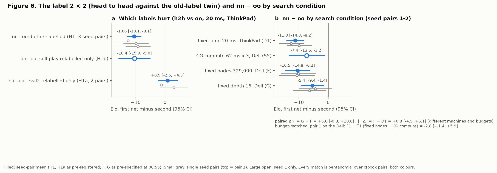
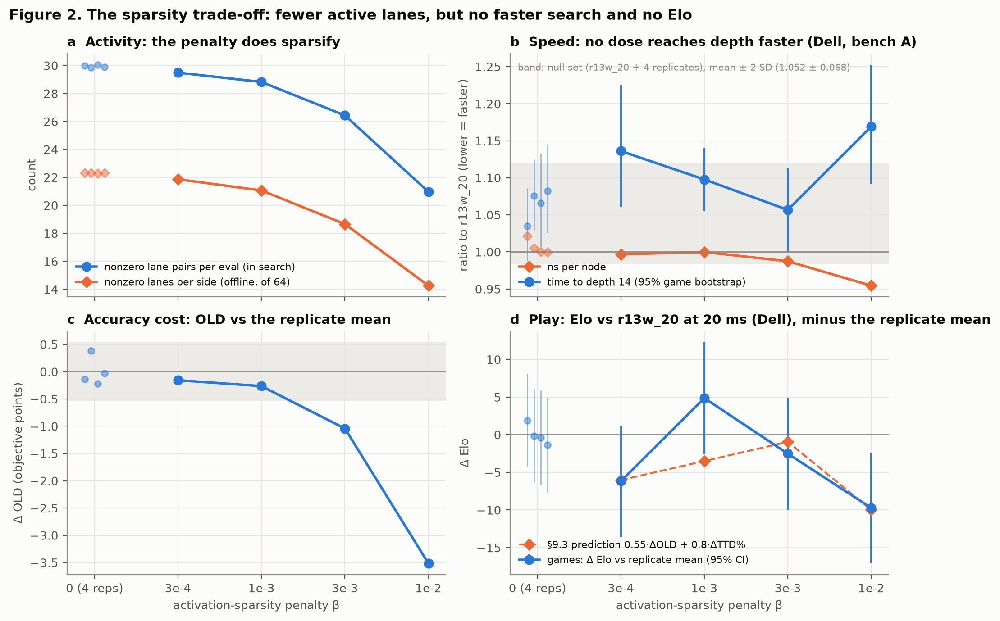
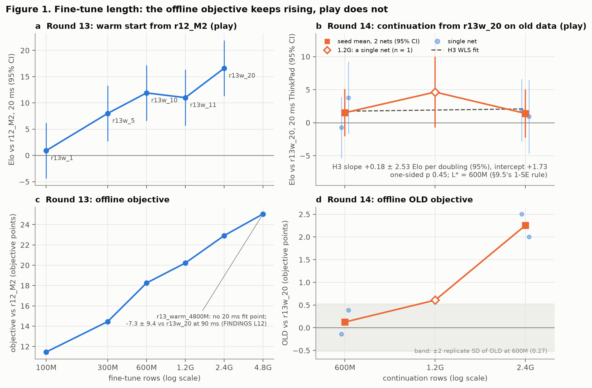
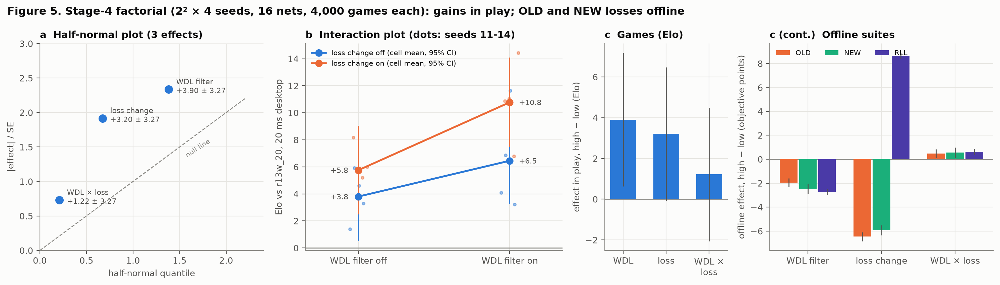
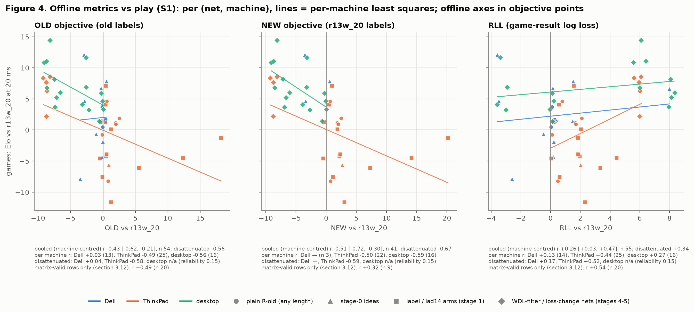
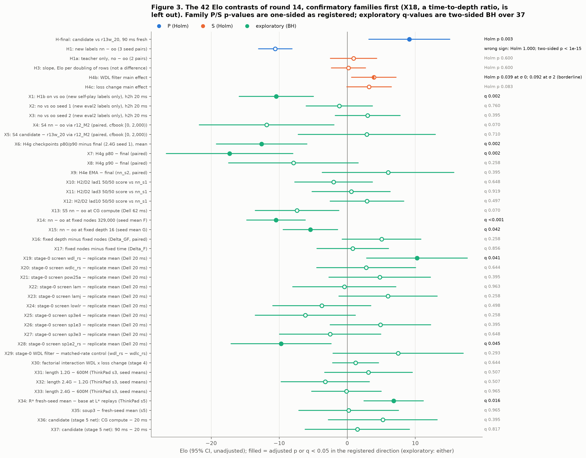
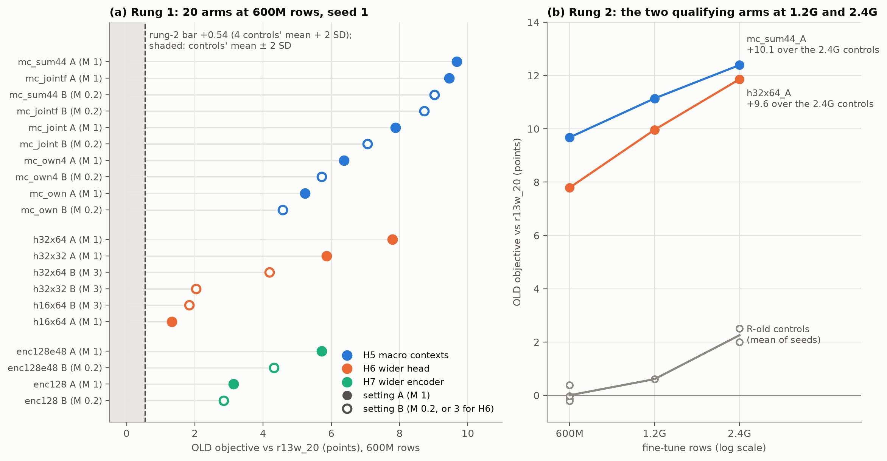

# Round 14: new labels, cheap training ideas and fine-tune length for a 35k-parameter UTTT NNUE

> **Repository copy.** The source of this report is `datasets/nnue2/r14/REPORT.md`, which is not in git
> (`datasets/` is gitignored), together with the records, scripts and logs it cites. Paths in the report are
> relative to `datasets/nnue2/r14/` unless the report says otherwise. The figures are copied to [`fig/`](fig/)
> next to this file and the figure links point there; everything below the title is otherwise verbatim
> (copied 2026-10-08).

**Status (2026-10-04, 13:00 PDT): final for the pre-registered round. Addendum 2026-10-08: architecture track final.**
Stages 0-5, the three ship tests and the recommendation [10:40] are complete. The recommended net `r14_d5_final_s2_rs`
was submitted to CodinGame at about 10:50. The exploratory architecture track (sections 2.7 and 3.14) finished rung 1 at
16:20 and rung 2 at 20:52 on 2026-10-04, offline only. The addendum of 2026-10-08 reports both rungs in full and
summarises the scaling study's games for the widened encoder. It changes no pre-registered number.

**Timeline and snapshots.** Round 14 ran from about 13:40 on 2026-10-03 (the first round-14 builds and the relabel smoke
test, §3.2) to the recommendation at 10:40 on 2026-10-04. The report uses these snapshots, each marked where it is used:

| Time (2026-10-04) | What was read |
| --- | --- |
| 11:18 | `results/arms.jsonl` and `results/scores.jsonl` for every pre-registered number (numbers.md, made by `r14_numbers.py`) |
| 11:22 | the sp14 datagen row counts (section 3.3.8) |
| 12:05 | first assembly of this report from the section drafts |
| 12:30-12:33 | the review pass's recomputations (`report_work/review_checks.txt`) and data hashes (`report_work/data_hashes.txt`) |
| 12:50 | the architecture track at the interim (the first Table 5b, replaced by the addendum) |
| 13:00 | this revision, after a statistics review and a clarity review (`report_work/review_responses.md`) |
| 2026-10-08 | the addendum: `scores.jsonl` (last architecture record 20:52 on 10-04), `logs/gpu_queue.log`, `analyse_r14.py arch` (`report_work/arch_final_1008.txt`), `report_work/arch_final_numbers.py` (Tables 5b and 5c, Figure 7) and the final scaling-study report (`datasets/nnue2/scaling/REPORT.md`, 10-08) |

The outline (§13) also calls for an HTML version of this report as a published artifact. It follows this file and
carries the same content.

## Abstract

**Question.** crossfish plays Ultimate Tic-Tac-Toe on CodinGame with an alpha-beta search and a 35,243-parameter NNUE
evaluation. The shipped net, r13w_20, had been fine-tuned on round 13's data until more rows stopped moving its offline
score. Could one night of cheap changes to the trainer alone still produce a net that beats r13w_20 in the shipped
engine, and which changes would do it?

**Design.** A six-stage funnel, pre-registered before any new-label net existed, tested four levers: labels from
r13w_20's own search (hypothesis H1), positions from CodinGame ladder games (H2), fine-tune length (H3) and seven
training ideas from Stockfish, bullet and Viridithas (H4). The pre-registered stages trained 48 full-length nets, and
the round played 449,968 games, mostly at 20 ms per move. Every comparison between trained nets allows for seed-to-seed
spread in playing strength (σ_net), which was estimated at 0.0 Elo (95% interval [0, 1.65]). Confirmatory tests are
one-sided and Holm-corrected within two pre-registered families. The 37 exploratory contrasts carry two-sided
Benjamini-Hochberg q-values. "±" is a 95% half-width.

**Key results.**

- **A stronger net was found and shipped.** The final recipe R\* continues r13w_20 for 600M rows on round 13's data with
  two changes from Stockfish's trainer (next bullet). Its fresh-seed net `r14_d5_final_s2_rs` beat r13w_20 by **+9.1 ±
  5.9 Elo** over 4,000 games at 90 ms with the bot's opening book, on openings no decision had used (one-sided p 0.0013,
  Holm 0.0026). It also passed a sequential go/no-go test at 90 ms (accepted at 4,200 games; a sequential Elo is a
  decision, not an estimate) and read +12.9 ± 6.4 at CodinGame's node budget.
- **The two changes are supported together, not one by one.** The changes are a WDL contradiction filter, which skips
  self-play rows whose label the game's result contradicts, and a loss change: a power-2.5 loss that penalises
  over-estimates 1.2x. They were tested in a 2 × 2 factorial with four fresh seeds per cell. Their main effects, each
  averaged over the other factor, were +3.9 ± 3.3 and +3.2 ± 3.3 Elo (logged during the round as +3.84 and +3.14, from
  rounded cell means). Together they added +7.0 ± 4.7 over the base, and three fresh seeds read +6.8 ± 4.4 against
  replays of the base, consistent with that. Neither change alone is resolved (+2.65 ± 4.60 and +1.95 ± 4.65), and there
  is no evidence of an interaction (95% CI [−2.1, +4.5]). The filter's confirmation is borderline: its Holm p is 0.039
  only if σ_net is exactly 0, and above 0.05 for any σ_net of about 1 Elo or more (0.092 at the 2-Elo floor of the
  round's interim decisions). It is also 0.050 under the analysis tool's t-on-36-df convention.
- **New labels hurt.** Nets fine-tuned on labels from r13w_20's own search lost **−10.6 ± 2.5 Elo** head to head against
  twins trained on the old labels of the same positions in the same order, although every aggregate offline metric
  preferred them. The loss is consistent with the relabelled self-play rows, where the label mode also changed (−10.4 ±
  5.5, exploratory). Relabelling the eval2 training set alone was neutral (+0.9 ± 3.4). The loss held at a fixed node
  count and roughly halved at equal search depth (−5.4 ± 4.0). By the reading fixed before those games, that is an
  eval-quality deficit; whether larger search trees add to it is unresolved (+5.0 ± 5.8 recovered at equal depth, not
  significant). The pre-registered rule D1 therefore moved the round back to the old labels.
- **Nothing else bought anything measurable.** Fine-tune length from 600M to 2.4G rows gave +0.2 ± 2.5 Elo per doubling,
  so there is no evidence of a gain at the pre-registered minimum detectable effect of 4.1 per doubling (at 20 ms only).
  The pre-registered 1-SE rule then kept 600M. An activation-sparsity penalty cut active lanes by up to 30% but made no
  search faster. A λ schedule, a low-lr finish and 1-10% ladder positions failed their screens. EMA weights, checkpoint
  picking and a weight soup showed no gain.
- **Offline metrics could not certify the changes that mattered.** A validity matrix fixed before any result says which
  offline metric may judge which kind of change. Where it trusted the old-label objective (same loss, same labels), that
  objective correlated with games at r +0.49 (n 20; cluster-bootstrap 95% CI [−0.06, +0.77]): right sign, inconclusive.
  Across loss, filter and label changes, where the matrix had declared it biased, it moved against play (r −0.53), so
  all arms pooled read −0.43 (the round's pre-data tool gives −0.11 on its row set). The teacher-free result log loss
  correlated weakly overall (+0.26).

**Architecture track (exploratory, offline only; addendum 2026-10-08).** A separate track trained 20 arms at 600M rows:
a wider encoder, a wider head and macro-board contexts, each widened from r13w_20 so that training starts from its
function. All three families cleared the pre-registered bar on the old-label objective (OLD); the family bests sit 21-36
control SDs above the control mean, against a bar of 2. The two families taken to 1.2G and 2.4G rows, the sum44 macro
context and the 32x64 head, kept a lead of +9.4 to +10.5 OLD points over same-length controls. None of these nets has
played a game, and this round shows that OLD does not track play across changes like these. The widened encoder was
tested in games by the scaling study instead, on fresh data: it beat enc64 nets trained the same way by +7.3 Elo [+2.1,
+12.6] (Holm p 0.009), and a wider encoder output added +1.2 ± 6.9 (section 3.14).

**Sources.** `r14final_fresh/r14_d5_final_s2_rs`, `r14final_gsprt/…`, `r14cgc_veto/…` ([10:40], [10:11], [10:24]); the
factorial `r14s4_vsA/*` ([07:25]); `r14s1_h2h{1,2,3}`; `results/fixednodes_summary.json`; numbers.md §1-§12;
`report_work/review_checks.txt`. Table 1 collects the main estimates and [Figure 3](fig/fig3_forest.png) every
Elo contrast. Section 3.1 adds the secondary results that this abstract leaves out.

## Contents

- [Abstract](#abstract)
- [How to read this report](#how-to-read-this-report)
- [1. Introduction](#1-introduction)
  - [1.1 Where round 13 left off](#11-where-round-13-left-off)
  - [1.2 The levers and why they were chosen](#12-the-levers-and-why-they-were-chosen)
  - [1.3 Pre-registration](#13-pre-registration)
  - [1.4 How deviations were handled](#14-how-deviations-were-handled)
  - [1.5 Kinds of evidence](#15-kinds-of-evidence)
- [2. Methods](#2-methods)
  - [2.1 Net, trainer and runtime](#21-net-trainer-and-runtime)
  - [2.2 Teachers, relabels and the label modes](#22-teachers-relabels-and-the-label-modes)
  - [2.3 Data, snapshot P, lad14 and the holdout suites](#23-data-snapshot-p-lad14-and-the-holdout-suites)
  - [2.4 Base recipe, determinism, data order and eval scale](#24-base-recipe-determinism-data-order-and-eval-scale)
  - [2.5 The ideas and their exact deltas](#25-the-ideas-and-their-exact-deltas)
  - [2.6 Stage design, and how the D1 pivot reshaped it](#26-stage-design-and-how-the-d1-pivot-reshaped-it)
  - [2.7 The architecture track (exploratory, complete)](#27-the-architecture-track-exploratory-complete)
  - [2.8 Metrics and their validity](#28-metrics-and-their-validity)
  - [2.9 Games protocol](#29-games-protocol)
  - [2.10 Harness validation](#210-harness-validation)
  - [2.11 Statistics](#211-statistics)
- [3. Results](#3-results)
  - [3.1 Main results (Table 1)](#31-main-results-table-1)
  - [3.2 Ablations at a glance (Table 2)](#32-ablations-at-a-glance-table-2)
  - [3.3 Labels and the mechanism (H1; Table 3; Figure 6)](#33-labels-and-the-mechanism-h1-table-3-figure-6)
  - [3.4 Stage 0: one-factor screens](#34-stage-0-one-factor-screens)
  - [3.5 Sparsity: activity falls, speed does not rise (S3, Figure
    2)](#35-sparsity-activity-falls-speed-does-not-rise-s3-figure-2)
  - [3.6 lad14 and decision D2](#36-lad14-and-decision-d2)
  - [3.7 Training length (stage 3: H3, L\*, H4g; Figure 1)](#37-training-length-stage-3-h3-l-h4g-figure-1)
  - [3.8 The stage-4 factorial: WDL filter x loss change (H4b, H4c, R\*; Figure
    5)](#38-the-stage-4-factorial-wdl-filter-x-loss-change-h4b-h4c-r-figure-5)
  - [3.9 The final net](#39-the-final-net)
  - [3.10 Variance components, placebos and A/A (Table 4)](#310-variance-components-placebos-and-aa-table-4)
  - [3.11 Attribution of the final gain (S6; Table 5)](#311-attribution-of-the-final-gain-s6-table-5)
  - [3.12 Offline metrics against play (S1; Figure 4)](#312-offline-metrics-against-play-s1-figure-4)
  - [3.13 All contrasts at once (Figure 3)](#313-all-contrasts-at-once-figure-3)
  - [3.14 The architecture track (exploratory; complete)](#314-the-architecture-track-exploratory-complete)
- [4. Discussion](#4-discussion)
  - [4.1 What transferred from chess NNUE practice, and why](#41-what-transferred-from-chess-nnue-practice-and-why)
  - [4.2 Offline metrics vs play](#42-offline-metrics-vs-play)
  - [4.3 Cost-effectiveness](#43-cost-effectiveness)
- [5. Limitations](#5-limitations)
- [6. Future work](#6-future-work)
- [Appendix A. Reproducibility](#appendix-a-reproducibility)
  - [A.1 Pre-registration, deviations and frozen trainers](#a1-pre-registration-deviations-and-frozen-trainers)
  - [A.2 Data pins](#a2-data-pins)
  - [A.3 Every run's command](#a3-every-runs-command)
  - [A.4 Nets and binaries of the ship decision](#a4-nets-and-binaries-of-the-ship-decision)
  - [A.5 Games: conditions and opening ranges](#a5-games-conditions-and-opening-ranges)
  - [A.6 Analysis commands](#a6-analysis-commands)

**Tables.** Tables 1-5 and Figures 1-5 are the ones the pre-registered outline (§13) names. Tables added for this report
carry the number of the outline table they follow plus a letter (3b-3e, 4d, 5b-5d), so tables appear in document order.
Methods tables are numbered M1-M9 and appendix tables A1-A5.

| Table | Content | Where |
| --- | --- | --- |
| M1 | Deviations that bear on inference | [section 1.4](#14-how-deviations-were-handled) |
| M2 | Label sources | [section 2.2](#22-teachers-relabels-and-the-label-modes) |
| M3 | How far the labels moved (S2) | [section 2.2](#22-teachers-relabels-and-the-label-modes) |
| M4 | Arms and their exact deltas | [section 2.5](#25-the-ideas-and-their-exact-deltas) |
| M5 | The stages as run | [section 2.6](#26-stage-design-and-how-the-d1-pivot-reshaped-it) |
| M6 | Decision rules and what they decided | [section 2.6](#26-stage-design-and-how-the-d1-pivot-reshaped-it) |
| M7 | Game conditions | [section 2.9](#29-games-protocol) |
| M8 | Validation and null runs | [section 2.10](#210-harness-validation) |
| M9 | Planned and achieved precision | [section 2.11](#211-statistics) |
| 1 | Main results: Elo vs r13w_20 by condition | [section 3.1](#31-main-results-table-1) |
| 2 | Ablations: one row per idea | [section 3.2](#32-ablations-at-a-glance-table-2) |
| 3 | The label 2 × 2 | [section 3.3](#33-labels-and-the-mechanism-h1-table-3-figure-6) |
| 3b | Factorial cells | [section 3.8](#38-the-stage-4-factorial-wdl-filter-x-loss-change-h4b-h4c-r-figure-5) |
| 3c | Stage-5 family | [section 3.9](#39-the-final-net) |
| 3d | CG-compute screen | [section 3.9](#39-the-final-net) |
| 3e | The candidate in every condition | [section 3.9](#39-the-final-net) |
| 4a-4d | Variance components, offline seed SDs, placebos and A/A, seat-effect sensitivity | [section 3.10](#310-variance-components-placebos-and-aa-table-4) |
| 5 | Attribution of the final gain (S6) | [section 3.11](#311-attribution-of-the-final-gain-s6-table-5) |
| 5b | Architecture track, rung 1 (final, addendum) | [section 3.14](#314-the-architecture-track-exploratory-complete) |
| 5c | Architecture track, rung 2 (addendum) | [section 3.14](#314-the-architecture-track-exploratory-complete) |
| 5d | Where the round's compute went | [section 4.3](#43-cost-effectiveness) |
| A1-A5 | Hashes, data pins and data hashes (A2b), queue files, ship artefacts, opening ranges | [Appendix A](#appendix-a-reproducibility) |

**Figures.**

| Figure | Content | Where | File |
| --- | --- | --- | --- |
| 1 | Fine-tune length, round 13 against round 14 | [section 3.7](#37-training-length-stage-3-h3-l-h4g-figure-1) | [fig/fig1_length.png](fig/fig1_length.png) |
| 2 | The sparsity trade-off | [section 3.5](#35-sparsity-activity-falls-speed-does-not-rise-s3-figure-2) | [fig/fig2_sparsity.png](fig/fig2_sparsity.png) |
| 3 | Forest plot of the 42 Elo contrasts | [section 3.13](#313-all-contrasts-at-once-figure-3) | [fig/fig3_forest.png](fig/fig3_forest.png) |
| 4 | Offline metrics against play (S1) | [section 3.12](#312-offline-metrics-against-play-s1-figure-4) | [fig/fig4_offline_vs_play.png](fig/fig4_offline_vs_play.png) |
| 5 | The stage-4 factorial | [section 3.8](#38-the-stage-4-factorial-wdl-filter-x-loss-change-h4b-h4c-r-figure-5) | [fig/fig5_factorial.png](fig/fig5_factorial.png) |
| 6 | The label 2 × 2 and nn − oo by search condition (added) | [section 3.3](#33-labels-and-the-mechanism-h1-table-3-figure-6) | [fig/fig6_label_mechanism.png](fig/fig6_label_mechanism.png) |
| 7 | The architecture track, rung 1 and rung 2 (added in the addendum) | [section 3.14](#314-the-architecture-track-exploratory-complete) | [fig/fig7_arch.png](fig/fig7_arch.png) |


## How to read this report

**Citations.**

- Paths are relative to `datasets/nnue2/r14/` unless stated.
- A stamp such as [21:05] is a dated entry in the deviations log, `DESIGN.md` section 14 (98 entries, [14:26] to
  [10:40], when the report was first written). Times from 13:40 to 23:59 are on 2026-10-03, and times from 00:00 to
  12:59 are on 2026-10-04. A later time on 2026-10-04 carries its date (for example "16:20 on 10-04", the end of the
  architecture track's rung 1). The addendum also cites the later entry [10-04 17:45].
- "§8.4" means section 8.4 of the pre-registered design `DESIGN_v2.md`, which `DESIGN.md` reproduces unchanged above its
  log. "The design's Appendix B" is that file's appendix; this report's only appendix is Appendix A.
- "Table M1 #8" is row 8 of Table M1, the deviations that bear on inference (section 1.4).
- A match is cited by its `arms.jsonl` record id, `<tour>/<candidate>`. The game files are in
  `datasets/eval2/rr/<tour>/`.
- "numbers.md §N" is section N of `report_work/numbers.md`. Every number was recomputed by `report_work/r14_numbers.py`,
  which imports the round's own analysis code; its outputs are `numbers.md` and `numbers.json`. Three helpers add to it:
  `report_work/final_section_extra.py` (→ `final_section_extra.json`), `report_work/recipe_checks.py` (→
  `recipe_checks.txt`) and, for the review pass, `report_work/review_checks.py` (→ `review_checks.txt`).
- X1-X37 are the exploratory contrasts of numbers.md §12. "FINDINGS <ID>" is an entry of `datasets/nnue2/FINDINGS.md`,
  always written with the prefix: FINDINGS X1 is a ladder finding, unrelated to this report's X1.
- Elo is logistic Elo of the pentanomial mean pair score s̄: Elo = −400·log10(1/s̄ − 1). "±" is a 95% half-width (1.96
  SE) unless stated.
- sd_pair is the SD of the per-pair score (each opening played with both colours). nElo, normalised Elo, is (s̄ − 0.5) /
  (√2·sd_pair) · 800/ln 10, as in `analyse_r14.match_stats`. "Draws" is the share of games drawn.
- A late reply is one slower than the move time plus `gauntlet.py`'s `--late-margin` (30 ms by default: over 50 ms at 20
  ms, 92 ms at CGC and 120 ms at 90 ms; over 500 ms in T10). A reply over 1,000 ms forfeits (3,000 and 10,000 ms in
  T10).

**Terminology.**

| Term | Meaning |
| --- | --- |
| r13w_20, "A" | The shipped net before this round (r12_M2 fine-tuned for 2.4G rows): the init of every run, the anchor of every "vs A" match, and the teacher of the new labels |
| r12_M2 | The net before r13w_20: the old labels' teacher, the zero of round 13's objective, and the third party of S4 |
| R-old | Round 13's fine-tune recipe on round 13's data and labels, 600M rows from r13w_20 (§4); identical to `r14_ctrl600` |
| R-new(P) | R-old with both sources relabelled by r13w_20, on snapshot P (stage 1) |
| L\* | The fine-tune length chosen by §9.5 in stage 3: 600M rows |
| R\* | The final recipe chosen by §9.5 in stage 4: R-old + WDL filter + loss change at L\* (cell f4) |
| WDL filter | nnue-pytorch's WDL contradiction filter: a self-play training row is skipped with probability 1 − P(observed result \| label) (H4b; stage-0 arm `wdl`) |
| Loss change | Stockfish's loss shape: \|p_net − p_target\|^2.5, weighted 1.2x on over-estimates, with the PSQT auxiliary weight rescaled to 0.06878 (H4c; stage-0 arm `pow25a`). The round's log calls it the "loss cell" |
| f1-f4 | The stage-4 factorial cells: base, + WDL filter, + loss change, both |
| oo, nn, no, on, oc | The stage-1 label cells. The first letter gives the eval2 labels and the second the self-play labels: o = old (r12_M2's engine), n = new (r13w_20's engine). So `no` has new eval2 labels and old self-play labels. oc (old engine at depth 16) was not run |
| P, F | Snapshot P: the whole-game prefix of the self-play relabel that stage 1 trained on (62.8% of sp13). F, the full relabel, was never needed |
| e2b, e2t, sp13, sp13p, sp13t, lad14 | The data sources (Table M2). eval2 is the round-12 training set of engine-game positions; sp13 is round 13's self-play |
| Play mode, label mode | How a position got its label: the root score of the in-game search that chose the move (play mode, warm TT), or a fresh fixed-depth `datagen label` search of the stored position (label mode) (section 2.2) |
| SPH13, V2, LADH, DUMPH | The holdout parts: held-out games of round-13 self-play (SPH13), of eval2 (V2), of CodinGame ladder games (LADH), and of SPRT games played at CodinGame-like budgets ("dump" positions; DUMPH), each labelled by search. A trailing t (SPH13t, V2t, LADHt, DUMPHt) means the same positions labelled by r13w_20 |
| OLD, NEW, NEW-noLADH, RLL | The offline suites (section 2.3), in objective points vs r13w_20 (= 0); higher is better. Objective points are round 13's offline objective units, scaled to look like Elo ("Elo-like" on the figure axes); they are not Elo |
| H-final, GSPRT, CGC veto | The three ship tests (§9.6): H-final is the candidate vs r13w_20 over 4,000 fixed games on fresh openings at 90 ms (the estimate); the GSPRT is the sequential go/no-go test at 90 ms (a decision); the CGC veto rejects only if the upper 95% bound at CG compute is below 0 |
| a-, b-, e-, f-, g-, x-files | The GPU queue files of stages 0, 1, 3, 4 and 5 and of the architecture track (Table A3); "b-file" is a stage-1 queue file |
| b, `_rs` | b = sd(e_net) / sd(e_r13w_20), a label-free eval-scale ratio. A net with \|b − 1\| > 1% plays as `NAME_rs`, its output scaled by 1/b (section 2.4) |
| σ_net, σ̂, σ_used, "σ 2" | The between-seed SD of playing strength for a fixed recipe; its REML estimate (0.00); the value used in SEs (σ̂ once the pooled replicate df reach 4); and the conservative 2-Elo floor that the interim decisions kept (Table M1 #8) |
| Families P, S, X, ARCH | P = {H-final, H1} and S = {H1a, H3, H4b, H4c}: confirmatory, one-sided, Holm within the family. X = the 37 exploratory contrasts X1-X37: two-sided, BH q. ARCH = the architecture track's own exploratory family (no game contrast, so no q-values) |
| Estimate, screen, sequential, descriptive | The four kinds of evidence (section 1.5) |
| 20 ms, CGC, 90 ms | Game conditions (Table M7): 20 ms screening; CG compute (Dell 62 ms x 3 workers, about 1.01x CodinGame's nodes); 90 ms on the desktop with booked paste builds (about 1.7x) |
| Stage families | The tours `r14s0_vsA` to `r14s5_vsA` ("stage 0" to "stage 5"), each on one machine and one opening range (Table M5) |
| The candidate | `r14_d5_final_s2_rs`: fresh seed 2 of R\*, played at b 1.047318, recommended [10:40] and submitted |
| f4_s14 | `r14_d4_f4_s14_rs`, the stage-4 f4 net with the best 20 ms result; called "s1" in the round's logs and `ship_candidate.json`. A ship option, excluded from every estimate (§8.8) |
| Overloaded names | **P** is snapshot P (data) and family P (tests); the context says which. **V2** is the eval2 holdout; the A/A validation check is "check V2", and the design version is "v2" (lower case). **S5** is the CG-compute nn − oo match; the stage-5 family is always "stage 5". **S1** is the offline-vs-play analysis; the logs' "s1" is f4_s14. **Cell** is a factorial cell (f1-f4) or a label cell (oo, nn, no, on); the loss bundle is "the loss change". In section 3.3.7 the three T13 labels are L_play, L_old and L_new |

## 1. Introduction

### 1.1 Where round 13 left off

**The shipped net.** r13w_20 is r12_M2 fine-tuned for 2.4G rows. It beat r12_M2 by about +16 to +21 Elo in every
condition tested (FINDINGS N4):

- 20 ms: +16.6 ± 5.3;
- CodinGame compute (CGC): +20.2 ± 12.4;
- 90 ms in the shipped engine: +16.0 ± 10.9;
- this round's positive control: +21.0 ± 7.2 ([18:50]).

**Three facts framed round 14.**

1. **Gains per generation were shrinking:** about +270, +55 and +17 Elo (FINDINGS N6). Resolving the next generation
   needs about ±4 Elo, so 10,000-game comparisons and seed replicates.
2. **The old data was used up.** Round 13's recipe and data, run again for 600M rows from r13w_20, scored +22.79 (seed
   1) and +23.31 (seed 2) on the offline objective (r12_M2 = 0). r13w_20 itself scores +22.92 (§1; FINDINGS L13).
3. **Offline gains had stopped turning into play.** Round 13's objective overstated gaps by 1.5-2x and could not order
   its top group. A 4.8G-row net scored +25.1 offline but lost to r13w_20 by 7.3 ± 9.4 at 90 ms (§1).

Round 13 also never replicated a recipe in games. So nobody knew how far two seeds of one recipe differ in Elo.

### 1.2 The levers and why they were chosen

**New labels from the shipped net's search.** This was the main hypothesis, H1.

- Round 12 showed the precedent. Relabelling eval2 with the NNUE engine instead of the pre-NNUE engine was worth about
  +40 Elo (FINDINGS D1). Self-play by the NNUE engine added about +25 more (D3).
- Relabelling with the newest net is also Stockfish's standing distillation stage (`STOCKFISH_IDEAS.md` item 8).
- The teacher gap was much smaller this time: r13w_20 is about +16-21 Elo over r12_M2. The prior for H1 was therefore +3
  to +10 Elo (§2.1).

**Ladder positions (lad14).** These are 453k positions from CodinGame ladder games, labelled by r13w_20. They move the
training distribution toward the positions the bot actually meets (H2).

**Fine-tune length (H3).** Length was round 13's lever. The question was whether more rows still pay when the starting
point is r13w_20 instead of r12_M2.

**Seven cheap ideas.** These come from Stockfish's nnue-pytorch, bullet and Viridithas (`STOCKFISH_IDEAS.md` items 1, 2,
4, 6, 7, 10 and 12):

- an activation-sparsity penalty, meant to buy speed;
- picking checkpoints by games;
- a WDL contradiction filter;
- a power loss with asymmetry;
- a mid-run λ schedule (with a jitter variant);
- a short low-lr finish;
- an EMA of the weights.

Peak lr (H4h) was added from round 13. All of these change only the trainer. A winner therefore ships as a weights swap,
with no runtime or emitter work.

**Architecture track (exploratory).** The user added this in chat at [15:35], after both freezes, with a hyperparameter
sweep added at [15:45]. It asks whether capacity helps when it fits the remaining payload budget of about 27k
characters:

- a wider encoder;
- a wider head;
- macro-board contexts, an analogue of HalfKP.

It is reported in its own exploratory family and never shares a contrast with the pre-registered arms.

### 1.3 Pre-registration

**Version 1.** The design was written at 14:30 and frozen read-only at 15:02 as `DESIGN_v1.md` (sha256
`e29f1ccb415175716b1fac109d8da11710bfdb128db5565f8c89a99fafc67743`).

**Reviews.** Two adversarial reviews arrived at about 14:40:

- R1, on ML methodology;
- R2, on statistics and compute.

**Version 2.** The answer to the reviews was frozen as `DESIGN_v2.md` when its first stage-0 file (a050) was queued at
[15:22] (sha256 `a808390efd69fe078454448917e1cb1745222ac6ea80b1566fe13787784e5ba1`; `DESIGN_HASHES.txt`). The log's
approximate stamp for writing v2, "about 15:30", is a few minutes later than that freeze; the hash fixes what was
frozen. Both hashes were re-verified with `sha256sum` when this report was assembled. Section 15 of the design answers
every blocking and important review point. The main answers:

- σ_net enters every SE between nets;
- a mandatory data-order alias;
- frozen, hash-checked trainer copies;
- a full factorial instead of a fractional one;
- recipe claims made on fresh seeds only;
- H-final tested on fresh openings, apart from the GSPRT.

**What was known at each freeze.** Only three old-label runs had finished (the design's header): r14_ctrl600 (+22.79),
r14_d0_s2 (+23.31, 14:26) and r14_d0_lowlr (+22.92, 14:39). No new-label net existed at either freeze.

**What v2 fixes in advance:**

- two confirmatory families, each Holm-corrected at α = 0.05:
  - P = {H-final, H1};
  - S = {H1a, H2, H3, and the main effects of the ideas that reach the factorial};
- mechanical decision rules: D1 (labels), D2 (lad14 dose), β\* (sparsity dose), the factor screen, L\*, R\*, and the
  three ship tests;
- a validity matrix that says which metric may judge which arm;
- the games protocol and opening ranges;
- the power calculation (§§2, 6-9).

### 1.4 How deviations were handled

**The log.** Every change after the freeze was appended to `DESIGN.md` section 14, with a timestamp and a reason, before
the data it affects were read. The log has 98 entries, from [14:26] to [10:40].

**Three kinds of change:**

1. **Pre-registered contingencies triggered by data.** These are not deviations. Examples: the D1 pivot, and the V4 rule
   that moved the ship pick to CGC games.
2. **Changes forced by infrastructure or by a flaw found in the plan.** Each keeps the pre-registered estimand, and each
   was logged before its data. Examples: the ladder-opening shortfall and the β\* sign.
3. **Analysis corrections found while writing this report.** Both versions are reported wherever the conclusion depends
   on the choice (numbers.md §14).

Analyses added during the round are labelled "registered during the round" when their reading rules were written before
their data. Examples are the fixed-node and fixed-depth matches [00:55] and the role-swapped A/A test [01:40]. Analyses
added after their data are labelled post hoc.

Table M1 lists the deviations that touch inference; rows 14-24 are analysis corrections made for this report. Some
report-time choices favour a confirmation: the σ and df conventions and the 16-net analysis behind H4b (rows 8, 15 and
16) were settled after the data had been read. The report gives the alternatives beside each such result. The full log
is `DESIGN.md` section 14 (Appendix A.1).

**Table M1. Deviations that bear on inference.**

| # | Stamp | Plan (v2) | What happened | Consequence |
| --- | --- | --- | --- | --- |
| 1 | [15:35], [15:45], [18:10], [19:55] | No architecture work (§2.4: `--macro-ctx` out of scope) | User-requested track. It has 20 arms, a rung-2 rule fixed at [18:10] before any result, and its own BH family ARCH. Rung-1 setting B uses new-parameter lr multiplier 0.2 or 3 instead of 5, after CPU screens showed 5 broke the encoder [18:10]. | Exploratory only, and it never shares a contrast with a pre-registered arm. It ran in GPU gaps and after the main stages, so a main-stage job waited for at most one running arm ([18:11], [21:05], [07:25], [09:38]) |
| 2 | [19:00] | Ship candidate = best 20 ms screen | V4 found that 20 ms preferred the 4.8G net (+3.6 ± 6.6), so §7.1's contingency applied. The candidate was picked by a 2,000-game CGC screen per seed | Selection moved to Dell CGC games. The estimates are unchanged |
| 3 | [19:10] | Blinded placebos with a sealed map (§7.1) | The session's permission check declined the sealed file, so the placebos are an open-named byte copy, `r14_val_aa` | No analyst blinding. Every decision was a mechanical rule |
| 4 | [19:10] | Ladder openings = LADH games cut at ply 10, at least 1,500 openings | Only 371 distinct ply-10 positions exist. A "frontier" rule (cut where a game leaves every other game's line, ply ≤ 24) gives 1,571 openings (427 seen, 1,144 unseen) | D2's ladder contrast has 3,142 games per arm instead of 4,000 |
| 5 | [19:10] | β\* score pred = −0.55·ΔOLD + 0.8·ΔTTD% (§9.3) | The sign was corrected to +0.55·ΔOLD before any bench data. Under the uncorrected sign the argmax is still 3e-3 (+0.19 against −0.95; recomputed from `results/beta_star_blockA.txt`) | None. With no stage 2, β\* fed only stage 4's speed rule, which no dose passed |
| 6 | [19:27] | Every playing net scale-matched (§4) | `scale_b.py` did not exist when stage 0 was queued. The rule was first applied at [19:27], before any game | All nets with \|b − 1\| > 1% played rescaled (`_rs`). No net played before its b was known |
| 7 | [21:05] | Stages 2-5 on new labels | D1 = −11.28 < 0, so the pre-registered pivot applied: stage 2 was dropped and the stage-0 arms became the screens. Stages 3-5 used R-old's data, e040 was dropped, and the 600M points of stage 3 reuse r14_ctrl600 and r14_d0_s2 (DirectML training is bit-deterministic: T0g) | H4a/d/f/h were never estimated as factorial effects. Peak lr (H4h) and the low-lr gate Δ(lowlr − l900) could not be evaluated |
| 8 | [23:30] | §8.4: switch from the 2-Elo σ floor to σ̂ once pooled replicate df ≥ 4 | D2 and the factor screen (both [23:30]), L\* [02:25] and R\* [07:25] kept the floor, as [21:05] had announced | Recomputed with σ̂ = 0: L\*, R\* and the stage-0 screen verdicts are unchanged. D2 depends on how §9.2's tie clause ("ties within 1 SE go to the smaller dose") is read. **Tie first:** lad10 − lad3 is +2.54 (SE 2.92), a tie, so the candidate is lad3, which fails rule 3 (p 0.42): s\* = 0, as logged. **Rules first:** only lad10 passes all three rules (score +2.89, SE 2.77, one-sided p 0.148 < 0.2), so s\* = 132 passes per 600M, and lad14 would have entered the factor set ([21:05]). The logged decision stands, because it was made and acted on first (section 3.6; numbers.md §14 item 5; `review_checks.txt` §2). Under the rules-first reading, the factorial behind H4b was chosen under the floor while H4b is judged under σ̂ |
| 9 | [23:30] | Stage-4 cell f1 reuses r14_ctrl600 and r14_d0_s2 (Appendix B) | All 16 nets trained fresh on seeds 11-14 | Keeps the stage-0 selection data out of the estimate (§8.8) |
| 10 | [21:40] | Top-ups +50% (§7.5) | Stage-3 top-ups capped at the range end (pair 23,000) | None was triggered |
| 11 | [23:45] | Desktop families at `--high` | `--high` cut the GPU trainer to 105k rows/s, so the families used §7.1's fallback, normal priority | Desktop validation passed under the fallback |
| 12 | [23:45] | T13 relabel by e2b's own binary | That binary is a ThinkPad ELF. Its desktop twin was used after checking it against e2b on 2,000 rows (r 0.967; rerun floor 0.959) | None |
| 13 | [07:25] | Leave-one-out runs g040-g051 are mandatory | Not applicable after the pivot: R\* contains neither new labels nor lad14 | Attribution comes from the factorial and from fresh seeds against base replays (S6) |
| 14 | report | Hypothesis records name nets | Records for H1a, H1b, H3 and H4g named unscaled nets that played as `_rs`. They were re-pointed, and H2 and H4e were added as exploratory rows | Names only (numbers.md §14 item 1) |
| 15 | report | §8.5: the 2² x 4 desktop factorial | `analyse_r14.py report` pools 19 cells over two machines, adding the stage-5 seeds and f4_s14's replay | The pre-registered 16-net analysis is reported. The tool's version is kept as a cross-check (numbers.md §14 item 2). This choice was made at report time, after the data, and it moves H4b toward confirmation (the tool's version: +2.51, not confirmed) |
| 16 | report | §8.4 Satterthwaite df | `factorial_fit` hard-codes t with 36 df | H4b's Holm p is 0.039 (σ̂ = 0, df = ∞), 0.050 (t36) or 0.092 (2-Elo floor); it crosses 0.05 at σ_net ≈ 1 Elo, inside the REML interval [0, 1.65]. The σ and df conventions for this claim were settled at report time, after the data: during the round the floor was in force ([21:05]; FINDINGS E3 at 07:35), and [07:25] left the claims to the report. H4b is therefore reported as borderline (section 3.8; numbers.md §14 item 3; `review_checks.txt` §1) |
| 17 | report | Disjoint opening ranges (§7.2) | The CGC screen used stage 2's unused range [13,000, 14,000) [07:41]. The role-swapped A/A [44,000, 49,000) and the T10 pair-2 matches [43,500, 45,500) share 1,500 spare-range pairs | Neither overlap touches a selecting or confirmatory set |
| 18 | report | §9.2: D2's paired score | [23:30] printed the driver's unpaired interim scores for lad3 and lad1 (−0.08, −2.66) | The paired rule gives +0.58 and −2.00. Both fail either way (numbers.md §14 item 6) |
| 19 | report | §8.10: S1 over every arm | `analyse_r14.py` looks up offline scores by the played name, so every `_rs` net drops out, and it counts each match as a row (OLD r −0.11, n 35) | Rows per (net, machine), with `NAME_rs` taking NAME's scores: OLD r −0.43 (n 54), the same sign. This method was chosen at report time and moves OLD's r from −0.11 to −0.43. The tool's values are kept beside it, and section 3.12 adds a stratification by the validity matrix with a cluster bootstrap by recipe (numbers.md §14 item 8; `review_checks.txt` §6) |
| 20 | report | Every arm has OLD and NEW scores | pow25a has neither: its post-step failed (FINDINGS I25) | Its ΔOLD is the in-run approximation −6.32 (probably about −6.7). It is left out of S1's OLD rows (numbers.md §14 item 9) |
| 21 | report | §7.5: the pre-top-up estimate is tabled; H4g is paired on shared pairs | Neither the pre-top-up D2 score nor an unpaired H4g contrast existed | Both were computed for this report (`recipe_checks.txt`). D2's verdicts are unchanged; the paired H4g q-values overstate the mean (X6) and p80 (X7) (section 3.7) |
| 22 | report | Logged effect sizes | [07:25] and [02:25] computed from rounded inputs: WDL +3.84, loss +3.14, interaction +1.19; 1.2G − 600M 3.05 | The report uses the §8.5 WLS (+3.90 / +3.20 / +1.22) and unrounded values (3.12). The difference is immaterial (numbers.md §14 items 4, 7) |
| 23 | review | X18's two-sided p (bench block B tree size) | numbers.md §12 used a normal reference with block A's null SD 0.0341 treated as known (p 0.016, q 0.064) | That SD comes from 5 nets (4 df), so the p uses t on 4 df: p 0.074, q 0.25. X4's and X13's q move from 0.064 to 0.070; no other q changes (`review_checks.txt` §5, §7) |
| 24 | review | §8.9: placebos test the harness | The pooled A/A offset (−3.74 ± 2.69) was used for an absolute-value caveat but treated as zero for head-to-head contrasts | One stance: the round's verdict (no seat effect, FINDINGS E5) is primary, so no correction is applied anywhere. Table 4d gives the seat-effect sensitivity of every head-to-head contrast and of absolute values (section 3.10) |
| 25 | [10-04 17:45] | [18:10], [20:20]: rung 2 for every qualifying family on `frozen_x2`, with new controls `r14_x_ctrl1200` / `r14_x_ctrl2400`; the 11:00 handoff routed it to the scaling study's queue | Rung 2 ran for H5 and H6 on round 14's runner (user approval 17:40), against stage 3's R-old nets `r14_d3_l1200` and `r14_d3_l2400` (+ `_s2`); the h32x64 files kept `frozen_x`; H7's rung 2 was replaced by the scaling study's X family | Exploratory and offline only. The controls share the planned data, schedule, steps and seed, the trainers match byte for byte on T0, and the logging flags leave training bit-identical (section 2.7) |

**Planned but not run.** These are listed in full in numbers.md §14 item 13:

- stage 2;
- H1c (cell `oc`);
- bench blocks C and D;
- the objective on deduplicated holdouts;
- `nn_s3_ema` (not built);
- the "labels at scale" contrast l2400 − old_l2400.

The conditional `nn_raw` arm lapsed as its rule provides, because nn's b was 1.0086.

### 1.5 Kinds of evidence

Every claim in this report rests on one of four kinds of evidence, following §8.8 (tables label them where it matters):

- **Estimate:** from data that selected nothing.
- **Screen:** from data that chose an arm. It is biased upward for the arm it chose.
- **Sequential:** from a test that stopped on its own data, the GSPRT. It is a decision, not an effect size.
- **Descriptive.**

Confirmatory p-values are one-sided as registered and Holm-adjusted within their family. A confirmatory result in the
opposite direction (H1) is reported with a two-sided p, which lies outside its family's error control. Exploratory
contrasts get two-sided p-values and Benjamini-Hochberg q-values over the 37 exploratory contrasts (numbers.md §12).
That family holds some derived rows (X6 is the mean of X7 and X8, X33 = X31 + X32, X16 = X15 − X14, and X2 and X3 are
H1a's parts), so BH's dependence assumption is doubtful and the count of discoveries is slightly inflated (section
3.13).

## 2. Methods

### 2.1 Net, trainer and runtime

**Architecture.** B-64 "Gen", the shipped shape, with 35,243 parameters
(`documentation/nnue_training_and_implementation.md` §2). A miniboard's pattern is its 3^9 cell configuration.

| Part | Shape | Parameters |
| --- | --- | ---: |
| Shared encoder | one-hot 27 (3 states x 9 cells) → 64 → 64 → 32, ReLU | 8,032 |
| Per-location projections | 9 locations x (32 → 65) | 19,305 |
| Forced-board projection | 32 → 65 | 2,145 |
| Bias, decided-board and constraint rows | 48 x 65 | 3,120 |
| Head | 128 → 16 → 32 → 1 | 2,641 |

The forced-board row is added at evaluation time, not stored. Each perspective keeps 64 lanes plus one PSQT lane. After
a clamp, the two perspectives feed the head, and

  eval = 1000 · (out + (psqt_stm − psqt_other) / 2).

**Runtime.** The runtime is integer and incremental, with emitter scales 9, 12, 13, 13 and 10. It multiplies only lane
pairs (2p, 2p+1) that contain a nonzero lane. The four old-label replicates average 29.07 such pairs per evaluation on
offline positions in the exported build, and 22.3 nonzero lanes per side (§1; numbers.md §5). Section 2.8 names the
three ways the round counts lane pairs.

**Export and payload.** A net is exported with `export_bgn.py export NAME --perm` and emitted by
`nnue_emit_b64_header.py`, using round 13's `--calib` and `--sample` arguments. The emitter applies GPTQ rounding, a
least-squares refit, per-row bf16 scales, Rice coding and CJK14 characters. The source carries the generator, not the
25.6 MB of tables, which the bot bakes at start-up. The B-64 runtime and emitter accept only this shape, so every
pre-registered arm keeps it (§3.1).

**Trainer.** `gen_r14.py` is gen_r13 plus round-14 options that are all off by default. It runs GenFlat on the desktop's
Radeon GPU through torch-directml, at batch 16,384. It ran at 634-665k rows/s while the relabels loaded the desktop and
at 741-759k beside the desktop games at normal priority; 790k was measured alone in round 13 (§10.1; [23:45]).

**Frozen trainer copies.** Another agent kept editing `gen_r14.py` during the round, so no queued job ran it in place.
Each job checks a frozen copy's `SHA256SUMS` before training and exits 3 on any mismatch. The copies:

| Copy | SHA256SUMS hash | Used by | Stamp |
| --- | --- | --- | --- |
| `frozen_s0` | `27364a36…` | stages 0 and 3 | [15:52] |
| `frozen_x` | `64ee365b…` | a120-a140, stage 1, stage 4, stage 5, architecture rung 1, h32x64's rung 2 | [18:00] |
| `frozen_x2` | `e8b44447…` | the finer macro-context arms and mc_sum44's rung 2 | [20:06] |

Each copy reproduced gen_r13 byte for byte on T0, a 240-step CPU run with every option off: the `.pt` hash is
`fa80330e…` and 28/28 normalised log lines match ([15:56], [18:00], [20:06]).

### 2.2 Teachers, relabels and the label modes

**Table M2. Label sources.** "Play" mode is the root score of the in-game search that chose the move, with the game's
warm transposition table (TT). "Label" mode is `datagen label`: a fixed-depth search of each stored position, whose TT
holds only that thread's earlier positions ([18:33] T12).

| Source | Positions | Train / holdout rows | Teacher | Depth | Mode | Cells that use it |
| --- | --- | --- | --- | ---: | --- | --- |
| e2b | eval2 | 4,339,877 / 482,136 (V2) | r12_M2 engine | 14 | label | R-old, oo, on |
| e2t | eval2, the same rows (C1) | 4,339,877 / 482,136 (V2t) | r13w_20 engine | 14 | label | nn, no, lad\* |
| sp13 | round-13 self-play, 3 shards | 77,435,884 / 2,388,278 (SPH13) | r12_M2 engine | 13 | play | R-old |
| sp13p | sp13's prefix at snapshot P | 48,594,181 / 1,494,900 | r12_M2 engine | 13 | play | oo, no |
| sp13t | the same positions as sp13p (C1) | 48,594,181 / 1,494,900 (SPH13t) | r13w_20 engine | 13 | label | nn, on, lad\* |
| lad14 | 6,896 ladder games, minus LADH and holdout duplicates | 453,443 / none | r13w_20 engine | 14 | label | lad1, lad3, lad10 |

Cell names give the eval2 labels, then the self-play labels: n = new, o = old. So `no` means new eval2 labels with old
self-play labels.

**What each relabel changes.**

- Relabelling eval2 changes only the teacher.
- Relabelling self-play changes the teacher **and** the mode.
- H1 (nn vs oo) is the effect of the whole pipeline.
- H1a (no vs oo) is the clean teacher contrast.
- H1b (on vs oo, exploratory) mixes teacher and mode (§2.1).

**Teacher builds (T12, [18:33]).**

| Build | Compiler | sha256 |
| --- | --- | --- |
| Desktop | clang 22.1.8 / libc++ | `e56e030a…` |
| Laptops | g++ 11.4.0 | `4e1113d3…` |

The laptop build's source equals the ship worktree's (commit f4d6b3d plus a 4-file pragma change). The desktop build
very likely has the same source, but its flags and source tree were not recorded. The two builds' static evals are
bit-identical. Their searches still differ, because the two builds draw different Zobrist keys. On 10,000 SPH13
positions at depth 13, single-threaded, the two builds give the same label on 65.3% of positions (mean |Δ| 85.3, r
0.990), against 28.6% (r 0.893) for the old and new sp13 labels. Section 3.3.7 gives the full comparison.

At snapshot P, 47.5% of sp13t's training labels came from the desktop build ([18:39]).

**Relabel coverage (C1).** The relabels change labels on 70.9% of eval2 rows and 69.9% of sp13 rows at P. The positions,
keys and records are identical row for row (`checks/c1_*.json`, [18:24], [18:39]).

**Table M3. How far the labels moved** (S2, descriptive). The four suite rows were computed post hoc for this report
with `t13_mode.pair_stats` (numbers.md §9, S2). The T13 rows were computed during the round ([23:45],
`checks/t13_mode.json`). How `pair_stats` computes each column:

- r, the RMA slope and mean |Δ| use non-mate rows (|label| < 8,000);
- sign flips use rows where either label is nonzero;
- |Δ| > 500 and exact (the share of identical labels) use all rows;
- mean Δ is new − old over non-mate rows.

| Comparison (old → new) | Rows | Pearson r | RMA slope | Mean \|Δ\| | Sign flips | \|Δ\| > 500 | Exact | Mean Δ |
| --- | ---: | ---: | ---: | ---: | ---: | ---: | ---: | ---: |
| V2: eval2, teacher only | 482,136 | 0.938 | 1.051 | 324 | 3.1% | 16.9% | 29.1% | +13.2 |
| SPH13 at P: teacher + mode | 1,494,900 | 0.893 | 0.862 | 333 | 3.5% | 17.6% | 30.0% | +25.2 |
| LADH: teacher only | 193,320 | 0.952 | 1.024 | 546 | 1.3% | 28.5% | 37.3% | +18.1 |
| DUMPH: teacher only | 106,495 | 0.895 | 1.044 | 214 | 10.7% | 10.8% | 31.9% | +1.5 |
| T13 mode leg (old engine, play → label) | 1,000,064 | 0.898 | 0.835 | 320 | 3.2% | 16.8% | 31.3% | +15 |
| T13 teacher leg (label mode, old → new engine) | 1,000,064 | 0.920 | 1.029 | 307 | 4.2% | 16.3% | 28.7% | +10 |
| T13 total (sp13 → sp13t) | 1,000,064 | 0.895 | 0.863 | 333 | 3.6% | 17.5% | 30.0% | +25 |

**Reading Table M3.**

- On self-play, the mode change alone moves the labels as far as the whole relabel.
- It also compresses them: the non-mate SD falls from 1,709 to 1,427.
- The teacher leg is similar in size, but the two legs are anti-correlated ([23:45]; section 3.3.7).

### 2.3 Data, snapshot P, lad14 and the holdout suites

**Snapshot P ([18:39]).** At about 18:25 the self-play relabel was still running on three machines, so stage 1 was
pinned to a whole-game prefix of it:

| Shard | sp13t train rows |
| --- | ---: |
| Desktop | 23,087,493 |
| ThinkPad | 15,483,257 |
| Dell | 10,023,431 |
| **Total** | **48,594,181** (62.8% of sp13) |

- SPH13t at P has 1,494,900 holdout rows.
- Every b-file checked a sha256 of P's record column before training and would have exited 5 on a mismatch.
- The full snapshot F was never needed. After the pivot, stages 3-5 trained on R-old's data.
- Every NEW score in the round uses P's SPH13t pin (all 49 NEW records in `scores.jsonl` at the snapshot).

**Passes over the data.** At 600M rows with the 0.4644 / 0.5356 mix, eval2 is seen about 64 times. sp13 is seen about
4.15 times on the full data (R-old) and about 6.6 times at P (§3.2).

**lad14** (`data/lad14_build.json`; T11, [18:24]).

- It comes from 6,896 ladder games, with every LADH game and position removed.
- T11 then dropped 1,331 rows equal, up to the 8 board symmetries, to a row of SPH13, V2, DUMPH or LADH. That leaves N_L
  = 453,443.
- Before T11, 61.5% of its rows were one-move children with no game result.
- The dose is defined in passes per 600M rows, not as a share: 1% = 13.2 passes, 3% = 39.7, 10% = 132.3.

**Holdout overlap (T11, `checks/t11_overlap.json`).** Holdouts are split by game, not by position. So some holdout rows
equal a training row up to symmetry:

| Holdout | Overlap with R-old's data | Overlap with P's mix |
| --- | ---: | ---: |
| SPH13 | 8.05% | 7.10% |
| V2 | 13.27% | 12.12% |
| DUMPH | 2.90% | 2.47% |
| LADH | 0 | 0 |

**Offline suites (§3.3).** Each suite applies round 13's objective formula:

- holdout weights SPH13 0.35, LADH 0.35, V2 0.15, DUMPH 0.15;
- a result share of 0.4;
- −6.8 Elo-equivalent per 1% of scale-fitted label MSE;
- −4.9 per 0.001 of result log loss.

Every suite is reported against r13w_20, so r13w_20 = 0 on each. The four suites:

| Suite | Labels | Note |
| --- | --- | --- |
| **OLD** | r12_M2's engine (e2b, dumpb) | The in-run objective; r12_M2 scores −23.43 on it |
| **NEW** | r13w_20's engine (SPH13t, LADHt, V2t, DUMPHt) | LADHt and DUMPHt were relabelled at depth 14 and 13 ([18:30]) |
| **NEW-noLADH** | as NEW, without LADH | The no-harm check for ladder arms |
| **RLL** | none: the result log-loss part alone | Teacher-free, but not engine-free: the results come from the games that generated each source |

All suites are scored by `tools/score_r14.py` ([16:35]), which reproduces the in-run objectives exactly.

### 2.4 Base recipe, determinism, data order and eval scale

**R-old** is round 13's fine-tune and equals `r14_ctrl600` exactly (§4). Its flags:

```
--init r13w_20 --seed 1 --lr 1e-3 --sched cosine --warmup 0.01 --lr-floor 1e-5 --batch 16384 --steps 36621
--wd 1e-5 --psqt-w 0.1 --clip 1.0 --k 1600 --lam 0 --mix e2b=0.4644,sp13=0.5356
```

36,621 steps x 16,384 rows = 600M rows. Round-14 lengths change only `--steps`: 73,242 for 1.2G rows and 146,484 for
2.4G. A new-label cell swaps the sources in `--mix`, aliases their block order (below) and adds `--log-pairs`. The
in-run holdouts are always the OLD suite.

**Determinism checks** ([15:56]-[16:12]).

| Check | What it compared | Result |
| --- | --- | --- |
| T0 | The frozen copy with every option off, against gen_r13 | Byte-identical `.pt` |
| T0e | The run with `--log-pairs`, `--save-at` and `--ema` added | Bit-identical trajectory |
| T0s | The sparsity code path against `model.fast` | Bit-identical outputs and gradients |
| T0g | Two same-seed DirectML runs (A, B), and A against gen_r13 (G), 2,000 steps each | Equal final tensors, max \|Δw\| = 0, and all 28 log lines identical |

**Consequence of T0g.** On this GPU a seed is an exact repeat. σ_net therefore measures seed and data-order variance
only, not GPU nondeterminism. The same fact let stage 3 reuse r14_ctrl600 and r14_d0_s2 as its 600M points [21:05].

**Data-order alias (T2b).** gen_r13 seeds each source's block order and cap subset with crc32 of the source's name.
Relabelled twins would therefore have seen the same rows in different orders.

- `--order-alias e2t=e2b,sp13t=sp13p` makes each new-label source draw its blocks as its old-label twin does. Each cell
  aliases only the new-label sources it contains [18:44].
- Check: the first 200 batches of 16,384 rows had identical input hashes for nn, no and on against oo, in 200 of 200
  batches. The labels were identical in 0 batches.
- Negative control: without the alias, 0 of 200 batches matched ([18:40], `checks/t2b_alias.json`).
- So within a stage, every cell of a given seed sees the same rows in the same order with the same augmentation. The
  trajectories still diverge through rounding, so this is "same data order", not common random numbers.

**Eval-scale matching** (§4; first applied at [19:27]).

- The search's margins are tuned to r13w_20's raw eval scale.
- For every net, b = sd(e_net) / sd(e_r13w_20) on 200,000 SPH13 rows with |e_r13w_20| ≤ 2,000. This is label-free, and
  it was decided offline before any games.
- If |b − 1| > 1%, the net plays as `NAME_rs`: its PSQT lane and last dense layer are scaled by 1/b, which leaves its
  lane sparsity and OLD objective unchanged ([19:27]).
- Every WDL-filter net and the matched-rate control needed this, with b = 1.043-1.063. So did:
  - sp1e2 (b 1.019);
  - the `no` (1.018-1.020), `on` (0.989) and lad (1.012-1.018) nets;
  - l2400 (1.011) and its p90 checkpoint (1.012).
- The `nn` nets did not (1.006-1.009) (`results/scale_b.jsonl`; numbers.md §9, S2).

### 2.5 The ideas and their exact deltas

**Table M4. Arms.** Every arm is R-old (or R-new(P) in stage 1) plus the delta shown, for 600M rows, warm from r13w_20,
at seed 1 unless named.

| Idea (hypothesis) | Source idea | Delta | Stage-0 arm |
| --- | --- | --- | --- |
| Activation sparsity (H4a) | bullet / Viridithas "flounce" | Adds β·mean(clamp(acc, 0, 1)) over the 64 lanes of both perspectives to the loss; β ∈ {3e-4, 1e-3, 3e-3, 1e-2} | sp3e4, sp1e3, sp3e3, sp1e2 |
| WDL contradiction filter (H4b) | nnue-pytorch's WDL filter | Skips a self-play row with probability 1 − P(observed result \| label). The model is P(win) = σ((s − d)/s0) and P(loss) = σ((−s − d)/s0), fitted by maximum likelihood on 1.9M sp13 rows (d 1,108, s0 608). eval2 is untouched. In training it skipped 30.4% of judged sp13 rows (`logs/q_a120_d0_wdl.out`; FINDINGS T7; a pre-run check read 30.2% [17:35]) | wdl |
| Matched-rate control for the filter | design (R1-B4) | Skips judged sp13 rows independently of the result, at the filter's keep rate per (ply bucket x \|label\| bucket) cell, 7 x 8 cells; in training it skipped 30.4% (`logs/q_a130_d0_wdlc.out`; 30.5% in the [17:35] check) | wdlc |
| Power loss with asymmetry (H4c) | Stockfish (\|Δ\|^2.43, 1.23x) | Main loss \|p_net − p_target\|^2.5 · (1 + 0.2·[p_net > p_target]). The PSQT auxiliary loss stays MSE at weight 0.1·R_old = 0.06878, where R_old = 0.687763 = E[pow loss] / E[MSE] at r13w_20 over 1M rows (T9, [15:58]) | pow25a |
| λ schedule (H4d) | Stockfish | Result blend λ(t) = 0.3·sin²(πt), so pure score at both ends | lam |
| λ jitter (H4i, exploratory) | Stockfish | The schedule plus multiplicative N(0, 0.33) per row, clamped to [0, 1] | lamj |
| Low-lr finish (H4f) | Stockfish | 300M rows from r13w_20 at batch 8,192 (36,621 steps), lr 2e-4 → 1e-6, warmup 0.005 | lowlr |
| EMA of the weights (H4e, exploratory) | Stockfish / SWA | Decay 0.999863, a time constant of 20% of the run, from 80% of the run; a within-run contrast on nn_s2 | — |
| Checkpoint pick (H4g, exploratory) | Stockfish | The 2.4G run's 80% and 90% checkpoints against its final weights | — |
| Peak lr (H4h) | round 13 | 5e-4 or 2e-3 instead of 1e-3; stage 2 only | not run |
| Ladder positions (H2) | — | lad14 at 1%, 3% or 10% of rows, the other shares scaled by 1 − s | lad1, lad3, lad10 (stage 1) |

### 2.6 Stage design, and how the D1 pivot reshaped it

**The planned funnel (v2).**

| Stage | Plan |
| --- | --- |
| 0 | Old labels: determinism checks, 4 replicates and a harm screen of every idea |
| 1 | The label 2x2 with 3 seed pairs, and a lad14 dose-response, on P |
| 2 | One-factor screens of the ideas on new labels |
| 3 | Length on F |
| 4 | A full factorial at 600M of up to 4 screened ideas (16 nets for any k = 2-4) |
| 5 | R\* at L\* with 3 fresh seeds, mandatory leave-one-out runs, and the ship tests |

D1's pivot at [21:05] removed stage 2 and moved stages 3-5 onto R-old's data. Table M5 shows what actually ran.

**Table M5. The stages as run.** All games are against r13w_20 ("vs A") unless stated. All are on cfbook openings except
the ladder set. "Games" counts every match record (`arms.jsonl`), placebos included.

| Stage | Nets trained | Machine, condition | Opening pairs | Games | Ends in |
| --- | --- | --- | --- | ---: | --- |
| Validation | none | ThinkPad and desktop, 20 ms | [0, 3,500) | 24,000 (+10,000 role swap) | opening set; harness gates (section 2.10) |
| 0 | 14 (+3 determinism runs of 2,000 steps): 4 replicates, lowlr, 4 sparsity doses, lam, pow25a, wdl, wdlc, lamj | Dell, 20 ms, 6 workers | [3,500, 6,500) | 66,000 (replicates 6k, arms 4k, placebo 2k) | β\* (block A); after the pivot, the factor screen |
| 1 | 12 on P: nn and oo x seeds 1-3, no x 2, on, lad1/3/10 | ThinkPad, 20 ms, 7 workers | [7,000, 12,000); third party [0, 2,000); ladder frontier [0, 1,571) | 141,568 (vs A 79,568 incl. ladder 12,568; h2h 52,000; third party 8,000; placebo 2,000) | D1 [21:05]; D2 [23:30] |
| 2 | not run (D1) | — | ([13,000, 18,000) left unused) | — | — |
| 3 | 3 on R-old data: l1200, l2400 x 2 (+ p80/p90 checkpoints); 600M = ctrl600 and d0_s2, reused | ThinkPad, 20 ms | [18,000, 22,000) | 44,000 | L\* = 600M [02:25] |
| 4 | 16: 2² (WDL filter x loss change) x fresh seeds 11-14 | Desktop, 20 ms, 6 workers, normal priority | [23,000, 25,000) | 66,000 (4k per net, placebo 2k) | R\* = f4 [07:25] |
| 5 | 3 fresh seeds of R\* (2-4), + a CPU soup | ThinkPad, 20 ms | [26,000, 30,000); third party [0, 2,000) | 58,000 (8k per seed, base replays 2 x 8k, f4_s14 8k, soup 4k, third party 4k, placebo 2k) | recipe estimate |
| Ship pick | — | Dell, CGC | [13,000, 14,000) | 8,000 (2,000 per seed, incl. f4_s14) | candidate [09:36] |
| Ship tests | — | Desktop, 90 ms booked / Dell, CGC | GSPRT from 33,500; fresh [39,000, 41,000); veto [31,000, 33,000) | 4,200 + 4,000 + 4,000 | recommend [10:40] |
| Mechanism (exploratory) | — | Dell: CGC h2h (S5); fixed 329,000 nodes; fixed depth 16 | [31,000, 33,000); [41,500, 45,500) | 4,000 + 8,000 + 8,000 | [00:15], [03:35] |

**Totals.**

- 48 full-length trainings: r14_ctrl600 plus 47 queue jobs (`logs/gpu_queue.log`).
- 439,768 games in `arms.jsonl` match records, 399,568 of them at 20 ms. These totals leave out the 628 games of the two
  harness end-to-end smoke records (`r14e2e_desk20`, 556 games; `r14e2e_desk90b`, 72).
- Plus two tours with no `arms.jsonl` record: the 10,000-game role-swapped A/A (`r14val_aa_swap`) and the 200-game T8
  smoke. In all, 449,968 games (`final_section_extra.json` → `games`).

**Table M6. Decision rules and what they decided.** These rules were fixed in advance (§9) unless a stamp says
otherwise. σ = 2 is the floor the interim decisions used (Table M1 #8).

| Rule | Input | Rule as applied | Outcome |
| --- | --- | --- | --- |
| D1 (§9.1) | Mean h2h nn − oo over seed pairs 1-2 (10k games each) | Continue on new labels if ≥ 0; otherwise pivot | −11.28 (games SE 1.55): **pivot** [21:05] |
| β\* (§9.3, sign fixed [19:10]) | Bench block A: pred = 0.55·ΔOLD + 0.8·ΔTTD% | argmax; drop the second dose if every pred ≤ 0 | β\* = 3e-3; every pred ≤ 0 (3e-4 −6.03, 1e-3 −3.50, 3e-3 −0.95, 1e-2 −9.98) [21:05] |
| Factor screen (§9.4 under the pivot, [21:05]) | Stage-0 arm − mean of 4 replicates (Dell, 4k vs 6k each), SE with 2σ² | Accuracy ideas pass at Δ > 0, one-sided p < 0.2. Sparsity needs TTD faster than max(3%, 2.5 x null SD) = 8.5% | WDL +10.3 (z 2.34) and loss +4.8 (z 1.08) pass; lam −0.4 and lowlr −3.7 fail; sparsity fails (no dose faster): **k = 2** [23:30] |
| D2 (§9.2) | Mean of the paired random-opening and ladder-opening contrasts against nn_s1 | Best dose, if (1) random ≥ −1 SE, (2) unseen ladder ≥ −1 SE, (3) score > 0 with p < 0.2; ties within 1 SE go to the smaller dose | lad10 score +2.89, z 0.73 at σ 2: **s\* = 0** [23:30]. Under σ̂ = 0 the outcome depends on whether the tie clause is applied before the three rules (s\* = 0) or after them (s\* = lad10) (Table M1 #8) |
| L\* (§9.5) | ThinkPad stage-3 seed means | Best length; a shorter length wins if within 1 SE | Best 1.2G +4.6; 600M is 3.05 lower (as logged; 3.12 unrounded) with SE 4.10: **L\* = 600M** [02:25] |
| R\* (§9.5) | Stage-4 effects (mean of 8 high-level nets minus mean of 8 low-level nets) | Include a factor if its effect > 0 with p < 0.2; add an interaction only if p < 0.05 | As logged, from rounded cell means: WDL +3.84 (z 1.97), loss +3.14 (z 1.61), interaction +1.19 (the §8.5 WLS gives +3.90 / +3.20 / +1.22): **R\* = f4** [07:25], [07:50] |
| Ship pick (V4 contingency; tie rule [07:41]) | 2,000-game Dell CGC screen of fresh seeds 2-4 and f4_s14 (`r14_d4_f4_s14_rs`) | Best Elo; candidates within 1 paired SE tie; a tie goes to the lowest seed | All four tie (+5.7 to +10.6): **r14_d5_final_s2_rs** [09:36] |
| Ship tests (§9.6) | 90 ms GSPRT; 90 ms fresh estimate; CGC veto | Accept H1; fresh point > 0; veto only if the upper 95% bound < 0 | H1 at 4,200 games; +9.1; +12.9 (upper +19.2): **recommend** [10:40] |

### 2.7 The architecture track (exploratory, complete)

**Arms.** Rung 1 trained 20 arms with the R-old recipe at 600M rows, seed 1 ([18:12], [20:09]). There are 10 variants,
each in two settings: A uses new-parameter lr multiplier M = 1, and B uses M = 0.2 (H5, H7) or M = 3 (H6) ([18:10]). M
scales the learning rate of the parameters that r13w_20 does not have.

| Family | Variants | Extra parameters |
| --- | --- | ---: |
| H5, macro contexts | own, own4, sum44, joint, jointf | 6,435-38,610 |
| H6, wider head | 16x64, 32x32, 32x64 | 576-3,664 |
| H7, wider encoder | 128-128-32 (enc128), 128-128-48 (enc128e48) | 16,192-28,656 |

**Function-preserving warm start.**

- Every widened net reproduces r13w_20 at step 0, bit for bit, on 80,000 holdout rows. With E = 48 the error is at most
  0.02 eval units.
- New units get calibrated random incoming weights and zero outgoing weights.
- Context rows start at zero.
- An independent verifier re-checked all of this ([17:35], [17:55], [20:04]).

**Rung-2 rule** (fixed at [18:10], before any result).

- Per family, take the best arm on OLD against r13w_20.
- It qualifies if it beats the 600M replicate mean (+0.003) by more than 2 replicate SDs (0.268), so above +0.540.
- Qualifying arms go to 1.2G and 2.4G rows against same-length controls.
- At each length the margin is the arm minus its same-length control, in units of the 600M replicate SD. An arm survives
  rung 2 if its margin at 2.4G is above 2 SDs (+0.54).
- Games follow only after a runtime port decision: neither the exporter nor the B-64 runtime can load these nets.

**What ran** (`logs/gpu_queue.log`; [10-04 17:45]).

| Step | Jobs | When (10-04) | GPU min | Exit codes |
| --- | --- | --- | ---: | --- |
| Rung 1 | 20 files `x500_x_*`, `x510_x_*` (H5 10, H6 6, H7 4) | 07:08-16:20 | 435 (H5 237, H6 110, H7 88) | all 0 |
| Rung 2 | `y010`-`y040`: mc_sum44_A and h32x64_A at 1.2G (73,242 steps) and 2.4G (146,484 steps) | 17:34-20:52 | 196 | all 0 |
| H7 rung 2 | none: replaced by the scaling study's widened-encoder family X (`scaling/DESIGN_scaling.md` [2026-10-04 11:00]) | | 0 | |

- **Where rung 2 ran (deviation).** The 11:00 handoff had routed rung 2 to the scaling study's queue. The user approved
  running it on round 14's idle runner instead at 17:40 on 10-04, before the study's GPU start [10-04 17:45]. Apart from
  the header comment, the four files are the rung-1 files with only the run name and `--steps` changed.
- **Controls at rung 2 (deviation from [18:10]).** The rule named new controls on the frozen trainer (`r14_x_ctrl1200`,
  and `r14_x_ctrl2400` if stage 3's old-label 2.4G run was dropped). Neither ran. Rung 2 used stage 3's R-old nets
  instead: `r14_d3_l1200` (seed 1) at 1.2G, and `r14_d3_l2400` (seed 1) and `r14_d3_l2400_s2` (seed 2) at 2.4G [10-04
  17:45]. They have the planned controls' data, schedule, steps and seed. They ran on `frozen_s0` without `--log-pairs
  --log-clip`, and `r14_d3_l2400` also saved checkpoints (`--save-at 0.5,0.8,0.9`). All three frozen copies reproduce
  gen_r13 byte for byte on T0 (section 2.1), and `--log-pairs`, `--save-at` and `--log-clip` leave training
  bit-identical (T0e [15:56]; [17:55]).
- **Trainers at rung 2.** [20:20] put every rung-2 run on `frozen_x2`. The mc_sum44 files used `frozen_x2` and the
  h32x64 files kept their rung-1 trainer, `frozen_x` [10-04 17:45], so each rung-2 run used its rung-1 arm's trainer.
- **Records.** The four rung-2 nets have score records in `results/scores.jsonl` but no net record in
  `results/arms.jsonl`, so `analyse_r14.py arch` sees rung 1 only. The rung-2 numbers in section 3.14 come from
  `report_work/arch_final_numbers.py`, which applies the [18:10] reading rule to the score records.

**Payload.** The payload is reported, not gated. The extra paste characters are estimates at 0.88 characters per weight
([17:35], [19:46]). jointf (+33.9k) exceeds the 27,086 characters the shipped paste leaves free, and enc128e48 (+25.1k)
nearly fills them.

**Status.** Complete since 20:52 on 10-04, the last rung-2 exit. No architecture-track net has played a game in round
14. Section 3.14 gives the final results and summarises the scaling study's games for the widened encoder.

### 2.8 Metrics and their validity

**What every arm records** (§6):

- OLD, NEW, NEW-noLADH and RLL;
- nonzero lane pairs per evaluation (`--log-pairs`; see below);
- integer-export fidelity;
- the scale b;
- for benched arms, ns per node and time to depth (TTD);
- 20 ms games against r13w_20.

**Three lane-pair measures.** (1) *Exported build, offline*: `offline_sparsity.pairs` in `eval/build/<net>/build.json`,
counted by the integer build over offline positions (replicates 29.07; Table 2's Δpairs column and section 2.1). (2) *In
search*: counted by the engine during bench block A's depth-14 searches (replicates 29.94; the sparsity table of section
3.5). (3) *Trainer-logged*: `--log-pairs` on the float model during training (Table 2's footnote ᶜ, the stage-1 and
stage-4 rows). The three differ in positions and arithmetic, so only differences within one measure are compared.

**Validity matrix** (pre-registered). Each cell says whether the metric may rank an arm against its base.

| Arm type | OLD | NEW | RLL | Pairs / TTD | Games |
| --- | --- | --- | --- | --- | --- |
| Same loss and labels (seeds, length, EMA, checkpoints, low-lr) | valid | valid | valid | valid | valid |
| Label arms (the 2x2) | biased toward old labels | biased toward new labels | valid | valid | valid |
| lad14 share | biased (LADH under-rates) | biased (LADHt over-rates); NEW-noLADH valid | valid | valid | valid, plus ladder openings |
| Sparsity | valid as the accuracy cost | valid as the cost | valid | **primary** | valid |
| Loss shape, λ, WDL filter and control | biased | biased | partly valid | valid | **the only valid comparator** |

The matrix was written before any result, and the round's data bear it out (section 3.12; post hoc stratification). In
the rows where it calls OLD valid, OLD had the right sign but was inconclusive: r +0.49 (n 20; cluster-bootstrap 95% CI
[−0.06, +0.77]). In the rows where it calls OLD biased (loss, λ, filter, label and lad14 arms) OLD moved against play: r
−0.53 (n 31). Pooled, that gives −0.43 (S1; [Figure 4](fig/fig4_offline_vs_play.png)). Decisions used games
throughout.

**Offline noise floor.** Over the four 600M replicates, OLD has SD 0.268. Pooled over 24 df it is 0.377, and LADH's part
alone is 1.07 (numbers.md §7.2; Table 4b).

**Speed** (§7.7; [16:35], [19:27]).

- `eval/bench.py` runs on Dell CPU 2 with games paused. It searches to depth 14 over 36 ladder games (1,941 searches),
  in 3 interleaved rounds with an A/A reference (`--aa`).
- Builds use CodinGame's g++-11 command.
- Node counts and hashes are deterministic per net, so only time varies.
- TTD is search CPU time to depth 14 relative to r13w_20 in the same round, with a 2,000-resample bootstrap over games.
- The null spread of TTD among same-recipe nets has mean 1.052 and SD 0.034.
- Block A covered the replicates and sparsity doses [21:05]. Block B, adapted to the pivot, covered nn and oo [00:15].

**Sanity stop** (§6). A run would have been stopped on NaN or inf, or on a collapse of OLD against its base. No run hit
it.

### 2.9 Games protocol

**Engine** (§7.1; FINDINGS E15).

- The engine is the shipped bot, `codingame_nnue.cpp`, built by `eval/build_candidate.py` from a frozen archive of the
  ship commit (f4d6b3d).
- Screening, head-to-head and CGC games use the bookless build `cg_nobook`, so no net gets a book.
- The 90 ms tests use booked paste builds. Each net's book is re-packed by `make play-book`.
- Laptop binaries are compiled on the ThinkPad with CodinGame's exact g++-11 command (-O0 plus the source pragmas, no
  `-march`). The desktop uses clang/libc++.
- `build_candidate.py verify` showed the round-14 builds of r13w_20 are search-identical to the shipped bot: depth-12
  search over 635 positions gives the same nodes and hash across five builds.

**Referee** (`eval/gauntlet.py`).

- It plays CodinGame's rules: a full board is won by the player with more miniboards.
- Each engine pair is pinned to one CPU, so both engines in a game share that CPU.
- A move over 1,000 ms forfeits. Late replies are counted.
- Each opening is played as a pair, both colours.
- Results are written as pentanomial records.

Every gauntlet and driver was registered on the job dashboard.

**Openings and ranges.**

- V1 chose cfbook over rand by the larger |s̄ − 0.5| / sd_pair (0.1167 vs 0.1129) [18:33].
- cfbook is test_bots' balanced book: 50,000 lines of 4-10 plies, |score| ≤ 300 at depth 16.
- Pair i is line i. Within a family, every arm starts at the family's first pair, so arms are paired by opening.
- The ranges in Table M5 are disjoint between families, with three exceptions. S5 and the veto share [31,000, 33,000),
  the design's CG-compute range (§7.2), by design; they involve different nets, so nothing is paired, and the openings
  are fresh for the candidate. The third-party games share V3's [0, 2,000), an intended pairing (the S4 contrasts are
  paired on it). The third is the spare-range overlap of Table M1 #17.
- "Fresh" for H-final means pairs [39,000, 41,000), which no round-14 decision used.
- The ladder-frontier set has 1,571 openings, each played once per arm with both colours [19:10].

**Table M7. Conditions.** Game rates are as measured.

| Condition | Machine and settings | Relation to CodinGame | Games/h |
| --- | --- | --- | ---: |
| 20 ms (screening) | ThinkPad i7-1365U, 7 workers on E-cores 5-11 | about 0.3x CodinGame's nodes | 31,400-33,300 |
| 20 ms | Dell (4c/8t), 6 workers on CPUs 1-3 and 5-7 | | 28,255 |
| 20 ms | Desktop Ryzen 7 5800XT, 6 workers on CPUs 10-15, normal priority, GPU training | | 29,200-29,600 |
| CGC | Dell, 62 ms x 3 workers on CPUs 1-3 | 329,317 nodes per clock-stopped move, against 325,438 on CodinGame (FINDINGS E14) | about 5,000 |
| 90 ms, booked | Desktop, 7 workers on CPUs 1, 3, …, 13, `--high`, GPU queue paused [09:38] | about 1.7x CodinGame's nodes (FINDINGS E14) | 7,975-8,213 |
| Fixed nodes (T10) | Dell, 6 workers; N = 329,000, r13w_20's mean nodes at Dell CGC | removes the clock | 5,350 |
| Fixed depth (T10) | Dell, 6 workers; D = 16, the median completed depth at Dell CGC | equal depth: removes the depth cost of a bigger tree | about 6,950 |

The fixed-node and fixed-depth builds were verified ([00:55]):

- with the option off, they equal the normal build token for token;
- node counts are deterministic: 80 of 80 games replayed move for move across worker counts;
- every T10 game is a deterministic function of its opening pair.

### 2.10 Harness validation

**Table M8. Validation and null runs.** All runs are at 20 ms on cfbook unless stated. A/A runs play `r14_val_aa`, a
byte copy of r13w_20 built through the full pipeline, as the candidate.

| Check | Stamp, record | Games | Result | Gate |
| --- | --- | ---: | --- | --- |
| V1, positive control r13w_20 vs r12_M2, cfbook and rand | [18:33], `r14val_pc_{cfbook,rand}` | 2,000 each | +18.9 ± 10.1 and +16.3 ± 9.0 | choose the set: cfbook |
| Check V2, A/A, ThinkPad | [18:45], `r14val_aa_cfbook` | 6,000 | −3.3 ± 5.4 (z −1.20); sd_pair 0.2176 | \|Elo\| < 2.58 SE: pass |
| V3, positive control extended | [18:50] | 4,000 | +21.0 ± 7.2 (p 5e-9); ρ(check V2, V3) = −0.021 | p < 0.05: pass |
| V4, known answer r13_warm_4800M vs r13w_20 | [19:00], `r14val_ka_cfbook` | 4,000 | +3.6 ± 6.6; ρ(check V2, V4) = −0.003 | not a gate; triggered the CGC ship pick |
| Desktop A/A, `--high` | [23:45], `r14val_aa_desk` | 4,000 | −1.6 ± 6.3, but the trainer fell to about 105k rows/s | fail (trainer) |
| Desktop A/A, normal priority | [23:45], `r14val_aa_desk_nohigh` | 4,000 | −4.0 ± 6.6; 2 late replies in about 218,000 moves; trainer 741-759k rows/s | pass |
| Placebos, stages 0, 1, 3, 4 and 5 | `r14s{0,1,3,4,5}_vsA/r14_val_aa` | 2,000 each | −2.4, −8.9, −0.9, −7.1, −4.3 (each ± 9.2-9.6) | each within 2.58 SE (§8.9): pass |
| Role-swapped A/A (r13w_20 as candidate), tour `r14val_aa_swap` | registered during the round, [01:40]; result [02:25] | 10,000 | +1.3 ± 4.1 | seat effect only if the swap < 0 and the pooled \|z\| > 2: no seat effect |
| T8, 90 ms booked pipeline | [07:52], tour `r14final_t8_smoke` (no `arms.jsonl` record) | 200 | −8.7 ± 26.6; 0 forfeits; port check identical at depths 5/7/9; book used exactly in 40 of 40 protocol games | pass |

**Two consequences.**

- **Pair correlations are about 0** (ρ −0.021 and −0.003). Sharing openings therefore buys no SE for contrasts between
  arms that each played against A, and §8.3's rule falls back to independent SEs. Direct head-to-head matches were used
  where precision mattered.
- **sd_pair matched the plan.** It was 0.218 for near-equal nets against the planned 0.221, so §7.4's count adaptation
  was not triggered [19:10].

**The A/A offset** (FINDINGS E5; numbers.md §7.3; Tables 4c and 4d).

- **Size.** Pooled over the 8 candidate-seat A/A runs (24,000 games), the byte copy reads −3.74 ± 2.69 (z −2.73). Each
  run passes §8.9 on its own.
- **Two hypotheses.** A *seat effect* (`gauntlet.py`'s candidate seat loses Elo whatever net sits in it) predicts about
  −3.7 for the role swap, where r13w_20 takes the candidate seat. A *copy effect* (the copy `r14_val_aa` plays worse
  than the original) predicts about +3.7. The swap, registered during the round at [01:40], read +1.29 ± 4.09.
- **Pooled over all 9 runs.** The seat estimate (each run as candidate minus reference, so the swap enters as +1.29) is
  −2.26 ± 2.24 (z −1.97). The copy-minus-original estimate (the swap enters as −1.29) is −3.01 ± 2.24 (z −2.63). The
  [02:25] rule declares a seat effect only if the swap reads below 0 and the pool has |z| > 2, so it did not fire.
- **Neither pure hypothesis fits.** The three desktop runs used one byte-identical exe for both names (sha256
  `b4614992…`), so no copy effect is possible there, yet they read −1.65, −4.00 and −7.12. The round's verdict is that
  the offset is noise (FINDINGS E5).
- **This report's stance.** The primary analysis follows that verdict and applies no correction anywhere. An offset of
  up to about 4 Elo is not excluded (FINDINGS E5), so Table 4d gives the sensitivity to a seat effect. A seat effect
  would make absolute vs-A values read low, and it would also shift every head-to-head contrast, because a head-to-head
  puts one compared net in each seat (the new-label net in the candidate seat, oo in the reference seat). Contrasts of
  two candidates against the same reference within a family cancel it: the factorial, R\* − base, H3, D2's scores and
  the anchor-based nn − oo. A copy effect would touch only the placebo runs.

### 2.11 Statistics

**Per match** (§8.1). With s̄ the mean pentanomial pair score, Elo = −400·log10(1/s̄ − 1). The SE comes from the
per-pair variance by the delta method, and ± means 1.96 SE. nElo and draw rates are also reported. For regressions and
paired differences, pair i scores y_i = 695·(s_i − 0.5), the linearisation of logistic Elo at 0.5 (§8.2).

**Contrasts** (§8.3). Δ = Elo_a − Elo_b. Its game SE uses the paired per-pair differences when the arms share openings,
but never less than 0.8x the independent SE. Since ρ ≈ 0, it equals the independent SE in practice.

**Between-net variance** (§8.4). Each match is modelled as

  Elo_m = θ(recipe_a) − θ(recipe_b) + u_a − u_b + e_m,  u ~ N(0, σ²_net),  e_m ~ N(0, SE²_m),

where:

- fixed reference nets have u = 0;
- e_m's variance is known from the pentanomial counts;
- θ has a fixed effect per (recipe, machine, condition, opening set);
- σ²_net is fitted by REML on the match-level estimates, with a per-set method-of-moments cross-check.

**Using σ_net.** The plan was a 2-Elo floor until the pooled replicate df reached 4, then σ_used = σ̂. A contrast
between nets uses SE² = SE²_games + σ²_used·(1/n_a + 1/n_b), with Satterthwaite df.

**The fit.**

- 92 matches, 43 fixed effects, 33 trained nets in 9 replicate sets, 24 replicate df (`report_work/report.json` →
  `sigma_net.replicate_sets`).
- **σ̂_net = 0.00 Elo [0.00, 1.65]**.
- The method of moments gives a pooled variance of −1.28 on 28 df, so σ = 0.
- Removing the GSPRT and screen records leaves σ̂ at 0.00 [0, 1.82].
- The stage-4 cells check it independently: the within-cell χ² against the game SEs is 8.54 on 12 df (p 0.74), with an
  upper 95% bound on σ_net of 2.62 (numbers.md §7.1).

So the confirmatory tests use σ_used = 0. Their Satterthwaite df are infinite, so they are z-tests. Every place where
the 2-Elo floor would change a verdict is reported beside it. A boundary estimate of 0 is weak evidence that σ_net is 0:
in the round's own simulations of a design like this one (df 10), REML returned σ̂ = 0 in 23% of runs at a true σ_net of
2 ([16:35]). That is why H4b, the one confirmation that depends on σ_net, is reported as borderline (section 3.8).
Before the round, the analysis code reproduced round 13's 6 ship-match logs and 125 test_bots logs to |Δ| < 5e-5 and
recovered σ_net in simulation with 93-98% coverage [16:35].

**Factorial** (§8.5). WLS on cell Elo against r13w_20, with ±1-coded factors and Var(ε_c) = SE²_c + σ²_used. A main
effect is the high-minus-low difference. The 4 seeds per cell give an internal σ_net estimate (12 df), pooled with the
external one. Also reported:

- a half-normal plot;
- seed blocks as complete replicates;
- the same model on OLD, NEW and RLL.

**Length** (§8.6). H3 is the WLS slope of Elo on log2(rows / 600M) over 5 ThinkPad stage-3 nets: 600M x 2 seeds, 1.2G,
and 2.4G x 2. Each net has variance SE²_i + σ²_used.

**Confirmatory tests and their SEs.**

- H1 is the mean of 3 head-to-head seed pairs, with SE² = ΣSE²_K/9 + 2σ²/3.
- H1a is the mean of 2 seed pairs.
- H-final is one net on fresh openings, so it has no σ term.

**Multiplicity** (§8.7).

| Family | Members | Correction |
| --- | --- | --- |
| P | H-final, H1 | Holm, one-sided, α = 0.05 |
| S | H1a, H3, H4b, H4c | Holm, one-sided, α = 0.05 |
| Exploratory | 37 contrasts: screens, H1b, H2/D2, H4e, H4g, S4, S5, T10, soup, interactions, length steps | two-sided p, 95% CI, BH q |

- Error rates are controlled within each family, not across families.
- H2 left family S when D2 set s\* = 0 [23:30].
- H4a, d, f and h never reached the factorial.
- §8.7 maps family S's verdicts mechanically to "confirmed", "included, not confirmed", "no evidence at MDE x" (the
  upper 95% bound is below the role's MDE) and "harmful" (the upper bound of the pooled screen is below 0, Bonferroni
  over the screened ideas).

**Go/no-go GSPRT** (§7.5, §9.6).

- Pentanomial constrained-MLE LLR in score units (`tools/sprt_merge.py`), with logistic-Elo bounds [0, 6], α = β = 0.05
  and LLR bounds ±2.944.
- Checked exactly every 100 pairs, by running the gauntlet in 100-pair chunks [07:52].
- Capped at 10,000 games, where the sign of the LLR would decide.
- Planned operating characteristics (§7.5): P(accept) 0.05 / 0.50 / 0.88 / 0.95 / 0.99 at true Elo 0 / 3 / 5 / 6 / 8.
- Its Elo is sequential and is never used as an estimate. H-final's p comes only from the 4,000 fresh games.

**Selection and estimation** (§8.8).

- Screens select; factorials, fresh seeds and fresh openings estimate.
- The candidate's Elo is reported only from its confirmation games (CGC veto, 90 ms fresh), never from the CGC screen
  that picked it.
- Recipe-level claims use only the three fresh stage-5 seeds. The selected net f4_s14 (`r14_d4_f4_s14_rs`) and every
  stage-0 arm are excluded.
- Top-ups (§7.5) were mechanical, triggered when an interim z came within 0.5 of a threshold. Only lad10 got one, from
  6k to 9k games; its pre-top-up estimate is the one tabled.

**Table M9. Planned and achieved precision.** The MDE is one-sided at α = 0.05 with power 0.8, planned at σ_net = 2
(§7.4). Achieved SEs use σ̂ = 0.

| Test | Design | Planned SE (σ = 0 / 2) | MDE (σ = 2) | Achieved SE |
| --- | --- | --- | ---: | ---: |
| H-final | 4,000 fresh games at 90 ms | 2.77 (sd_pair 0.178) | 6.9 | 3.03 (sd_pair 0.195) |
| H1 | 3 seed pairs x 10k h2h | 1.25 / 2.06 | 5.1 | 1.26 (2.06 at σ 2) |
| H1a | 2 seed pairs x 8k h2h | 1.72 / 2.64 | 6.6 | 1.74 |
| H3 | slope over 5 nets | 1.31 / 1.65 | 4.1 per doubling | 1.29 |
| Factor main effects | 16 nets x 4k, 8 vs 8 | 1.72 / 1.99 | 4.9 | 1.67 (1.95 at σ 2) |
| Stage-0 harm screen | 4k against 4 replicates at 6k | 3.71 / 4.33 | harm if Δ < −2 SE | 3.68-3.88 (games) |

**Software.**

- Analysis: `tools/analyse_r14.py` (`report`, `match`, `contrast`, `arch`) and `tools/score_r14.py`, both read-only
  here.
- The report's recomputation: `report_work/r14_numbers.py` (1 thread, about 1 min), with
  `report_work/final_section_extra.py`, `report_work/recipe_checks.py` and the review pass's
  `report_work/review_checks.py` (σ sensitivity, D2 tie clause, seat sensitivity, Fieller and t intervals, S1
  stratification, BH update).
- Figures: `report_work/make_figs.py` (Figures 1-5), `report_work/make_fig_labels.py` (Figure 6) and, for the addendum,
  `report_work/make_fig_arch.py` (Figure 7).
- Addendum numbers: `report_work/arch_final_numbers.py` (Tables 5b and 5c), read-only on `results/` and `logs/`.
- Assembly: `report_work/assemble_report.py` built the first version from the section drafts (12:05). The reviewed
  source is `report_work/REPORT_src.md`, and `report_work/finalize_report.py` turns it into this file (contents, index,
  line wrapping).

## 3. Results

Section 3.1 collects the main estimates (Table 1) and section 3.2 one row per idea (Table 2). Sections 3.3-3.8 follow
the funnel: the labels and the D1 pivot (3.3), the stage-0 screens (3.4), sparsity (3.5), lad14 and D2 (3.6), training
length (3.7) and the stage-4 factorial that chose R\* (3.8). Section 3.9 covers the final net and the ship tests, 3.10
the variance components, 3.11 the attribution of the final gain, 3.12 offline metrics against play, 3.13 every contrast
at once, and 3.14 the architecture track (exploratory and offline only; final in the addendum of 2026-10-08).

**Conventions.**

- **Elo.** Logistic Elo of the pentanomial mean pair score against r13w_20 ("vs A"), unless a contrast is named. Each
  opening pair is played with both colours.
- **Intervals.** "±" is a 95% half-width, and SE = half-width / 1.96.
- **σ_net.** Contrasts between nets carry σ_net (§8.4). The pooled replicate df is 24, so §8.4 sets σ_used to the REML
  σ̂ = 0.00 [0.00, 1.65] (Table 4a), and between-net SEs equal game SEs. This convention was applied to the confirmatory
  claims at report time; during the round the interim decisions kept the floor (next item).
- **The 2-Elo floor.** Some interim decisions used a 2-Elo floor ("σ 2"). Both values are given wherever that happened,
  and wherever a verdict changes inside σ̂'s interval (H4b, section 3.8).
- **Absolute vs-A values and the A/A offset.** No correction is applied (the round's verdict: noise; FINDINGS E5). The
  pooled candidate-seat placebo reads −3.74 ± 2.69 over 24,000 games (Table 4c). If it were a seat effect, absolute
  values and head-to-head contrasts would shift, while contrasts of candidates against the same reference within one
  family would not (Table 4d).
- **Kinds of number** (§8.8; section 1.5): *estimate* (data that selected nothing), *screen* (data that selected),
  *sequential* (stopped by a sequential test) and *descriptive*.

### 3.1 Main results (Table 1)

Table 1 collects the estimates against r13w_20 by condition. Sections 3.3-3.9 give each row's design, and Figure 3
(section 3.13) shows every contrast with its adjusted p or q value.

**Table 1. Elo vs r13w_20 (95% CI) by condition.** 20 ms = bookless shipped-engine builds on cfbook, on the machine
given; CGC = Dell 62 ms x 3 workers; 90 ms = desktop, booked paste builds, GPU paused. Seed means use SE² = Σ SE_i² / k²
+ σ²/k with σ̂ = 0. Every interval is ± a 95% half-width. Rows are estimates unless marked.

| Net / recipe | 20 ms | CG compute (Dell) | 90 ms (desktop, booked) | Sources |
| --- | --- | --- | --- | --- |
| r13w_20 (reference) | 0 by definition. Its open-named byte copy, pooled over 8 candidate-seat runs: −3.74 ± 2.69 (24,000 games; Table 4c) | — | — (T8 smoke only: −8.7 ± 26.6, 200 games) | `r14val_aa_*`, `r14s{0,1,3,4,5}_vsA/r14_val_aa`; [07:52] |
| Base at L\* = old-label replicates (R-old, 600M) | Dell stage 0, 4 nets: +1.82 ± 2.79. ThinkPad stage 3, seeds 1-2: +1.51 ± 3.57. ThinkPad stage 5, the same 2 nets replayed: −0.76 ± 3.38. Desktop stage 4 (f1), seeds 11-14: +3.80 ± 3.29. **IVW pool +1.65 ± 1.61** (descriptive: four families, machines and ranges) | — | — | `r14s0_vsA`, `r14s3_vsA`, `r14s5_vsA`, `r14s4_vsA` |
| nn: new labels (snapshot P, 600M), 3 seeds | −6.60 ± 3.55 (ThinkPad stage 1; seeds −4.26, −11.64, −3.91) | —ᵃ | — | `r14s1_vsA` |
| oo: old labels (P, 600M), 3 seeds | +0.25 ± 3.66 (ThinkPad stage 1; seeds +1.27, +4.08, −4.60) | — | — | `r14s1_vsA` |
| Lengths (R-old), ThinkPad stage-3 seed means | 600M +1.51 ± 3.57; 1.2G +4.63 ± 5.37; 2.4G +1.40 ± 3.66. **L\* = 600M** | — | — | `r14s3_vsA`; [02:25] |
| **R\*** (WDL filter + loss change, 600M), fresh seeds 2-4 | **+6.05 ± 2.82** (ThinkPad stage 5; seeds +7.64, +8.34, +2.17) | +9.38 ± 5.02 (seeds +10.60, +7.99, +9.56). These are the screen games: the mean is not biased by the pick, but it is selection data | — | `r14s5_vsA`, `r14cgc_screen` |
| **Candidate `r14_d5_final_s2_rs`** | +7.64 ± 4.87 (stage 5, 8,000 games) | **+12.86 ± 6.36** (veto, 4,000). Screen +10.60 ± 8.44: selection data | **+9.12 ± 5.94** (fresh, 4,000). GSPRT +7.45 ± 5.55: stopped, biased | `r14s5_vsA`, `r14cgc_veto`, `r14final_fresh`, `r14final_gsprt` |
| f4_s14 = `r14_d4_f4_s14_rs` (selected in stage 4) | +8.56 ± 4.77 (stage 5, after its selection). Selecting games: +14.43 ± 6.38 (desktop stage 4) | screen +5.73 ± 8.68 | — | `r14s5_vsA`, `r14s4_vsA`, `r14cgc_screen` |
| Soup of seeds 2-4 (`_rs`) | +6.25 ± 6.76 (stage 5, 4,000 games; exploratory) | — | — | `r14s5_vsA/r14_d5_soup3_rs` |
| Context: r13_warm_4800M | +3.65 ± 6.63 (V4, ThinkPad) | — | (round 13: −7.3 ± 9.4) | `r14val_ka_cfbook`; FINDINGS E13 |
| Context: r12_M2 | −20.96 ± 7.21 (V1 + V3: r13w_20 vs r12_M2 is +20.96) | — | — | `r14val_pc_cfbook` |

ᵃ nn has no CG-compute match against r13w_20. Its only CG-compute games are the head-to-head nn − oo for seed 1 (S5,
`r14cgc_s5`): −7.38 ± 6.15 (X13), a contrast between two nets, not an Elo vs r13w_20.

Sources: numbers.md §3 (`table1` in `numbers.json`); the stage-3 half-widths are from `report_fig/data_fig1_length.csv`;
the base row's half-widths are 1.96 x the seed-mean SEs of numbers.md §3. No A/A correction is applied; under a seat
effect every row would read 2-4 Elo higher (Table 4d).

**Secondary results not in the abstract.**

- **Checkpoints.** The 2.4G run's 80% checkpoint scored below its own final weights: −10.12 ± 8.23 on all of the final's
  games. The pre-registered paired contrast, −17.29 ± 9.31, overstates the gap (section 3.7). The 90% checkpoint matched
  the final weights.
- **Soup and EMA.** A uniform soup of the three fresh R\* seeds equalled their mean (+0.20 ± 7.31). EMA weights read
  +6.00 ± 9.66 in their one run, which is inconclusive.
- **Ladder data under σ̂.** D2 kept lad14 out under the 2-Elo floor. Under σ̂ the 10% dose passes D2's three rules, but
  the outcome then turns on how §9.2's tie clause is read (section 3.6; Table M1 #8).
- **Time control.** The candidate read +7.64 at 20 ms, +12.86 at CG compute and +9.12 at 90 ms. That is no sign of a
  gain that shrinks with time (X36, X37), but it is one net.
- **Third party.** The candidate keeps r13w_20's margin over r12_M2 (+2.88 ± 10.07; section 3.9.4).

### 3.2 Ablations at a glance (Table 2)

There is no stage-2 column: D1 pivoted to old labels at [21:05], so stage 2 never ran (§9.1). Stage 0's contrasts on
R-old took its place as the screen.

**Columns.**

- **Stage-0/1 Δ.** Block A: the idea's stage-0 contrast with the mean of the four replicates, which is screen data
  (§8.8). Block B: the stage-1 contrasts with the base of the stage. The label contrasts (H1, H1a, H1b) are estimates,
  because D1 selected no net (section 3.3.1), while the lad14 D2 scores are screen data. Block C holds the length and
  process contrasts, all estimates.
- **Factorial main effect.** The stage-4 estimate on 16 fresh-seed nets.
- **ΔOLD, ΔNEW, ΔRLL.** Offline scores in objective points (not Elo), minus the base's. The bases:
  - stage 0: the replicate mean (OLD +0.003, RLL +0.19); ΔNEW is the exception (footnote ᵃ);
  - label rows: oo;
  - lad14 rows: nn_s1;
  - length: the 600M seed mean;
  - checkpoints: the final weights;
  - soup: the mean of the fresh seeds.
- **Δpairs.** Nonzero lane pairs per evaluation in the exported build on offline positions, minus the replicates' 29.07
  (measure 1 of section 2.8; footnote ᶜ marks trainer-logged values).
- **ΔTTD %.** How much faster than the null set the net reaches depth 14 in bench block A (negative = slower).
- **Verdict.** The labels of §8.7.

**Table 2. One row per idea.**

| Idea | Arm / contrast | Stage-0/1 Δ (Elo, ± 95%) | Factorial main effect | ΔOLD | ΔNEW | ΔRLL | Δpairs | ΔTTD % | Verdict (§8.7) |
| --- | --- | --- | --- | ---: | ---: | ---: | ---: | ---: | --- |
| **A. Stage 0** (R-old, 600M, Dell 20 ms; 4,000 games vs the mean of 4 replicates at 6,000) | | | | | | | | | |
| WDL contradiction filter | wdl_rs | +10.25 ± 7.41 | **+3.90 ± 3.27** (H4b) | −2.91 | −3.37ᵃ | −3.76 | −0.23 | — | **borderline**: Holm p 0.039 at σ_net = 0, 0.050 (t36), above 0.05 for σ_net ≥ 1 (0.092 at σ 2). Estimand: filter plus scale matching (ᶠ) |
| WDL matched-rate control | wdlc_rs | +2.78 ± 7.25; filter − control +7.47 ± 9.58 | — | −2.81 | −3.26ᵃ | −3.66 | −0.27 | — | control (not a candidate) |
| Loss change: power 2.5, 1.2x on over-estimates, PSQT weight x R | pow25a | +4.78 ± 7.47 | **+3.20 ± 3.27** (H4c) | ≈ −6.3ᵇ | n/a | +7.81 | +0.14 | — | included in R\*, not confirmed |
| λ schedule 0.3 sin²(πt) | lam | −0.43 ± 7.60 | not entered | +0.46 | n/a | +1.30 | −0.10 | — | failed entry; upper bound +7.2, inconclusive at screen power |
| λ schedule + multiplicative jitter 0.33 | lamj | +5.99 ± 7.23 | not a candidate | +0.54 | +0.75ᵃ | +1.35 | −0.08 | — | exploratory (q 0.26) |
| Low-lr finish (300M rows, batch 8,192, lr 2e-4 → 1e-6) | lowlr | −3.73 ± 7.21 | not entered | −0.01 | n/a | +0.04 | −0.10 | — | failed entry; upper bound +3.5 |
| Activation sparsity β 3e-4 | sp3e4 | −6.17 ± 7.37 | — | −0.16 | n/a | −0.00 | −0.41 | −7.4 | not faster |
| β 1e-3 | sp1e3 | +4.86 ± 7.39 | — | −0.26 | n/a | −0.03 | −1.23 | −4.2 | not faster |
| β 3e-3 (= β\*) | sp3e3 | −2.52 ± 7.45 | — | −1.04 | n/a | −0.65 | −4.11 | −0.5 | not faster |
| β 1e-2 | sp1e2_rs | **−9.73 ± 7.37** | — | −3.52 | n/a | −2.78 | −8.71 | −10.1 | **harmful** at σ̂ 0 (Bonferroni bound −0.04; +1.53 at σ 2) |
| **B. Stage 1** (snapshot P, 600M, ThinkPad 20 ms) | | | | | | | | | |
| New labels, both sources (H1) | nn − oo, h2h, 3 pairs x 10,000 | −10.59 ± 2.47 | — | +0.90 | +2.67 | +1.78 | +0.16ᶜ | ≈ −7.9ᵉ | wrong sign (Table 3) |
| New eval2 labels only (H1a) | no − oo, h2h, 2 x 8,000 | +0.91 ± 3.41 | — | +0.83 | +1.39 | +1.41 | +0.16ᶜ | — | no evidence at MDE 6.6 |
| New self-play labels only (H1b) | on − oo, h2h, 6,000 | −10.43 ± 5.45 | — | +0.29 | +1.53 | +0.40 | +0.05ᶜ | — | exploratory, harm (q 0.0025) |
| lad14 1% (13 passes / 600M) | D2 score vs nn_s1 | −2.00 ± 5.70 | not entered (s\* = 0) | +5.04ᵈ | +5.07ᵈ (−0.18) | +1.37 | +0.12ᶜ | — | failed D2 |
| lad14 3% (40 passes) | D2 score | +0.58 ± 5.74 | not entered | +11.84ᵈ | +11.91ᵈ (−1.00) | +2.47 | +0.16ᶜ | — | failed D2 |
| lad14 10% (132 passes) | D2 score: pre-top-up / as decided | +3.12 ± 5.78 / +2.89 ± 5.43 | not entered | +17.69ᵈ | +17.93ᵈ (−5.40) | −0.10 | +0.31ᶜ | — | failed D2 at σ 2; at σ̂ 0 it passes rules 1-3, and s\* then depends on the tie reading (Table M1 #8) |
| EMA of the weights over the last 20% (H4e) | nn_s2_ema − nn_s2, within run | +6.00 ± 9.66 | — | −0.31 | −0.33 | −0.31 | — | — | exploratory (q 0.39) |
| Peak lr (H4h) | — | not run (stage-2 arms) | — | — | — | — | — | — | not tested |
| **C. Length and selection** (stage 3, ThinkPad 20 ms; stage 5) | | | | | | | | | |
| Length 1.2G vs 600M | seed means | +3.12 ± 6.45 | H3 slope +0.18 ± 2.53 per doubling | +0.48 | — | +0.60 | — | — | no evidence at MDE 4.1 per doubling |
| Length 2.4G vs 600M | seed means | −0.12 ± 5.12 | | +2.13 | — | +1.71 | — | — | |
| Checkpoint at 80% (2.4G, seed 1) | p80 − final, paired / unpaired | −17.29 ± 9.31 / −10.12 ± 8.23 | — | −1.72 | — | — | — | — | exploratory: worse than the final |
| Checkpoint at 90% | p90 − final, paired / unpaired | −7.91 ± 9.53 / −0.74 ± 8.27 | — | −0.58 | — | — | — | — | exploratory: no evidence |
| Uniform soup of the 3 fresh R\* seeds | soup − seed mean | +0.20 ± 7.31 | — | +0.26 | — | +0.16 | — | — | exploratory: no gain |

**Footnotes.**

- ᵃ Stage-0 nets other than wdl, wdlc and lamj have no NEW record (FINDINGS I25). For those three, ΔNEW is taken against
  the oo seed mean, nets trained on snapshot P in stage 1, so the base comes from other data and the value is indicative
  only.
- ᵇ pow25a has no OLD record (I25). The value is the in-run approximation −6.32. Across 57 nets that approximation errs
  by +0.06 on average and by up to 0.40. For loss-change nets it reads about 0.37 high, so the true value is about −6.7
  (numbers.md §14 item 9).
- ᶜ Pairs logged by the trainer (`--log-pairs`), not the build's.
- ᵈ OLD and NEW for ladder-data arms are biased upward by LADH line overlap (validity matrix of §6; FINDINGS O12). In
  parentheses: NEW-noLADH vs nn_s1, the metric the matrix declares valid for these arms (`score_r14.py show --suite
  NEWNOLADH`: lad1 +0.60, lad3 −0.22, lad10 −4.62, nn +0.78).
- ᵉ Bench block B, nn against the oo net of the same seed (not against the null set). Time to depth 14 (TTD): x1.151 and
  x1.024 for the two seed pairs, mean x1.088. Nodes to depth 14: x1.153 and x1.020, mean x1.087. At net level, ln(TTD
  nn/oo) x 100 = +8.2, 95% CI [−1.3, +17.7] with t on 4 df (p 0.074, q 0.25; X18), so the difference is not
  distinguishable from seed-to-seed variation in tree size. The table's −7.9 is the mean, 100·(e^−0.0824 − 1).
- ᶠ Every WDL-filter net, and the matched-rate control, played rescaled (`_rs`, b 1.04-1.06), and the base did not. So
  the filter's effect cannot be separated from the 1/b scale matching that came with it (section 2.4).

**Sources.**

- Stage 0: `r14s0_vsA/*`, `results/s0_dell_summary.json`.
- Offline: `scores.jsonl`, latest record per net and suite.
- Pairs: `eval/build/<net>/build.json`.
- TTD: `results/beta_star_blockA.json`.
- Stage 1: `r14s1_h2h*`, `r14s1_vsA`, `r14s1_ladA`; pre-top-up D2 in `recipe_checks.txt`.
- Length and checkpoints: `r14s3_vsA/*`, `report_fig/data_fig1_length.csv`; the unpaired contrasts in
  `recipe_checks.txt`.
- Soup: `r14s5_vsA/r14_d5_soup3_rs`.
- Every other value: numbers.md §5 and §12.

### 3.3 Labels and the mechanism (H1; Table 3; Figure 6)

**Summary.** Fine-tuning r13w_20 on labels from its own search lost to the same recipe on the old labels: **−10.6 Elo
head to head (H1; 3 seed pairs; 30,000 games; 95% CI [−13.1, −8.1])**. The pre-registered prior was +3 to +10. The loss
is consistent with coming from the self-play rows: relabelling them alone cost −10.4 [−15.9, −5.0] (H1b; exploratory,
one seed pair). Relabelling eval2 alone was neutral, +0.9 [−2.5, +4.3] (H1a). D1 moved the round to the old labels at
21:05.

Three exploratory findings locate the loss (T10, readings fixed at [00:55] before its games):

- **It is not time per node.** At a fixed 329,000 nodes per move the new-label nets lose −10.5 [−14.8, −6.2], about as
  much as at 20 ms fixed time (−11.3, on another machine at about 0.3x the nodes). The budget-matched comparison, fixed
  nodes against CG compute on the Dell for seed pair 1, differs by −2.8 [−11.4, +5.9].
- **An eval-quality deficit, the pre-specified reading.** At equal depth 16 the new-label nets still lose −5.4 [−9.4,
  −1.4].
- **Tree size: unresolved.** The equal-depth recovery, +5.0 [−0.8, +10.8], is consistent with larger search trees, but
  it is not significant, and the in-game probe at depth 16 did not reproduce a larger tree. In the bench the two seed
  pairs took x1.15 and x1.02 the time to reach depth 14 (section 3.3.6).

Every aggregate offline metric ranked the losing nets higher. On the same self-play positions, changing only the label
mode (in-game root score → fresh fixed-depth search), with the engine held fixed, moves the labels as far as the whole
old → new change does.

**The working consequence for datagen, pending the sp14 test:** regenerate self-play in play mode with the newest net
(sp14) rather than relabel it. The attribution to label mode is inferential (section 3.3.8, item 5).

#### 3.3.1 Design of the label experiment (stage 1)

**Positions and order.** All cells train on snapshot P:

- eval2: 4,339,877 training rows.
- sp13: 48,594,181 training rows, whole games only. That is 62.8% of sp13's 77,435,884 rows ([18:39]).

Two checks make the cells comparable:

- **The positions are identical across label versions.** C1 found x, key and rec equal in every train and hold row.
  Labels differ in 70.9% of eval2 rows and 69.9% of sp13 rows ([18:24], [18:39]; `checks/c1_e2b_e2t.json`,
  `checks/c1_sp13p_sp13t.json`).
- **The batch order is identical across cells.** In T2b, oo, nn, no and on drew byte-identical `x` in 200 of 200
  batches. Without the order alias the match was 0 of 200 ([18:40]; `checks/t2b_alias*.json`).

**Cells.** A 2 × 2 of eval2 labels × self-play labels (§5, stage 1; files b010-b120):

| Cell | eval2 labels | self-play labels | Seeds |
| --- | --- | --- | --- |
| oo | e2b: r12_M2 engine, d14, label mode | sp13p: r12_M2 engine, **in-game** d13 root score (play mode) | 1-3 |
| nn | e2t: r13w_20, d14, label mode | sp13t: r13w_20, d13, **label mode** | 1-3 |
| no | e2t (new) | sp13p (old) | 1-2 |
| on | e2b (old) | sp13t (new) | 1 |
| oc (H1c) | e2c (old engine, d16) | sp13p | not run: deferred, and the GPU was never idle |

**Recipe.** 600M rows warm from r13w_20, with the frozen trainer. The mix is eval2 0.4644 / sp13 0.5356, which at P is
about 64 passes over eval2 and 6.6 over sp13.

**Teacher gap.** r13w_20 beats r12_M2 by +21.0 ± 7.2 at 20 ms (V1 + V3, `r14val_pc_cfbook`), and by +16 to +21 across
conditions (FINDINGS N4).

**Games.**

- ThinkPad, 20 ms per move, 7 workers on CPUs 5-11.
- The shipped engine (`cg_nobook`), built with CodinGame's g++-11 command.
- cfbook openings from pair 7,000, both colours. Pentanomial statistics (§8.1). "±" is a 95% half-width.
- Each h2h plays a new-label cell against the oo net of the same seed, on shared opening pairs.
- Nets with |b − 1| > 1% play rescaled by 1/b (`_rs`, §4). no, no_s2 and on did; nn and oo did not.

**Harness check.** The stage-1 placebo read −8.86 ± 9.45 (2,000 games, z −1.84) and passed §8.9. No A/A correction is
applied. A head-to-head puts the new-label net in the candidate seat and oo in the reference seat, so a seat effect
would shift these contrasts. Table 4d gives the sensitivity: H1 would read −8.3 ± 3.3 under the 9-run seat estimate
(section 3.10).

**Status.**

- **Frozen v2** (`DESIGN_v2.md`, sha256 `a808390e…`) holds H1 (family P), H1a (family S), H1b (exploratory), D1 (§9.1),
  S2/T12/T13 (§8.11), S4/S5 (§2.3) and bench block B for nn_s1/oo_s1 (§7.7). v2's §§2.1, 8.11 and 9.1 are identical to
  the current design.
- **The fixed-node and fixed-depth matches (T10) are exploratory.** Their readings were fixed at [00:55]: before any T10
  game, but after D1, S5 and block B were known.
- **Every number here is a fixed-length estimate or descriptive.** No label contrast was sequentially stopped. D1 chose
  the label condition for later stages and selected no net, so H1 may use D1's games (§8.8).

#### 3.3.2 Table 3: the label 2 × 2 (stage 1, snapshot P, 600M rows, ThinkPad 20 ms)

**Offline columns.**

- They are objective points vs r13w_20; higher is better (FINDINGS glossary).
- OLD is scored on the old labels, NEW on r13w_20's labels, and RLL is the game-result log-loss part alone.
- The SPH13 columns are the self-play-holdout parts.
- Scores come from `results/scores.jsonl`, latest record per net and suite. b is from `results/scale_b.jsonl`.

**Table 3. The label 2 × 2, per net.**

| Cell | Seed | b (played as) | h2h vs oo, same seed (games) | vs r13w_20 (games) | OLD | NEW | RLL | OLD-SPH13 | RLL-SPH13 |
| --- | ---: | --- | --- | --- | ---: | ---: | ---: | ---: | ---: |
| oo | 1 | 1.0007 (raw) | — | +1.27 ± 5.5 (6k) | −0.37 | −0.40 | +0.20 | +0.06 | +0.24 |
| oo | 2 | 0.9991 (raw) | — | +4.08 ± 6.7 (4k) | +0.41 | +0.44 | +0.57 | +0.23 | +0.55 |
| oo | 3 | 0.9986 (raw) | — | −4.60 ± 6.8 (4k) | −0.47 | −0.49 | +0.05 | +0.19 | +0.43 |
| nn | 1 | 1.0086 (raw) | **−12.65 ± 4.29** (10k) | −4.26 ± 4.8 (8k) | +0.49 | +2.23 | +1.97 | −2.57 | −0.23 |
| nn | 2 | 1.0076 (raw) | **−9.90 ± 4.30** (10k) | −11.64 ± 6.8 (4k) | +1.21 | +3.00 | +2.33 | −2.63 | −0.09 |
| nn | 3 | 1.0057 (raw) | **−9.21 ± 4.26** (10k) | −3.91 ± 6.7 (4k) | +0.57 | +2.33 | +1.86 | −2.51 | −0.10 |
| no | 1 | 1.0196 (`_rs`) | −1.17 ± 4.87 (8k) | +7.12 ± 6.7 (4k) | +0.43 | +0.95 | +1.55 | +0.43 | +1.40 |
| no | 2 | 1.0179 (`_rs`) | +3.00 ± 4.77 (8k) | +0.09 ± 6.8 (4k) | +1.26 | +1.87 | +2.04 | +0.52 | +1.71 |
| on | 1 | 0.9887 (`_rs`) | **−10.43 ± 5.45** (6k) | −7.56 ± 6.80 (4k) | −0.08 | +1.13 | +0.60 | −2.58 | −1.35 |
| oc | — | — | not run | | | | | | |

The cell contrasts:

| Contrast | Games | Estimate [95% CI] | SE | Test, p | Adjusted | Status |
| --- | ---: | --- | ---: | --- | --- | --- |
| **H1**: nn − oo, mean of 3 seed pairs | 30,000 | **−10.59 [−13.06, −8.12]** | 1.26 (2.06 under a 2-Elo σ_net floor) | one-sided for > 0: p 1.000; two-sided p < 1e-15 (z −8.39), outside family P's error control | Holm (family P) 1.000 | confirmatory; **wrong sign** |
| **H1a**: no − oo, mean of 2 seed pairs | 16,000 | +0.91 [−2.50, +4.32] | 1.74 (2.65 under the floor) | one-sided p 0.300 | Holm (family S) 0.600 (0.731 under the floor) | confirmatory; no evidence at MDE 6.6 |
| **H1b**: on − oo, seed 1 | 6,000 | **−10.43 [−15.88, −4.97]** | 2.78 | two-sided p 0.0002 | BH q 0.0025 (37 exploratory) | exploratory |
| nn − oo via the anchor: seed means vs r13w_20 | 30,000 | −6.85 ± 5.10 | 2.60 | — | — | descriptive (computed here: −6.60 − 0.25). Both nets sit in the candidate seat, so a seat effect cancels; it equals H1 corrected for the pooled −3.74 offset (Table 4d) |

Offline deltas, seed-matched (numbers.md §5):

| Contrast | ΔOLD | ΔNEW | ΔRLL |
| --- | ---: | ---: | ---: |
| nn − oo | +0.90 | +2.67 | +1.78 |
| no − oo | +0.83 | +1.39 | +1.41 |
| on − oo | +0.29 | +1.53 | +0.40 |

On the SPH13 parts, the seed means of nn − oo are OLD-SPH13 −2.73 and RLL-SPH13 −0.55 (computed here from the table).

**Sources.**

- Matches: `r14s1_h2h{1,2,3}`, `r14s1_vsA`, all on cfbook from pair 7,000.
- Pentanomial counts (LL, LD, WL+DD, WD, WW):
  - h2h1 nn: 245 / 1,286 / 2,208 / 1,110 / 151.
  - h2h2 nn_s2: 242 / 1,242 / 2,248 / 1,095 / 173.
  - h2h3 nn_s3: 214 / 1,266 / 2,279 / 1,053 / 188.
  - on: 123 / 788 / 1,326 / 672 / 91.
  - no: 176 / 957 / 1,749 / 954 / 164.
  - no_s2: 159 / 912 / 1,777 / 1,005 / 147.
- Normalized Elo (nElo) of the three nn h2h: −20.1, −15.7, −14.7.
- Hypothesis values: `numbers.json` → `family_P.H1`, `family_S.H1a`, `exploratory` X1. The 2-Elo floor values are in
  `family_S_sigma2_sensitivity`.
- H1's SE follows §2.1: SE² = Σ SE_K² / 9 + 2σ²/3, with σ_used = σ̂ (REML) = 0.00 [0, 1.65], pooled over 24 replicate df
  (numbers.md §7.1).

**Seed consistency of H1** (computed here). The three seed-pair values have an SD of 1.82, against per-match SEs of
2.17-2.19. That gives χ² 1.39 on 2 df (p 0.50), so the contrast shows no seed-pair component.

The same nets' vs-A results scatter more:

- nn: SD 4.37 against a mean game SE of 3.11.
- oo: SD 4.43 against 3.22.

Their method-of-moments σ is about 3.0, on 2 df each (`games_replicate_sets`). The paired h2h is the efficient design
for label questions.

#### 3.3.3 D1: the pivot (pre-registered rule §9.1, logged [21:05])

**The rule.** Take the mean h2h of nn_sK − oo_sK over pairs K = 1, 2. If it is ≥ 0, continue on the new labels.
Otherwise pivot to the old labels. A point-estimate rule was chosen because the new labels were favoured a priori: under
a true +5 the pivot probability is about 3% (§9.1).

**Observed.** −11.28 (games SE 1.55), from pair 1 −12.65 ± 4.29 and pair 2 −9.90 ± 4.30. The round therefore pivoted:

- stage 2 was not run;
- stage 0's contrasts served as the screens;
- stages 3-5 used R-old's data, so snapshot F was not needed;
- lad14 stayed allowed, with D2 carried over.

Pair 3 and the no and on cells stayed queued for H1, H1a and H1b. Pair 3 later read −9.21 ± 4.26 ([23:55]).

**Recorded at the decision.** The offline/play disagreement was logged at the decision, before any further analysis
([21:05]): every offline metric favoured nn, in games it lost, and the eval scale was matched (b 1.0086 / 1.0076 against
1.0007 / 0.9991). D1 is reproduced exactly from `arms.jsonl` (numbers.md §2.3).



**Figure 6** (added to the five pre-registered figures; script `report_work/make_fig_labels.py`, data
`report_fig/data_fig6_label_mechanism.csv`). Panel b's note gives Δ_GF, Δ_F (fixed nodes on the Dell against 20 ms on
the ThinkPad, so different machines and budgets) and the budget-matched F1 − T1 (fixed nodes against CG compute, both on
the Dell). The label contrasts also appear with their adjusted p and q values in the forest plot (Figure 3).

#### 3.3.4 Transfer beyond 20 ms and beyond the twin

**S5, CG compute** (pre-registered, exploratory; [23:20], [00:15]; `results/cgc_s5_summary.json`).

- **Setup.** nn vs oo, seed 1, on the Dell at 62 ms × 3 workers (CPUs 1-3, calibrated to 1.01 × CodinGame's nodes).
  cfbook pairs [31,000, 33,000), 4,000 games.
- **Clean run.** 0 forfeits and 0 late replies; the longest move took 74.8 ms.
- **Result: −7.38 ± 6.15** (SE 3.14, z −2.35, nElo −12.9). Two-sided p 0.019, q 0.070. Penta 56 / 483 / 997 / 418 / 46.
- **Against 20 ms.** The difference from the 20 ms pair-1 h2h (−12.65 ± 4.29) is +5.27 ± 7.50: unpaired and descriptive,
  because the machines and openings differ. The difference from H1 is +3.2 ± 6.6 (computed here). The loss persists at
  CodinGame's node budget, and these data cannot tell whether it shrinks there.

**S4, third party** (exploratory; FINDINGS E23).

- **Setup.** Both nets against r12_M2, ThinkPad 20 ms, cfbook [0, 2,000), 4,000 games each.
- **Result.**
  - oo: +24.19 ± 6.87 (penta 50 / 418 / 854 / 560 / 118).
  - nn: +12.34 ± 7.14 (100 / 416 / 822 / 566 / 96).
  - Paired nn − oo: **−11.85 ± 9.90** (SE 5.05, p 0.019, q 0.070).
- **Comparison.** r13w_20 itself scores +20.96 ± 7.21 against r12_M2 on the same pairs. So oo keeps r13w_20's margin and
  nn loses about 9 Elo of it.
- **Reading.** The H1 loss is not an artefact of the twin as opponent: it also shows against r12_M2, the old-label
  teacher, used here as a third party (`r14s1_s4`, `r14val_pc_cfbook`). Because r12_M2's engine produced the labels oo
  was trained on, an intransitive advantage for oo against its own teacher cannot be excluded.

#### 3.3.5 Offline metrics did not see it

**Aggregates.** Every aggregate suite ranked the new-label nets above their twins (nn − oo: ΔOLD +0.90, ΔNEW +2.67, ΔRLL
+1.78), while they lost 10.6 Elo.

§6's validity matrix (section 2.8) had named RLL the valid offline metric for label arms, because it uses no teacher.
RLL failed here. Its gain came mostly from the ladder holdout: RLL-LADH was nn +5.96 / +6.45 / +5.38 against oo +0.42 /
+0.70 / −0.38 (`report_fig/data_fig4_offline_vs_play.csv`).

**Correlations across the 9 label-2 × 2 nets** (vs-A 20 ms Elo; bootstrap CIs; numbers.json →
`S1.*.stage1_label_2x2_9nets`):

| Metric | r with games |
| --- | --- |
| OLD | −0.13 |
| NEW | −0.48 |
| RLL | −0.23 |
| OLD-LADH | −0.61 |
| RLL-LADH | −0.60 |
| **OLD-SPH13** | **+0.78 [+0.46, +0.95]** |
| **RLL-SPH13** | **+0.68 [+0.39, +0.94]** |

Only the self-play-holdout parts had the right sign. That signal is fragile: adding the three lad14 arms (12 nets)
lowers it to +0.32 [−0.20, +0.86] and +0.33. OLD-SPH13 is also partly circular for label arms, because its targets are
sp13's own old labels.

So **no aggregate offline suite certifies a label change** (FINDINGS O9). Figure 4 (section 3.12) plots the label arms
as squares.

#### 3.3.6 Mechanism: search speed, tree size or eval quality

##### Bench block B: tree size

**Status and setup.**

- Pre-registered in §7.7 for nn_s1 / oo_s1. Adapted at [23:20] to add the seed-2 pair, because the stage-2 nets of the
  original plan no longer existed. Exploratory.
- Dell CPU 2; depth 14; `games36` (36 ladder games, 1,941 searches); 3 interleaved rounds with `--aa`; the g++-11
  CodinGame-command build.
- Source: `eval/results/bench/blockB_dell_d14_nn_vs_oo.json`; [00:15].

| Ratio (a / b) | Nodes to d14 | TTD [95% bootstrap over games] | ns per node [95% t] |
| --- | ---: | --- | --- |
| nn / oo, seed 1 | 1.153 | **1.151 [1.112, 1.194]** | 0.998 [0.995, 1.001] |
| nn_s2 / oo_s2 | 1.020 | 1.024 [0.973, 1.077] | 1.004 [0.995, 1.013] |
| **mean of the seed pairs** | 1.087 | **1.088 [1.052, 1.124]** | 1.001 |
| within oo: seed 2 / seed 1 | 1.051 | 1.054 [1.008, 1.105] | 1.003 |
| within nn: seed 2 / seed 1 | 0.929 | 0.937 [0.899, 0.974] | 1.009 |

**Uncertainty.** The bootstrap interval covers position sampling only. Net-to-net variation is larger: the within-recipe
seed contrasts (x1.054, x0.937) are as large as the effect, and the two seed pairs disagree (TTD x1.151 and x1.024).

At net level, against block A's null SD of TTD ratios among same-recipe replicates (0.0341, from 5 nets, so 4 df), the
mean log TTD ratio is **+8.2% (SE 3.4)**. With t on 4 df its 95% interval is **[−1.3, +17.7]** (ratio [0.988, 1.193])
and two-sided p 0.074, q 0.25 (X18; `review_checks.txt` §5). The earlier normal-theory values, [+1.6, +14.9], p 0.016,
treated that SD as known. Using block B's own within-recipe contrasts as the null instead gives p 0.19 on 2 df. So the
tree-size difference is not distinguishable from seed-to-seed tree variation at net level.

**Reading.** The time per node is unchanged. The new-label nets may build bigger trees, but at net level that is not
established. At the design's prior of 0.8 Elo per 1% of speed (§7.7, from a tree-identical +22% nps worth +18.8 Elo), a
x1.09 time to depth would be worth about −7 Elo, a large part of D1's −11 ([00:15]). T10 below tests that in games.

##### T10: fixed nodes and fixed depth (pre-specified [00:55]; results [03:35])

**Why fixed nodes alone cannot answer the question** (corrected before any data). A fixed-node match removes time per
node, not tree size. With ns per node equal, fixed nodes is fixed time without clock noise. So both the tree-size and
the eval-quality explanations predict that nn also loses at fixed nodes. Only equal depth separates them.

**Build and verification** (`eval/build_fixed_nodes.py`; `eval/results/fixednodes/verify.json`):

- With the option off, the preprocessed source is token-identical to the shipped engine, and the bench hashes are equal.
- 80 of 80 probe games replayed move for move across CPUs and loads, at fixed nodes and at depth 16.
- So every game is a deterministic function of its opening pair.

**N and D.**

- **N = 329,000.** That is the mean node count of r13w_20's clock-stopped moves at Dell CG compute (62 ms × 3 workers):
  300 games, 14,233 moves. 29.5% of moves ended at the depth cap.
- **D = 16.** That is the median completed depth of those moves.

**Protocol.**

- Dell, 6 workers, 2,000 cfbook pairs per tour, both colours. Pairs [41,500, 43,500) for seed pair 1 and [43,500,
  45,500) for seed pair 2.
- The depth tours replay the same openings, so the depth-minus-nodes contrast is paired.
- 0 forfeits, 0 illegal replies, 0 harness errors. The forfeit limits were raised to 3,000 ms (nodes) and 10,000 ms
  (depth), because time cannot change a move in either mode.

| Tour | Nets | Condition | Games | Penta (LL..WW) | nn − oo, Elo ± 95% (SE) | nElo | sd_pair |
| --- | --- | --- | ---: | --- | --- | ---: | ---: |
| r14fn_p1 | nn vs oo | 329,000 nodes | 4,000 | 57 / 490 / 1,002 / 415 / 36 | −10.17 ± 6.07 (3.10) | −18.0 | 0.199 |
| r14fn_p2 | nn_s2 vs oo_s2 | 329,000 nodes | 4,000 | 63 / 483 / 1,004 / 415 / 35 | −10.77 ± 6.10 (3.11) | −19.0 | 0.200 |
| r14fd_p1 | nn vs oo | depth 16 | 4,000 | 36 / 430 / 1,115 / 387 / 32 | −4.43 ± 5.62 (2.87) | −8.5 | 0.184 |
| r14fd_p2 | nn_s2 vs oo_s2 | depth 16 | 4,000 | 40 / 445 / 1,101 / 377 / 37 | −6.43 ± 5.72 (2.92) | −12.1 | 0.188 |

The readings use the same two seed pairs throughout (`results/fixednodes_summary.json`):

| Quantity | Definition | Estimate [95% CI] | Pre-specified reading | BH q (37) |
| --- | --- | --- | --- | --- |
| T | fixed time, 20 ms ThinkPad: D1's mean | −11.28 [−14.32, −8.24] | — | — |
| F | fixed nodes, seed mean | −10.47 [−14.77, −6.16] (SE 2.20) | — | 0.0001 |
| Δ_F = F − T | unpaired; F on the Dell at about CodinGame's node budget, T at 20 ms on the ThinkPad (about 0.3x the nodes) | **+0.81 [−4.46, +6.08]** | **not time per node** ("not a speed effect") | 0.856 |
| F1 − T1 | pair 1: fixed nodes vs S5 at CG compute, both on the Dell at the same budget | −2.77 [−11.41, +5.88] | — | — |
| G | fixed depth 16, seed mean | **−5.43 [−9.44, −1.42]** (SE 2.04) | — | 0.042 |
| Δ_GF = G − F | paired by opening | **+5.04 [−0.76, +10.83]** (SE 2.96); pairs +5.73 ± 8.21, +4.34 ± 8.18 | **eval quality**: G < 0 and Δ_GF's CI includes 0 | 0.258 |

The literal requested rule, "F ≥ 0 while T < 0", does not hold. The [00:55] entry pre-specified no multiplicity
correction. The q values come from the report's BH family of 37 exploratory contrasts, which is stricter.

**Interpretation.**

1. **Time per node and time allocation are excluded.** Fixed nodes reproduces the fixed-time loss (Δ_F +0.8 [−4.5,
   +6.1]), consistent with block B's equal ns per node. Δ_F compares different machines and budgets; the budget-matched
   F1 − T1, −2.8 [−11.4, +5.9], points the same way but is wide.
2. **The new-label net is a worse evaluator at equal depth: the pre-specified reading.** G is −5.4 [−9.4, −1.4], and
   Δ_GF's CI includes 0, which [00:55] maps to "eval quality". Equal depth favours the side with the bigger, less-pruned
   tree, so if anything G understates the eval deficit ([00:55], caveat). This reading assumes the A/A offset is noise:
   under a seat effect of −2.26, G would be −3.2 ± 4.6 and the reading would be inconclusive (Table 4d).
3. **Whether tree size adds to it is unresolved.** Δ_GF +5.0 [−0.8, +10.8] is consistent with a tree-size part, but it
   is not significant, and the test was borderline-powered by design (expected paired SE 2.5-3; observed 2.96).
   - Pairing the depth and node tours gave no variance reduction: the paired SE per seed pair was 4.2, the same as
     unpaired.
   - The ratio G / F = 0.52 has a Fieller 95% interval of [0.13, 1.11] (`review_checks.txt` §4): anything from almost
     none to all of the loss is compatible with eval quality. No split is claimed.
   - Fixed depth 16 also spends fewer nodes than the fixed-node condition (about 208k per move in the depth-16 probe
     games, against 237,640 per move on average at N = 329,000 in the [00:55] probe) and draws more, so G − F mixes
     budget and draw rate with tree size.
4. **Evidence against a large tree-size part.** In the 80 depth-16 probe games, mean nodes per move were 207k (nn) and
   209k (oo) ([00:55]): a small, TT-warm in-game sample of different positions per side, but no larger tree. Seed pair 2
   had nearly equal bench trees (TTD x1.024), yet its fixed-node loss (−10.77) and its recovery at fixed depth (+4.34)
   match pair 1's (−10.17; +5.74), whose bench trees were x1.151. If tree size carried much of the loss, pair 2 should
   lose less at fixed nodes and recover less at fixed depth.
5. **Equal-depth games draw more** (sd_pair 0.184-0.188 against 0.199-0.200 at fixed nodes).

#### 3.3.7 What changed in the labels (S2: T13 mode decomposition, teacher shift, T12 build agreement)

**Per-suite shift, old → new labels, on identical positions** (§8.11). Table M3 (section 2.2) gives it. It was computed
for this report from C1-aligned rows with `t13_mode.pair_stats`, not during the round (numbers.md §14 item 14).

- The teacher widens the labels where the mode is unchanged (RMA 1.02-1.05). Only self-play, where the mode changed, is
  compressed (0.862).
- DUMPH's high flip rate reflects its small labels: non-mate SD about 1,050-1,090, against 1,450-3,000 for the other
  suites (`numbers.json` → `S2.per_suite`).

**T13: mode vs teacher on sp13** (pre-registered §8.11; [23:45]; `checks/t13_mode.json`).

- **Sample.** 1,000,064 sp13 rows, whole games from the start of each shard, relabelled in label mode at d13 by the
  round-13 r12_M2 engine.
- **Labels compared:**
  - L_play = the old in-game label (sp13);
  - L_old = the old engine in label mode (T13);
  - L_new = r13w_20 in label mode (sp13t).
- **Rows.** 790k-806k non-mate rows per pair.

The three legs are the T13 rows of Table M3.

1. **Scale is mode.** Label-mode labels are compressed against in-game labels (non-mate SD 1,427 against 1,709). The
   slopes multiply: 0.835 × 1.029 ≈ 0.863.
2. **Disagreement does not add.** The mode leg alone is as large as the total change.
   - Over 788,994 non-mate rows: var(L_new − L_play) 563,960, var(L_old − L_play) 563,021, var(L_new − L_old) 349,959,
     and 2 cov −349,020.
   - So the two legs strongly anti-correlate, and L_new is no farther from the in-game labels than L_old is.
3. **Code-level difference** (FINDINGS D6). Label mode (`search_fixed_depth`) clears killers, history, counter moves and
   correction histories before each position and keeps only the TT. Play mode labels a position with the root score of
   an engine whose state persists through the game.
4. **Binary (deviation).** e2b's own ThinkPad g++ binary could not run on the desktop, so its desktop twin was used: the
   clang round-13 build, sha256 `81e0a615…`, same `datagen.cpp`.
   - Under the rebuild clause it had to reproduce e2b's labels on 2,000 rows at d14.
   - It gave r 0.967, mean |Δ| 210 and 45% exact.
   - The same-binary rerun floor (r13w_20 against its own e2t) is r 0.959, 204, 56%. The new teacher is r 0.921, 347,
     29%.
   - Passed. Static eval and HCE were equal on all rows.

**Labels as result predictors** ([18:41]; `train/wdl_sp13*.json`). WDL fits give:

- sp13 (in-game): NLL 0.532 on 1.90M rows;
- sp13t (label mode): NLL **0.597** on 1.90M rows of P.

The row samples differ. The in-game labels are also partly self-consistent with the results, because the engine chose
its moves by them (FINDINGS D7).

**Eval scale follows the label slopes** (computed here from `results/scale_b.jsonl`, relative to oo's seed mean 0.9995):

| Cell | Change in b | Cause |
| --- | ---: | --- |
| no | +0.019 | e2t widens V2 |
| on | −0.012 (vs oo seed 1) | sp13t compresses self-play |
| nn | +0.008 | sum of the two single changes: +0.007 |

nn stayed within 1% and played unscaled, so the H1 loss is not explained by a scale mismatch above 1%. b measures only
the spread of the eval, not its shape. [00:15] raised a possible shape mismatch with the search margins, the conditional
`nn_raw` arm lapsed under its rule (section 1.4), and no rescaled nn was played, so a shape effect is not excluded.

**T12: teacher builds** (pre-registered §3.2 and §8.11; [18:33]; `checks/t12/t12_compare.txt`). 10,000 SPH13 positions
were labelled at d13 on 1 thread in the same input order:

| Pair | Exact | mean \|Δ\| (non-mate) | p90 \|Δ\| | sign flips | r |
| --- | ---: | ---: | ---: | ---: | ---: |
| desktop clang/libc++ vs ThinkPad g++ (build effect) | 65.3% | 85.3 (78.0) | 169 | 1.50% | 0.990 |
| desktop vs desktop, repeat | 100% | 0 | 0 | 0 | 1 |
| desktop 1 vs 4 threads (schedule) | 90.0% | 14.1 (14.5) | 1 | 0.33% | 0.999 |
| old sp13 label vs new (desktop) | 28.6% | 772.5 (348.2) | 1,295 | 3.48% | 0.893 |

- **The builds differ in search only.** Static eval and HCE are bit-identical across builds; the searches diverge
  through different Zobrist keys.
- **Size of the build effect.** It is about 6 × the thread-schedule noise. Against the old → new change it is about 1/9
  over all rows and about 1/4.5 on non-mate rows.
- **Build mix.** sp13t at P is 47.5% desktop-clang and 52.5% laptop-g++ rows.
- **Not a confounder of H1.** Both cells share the same positions, so every row has the same shard, and hence the same
  build family, in nn and in oo. The build mix adds label noise; it cannot bias H1.

#### 3.3.8 Implications for datagen

1. **The working consequence: regenerate self-play rather than relabel it** (pending the sp14 test; the attribution to
   label mode is inferential, item 5).
   - **What started.** sp14 started at 00:04 on 10-04, at the user's request: r13w_20's datagen in play mode at d13,
     with the generator settings and openings file of sp13 (`logs/run_sp14d.sh` header; FINDINGS D19). Each label is the
     in-game root score.
   - **State at 11:22.**
     - desktop (clang): 54.0M rows, still running (resumed 10:42, to run until 21:00 on 10-04; `run_sp14d2.sh`);
     - ThinkPad (g++-11): 26.0M, stopped at 08:00;
     - Dell (g++-11): 13.4M, stopped at 08:00;
     - about 93M rows in total (`datasets/nnue2/r14_play_d13_{desktop,tp,dell}.log`).
   - **Its value is untested.** It must be shown in games against an sp13 fine-tune at matched rows. That is the scaling
     study's job (`scaling/DESIGN_scaling.md`).
2. **Relabelling eval2 buys nothing at this teacher gap.** H1a is +0.9 [−2.5, +4.3], with a teacher about 16-21 Elo
   stronger. Round 12's +40 relabel (FINDINGS D1) replaced the pre-NNUE engine with the NNUE engine, a far larger gap.
   That result is not a standing rule.
3. **Treat the label pipeline as a hyperparameter.**
   - Record mode, depth, build, threads and order for every shard.
   - Prefer one build, ideally the judge-like g++ build.
   - Compare label sets against the same-binary rerun floor (r 0.959, mean |Δ| 204 at d14), not against zero.
   - sp14 already mixes build families by shard, as sp13 did.
4. **Gate label changes in games, head to head.** No aggregate offline suite certified this one.
   - A per-source result-NLL check (0.597 vs 0.532 here) is a cheap pre-training warning.
   - The SPH13 parts are the only offline columns worth reading.
5. **Open questions.**
   - **Mode vs teacher on self-play.** The on cell mixes the two, so the attribution to label mode is inferential. The
     decisive cell, training on L_old (old engine, label mode, all 77M sp13 rows), needs a 77M-row relabel. It is future
     work ([23:55]).
   - **A cheaper split.** A play-like relabel would replay each game in order through one persistent engine (FINDINGS
     D6).
   - **Not run.** oc (H1c), which §2.2 deferred to GPU gaps that never came, and the labels-at-scale contrast (l2400 −
     old_l2400, e040), which was dropped under the pivot ([21:05]).
   - **Scope of H1.** It is established only at 600M rows, on P (62.8% of sp13), at one teacher gap.

#### 3.3.9 Deviations and limits specific to this section

- **H1's mechanical verdict** under §8.7 reads "no evidence at MDE 5.1", because the upper bound −8.12 is below 5.1.
  This report states the substantive result instead: the effect has the opposite sign, two-sided p < 1e-15. That
  two-sided harm claim lies outside family P's error control, which covers only the registered direction; at z −8.4 the
  conclusion does not depend on it.
- **Mixed playing scale within the 2 × 2.** no, no_s2 and on played `_rs`; nn and oo played raw (§4's 1% rule).
  Rescaling changes only the output scale, and the pre-registered contrast is H1, whose nets both played raw.
- **The T13 binary** was the desktop twin; its reproduction check passed (above).
- **The S2 per-suite table** was computed for the report, not during the round. It agrees with T13 and T12 where they
  overlap (numbers.md §14 item 14).
- **T10 and block B** are exploratory and were specified after D1. Block B has two seed pairs, and its seed-to-seed
  tree-size variation is as large as the effect.
- **No 90 ms games** exist for nn and oo, and the only CG-compute games are S5 (seed 1).
- **The A/A offset.** No correction is applied (FINDINGS E5). If the pooled offset (−3.74 ± 2.69 over 24,000 games) were
  a seat effect, the vs-A Elos in Table 3 would read up to about 4 Elo low, and the h2h contrasts would shift too,
  because the new-label net always sat in the candidate seat. Under the 9-run seat estimate (−2.26), H1 would be −8.3 ±
  3.3, H1a +3.2 ± 4.1, H1b −8.2 ± 5.9, F −8.2 ± 4.9 and G −3.2 ± 4.6 (Table 4d). H1 stays clearly negative, but T10's
  eval-quality reading would become inconclusive.

### 3.4 Stage 0: one-factor screens

**Design.** Pre-registered in §5 (stage 0), §7.6 and §9.4. Under the pivot, the screen rule was fixed at [21:05], before
any stage-0 game result was read.

- **Arms.** Ten, each one delta from R-old: 600M rows from r13w_20, round 13's old labels, seed 1.
- **Replicates.** Four seeds of R-old itself: ctrl600, d0_s2, d0_s3 and d0_s4.
- **Games.** Dell, 20 ms, 6 workers, cfbook pairs from 3,500. Replicates played 6,000 games each, arms 4,000.
- **Placebo.** −2.43 ± 9.21 (2,000 games, z −0.52), which passes §8.9.
- **Rescaled nets.** Three nets with |b − 1| > 1% played rescaled ([19:27]): sp1e2 (b 1.019), wdl (1.0546) and wdlc
  (1.0534).
- **Contrast.** Arm minus the replicate mean, with independent SEs. The replicate mean is +1.82 (games SE 1.42), from
  +3.71, +1.68, +1.45 and +0.46. Their between-net SD, 1.36, is below their mean game SE of 2.85.
- **Entry rule (§9.4).**
  - An accuracy idea enters stage 4 if Δ > 0 with one-sided p < 0.2, where the variance includes 2²·(1 + 1/4) for the
    2-Elo floor.
  - An idea with Δ < −2 SE is excluded as harmful.
  - Sparsity must also be faster (next subsection).

**Two ideas passed** ([23:30]):

- **The WDL filter.** It skips a self-play row with probability 1 − P(result | label); 30.4% of judged sp13 rows were
  skipped (FINDINGS T7). wdl_rs read +12.08 ± 6.86 vs A, Δ +10.25 ± 7.41, z 2.34 at σ 2 as logged (2.71 at σ̂ 0;
  numbers.md §2.3).
- **The Stockfish loss change.** pow25a read +6.60 ± 6.93, Δ +4.78 ± 7.47, z 1.08 at σ 2 (one-sided p 0.14; z 1.25 at σ̂
  0).

**The others did not:**

- The λ schedule (Δ −0.43 ± 7.60) and the low-lr finish (Δ −3.73 ± 7.21) failed. The low-lr finish's second condition,
  lowlr − l900, could not be evaluated, because l900 was a stage-2 file ([21:05]).
- Peak lr could not be tested, because its arms were stage-2 files.
- lamj (Δ +5.99 ± 7.23) was exploratory by design and not a candidate.
- Sparsity failed its speed rule, and lad14 failed D2.

So k = 2, and stage 4 became a 2² design with 4 seeds per cell.

**The harm screen.** No passing idea failed it. The only arm that did was sp1e2_rs (Δ −9.73 ± 7.37, z −2.22 at σ 2).
That arm also meets §8.7's "harmful" rule at σ̂ 0 (Bonferroni over the 10 arms: upper bound −0.04), but not at σ 2
(+1.53).

**The matched-rate control.** wdlc_rs skips the same share of rows per (ply x |label|) bucket, independently of the
result.

- It shares the filter's offline cost (ΔOLD −2.81 vs −2.91) and its scale widening (b 1.0534 vs 1.0546).
- It does not share the filter's games: Δ +2.78 ± 7.25.
- Filter − control on 2,000 shared pairs is +7.47 ± 9.58 (X29, q 0.29).

At screen power the control cannot separate contradiction removal from phase reweighting (exploratory; FINDINGS T8). It
was not part of the factorial.

**Screens overstate effects.** The filter had the largest Δ of the ten arms, and the loss change the fourth (lamj, not a
candidate, and sp1e3, rejected on speed, read higher). Like for like, the factorial's simple effects (each idea added
alone to the base, fresh seeds) were +2.65 for the filter and +1.95 for the loss change: 26% and 41% of their screen
values (+10.25, +4.78). Their main effects, averaged over the other factor, were +3.90 and +3.20 (38% and 67%). The
screens ran on the Dell and the factorial on the desktop, so part of the gap may be the machine. The rest is selection
(the winner's curse that §8.8 anticipates; FINDINGS E6) and plain regression to the mean of noisy single-net screens.
Nothing in this report uses a stage-0 Δ as an effect size.

### 3.5 Sparsity: activity falls, speed does not rise (S3, Figure 2)

**The penalty.** `--sparsity-beta β` adds β times the mean first-layer clipped-ReLU output, taken over lanes, both
perspectives and the batch (`frozen_s0/gen_r14.py`). The head multiplies only nonzero lane pairs, so a sparser
accumulator should be cheaper per node. That was idea 1, ranked first in `STOCKFISH_IDEAS.md`.

**The bench.** Block A ran on the Dell, CPU 2, with games paused (§7.7).

- It searched the 36 ladder games of `games36.txt` (1,941 searches) to depth 14.
- It ran 3 interleaved rounds with r13w_20 twice per round (`--aa`), using the g++-11 CodinGame-command build.
- TTD intervals bootstrap over games (2,000 resamples).
- The null set is r13w_20 plus the four replicates: mean TTD ratio 1.052, SD 0.034. This is the tree-shape noise between
  nets of equal sparsity.

| β | Net | Lane pairs per eval in search (cut vs the replicates' 29.94) | Nonzero lanes | ns/node [95%] | Nodes to d14 | TTD [95%] | ΔTTD % | ΔOLD | Δ Elo vs replicates (4,000) | Predicted (§9.3) |
| --- | --- | --- | ---: | --- | ---: | --- | ---: | ---: | --- | ---: |
| 0 | 4 replicates | 29.94 | 22.3 | 0.999-1.021 | 1.013-1.083 | 1.035-1.082 | — | 0 | 0 | — |
| 3e-4 | sp3e4 | 29.49 (1.5%) | 21.9 | 0.997 [0.982, 1.011] | 1.140 | 1.136 [1.061, 1.225] | −7.4 | −0.16 | −6.17 ± 7.37 | −6.03 |
| 1e-3 | sp1e3 | 28.82 (3.8%) | 21.1 | 1.000 [0.992, 1.007] | 1.098 | 1.098 [1.055, 1.140] | −4.2 | −0.26 | +4.86 ± 7.39 | −3.50 |
| 3e-3 | sp3e3 | 26.43 (11.7%) | 18.7 | 0.987 [0.958, 1.017] | 1.070 | 1.057 [1.000, 1.113] | −0.5 | −1.04 | −2.52 ± 7.45 | −0.95 |
| 1e-2 | sp1e2_rs | 20.97 (30.0%) | 14.3 | 0.954 [0.942, 0.967] | 1.225 | 1.169 [1.091, 1.253] | −10.1 | −3.52 | −9.73 ± 7.37 | −9.98 |

Ratios are to r13w_20 in the same rounds. Sources: `eval/results/bench/blockA_dell_d14_analysis.json`,
`results/beta_star_blockA.{json,txt}`, numbers.md §9 (S3).



**Figure 2.** Sparsity dose response, stage 0.

- (a) Nonzero lane pairs per eval in search, and nonzero lanes per side offline.
- (b) ns per node and time to depth 14 (bench A, Dell), with the null set's mean ± 2 SD.
- (c) ΔOLD vs the replicate mean, with ± 2 replicate SD.
- (d) Δ Elo vs the replicate mean (Dell, 20 ms, 95% CI), next to §9.3's prediction 0.55·ΔOLD + 0.8·ΔTTD%.

Data: `report_fig/data_fig2_sparsity.csv`.

**Activity.** The penalty sparsifies as intended, monotonically. At β 1e-2, lane pairs per eval in search fall 30%
(29.94 → 20.97) and nonzero lanes per side fall from 22.3 to 14.3 of 64.

**Speed.** Speed does not follow.

- Per-node time falls only at the largest dose: ns/node 0.954 [0.942, 0.967]. The pair multiply is a small share of
  per-node cost in this runtime.
- That net needs 22.5% more nodes than r13w_20 to reach depth 14. Its TTD ratio is 1.169 against the null mean of 1.052,
  so ΔTTD is −10.1%.
- The three smaller doses sit at or above the null mean, 1.057-1.136.
- TTD differences of a few percent are within the null SD of 3.4% (FINDINGS S8). Single-dose TTDs below 1e-2 should not
  be read as slowdowns caused by sparsity.

**β\*** (§9.3, pre-registered; the formula's sign was corrected at [19:10], before any bench data).

- pred(β) = 0.55·ΔOLD + 0.8·ΔTTD% gave −6.03, −3.50, −0.95 and −9.98.
- β\* = 3e-3 by argmax, but every prediction was ≤ 0 ([21:05]).
- With no stage 2, β\* fed only stage 4's speed rule. That rule needs TTD faster by max(3%, 2.5 x 3.41%) = 8.5%. No dose
  was faster at all, so sparsity did not enter.

**Games.** Games agree with the prediction within their 95% CIs at three of the four doses (Figure 2d). At 1e-3 they
read +4.86 ± 7.39, 8.4 above the prediction of −3.50, just outside the CI. The one significant result is harm at 1e-2:
−9.73 ± 7.37 (X28, q 0.045). It costs both accuracy (ΔOLD −3.52, 13 replicate SDs) and depth.

**Elo per 1% of speed.** S3 cannot estimate it, because no dose was faster. The prior of 0.8 Elo per 1% (FINDINGS S4)
stays untested here.

**Conclusion** (FINDINGS S10). For this 35k-parameter runtime, activation sparsity buys no search speed, so it is not a
lever. Speed work belongs in the search or the accumulator updates.

### 3.6 lad14 and decision D2

**What lad14 is.** Positions from CodinGame ladder games, labelled by the new teacher at depth 14 and deduplicated
against every holdout (T11: N_L = 453,443 rows).

**Doses.** Three doses were added to the stage-1 base R-new(P), with the other sources scaled by 1 − s:

| Dose | Arm | lad14 passes per 600M |
| --- | --- | ---: |
| 1% | lad1 | 13.2 |
| 3% | lad3 | 39.7 |
| 10% | lad10 | 132.3 |

**Games.** ThinkPad, 20 ms.

- Random cfbook pairs [7,000, 10,000): 6,000 games per dose.
- The 1,571 frontier ladder openings ([19:10]), 1,144 of them unseen by lad14: 3,142 games per dose.
- All three nets had b 1.012-1.0175 and played `_rs`.

**Rule D2** (§9.2, pre-registered; paired form fixed at [23:30]).

- The score is the mean of two contrasts against nn_s1: the paired random-opening contrast and the ladder-opening
  contrast.
- s\* is the best dose provided that:
  1. its random contrast is ≥ −1 SE;
  2. its unseen-line ladder contrast is ≥ −1 SE;
  3. its score is > 0 with one-sided p < 0.2, with the SE including 2σ²_used.
- Otherwise s\* = 0. "Ties within 1 SE go to the smaller dose."

| Dose | vs A, random openings (games) | Random − nn (paired; shared pairs) | Ladder − nn (1,571 openings) | Unseen − nn (1,144 openings) | Score | z (p) at σ 2 | z (p) at σ̂ 0 |
| --- | --- | --- | --- | --- | --- | --- | --- |
| lad1 | −6.14 ± 5.60 (6,000) | −0.58, SE 3.98 (3,000 pairs) | −3.43, SE 4.26 | −1.52, SE 4.90 | −2.00 | −0.49 (0.69) | −0.69 (0.75) |
| lad3 | −4.52 ± 5.63 (6,000) | +1.04, SE 4.02 (3,000 pairs) | +0.11, SE 4.27 | +1.52, SE 5.03 | +0.58 | +0.14 (0.44) | +0.20 (0.42) |
| lad10, pre-top-up | −3.42 ± 5.53 (6,000) | +2.14, SE 4.00 (3,000 pairs) | +4.09, SE 4.33 | +5.32, SE 5.05 | +3.12 | +0.76 (0.22) | +1.06 (0.145) |
| lad10, as decided | −1.27 ± 4.48 (9,000) | +1.69, SE 3.44 (4,000 pairs) | +4.09, SE 4.33 | +5.32, SE 5.05 | +2.89 | +0.73 (0.23) | +1.05 (0.148) |

The base, nn_s1, read −4.26 ± 4.79 vs A (8,000 games, pairs [7,000, 11,000)). Sources: `r14s1_vsA/*`, `r14s1_ladA/*`,
`recipe_checks.txt` (section 1), numbers.md §2.3 and §12 (X10-X12).

**The top-up** (§7.5). lad10's interim z was within 0.5 of the threshold, so it received the one mechanical top-up of
the round: 6,000 → 9,000 random games, pairs [7,000, 11,500) ([23:30]). It is the only `topup` record in `arms.jsonl`.

- §7.5 reserves the topped-up data for the decision and puts the pre-top-up estimate in Table 2. The pre-top-up score is
  computed here for the first time.
- The two scores differ by 0.23 Elo, and every verdict is the same on either data.

**Decision.** As logged at [23:30], s\* = 0 and lad14 did not enter stage 4:

- lad10's score z was 0.73 < 0.8416 with the 2-Elo floor, so rule 3 failed;
- lad3 and lad1 failed too;
- H2 left family S and is reported here as exploratory (X10-X12, q 0.50-0.92).

**Two deviations bear on D2.**

1. **The scores in the log.** [23:30] printed the driver's unpaired interim scores for lad3 and lad1 (−0.08, −2.66;
   Table M1 #18). The pre-registered paired rule gives +0.58 and −2.00. Both fail either way.
2. **The σ convention.** §8.4 switches from the 2-Elo floor to σ̂ once the pooled replicate df reaches 4. By 23:30 it
   had: REML gave σ̂ = 0 on 8 df (FINDINGS E3).
   - At σ̂ 0, lad10's score has one-sided p 0.148 (0.145 pre-top-up), below 0.2. Rules 1 and 2 hold: the random contrast
     is +1.69 ≥ −1 SE, and the unseen contrast is +5.32 ≥ −1 SE.
   - What s\* would then be depends on the order in which §9.2's clauses are applied (computed for this report,
     `review_checks.txt` §2):
     - **Tie first.** The best score is lad10's. lad10 − lad3 is +2.54 (SE 2.92 on shared openings: random +1.10, SE
       4.03, 3,000 pairs; ladder +3.98, SE 4.23), within 1 SE, so the tie goes to the smaller dose, lad3. lad3 fails
       rule 3 (p 0.42), so s\* = 0 under either σ. (lad10 − lad1 is +5.12, SE 2.92: not a tie.)
     - **Rules first.** Only lad10 passes rules 1-3 at σ̂, so s\* = lad10 at 132 passes per 600M, and by [21:05] lad14
       would have entered stage 4's factor set (three factors instead of two).
   - The text of §9.2 lists the rules, then the fallback, then the tie clause, which does not settle the order.

   The logged decision stands. It was made and acted on (stage 4 was queued at [23:30]) under the conservative floor
   that [21:05] had announced. It is Table M1 #8 (numbers.md §14 item 5). Under the rules-first reading, the factorial
   that produced R\* and H4b was chosen under the floor, while H4b is judged under σ̂ (section 3.8).

**What remains open.** lad14's effect was measured only on new-label bases, at about +3 ± 6 for the 10% dose. It was
never tested on R\*'s old-label base.

**Offline, the arms are unreadable.**

- OLD and NEW rise steeply with dose (+5 to +18 vs nn), carried by the LADH part, which shares lines with lad14 (O12).
- The SPH13 part of OLD falls with dose: −0.89, −2.11, −7.98.
- NEW-noLADH, the matrix's valid no-harm metric, falls from −0.18 to −5.40.
- Games show no harm at any dose. This is one more case where the offline and play readings disagree (S1, section 3.12).

### 3.7 Training length (stage 3: H3, L\*, H4g; Figure 1)

**Design.** Pre-registered in §5 (stage 3), §8.6 and §9.5. After the pivot ([21:05], [21:40]), stage 3 ran on R-old's
data from r13w_20:

- 600M: ctrl600 and d0_s2. R-old is bit-deterministic on DirectML (T0g), so these are e030 and e050 reused, not
  retrained.
- 1.2G: l1200.
- 2.4G: l2400 (seed 1, rescaled to l2400_rs at b 1.0109) and l2400_s2.
- p80 and p90 (exploratory H4g): checkpoints saved during l2400's run.
- e040, the labels-at-scale arm, was dropped under the pivot.

**Games.** ThinkPad, 20 ms, cfbook pairs from 18,000; placebo −0.87 ± 9.60 (2,000 games).

| Rows | Net | Elo vs A (games) | Seed mean (± 95%) | OLD | NEW | RLL |
| --- | --- | --- | --- | ---: | ---: | ---: |
| 600M | r14_ctrl600 | −0.74 ± 4.62 (8,000) | **+1.51 ± 3.57** | −0.14 | — | +0.10 |
| | r14_d0_s2 | +3.76 ± 5.45 (6,000) | | +0.39 | — | +0.27 |
| 1.2G | r14_d3_l1200 | +4.63 ± 5.37 (6,000) | **+4.63 ± 5.37** | +0.61 | +0.61 | +0.78 |
| 2.4G | r14_d3_l2400_rs | +1.87 ± 4.74 (8,000) | **+1.40 ± 3.66** | +2.51 | +2.46 | +2.10 |
| | r14_d3_l2400_s2 | +0.93 ± 5.57 (6,000) | | +2.00 | +1.98 | +1.70 |
| 2.4G at 80% | r14_d3_l2400_p80 | −8.25 ± 6.73 (4,000) | | +0.79 | — | — |
| 2.4G at 90% | r14_d3_l2400_p90_rs | +1.13 ± 6.77 (4,000) | | +1.93 | — | — |

Sources: `r14s3_vsA/*` ([02:25]), `report_fig/data_fig1_length.csv`, `scores.jsonl`, numbers.md §10.

**H3** (family S; §8.6). This is a WLS slope of Elo vs A on log2(rows / 600M) over the 5 nets, with Var_i = SE_i² (σ̂
0).

- **Slope +0.18 ± 2.53 Elo per doubling** (SE 1.29), one-sided p 0.445, Holm p 0.60.
- The intercept is +1.73, and χ² is 2.80 on 3 df, so there is no lack of fit.
- With the 2-Elo floor the slope is +0.09 ± 3.20.
- The upper 95% bound, +2.70, is below the pre-registered MDE of 4.1 per doubling, so the verdict is *no evidence at MDE
  4.1*. Round 13's play response, about +3.4 per doubling from 100M to 2.4G (FINDINGS L11), lies above that bound. This
  is absence of evidence, not evidence of absence: the bound still allows about +5.4 Elo from 600M to 2.4G, and it holds
  at 20 ms only. L\* = 600M follows from the 1-SE rule below, not from the slope.

Exploratory adjacent contrasts (X31-X33): 1.2G − 600M +3.12 ± 6.45; 2.4G − 1.2G −3.24 ± 6.49; 2.4G − 600M −0.12 ± 5.12.

**L\*** (§9.5, pre-registered, [02:25]): **600M**.

- The best length was 1.2G (+4.63).
- 600M's seed mean is 3.12 lower, with SE 4.10 at σ 2 or 3.29 at σ̂ 0. Under either, that is within 1 SE, so the shorter
  length wins. [02:25] logged 3.05 from rounded inputs.
- The 4.8G arm was conditional on the 2.4G mean beating 1.2G by 2 SE. It was 3.24 lower, so 4.8G never ran.

**Offline and play diverge with length.** OLD rises convexly, +0.13 → +0.61 → +2.26. The 2.4G gain is 8 replicate SDs,
so it is real offline. Play is flat.

- That offline gain at 2.4G is about the same as the +2.1 by which round 13's 4.8G net led r13w_20 offline. That net
  read −7.3 ± 9.4 against r13w_20 at 90 ms (FINDINGS L12).
- Round 13's warm start from r12_M2 rose in both: the objective by +2 to +4 per doubling (L10), play from +0.9 at 100M
  to +16.6 at 2.4G vs r12_M2 (L11).
- The two rounds' rows mean different things. Round 13's are fine-tune rows from r12_M2; round 14's are continuation
  rows from r13w_20 on the same data. The two curves share no scale.

The reading (FINDINGS L13, L14) is that **more training on data the init has already fit buys nothing measurable at 20
ms**. Gains must come from a changed objective or new data. The factorial below supplied the first.



**Figure 1.** Training length, round 13 against round 14.

- (a) Round 13's warm starts from r12_M2: Elo vs r12_M2 (ThinkPad 20 ms fit, about ± 5.3).
- (b) Round 14's continuation from r13w_20: Elo vs r13w_20 (ThinkPad 20 ms). Single nets, seed means (squares; the 1.2G
  point is a single net, drawn as a diamond) with 95% CIs, and the H3 WLS fit (dashed).
- (c, d) Each round's offline objective, on its own scale. The band in (d) is ± 2 replicate SDs of OLD at 600M.

Data: `report_fig/data_fig1_length.csv`. Sources: FINDINGS L10/L11, `r13n_20ms/ratings.json`, `r14s3_vsA`.

**H4g: checkpoint selection** (exploratory; Stockfish's "pick the epoch by games", idea 2).

- The pre-registered contrast ([21:40]) is paired on the 2,000 opening pairs that the checkpoints shared with the final
  net, with no σ term because they come from the same run:
  - p80 − final −17.29 ± 9.31 (X7, q 0.0025);
  - p90 − final −7.91 ± 9.53 (X8, q 0.26);
  - their mean −12.60 ± 6.66 (X6, q 0.0025).
- **Sensitivity** (this report; `recipe_checks.txt` section 2).
  - The final net scored +9.04 ± 6.69 on those 2,000 shared pairs and −5.30 ± 6.72 on its other 2,000.
  - The pair correlation is ρ ≈ 0.04, so pairing buys no precision. It only ties the contrast to the final's lucky half.
  - Using all 8,000 of the final's games, the contrasts are p80 −10.12 ± 8.23, p90 −0.74 ± 8.27, and mean −5.43 ± 6.73
    (two-sided p 0.11).
- **Reading.** The 80% checkpoint is worse than the final weights (−10.12 ± 8.23 on all of the final's games). It is
  also below r13w_20 (−8.25 ± 6.73) although it beats r13w_20 on OLD (+0.79; FINDINGS H15). Nothing suggests a late
  checkpoint beats the final. The paired q-values (0.0025 for X6 and X7) overstate the evidence for the mean, which
  unpaired reads −5.43 ± 6.73 (p 0.11), and to a lesser degree for p80.

### 3.8 The stage-4 factorial: WDL filter x loss change (H4b, H4c, R\*; Figure 5)

**Design.** Pre-registered in §8.5, the design's Appendix B and [23:30].

- **Cells.** Four: base (f1), WDL filter (f2), loss change (f3) and both (f4). Factor A is `--wdl-filter --wdl-src sp13
  --wdl-only sp13`. Factor B is `--pow-exp 2.5 --qp-asym 0.2 --psqt-w 0.06878`, where 0.06878 = 0.1 x R_old (T9).
- **Training.** 600M rows from r13w_20 on R-old's data, trainer `frozen_x`.
- **Seeds.** Four fresh seeds, 11-14, for every cell.
  - This deviates from the design's Appendix B, which would have reused two f1 nets ([23:30]).
  - Those nets were stage 0's comparators. With bit-deterministic training, a seed-1 f2 or f3 would also *be* the
    selected stage-0 arm. §8.8 forbids estimating with nets that took part in selection.
  - Each seed block is a complete replicate.
- **Games.** 16 nets, desktop, 20 ms, 6 workers on CPUs 10-15, with the GPU trainer running.
  - Pairs: cfbook [23,000, 25,000), 4,000 games per net.
  - Placebo: −7.12 ± 9.26 (z −1.51, passes §8.9).
  - All 8 WDL-filter nets had b 1.043-1.063 and played `_rs`. The loss change alone left b within 0.5% (f3 1.000-1.005).
- **Analysis.** WLS on the 16 net Elos with ±1 coding and Var = SE² + σ²_used. Effects are reported as high − low.

**Table 3b. Factorial cells** (Elo vs A, 4,000 games per net; mean game SE 3.34).

| Cell | WDL filter | Loss change | s11 | s12 | s13 | s14 | Mean | Seed SD | OLD mean | RLL mean | b |
| --- | :---: | :---: | ---: | ---: | ---: | ---: | ---: | ---: | ---: | ---: | --- |
| f1 base | − | − | +1.39 | +5.91 | +4.60 | +3.30 | +3.80 | 1.93 | −0.20 | +0.11 | 0.996-1.004 |
| f2 | + | − | +4.08 | +6.86 | +11.64 | +3.21 | +6.45 | 3.80 | −2.63 | −3.21 | 1.052-1.063 (`_rs`) |
| f3 | − | + | +8.17 | +3.65 | +5.21 | +5.99 | +5.76 | 1.88 | −7.13 | +8.13 | 1.000-1.005 |
| f4 = R\* | + | + | +10.86 | +11.03 | +6.78 | +14.43 | **+10.77** | 3.13 | −8.63 | +6.03 | 1.043-1.049 (`_rs`) |

Sources: `r14s4_vsA/r14_d4_f*` ([07:25]), `report_fig/data_fig5_factorial_cells.csv`, `results/scale_b.jsonl`,
numbers.md §4.

**Effects** (H4b and H4c in family S, Holm over {H1a, H3, H4b, H4c}, one-sided; the interaction is exploratory):

| Term | Estimate ± 95% (SE) | One-sided p | Holm p | Verdict | OLD effect | NEW effect | RLL effect |
| --- | --- | ---: | ---: | --- | ---: | ---: | ---: |
| WDL filter (H4b) | **+3.90 ± 3.27** (1.67) | 0.0097 | **0.039** | **borderline** (below) | −1.96 ± 0.37 | −2.47 ± 0.42 | −2.72 ± 0.25 |
| Loss change (H4c) | **+3.20 ± 3.27** (1.67) | 0.028 | 0.083 | included in R\*, not confirmed | −6.47 ± 0.37 | −5.92 ± 0.42 | **+8.63** ± 0.25 |
| WDL x loss (X30) | +1.22 ± 3.27 (1.67) | two-sided 0.47 (q 0.64) | — | no evidence of an interaction | +0.47 ± 0.37 | +0.55 ± 0.42 | +0.61 ± 0.25 |

Main effects are high − low averaged over both levels of the other factor; they are not the gain of adding one idea to
R-old (those are the simple effects below). The offline columns are OLS over the same 16 nets, in objective points, ±
1.96 x the residual SE. Sources: `numbers.json` (`factorial_s4`, `family_S`, `factorial_offline`), numbers.md §2.2 and
§4.

**σ_net ≈ 0, from the factorial's own replicates.**

- The within-cell χ² against the game SEs is 8.54 on 12 df (p 0.74). The pooled within-cell SD is 2.80, against a mean
  game SE of 3.34.
- The internal REML gives σ = 0.00 [0, 3.26] (12 df). The one-sided 95% upper bound from the χ² is 2.62.
- Pooled with the external σ̂ (0, 24 df), σ_used = 0.
- Seed blocks do not matter: block effects are −0.57, +0.17, +0.36 and +0.04, χ² 0.22 on 3 df (p 0.97). The blocked
  effects are unchanged (+3.90, +3.20, +1.23).
- Only f2 shows more spread than its games (seed SD 3.80; per-set REML 1.89 [0, 10.7], Table 4a).
- For warm-started 600M fine-tunes, the run-to-run spread in strength is at or below about 2.6 Elo. Single-net contrasts
  at 4,000 games are limited by game noise, not by seeds (FINDINGS E3).

**H4b is borderline.** Its verdict depends on σ_net and on the df convention (numbers.md §2.2, §14 item 3;
`review_checks.txt` §1, WLS with Var = SE² + σ²):

| Convention | H4b one-sided p | H4b Holm p | H4c Holm p |
| --- | ---: | ---: | ---: |
| σ_net = 0 with df = ∞ (z): §8.4's Satterthwaite df at a pooled σ̂² of exactly 0 | 0.0097 | **0.039** | 0.083 |
| σ_net = 0 with `analyse_r14.factorial_fit`'s t on 36 df (written before any data, [16:35]) | 0.0126 | 0.050 | 0.095 |
| σ_net = 0.5 | 0.0105 | 0.042 | 0.087 |
| σ_net = 1.0 | 0.0127 | 0.051 | 0.100 |
| σ_net = 1.65, the REML upper bound | 0.018 | 0.074 | 0.130 |
| σ_net = 2, the floor of the [07:25]/[07:50] interim (SE 1.95) | 0.023 | 0.092 | 0.153 |
| σ_net = 3, about the stage-1 method-of-moments values | 0.042 | 0.17 | 0.24 |

- **Where it crosses.** H4b's Holm p is below 0.05 only for σ_net below about 0.97 Elo, inside the REML interval [0,
  1.65]. A boundary σ̂ of 0 is weak evidence: in the round's simulations REML returned 0 in 23% of runs at a true σ_net
  of 2 ([16:35]).
- **When the conventions were set.** Three choices behind the 0.039 were made at report time, after the data had been
  read, and each moves toward confirmation: σ̂ instead of the 2-Elo floor that was in force during the round ([21:05];
  FINDINGS E3 at 07:35), df = ∞ instead of t36, and the 16-net analysis instead of the tool's 19 cells (Table M1 #15,
  #16). Only the last has a reason independent of the outcome (§8.5 and §8.8 define it). [07:25] left the claims to
  the report.
- **Estimand.** Every WDL-filter net played `_rs` (b 1.04-1.06), and no f1 or f3 net did, so H4b measures the filter
  plus the 1/b scale matching that came with it.

The statement this report makes: **the WDL filter's main effect is positive in the pre-registered factorial (+3.90 ±
3.27), but its confirmation is at the boundary and does not survive a σ_net of about 1 Elo or the t36 convention.** The
loss change is included by rule §9.5 but not claimed.

**Simple effects** (cell-mean differences; `review_checks.txt` §1):

| Contrast | Estimate ± 95% |
| --- | --- |
| Filter alone, f2 − f1 | +2.65 ± 4.60 |
| Filter beside the loss change, f4 − f3 | +5.02 ± 4.67 |
| Loss change alone, f3 − f1 | +1.95 ± 4.65 |
| Loss change beside the filter, f4 − f2 | +4.32 ± 4.62 |
| Both, f4 − f1 | **+6.97 ± 4.67** |

Only the combination is clearly above the base. Neither idea alone is resolved, and the interaction's 95% CI, [−2.1,
+4.5], allows an interaction as large as either main effect. So the data support the combination, but they cannot show
that the two effects add: they only fail to show an interaction.

**Seed-block paths** (descriptive; the driver's informational lines in `eval/logs/r14_s4_desk_driver.out`, FINDINGS T7).
The effects moved as blocks were added: after blocks 11 / 12 / 13 / 14, A read +2.7 / +3.4 / +3.7 / +3.8 and B +6.8 /
+3.9 / +1.9 / +3.1. The loss change was the less stable of the two.

**R\*** (§9.5, pre-registered; [07:25], corrected [07:50]).

- Both main effects are > 0 with one-sided p < 0.2 under any σ convention, and the interaction is not p < 0.05. So **R\*
  = f4 = R-old + WDL filter + loss change at L\* = 600M**.
- The predicted gain over the base is +7.10 ± 4.63 (WLS sum of the main effects), or +6.97 from cell means.
- This prediction was tested out of sample on other machines and openings, by the stage-5 fresh seeds (section 3.9). R\*
  seeds 2-4 minus the base at L\*, replayed in the same ThinkPad family, read +6.81 ± 4.35 (X34, q 0.016).
- The fresh seeds are therefore consistent with the factorial's prediction for the combination at L\*. The interaction's
  95% CI is [−2.1, +4.5]; X30 reports [−2.2, +4.6], using t on 36 df.
- **The base replays in X34** are ctrl600 and d0_s2, two of stage 0's four comparators. [23:30] declined to reuse them
  as f1 cells for that reason, and §8.8 bars nets that "played a part in selection" from recipe claims. Their use here
  is defensible: they were comparators, not selected arms; the replays are new games on new openings in another family;
  and with σ_net ≈ 0 a net's strength is its recipe's. It remains a departure from the letter of §8.8. If σ_net were the
  stage-5 seeds' own 2.28, X34 would read +6.81 ± 6.00 (p 0.026).

**The two analyses disagree; the pre-registered one is reported** (numbers.md §14 item 2). `analyse_r14.py report` pools
every net with a `factors` field: the three stage-5 seeds and the selected net f4_s14's ThinkPad replay join f4, across
machines. Its estimates are +2.51 / +1.81 / −0.17, both "not confirmed". §8.5, [23:30] and H4b's record define the
16-net desktop analysis, and §8.8 keeps f4_s14 out.

**Not measured.** Bench block C (TTD of the 16 cells) was not run. The logged lane pairs show no effect of either factor
(|effect| ≤ 0.04 ± 0.07). H2's factorial endpoint and the ladder-opening model do not apply, because lad14 was not a
factor.



**Figure 5.** The stage-4 factorial (2² x 4 seeds, 16 nets, 4,000 games each).

- (a) Half-normal plot of \|effect\| / SE for the three effects. Both main effects lie above the null line, and the
  interaction lies near it.
- (b) Interaction plot: cell means with 95% CIs and the four seeds as dots. The lines are close to parallel, but the
  interaction's CI is wide.
- (c) The same factorial on games (left, Elo) and on OLD, NEW and RLL (right, objective points; a separate axis, because
  the units differ). Both ideas cost OLD and NEW while gaining in play. RLL gets the loss change's sign right and the
  filter's wrong.

Data: `report_fig/data_fig5_factorial_cells.csv`, `data_fig5_factorial_effects.csv`.

### 3.9 The final net

#### 3.9.1 Stage 5: three fresh seeds of R\* (pre-registered estimation)

**What was trained.** R\* = R-old + WDL filter (self-play source only) + loss change (power 2.5, asymmetry 0.2, PSQT
weight 0.06878 = 0.1·R_old) at L\* = 600M rows (36,621 steps x 16,384), warm-started from r13w_20 [07:25]. The three
stage-5 runs are the stage-4 f4 job with seeds 2, 3 and 4, which no earlier run of this configuration had used (stage 4
used 11-14). They ran on `frozen_x`, 15 GPU minutes each, 07:29-08:16 (`logs/gpu_queue.log`). All three widened the eval
scale (b 1.045-1.047, `results/scale_b.jsonl`) and played as `_rs` nets (eval x 1/b), as every WDL-filter net did
(FINDINGS S13).

**Selection rule (§8.8).** Recipe-level estimates use the three fresh seeds only. The net f4_s14 = `r14_d4_f4_s14_rs`
("s1" in the round's logs), the stage-4 f4 net with the best 20 ms result (+14.43 ± 6.38 in the games that selected it),
was carried as a ship option and replayed, but it enters no recipe-level estimate.

**Table 3c. Stage-5 family.** ThinkPad, 20 ms, 7 workers on E-cores 5-11, tour `r14s5_vsA`, vs r13w_20, cfbook pairs
from 26,000 for every arm (pair-major, so arms share openings) [07:41]. Elo ± 95% half-width.

| Arm | Role | Games | Pairs | Elo vs r13w_20 | Kind |
| --- | --- | ---: | --- | --- | --- |
| `r14_d5_final_s2_rs` | fresh seed 2 (later the ship candidate) | 8,000 | [26,000, 30,000) | +7.64 ± 4.87 | estimate |
| `r14_d5_final_s3_rs` | fresh seed 3 | 8,000 | same | +8.34 ± 4.92 | estimate |
| `r14_d5_final_s4_rs` | fresh seed 4 | 8,000 | same | +2.17 ± 4.86 | estimate |
| **R\* (mean of seeds 2-4)** | recipe | 24,000 | | **+6.05 ± 2.82** (SE 1.44) | estimate |
| `r14_ctrl600` | base at L\* (seed 1), replayed | 8,000 | same | −0.83 ± 4.82 | estimate |
| `r14_d0_s2` | base at L\* (seed 2), replayed | 8,000 | same | −0.69 ± 4.73 | estimate |
| base mean | | 16,000 | | −0.76 (SE 1.72) | estimate |
| **R\* − base (X34)** | the ideas, within one family | | | **+6.81 ± 4.35** (paired SE 2.22, independent 2.24); p 0.0022, BH q 0.016 | estimate (exploratory family) |
| `r14_d4_f4_s14_rs` (f4_s14) | selected in stage 4; excluded | 8,000 | same | +8.56 ± 4.77 | descriptive |
| `r14_d5_soup3_rs` | uniform weight soup of seeds 2-4 | 4,000 | [26,000, 28,000) | +6.25 ± 6.76; soup − seed mean +0.20 ± 7.31 (X35, q 0.97) | exploratory |
| `r14_val_aa` | placebo (open-named byte copy of r13w_20) | 2,000 | [26,000, 27,000) | −4.34 ± 9.52 (z −0.89; passes §8.9) | check |

Sources: `r14s5_vsA/*`; numbers.md §3, §8, §12; per-arm statistics recomputed with `analyse_r14.py match`
(`final_section_extra.json` → `s5`).

- **Consistent with the factorial.** Within this family the ideas add +6.81 ± 4.35 over the base. The stage-4 factorial
  predicted +6.97 ± 4.67 (f4 − f1, cell means; +7.10 ± 4.63 WLS), from other nets, another machine (desktop) and other
  openings ([23,000, 25,000)). Two intervals of this width agree easily, so this is consistency, not a precise
  replication.
- **Seed scatter is consistent with game noise.** The three seeds have SD 3.38 against a mean game SE of 2.49: χ² 3.7 on
  2 df (p 0.16), method-of-moments σ 2.28. REML over the f4 cell plus these seeds gives σ 0.93 [0, 4.84] (Table 4a).
  R\*'s ± 2.82 assumes σ_net = 0; with the seeds' own σ of 2.28 it would be ± 3.82 (`review_checks.txt` §8). Seed 4 is
  the low one; nothing else distinguishes it: b 1.047, and its OLD (−8.71) is the best of the three (seeds 2 and 3:
  −8.77, −9.19; `score_r14.py show`).
- **f4_s14 shows little winner's curse here** (descriptive): relative to its family's base it read +10.63 ± 7.17 in the
  desktop games that selected it and +9.32 ± 5.84 in this independent family (`final_section_extra.json` →
  `s1_vs_base_s4`, `s1_vs_base_s5`). It stays out of every estimate by rule; it was also the weakest of the four in the
  CG-compute screen below.
- **No soup gain**, as in round 13 (FINDINGS H9). The soup's b was 1.0452, so it also played rescaled.

#### 3.9.2 CG-compute screen and the pick (pre-registered contingency; selection data)

V4's point estimate [19:00] preferred, at 20 ms in the shipped engine, the 4.8G net that had lost to r13w_20 at 90 ms in
round 13 (+3.6 ± 6.6 vs −7.3 ± 9.4). By §7.1's sign rule this triggered §9.6's contingency: the candidate is picked by a
fixed 2,000-game CG-compute screen, not by the 20 ms screen. The detailed rule was fixed at [07:41], before any screen
game: the best screen Elo wins; any net within 1 SE of the best (SE of the paired difference on the shared 1,000 pairs)
ties; ties go to the lowest seed (§9.7: fresh seeds 2-4 before f4_s14, seed 14).

**Table 3d. CG-compute screen.** Dell, 62 ms per move x 3 workers on CPUs 1-3 (the sprt_cg_compute calibration, 1.01x
CodinGame's nodes [23:20]), tour `r14cgc_screen`, cfbook pairs [13,000, 14,000) (inside the range left unused when stage
2 was dropped), 2,000 games each vs r13w_20.

| Net | Elo ± 95% | Paired difference to the best (SE, ρ) |
| --- | --- | --- |
| `r14_d5_final_s2_rs` | +10.60 ± 8.44 | (best) |
| `r14_d5_final_s4_rs` | +9.56 ± 8.82 | +1.0 (6.00, +0.07) |
| `r14_d5_final_s3_rs` | +7.99 ± 8.82 | +2.6 (6.12, +0.03) |
| `r14_d4_f4_s14_rs` (f4_s14) | +5.73 ± 8.68 | +4.9 (6.27, −0.03) |

All four tied, so the lowest seed was picked: **`r14_d5_final_s2_rs`** (net `r14_d5_final_s2`, b 1.047318) [09:36;
`results/ship_candidate.json`]. Seed 2 would have been picked whenever it was within 1 SE of the best, so the pick put
little selection pressure on the candidate. The mean of the three fresh seeds' screens, +9.38 ± 5.02 (SE 2.56), is not
biased by the pick, but it is screen data (numbers.md §14 item 15). No screen number is used as an estimate of the
candidate.

#### 3.9.3 The ship tests (pre-registered, §9.6)

**Table 3e. The candidate in every condition.** One net, `r14_d5_final_s2_rs`, vs r13w_20. The three ship tests ran in
§9.6's order; the 90 ms tests used booked paste builds on the desktop with the GPU queue paused (`final90_driver.py`,
[09:38]-[10:40]).

| Test | Condition | Openings (cfbook pairs) | Games | Elo ± 95% | nElo | Draws | sd_pair | Kind | Source |
| --- | --- | --- | ---: | --- | --- | ---: | ---: | --- | --- |
| stage-5 family | 20 ms, ThinkPad, bookless | [26,000, 30,000) | 8,000 | +7.64 ± 4.87 | +12.0 | 0.54 | 0.226 | estimate | `r14s5_vsA/r14_d5_final_s2_rs` |
| CG-compute screen | CGC, Dell | [13,000, 14,000) | 2,000 | +10.60 ± 8.44 | +19.1 | 0.62 | 0.196 | screen (picked it) | `r14cgc_screen/r14_d5_final_s2_rs` |
| **1. Go/no-go GSPRT [0, 6]** | 90 ms, desktop, booked, 7 workers on CPUs 1,3,...,13, `--high` | from 33,500; decision window [33,500, 35,600) | 4,200 | **H1 accepted**, LLR +3.323 (bounds ±2.944) at the 21st 100-pair check. Elo +7.45 ± 5.55 | +14.1 ± 10.5 | 0.65 | 0.187 | sequential: a decision, not an estimate | `r14final_gsprt/r14_d5_final_s2_rs`; [10:11] |
| **2. H-final (fresh openings)** | same | [39,000, 41,000) | 4,000 | **+9.12 ± 5.94** (SE 3.03) | +16.5 ± 10.8 | 0.64 | 0.195 | estimate | `r14final_fresh/r14_d5_final_s2_rs`; [10:40] |
| **3. CG-compute veto** | CGC, Dell | [31,000, 33,000) | 4,000 | **+12.86 ± 6.36** (SE 3.25); upper bound +19.22 | +21.8 | 0.60 | 0.209 | estimate | `r14cgc_veto/r14_d5_final_s2_rs`; [10:24] |

Pentanomials: GSPRT 27 / 421 / 1,128 / 483 / 41; fresh 29 / 417 / 1,028 / 472 / 54; veto 38 / 435 / 947 / 501 / 79
(`results/final90_summary.json`, `results/cgc_veto_summary.json`).

- **Test 1.** The GSPRT (logistic Elo [0, 6], α = β = 0.05, pentanomial constrained-MLE LLR, checked exactly every 100
  pairs, cap 10,000 games) accepted H1 at 4,200 games, below the 4,500-7,400-game average the plan expected [07:52]. Its
  Elo is reported only as the stopping point.
- **Test 2, H-final (family P).** One-sided p 0.0013; Holm over {H-final, H1} gives p 0.0026: **confirmed**. Its p-value
  comes only from the 4,000 fixed fresh-opening games, as §8.7 requires, never from the GSPRT. §9.6's condition (point
  estimate > 0) holds.
- **Test 3.** Vetoed only if the upper 95% bound were below 0; it is +19.22, so **not vetoed**. These openings were also
  used by S5's nn-vs-oo match [00:15], a different pair of nets, so they are fresh for the candidate.
- **Harness.** In all three tests: 0 forfeits, 0 illegal moves, 0 late replies (> 120 ms) for either engine. Longest
  moves 90.7 / 90.9 ms at 90 ms and 75.9 / 74.8 ms at CGC (candidate / r13w_20).
- **Pre-flight (T8) [07:52].** The candidate's booked build passed `make port-check` at depths 5, 7 and 9 and
  `cg_selfcheck book=ok` with 34,066 entries and the same table checksum as r13w_20's (17441813851168678777). It also
  played 40 of 40 CodinGame-protocol book games exactly (`results/final90_summary.json` → `t8`).
- **Recommendation and submission.** All three tests passed, so §9.6 recommended `r14_d5_final_s2_rs` to replace r13w_20
  [10:40]. The user submitted it to CodinGame at about 10:50 on 2026-10-04 (the user's chat message; there is no
  section-14 entry). The paste prepared for submission, `ship_r14/cg_input_r14_d5_final_s2_rs.cpp` (10:41), is
  byte-identical to the booked build that played tests 1 and 2 (sha256 `b32979a6...`; Appendix A.4).
- **Time control.** The candidate read +7.64 at 20 ms, +12.86 at CGC and +9.12 at 90 ms. The unpaired differences (other
  openings and machines) are CGC − 20 ms +5.22 ± 8.0 (X36) and 90 ms − 20 ms +1.48 ± 7.7 (X37). So there is no sign that
  the gain shrinks with time, unlike the 4.8G net of round 13 (FINDINGS E13). Draws rise with time (0.54, 0.60, 0.64)
  and the pair SD falls (0.226, 0.209, 0.195), as in FINDINGS E1. Whether a longer game also resolves a given gap better
  depends on whether Elo gaps compress as draws rise, which one net cannot tell. The nElo values (+12.0, +21.8, +16.5)
  do not suggest compression.

#### 3.9.4 Third party (S4, exploratory)

The candidate vs r12_M2 (ThinkPad, 20 ms, cfbook [0, 2,000), 4,000 games): **+23.84 ± 7.25** (`r14s5_s4`). r13w_20 vs
r12_M2 on the same pairs, played in validation (V1 + V3 [18:50]): +20.96 ± 7.21. The paired difference is **+2.88 ±
10.07** (SE 5.14, ρ 0.02; X5, q 0.71). The candidate keeps r13w_20's margin over the previous net, and the difference
has the sign of the direct result. At ±10 it is a transitivity check, not an estimate.

### 3.10 Variance components, placebos and A/A (Table 4)

**Table 4a. Between-net SD in play, σ_net (REML of §8.4, `analyse_r14.py`).**

| Set | Trained nets | REML σ̂ [95% profile] | Note |
| --- | ---: | --- | --- |
| **Pooled: 92 matches, 43 fixed effects** | 33 in 9 sets (replicate df 24) | **0.00 [0.00, 1.65]** | method of moments: pooled between-net variance −1.28 (28 df), so σ 0 |
| Pooled without the GSPRT and screen records | (87 matches) | 0.00 [0.00, 1.82] | robustness (numbers.md §14 item 12) |
| R-old@600M | 4 | 0.00 [0, 4.00] | Dell games SD 1.36 vs mean SE 2.85 |
| R-old@2400M | 2 | 0.00 [0, 18.4] | |
| nn@P600M / oo@P600M | 3 / 3 | 0.00 [0, 4.05] / 0.00 [0, 3.80] | MoM 3.04 / 3.03 (2 df each) |
| no@P600M | 2 | 0.00 [0, 16.6] | MoM 3.59 (1 df) |
| d4 f1 / f2 / f3 @600M | 4 / 4 / 4 | 0.00 [0, 6.43] / 1.89 [0, 10.69] / 0.00 [0, 6.34] | |
| d4 f4@600M + stage-5 seeds | 7 | 0.93 [0, 4.84] | ThinkPad stage-5 seeds alone: MoM 2.28 (2 df) |
| Stage-4 internal (stage 4 only) | 16 | 0.00 [0, 3.26] (12 df) | within-cell χ² 8.54 on 12 df (p 0.74); upper 95% bound 2.62 |

- **Reading.** Warm-started 600M fine-tunes of r13w_20 differ by seed less than a 4,000-8,000-game match can resolve.
  §8.4 switches from the 2-Elo floor to σ_used = σ̂ once the pooled replicate df reaches 4, which happened by 23:30. The
  report's analysis uses σ̂ = 0, so between-net SEs equal game SEs (Satterthwaite df = ∞); the interim decisions kept
  the floor (section 5, item 3). The profile bound allows σ_net up to 1.65.
- **What depends on it.** H4b's Holm p is 0.039 at σ̂ 0, 0.050 with `factorial_fit`'s t on 36 df, 0.051 at σ_net 1 and
  0.092 with the 2-Elo floor (section 3.8). H1, H-final, L\* and R\* are the same under either σ. D2, and with it the
  factor set (lad14 enters whenever s\* > 0, [21:05]), are the same under either σ if §9.2's tie clause is applied
  first, and change at σ̂ if the three rules are applied first (section 3.6; section 5, item 3).

**Table 4b. Offline seed SDs per part** (objective points vs r13w_20; n − 1 SD within each replicate set).

| Set | n | OLD | SPH13 | LADH | V2 | DUMPH | NEW | RLL |
| --- | ---: | ---: | ---: | ---: | ---: | ---: | ---: | ---: |
| R-old@600M (seeds 1-4) | 4 | 0.268 | 0.225 | 0.940 | 0.243 | 0.286 | — | 0.143 |
| f1 (seeds 11-14) | 4 | 0.266 | 0.446 | 1.065 | 0.228 | 0.375 | 0.327 | 0.108 |
| f2 WDL | 4 | 0.430 | 0.224 | 1.176 | 0.259 | 0.249 | 0.483 | 0.319 |
| f3 loss | 4 | 0.406 | 0.485 | 1.343 | 0.253 | 0.176 | 0.483 | 0.166 |
| f4 = R\* (seeds 11-14, 2-4) | 7 | 0.335 | 0.285 | 0.951 | 0.213 | 0.197 | 0.378 | 0.285 |
| nn@P / oo@P | 3 / 3 | 0.398 / 0.484 | 0.057 / 0.086 | 0.999 / 1.023 | 0.408 / 0.409 | 0.273 / 0.458 | 0.420 / 0.512 | 0.245 / 0.272 |
| **Pooled (df)** | | **0.377 (24)** | 0.297 (24) | **1.070 (24)** | 0.299 (24) | 0.278 (24) | 0.436 (21) | 0.245 (24) |

The LADH part (193,320 real ladder positions) is the noisiest by a factor of 3-4. The architecture track's rung-2
threshold uses the fixed 4-replicate SD 0.268 (threshold +0.540) [18:10]. Source: numbers.md §7.2.

**Table 4c. Placebos (§8.9: each family within 2.58 SE of 0) and the A/A pool.** The placebo is the open-named byte copy
`r14_val_aa` of r13w_20 (not blinded; [19:10]).

| Run | Machine | Games | Elo ± 95% | z |
| --- | --- | ---: | --- | ---: |
| Check V2 (validation) | ThinkPad | 6,000 | −3.30 ± 5.41 | −1.20 |
| stage 0 / 1 / 3 / 4 / 5 placebos | Dell / ThinkPad / ThinkPad / desktop / ThinkPad | 2,000 each | −2.43 ± 9.21 / −8.86 ± 9.45 / −0.87 ± 9.60 / −7.12 ± 9.26 / −4.34 ± 9.52 | −0.52 / −1.84 / −0.18 / −1.51 / −0.89 |
| desktop validation, `--high` / normal priority | desktop | 4,000 each | −1.65 ± 6.29 / −4.00 ± 6.61 | −0.51 / −1.18 |
| role swap, `r14val_aa_swap` (r13w_20 in the candidate seat; registered during the round, [01:40]) | ThinkPad | 10,000 | +1.29 ± 4.09 | +0.62 |
| **Pool of the 8 candidate-seat runs** (copy as candidate) | | 24,000 | **−3.74 ± 2.69** | **−2.73** |
| Seat estimate: 9 runs, each as candidate minus reference (the swap enters as +1.29) | | 34,000 | −2.26 ± 2.24 | −1.97 |
| Copy minus original: 9 runs, each as copy minus r13w_20 (the swap enters as −1.29) | | 34,000 | −3.01 ± 2.24 | −2.63 |

- Every family's placebo passes §8.9. The pooled candidate-seat offset (z −2.73) persists after the stage-5 placebo was
  added. The seat test registered during the round ([01:40]: a seat effect only if the swap reads below 0 and the pool
  has |z| > 2) reads z −1.97 on all 9 runs, so the [02:25] decision (no seat effect; the 90 ms final unchanged) stands
  (numbers.md §14 item 10).
- **Which hypothesis the data favour.** The pooled data lean more toward copy minus original (z −2.63) than toward a
  seat effect (z −1.97). But the three desktop runs used one byte-identical exe for both names (`b4614992…`), which
  rules out a copy effect there, and they read −1.65, −4.00 and −7.12. The round's verdict is noise (FINDINGS E5), and
  this report applies no correction (section 2.10).
- **Sensitivity.** Table 4d shows what a seat effect would change. The 90 ms condition has no A/A beyond the 200-game T8
  smoke.

**Table 4d. Seat-effect sensitivity** (descriptive; computed for this report, `review_checks.txt` §3). Primary values
apply no correction. The two right-hand columns subtract a seat effect of −2.26 ± 2.24 (the 9-run seat estimate) or
−3.74 ± 2.69 (the 8-run candidate-seat pool) from contrasts whose first net sat in the candidate seat, and add its
uncertainty.

| Contrast | Seats (candidate / reference) | Primary | Seat effect −2.26 | Seat effect −3.74 |
| --- | --- | --- | --- | --- |
| H1, nn − oo (20 ms, 3 pairs) | nn / oo | −10.59 ± 2.47 | −8.33 ± 3.33 | −6.85 ± 3.65 |
| H1a, no − oo (2 pairs) | no / oo | +0.91 ± 3.41 | +3.17 ± 4.08 | +4.65 ± 4.34 |
| H1b, on − oo (X1) | on / oo | −10.43 ± 5.45 | −8.17 ± 5.89 | −6.69 ± 6.08 |
| S5, nn − oo at CGC (X13) | nn / oo | −7.38 ± 6.15 | −5.12 ± 6.55 | −3.64 ± 6.72 |
| F, fixed nodes (X14) | nn / oo | −10.47 ± 4.31 | −8.21 ± 4.86 | −6.73 ± 5.08 |
| G, fixed depth 16 (X15) | nn / oo | **−5.43 ± 4.01** | −3.17 ± 4.59 | −1.69 ± 4.83 |
| Δ_GF and Δ_F (X16, X17) | both terms nn / oo | +5.04 ± 5.80; +0.81 ± 5.27 | unchanged | unchanged |
| Any absolute Elo vs r13w_20 (H-final, Table 1) | candidate / r13w_20 | as tabled | 2.26 higher | 3.74 higher |
| Contrasts of two candidates vs the same reference in one family (factorial effects, R\* − base, H3, D2 scores, the anchor-based nn − oo) | both in the candidate seat | as tabled | unchanged | unchanged |

- Under a seat effect H1, H1b and F stay clearly negative. G, the equal-depth contrast behind T10's eval-quality
  reading, and S5 would no longer exclude 0, so T10's pre-specified reading would become inconclusive. H1a would lean
  positive: it would include 0 at −2.26 (p 0.13) and exclude it at −3.74 (p 0.036).
- The anchor-based nn − oo (−6.85 ± 5.10, Table 3) is immune to a seat effect and equals H1 under the −3.74 correction.

### 3.11 Attribution of the final gain (S6; Table 5)

**Table 5.** Under the D1 pivot the pre-registered leave-one-out runs (loo_labels, loo_lad) do not apply: R\* contains
neither new labels nor lad14 [07:25]. The attribution comes from the factorial and the stage-5 family.

| Component | Contrast | Estimate (± 1.96 SE) | Kind / source |
| --- | --- | --- | --- |
| Total, the candidate at 90 ms | H-final | +9.12 ± 5.94 | estimate; `r14final_fresh` |
| Total, the candidate at CGC | veto | +12.86 ± 6.36 | estimate; `r14cgc_veto` |
| Total, recipe R\* at 20 ms | fresh seeds 2-4 vs r13w_20 (stage 5) | +6.05 ± 2.82 | estimate |
| Extra fine-tuning alone (base at L\* vs r13w_20) | R-old 600M, IVW over 4 families | +1.65 ± 1.61 (families −0.76 to +3.80) | descriptive pool |
| Length (base at L\* minus the 600M point) | L\* = 600M | 0 by construction (1.2G − 600M +3.12 ± 6.45; 2.4G − 600M −0.12 ± 5.12; X31, X33) | estimate |
| **The ideas (R\* − base at L\*)** | factorial f4 − f1 | **+6.97 ± 4.67** (cell means); WLS +7.10 ± 4.63 | estimate (16 fresh nets) |
| — WDL filter | main effect (H4b), averaged over the loss change; alone (f2 − f1) +2.65 ± 4.60 | +3.90 ± 3.27 | borderline: Holm p 0.039 at σ_net 0, above 0.05 for σ_net ≥ 1 (section 3.8) |
| — loss change | main effect (H4c), averaged over the filter; alone (f3 − f1) +1.95 ± 4.65 | +3.20 ± 3.27 | included in R\*, not confirmed (Holm p 0.083) |
| — interaction | | +1.22 ± 3.27 (X30, q 0.64) | no evidence of an interaction (CI [−2.1, +4.5]) |
| The ideas, with fresh seeds | R\* seeds 2-4 − base replays, same stage-5 family and pairs | **+6.81 ± 4.35** | estimate (X34, q 0.016) |
| New labels | not in R\* (D1 pivot). At 600M they cost −10.59 ± 2.47 (H1) | — | the loss avoided |
| lad14 | not in R\* (D2: s\* = 0) | — | |
| Predicted R\* vs r13w_20 at 20 ms | continuation + ideas | +8.62 | sum of the rows above |

The 20 ms fresh-seed estimate (+6.05) sits 2.6 below the prediction, about as far as the stage-5 family's base (−0.76)
sits below the IVW pool (+1.65). Within stage 5 the ideas' gain (+6.81) is consistent with the factorial (+6.97).

**A descriptive split, sensitive to the A/A offset.** Of the predicted +8.62, about four fifths (+6.97) is the two ideas
and one fifth (+1.65) the 600M continuation itself, which exceeds 2 SE on its own only in the desktop family (+3.80, SE
1.68). The two parts are different kinds of number. The ideas' +6.97 is a within-family contrast, which a seat effect
would not touch. The continuation's +1.65 is an absolute vs-A value, which a seat effect would shift: at the pooled
−3.74 it would be about +5.4, and the split would be nearer three fifths to two fifths. The split is therefore
descriptive and depends on the offset being noise (Table 4d). Figure 5 (section 3.8) shows the factorial.

### 3.12 Offline metrics against play (S1; Figure 4)

**Data and method** (§8.10; exploratory).

- **Rows.** One row per (net, machine), from every 20 ms random-opening match vs A with ≥ 4,000 games: 55 rows.
- **`_rs` nets.** They take their trained net's offline scores. The rescale changes only the output scale, and the
  scale-fitted objective is invariant to it ([19:27]).
- **Correlations.** Pooled with machine centring. The main table's CIs bootstrap rows (2,000 resamples, seed 14). Rows
  cluster by recipe and the same nets appear on two machines, so the review pass added a cluster bootstrap that
  resamples recipes (`review_checks.txt` §6); its CIs are wider and are the ones quoted in the text. Both are
  optimistic, because the nets share an init and some were selected.
- **Disattenuation.** Uses the reliability of games Elo, 1 − mean SE² / var(Elo).
- **Departure from the tool, chosen at report time.** This differs from `analyse_r14.py`'s pre-data S1, which drops
  every `_rs` net and counts each match as a row. The tool gives OLD r −0.11 (n 35), NEW −0.33 (19) and RLL +0.16 (33)
  (numbers.md §14 item 8; Table M1 #19). The change of row unit moves OLD's pooled r from −0.11 to −0.43.

| Metric | Pooled r [95%] (n) | Spearman | Slope (Elo per point) | Reliability | Disattenuated | Dell | ThinkPad | Desktop |
| --- | --- | ---: | --- | ---: | ---: | ---: | ---: | ---: |
| OLD | **−0.43 [−0.62, −0.21]** (54) | −0.41 | −0.46 [−0.79, −0.22] | 0.59 | −0.56 | +0.03 (13) | −0.49 (25) | −0.56 (16) |
| NEW | **−0.51 [−0.72, −0.30]** (41) | −0.56 | −0.46 [−0.84, −0.23] | 0.56 | −0.67 | — (3) | −0.50 (22) | −0.59 (16) |
| NEW-noLADH | −0.53 [−0.72, −0.28] (41) | −0.35 | −0.53 | 0.56 | −0.71 | — (3) | −0.55 (22) | −0.55 (16) |
| RLL | **+0.26 [+0.03, +0.47]** (55) | +0.24 | +0.41 [+0.05, +0.82] | 0.58 | +0.34 | +0.13 (14) | +0.44 (25) | +0.27 (16) |

Pooled correlations of the holdout parts lie between −0.47 and +0.28 (numbers.md §9, S1). pow25a has no OLD record and
is excluded from the OLD rows (I25). Disattenuated per machine (OLD): Dell +0.04, ThinkPad −0.58; the desktop's value
(−1.42) cannot be read, because the reliability of its games Elo is 0.15.

**Stratified by the validity matrix** (post hoc; the matrix itself was fixed before any result; `review_checks.txt` §6).
"Valid" rows are those where §6's matrix calls OLD valid: plain R-old at any length and its checkpoints, the low-lr
finish, the four sparsity doses and f1. "Biased" rows are the loss-shape, λ, WDL-filter and control, label (nn, no, on)
and lad14 arms. oo is a label-2 × 2 cell on R-old's labels and loss, so one line adds it to the valid rows, and the
biased rows leave it out.

| Rows | n (recipes) | OLD r | Cluster-bootstrap 95% | RLL r | Cluster-bootstrap 95% |
| --- | --- | ---: | --- | ---: | --- |
| All | 54 (27) | −0.43 | [−0.65, −0.04] | +0.26 (n 55) | [−0.10, +0.53] |
| Matrix: OLD valid | 20 (11) | **+0.49** | [−0.06, +0.77] | +0.54 | [+0.02, +0.79] |
| Matrix: OLD valid, plus oo | 23 (12) | +0.45 | [+0.07, +0.74] | +0.51 | [+0.14, +0.76] |
| Matrix: OLD biased | 31 (15) | **−0.53** | [−0.74, 0.00] | +0.22 (n 32) | [−0.18, +0.52] |
| Earlier subset: R-old at 600M-2.4G, oo, f1 | 16 (5) | +0.33 | [−0.15, +0.64] | +0.31 | [−0.16, +0.69] |
| The tool's pre-data S1 (match rows, `_rs` nets dropped) | 35 | −0.11 | — | +0.16 (n 33) | — |



**Figure 4.** Games Elo vs A at 20 ms against OLD, NEW and RLL.

- Colours are machines, and the lines are per-machine least squares.
- Markers are groups: plain R-old at any length, stage-0 ideas, label and lad14 arms, and filter and loss-change nets.
- The filter and loss-change nets (diamonds) sit at the upper left of the OLD and NEW panels. The label and lad14 arms
  (squares) sit at the lower right.

Data: `report_fig/data_fig4_offline_vs_play.csv`.

**OLD was usable where the matrix trusted it, and wrong where the matrix said it would be.** Within the valid rows it
has the right sign (r +0.49), though the interval includes 0. Across loss, filter and label changes, where the matrix
had declared it biased, it moved against play (r −0.53). The pooled −0.43 restates the matrix more than it measures a
property of OLD, and it also depends on the report-time row unit (the tool's −0.11). NEW behaves like OLD. RLL is the
only aggregate with a positive pooled r, and that r is weak (+0.26, cluster-bootstrap CI [−0.10, +0.53]). The
anti-correlation comes from five reversals, each between recipes rather than seeds:

| Change | What offline said | What games said | Source |
| --- | --- | --- | --- |
| New labels (nn vs oo) | OLD +0.90, NEW +2.67, RLL +1.78: all prefer nn | −10.59 ± 2.47 (H1) | Table 3; FINDINGS O9 |
| Stage-0 ideas | OLD best: lamj +0.54, lam +0.46. Worst: pow25a ≈ −6.3, sp1e2 −3.52, wdl −2.91 | Best: wdl_rs +10.25. lam −0.43 | Table 2; [23:30]; O10 |
| Factorial cells | OLD and NEW order f1 > f2 > f3 > f4. Effects: filter −1.96, loss −6.47 | f4 > f2 > f3 > f1. Effects: +3.90, +3.20 | Table 3b; O10 |
| Length | OLD +0.13 → +0.61 → +2.26 | +1.51 → +4.63 → +1.40; slope +0.18 | Figure 1; L14 |
| lad14 dose | OLD and NEW +5 to +18 (LADH overlap); NEW-noLADH down to −5.40 | −2.0 to +3.1, no harm | Table 2; O12 |

**Where offline metrics are usable.**

- **Same loss, same labels.** Within the matrix-valid rows (n 20) OLD has the right sign but is inconclusive: r +0.49
  [−0.06, +0.77]. In the earlier 16-row subset (plain R-old, oo and f1) it reads r +0.33, slope +0.98 [−0.28, +4.03] Elo
  per point, consistent with the 0.55 that §9.3 assumed.
  - The reliability of games Elo in the 16-row subset is negative: the true spread in strength is below the game noise.
  - The same is true at the stage-4 desktop (reliability 0.15), where disattenuated values exceed 1 and cannot be read.
- **Labels.** Across the 9 label-2x2 nets, only the self-play holdout parts pointed the right way: OLD-SPH13 r +0.78
  [+0.46, +0.95], RLL-SPH13 +0.68. The aggregates were −0.13 to −0.48.
- **RLL is not a safe teacher-free proxy** (O11). It gets the loss change's direction right (+8.63) and the filter's
  wrong (−2.72), and it preferred the new labels.

**Implication** (FINDINGS O1, O10). Offline suites are fit for catching broken runs, and for large differences within
same-loss, same-label arms. Every selection in this round that mattered (labels, filter, loss, length) had to be made by
games. The architecture track is offline only; its OLD gains (+1.3 to +9.7 at 600M rows, and +9.4 to +10.5 over
same-length controls at 1.2G and 2.4G; section 3.14) should be read with this section in mind, since a capacity change
is not a case the matrix covers.

### 3.13 All contrasts at once (Figure 3)



**Figure 3.** Forest plot of the 42 Elo contrasts: estimate and unadjusted 95% CI. X18, the bench's time-to-depth ratio,
is not in Elo and is left out (section 3.3.6).

- **Families P and S** (blue, orange) carry one-sided Holm p-values, as registered.
- **The 37 exploratory contrasts** (green) carry two-sided Benjamini-Hochberg q-values over those 37, with X18's t-based
  p (Table M1 #23). Rows carry their X ids.
- A filled marker means an adjusted p or q below 0.05 in the registered direction (for confirmatory rows) or in either
  direction (for exploratory rows). H1 is hollow because its registered direction failed; it is marked "wrong sign"
  (two-sided p < 1e-15). H4b's marker is half-filled: it is filled only at σ_net = 0 (section 3.8).
- H3 is a slope in Elo per doubling of rows, not an Elo difference.
- FWER is controlled within each family, not across families (§8.7).

Data: `report_fig/data_fig3_forest.csv`, numbers.md §2 and §12.

**Confirmatory.** One of six contrasts survives Holm robustly, and one is at the boundary:

- H-final, +9.12 [+3.18, +15.06], Holm p 0.0026;
- H4b, +3.90 [+0.63, +7.18], Holm p 0.039 at σ_net = 0, above 0.05 for σ_net ≥ about 1 Elo or under t36 (section 3.8).

H1 has the opposite sign to its hypothesis (−10.59; two-sided p < 1e-15, outside family P's error control). H1a, H3 and
H4c are not confirmed.

**Exploratory.** Eight of 37 have q < 0.05. The family holds derived rows (section 1.5). Dropping X2, X3, X6, X16 and
X33 leaves 32 contrasts and seven discoveries (X6 duplicated X7). They fall in three groups:

- **The label mechanism** (section 3.3):
  - H1b on − oo −10.43 (q 0.0025);
  - nn − oo at fixed nodes −10.47 (q 0.0001);
  - nn − oo at fixed depth 16 −5.43 (q 0.042).
- **Two stage-0 screens.** wdl_rs +10.25 (q 0.041) and sp1e2_rs −9.73 (q 0.045). These are selection data, and the
  factorial supersedes the first.
- **The rest:**
  - the H4g checkpoint contrasts, X6 and X7 (q 0.0025 each), whose strength is overstated by the paired design (section
    3.7);
  - R\* fresh seeds − base at L\*, +6.81 (q 0.016), consistent with the factorial out of sample.

**Nulls.** Every length contrast, every lad14 dose, the interaction, EMA, the soup and the time-control differences of
the candidate are within noise.

### 3.14 The architecture track (exploratory; complete)

> **Addendum (2026-10-08): final.** This subsection replaces the interim version of 12:50 on 10-04, which is kept in
> `REPORT_before_addendum_20261008.md`. The numbers come from `results/scores.jsonl` (the latest record per net and
> suite against r13w_20; the last architecture-track record is from 20:52 on 10-04), `logs/gpu_queue.log`, the rung-2
> rule re-run by `analyse_r14.py arch` on 10-08 (`report_work/arch_final_1008.txt`, identical to its 17:35 run on
> 10-04), and `report_work/arch_final_numbers.py` (output `report_work/arch_final_numbers.json`). Everything here is
> exploratory and offline only. No architecture-track net has played a game, so the ARCH family has no contrast and
> no BH q-value. `r14_numbers.py` was not re-run: `numbers.md` and `numbers.json` keep their 11:18 snapshot for every
> pre-registered number, and `arch_final_numbers.json` supersedes their architecture section (numbers.md §11). One
> margin in the interim Table 5b was rounded twice: `enc128_A` is +11.6 (11.649), not +11.7.

**Design** ([15:35], [15:45], [18:10], [19:55]; section 2.7). The track was added during the round at the user's
request, as its own exploratory family that never shares a contrast with the pre-registered arms. Every arm is R-old at
600M, warm-started from r13w_20 and widened function-preservingly, so that step 0 reproduces r13w_20. Each variant runs
in two settings: A (M = 1) and B (M 0.2 for H5 and H7, M 3 for H6), fixed per family from CPU screens before any GPU
result [18:10]. Both rungs are judged offline by the OLD objective against r13w_20.

**Variants.**

| Variant | Family | Change from r13w_20 (B-64: encoder 27-64-64-32, head 128-16-32-1) |
| --- | --- | --- |
| own | H5 macro contexts | each live board's pattern row is conditioned on its macro-line status for the viewer: 3 contexts (dead, live, critical) |
| own4 | H5 | as own, with 4 levels (dead, open0, open1, critical) |
| joint | H5 | the 3-level status for both players: 9 contexts |
| jointf | H5 | as joint, and the forced board's row is conditioned on its context too, with its own context rows |
| sum44 | H5 | the 4-level status of each player in two separate tables whose rows add (8 rows) |
| h16x64, h32x32, h32x64 | H6 wider head | head 128-16-64-1, 128-32-32-1, 128-32-64-1 |
| enc128, enc128e48 | H7 wider encoder | encoder 27-128-128-32, 27-128-128-48 |

**Table 5b. Rung 1, final: all 20 arms at 600M rows, seed 1.** OLD, NEW and RLL against r13w_20 in objective points.
Margin = (OLD − control mean) / control SD, with the four 600M R-old controls' OLD mean +0.003 and SD 0.268, so the
rung-2 bar is a margin of +2 (+0.540). "Extra chars" is the estimated extra paste length in thousands of UTF-16
characters. "Finished" is the queue exit time on 10-04. Bold: each family's best.

| Arm | Family | Setting | Parameters | OLD | NEW | RLL | Margin | Extra chars (k) | Finished |
| --- | --- | --- | ---: | ---: | ---: | ---: | ---: | ---: | --- |
| Controls `r14_ctrl600`, `r14_d0_s2`, `_s3`, `_s4` | R-old | | 35,243 | +0.003 (SD 0.268) | not scored | +0.186 (SD 0.143) | 0 | 0 | 10-03 |
| **`r14_x_mc_sum44_A`** | H5 | A (M 1) | 52,403 | **+9.68** | +9.62 | +7.91 | +36.0 | 15.1 | 16:00 |
| `r14_x_mc_jointf_A` | H5 | A (M 1) | 73,853 | +9.45 | +9.46 | +7.33 | +35.2 | 33.9 | 13:35 |
| `r14_x_mc_sum44_B` | H5 | B (M 0.2) | 52,403 | +9.02 | +8.95 | +7.28 | +33.6 | 15.1 | 16:20 |
| `r14_x_mc_jointf_B` | H5 | B (M 0.2) | 73,853 | +8.71 | +8.67 | +6.88 | +32.4 | 33.9 | 14:02 |
| `r14_x_mc_joint_A` | H5 | A (M 1) | 54,548 | +7.88 | +7.89 | +6.16 | +29.3 | 16.9 | 12:43 |
| `r14_x_mc_joint_B` | H5 | B (M 0.2) | 54,548 | +7.06 | +7.01 | +5.81 | +26.3 | 16.9 | 13:09 |
| `r14_x_mc_own4_A` | H5 | A (M 1) | 43,823 | +6.37 | +6.24 | +4.78 | +23.7 | 7.5 | 15:12 |
| `r14_x_mc_own4_B` | H5 | B (M 0.2) | 43,823 | +5.72 | +5.56 | +4.43 | +21.3 | 7.5 | 15:38 |
| `r14_x_mc_own_A` | H5 | A (M 1) | 41,678 | +5.22 | +5.10 | +3.95 | +19.4 | 5.6 | 14:27 |
| `r14_x_mc_own_B` | H5 | B (M 0.2) | 41,678 | +4.57 | +4.42 | +3.57 | +17.0 | 5.6 | 14:50 |
| **`r14_x_h32x64_A`** | H6 | A (M 1) | 38,907 | **+7.79** | +7.83 | +7.36 | +29.0 | 3.2 | 11:58 |
| `r14_x_h32x32_A` | H6 | A (M 1) | 37,819 | +5.86 | +5.87 | +5.61 | +21.8 | 2.3 | 11:18 |
| `r14_x_h32x64_B` | H6 | B (M 3) | 38,907 | +4.19 | +4.21 | +4.46 | +15.6 | 3.2 | 12:17 |
| `r14_x_h32x32_B` | H6 | B (M 3) | 37,819 | +2.04 | +2.08 | +2.20 | +7.6 | 2.3 | 11:37 |
| `r14_x_h16x64_B` | H6 | B (M 3) | 35,819 | +1.84 | +1.86 | +1.80 | +6.8 | 0.5 | 10:59 |
| `r14_x_h16x64_A` | H6 | A (M 1) | 35,819 | +1.32 | +1.32 | +1.36 | +4.9 | 0.5 | 09:39 |
| **`r14_x_enc128e48_A`** | H7 | A (M 1) | 63,899 | **+5.72** | +5.61 | +4.54 | +21.3 | 25.1 | 09:01 |
| `r14_x_enc128e48_B` | H7 | B (M 0.2) | 63,899 | +4.32 | +4.08 | +3.12 | +16.1 | 25.1 | 09:24 |
| `r14_x_enc128_A` | H7 | A (M 1) | 51,435 | +3.13 | +2.98 | +2.63 | +11.6 | 14.2 | 07:29 |
| `r14_x_enc128_B` | H7 | B (M 0.2) | 51,435 | +2.85 | +2.79 | +2.38 | +10.6 | 14.2 | 08:37 |

Sources: `results/scores.jsonl` (OLD, NEW, RLL); `logs/gpu_queue.log` (Finished); parameters from each run's RESULT line
in `logs/q_<file>.out`; extra characters from [17:35] and [19:46]; the controls' SDs from [18:10] and Table 4b. The 600M
controls were scored before the NEW suite existed. All values are in `report_work/arch_final_numbers.json` (`rung1`,
`controls`) and Figure 7a.

- **The rung-2 rule.** All three families qualify. The family bests are H5 `mc_sum44_A` (+9.68, 36.0 control SDs above
  the control mean), H6 `h32x64_A` (+7.79, 29.0) and H7 `enc128e48_A` (+5.72, 21.3); the bar is 2. The weakest of the 20
  arms, `h16x64_A` (+1.32, 4.9), also clears it. In H5, `mc_sum44_A` leads `mc_jointf_A` by 0.22, more than the 0.01 tie
  margin, so no tie rule applied. The control SD of 0.268 has 3 df. With the pooled offline seed SD of 0.377 (24 df;
  Table 4b) as the unit, the three family bests sit 25.7, 20.7 and 15.2 SDs above the control mean.
- **Every family's best is setting A (M 1).** A minus B on OLD is +0.65 to +0.82 for the five H5 variants (2.4-3.0
  control SDs), +0.29 for enc128 (1.1), +1.40 for enc128e48 (5.2), +3.83 for h32x32 and +3.60 for h32x64 (13-14), and
  −0.52 for h16x64 (−1.9). In H5 and H7, M 1 is the largest multiplier tried, so `analyse_r14.py arch` flags those seven
  sweeps as not bracketing the optimum; it flags h16x64 the same way at M 3. The CPU screens had favoured M 0.2 for the
  encoder and the macro contexts [18:10]; on the GPU at 600M that preference did not hold (FINDINGS A12).
- **Ranking.** Each arm is one seed. `mc_sum44_A` and `mc_jointf_A` differ by less than one control SD (0.22 against
  0.268), so their order is not resolved. The overall best arm was replaced six times as the queue drained: `enc128_A`
  (07:29), `enc128e48_A` (09:01), `h32x32_A` (11:18), `h32x64_A` (11:58), `mc_joint_A` (12:43), `mc_jointf_A` (13:35)
  and `mc_sum44_A` (16:00), at the queue exit times on 10-04.

**How the gains are spread over the holdout parts** (OLD parts against r13w_20; the 600M controls' means are SPH13
+0.13, LADH −0.09, V2 +0.60, DUMPH −0.68).

| Arm | SPH13 | LADH | V2 | DUMPH |
| --- | ---: | ---: | ---: | ---: |
| `r14_x_mc_sum44_A` | +8.92 | +10.16 | +9.98 | +10.01 |
| `r14_x_mc_jointf_A` | +10.53 | +6.50 | +11.84 | +11.44 |
| `r14_x_h32x64_A` | +6.99 | +8.65 | +8.44 | +6.99 |
| `r14_x_enc128e48_A` | +6.61 | +2.38 | +9.95 | +7.21 |
| `r14_x_enc128_A` | +3.80 | +1.07 | +6.54 | +2.96 |

`mc_sum44_A` and `h32x64_A` gain on all four parts. The four encoder arms gain least on LADH, the ladder holdout (+0.34
to +2.38). LADH is the noisiest part (seed SD 1.07 against 0.28-0.30 for the others; Table 4b).

**Table 5c. Rung 2: the two qualifying arms at 1.2G and 2.4G rows against same-length R-old controls.** OLD, NEW and RLL
against r13w_20 in objective points; Δ = arm minus its same-length control; margin = ΔOLD in units of the 600M replicate
SD (0.268). At 2.4G the control is the mean of the two stage-3 seeds, with the seed-1 control (the arms' seed) in
brackets. The 600M rows repeat rung 1 against the four-control mean.

| Net | Rows | OLD | NEW | RLL | ΔOLD | ΔNEW | ΔRLL | Margin | GPU min |
| --- | --- | ---: | ---: | ---: | ---: | ---: | ---: | ---: | ---: |
| Controls (4 seeds) | 600M | +0.003 | not scored | +0.186 | | | | | |
| `r14_d3_l1200` | 1.2G | +0.61 | +0.61 | +0.78 | | | | | |
| `r14_d3_l2400`, `r14_d3_l2400_s2` | 2.4G | +2.51, +2.00 (mean +2.26) | +2.46, +1.98 (mean +2.22) | +2.10, +1.70 (mean +1.90) | | | | | |
| `r14_x_mc_sum44_A` | 600M | +9.68 | +9.62 | +7.91 | +9.67 | | +7.72 | +36.0 | 22 |
| `r14_x_mc_sum44_A_l1200` | 1.2G | +11.14 | +11.11 | +9.39 | +10.53 | +10.49 | +8.60 | +39.2 | 36 |
| `r14_x_mc_sum44_A_l2400` | 2.4G | +12.39 | +12.38 | +10.42 | +10.13 (+9.88) | +10.16 (+9.92) | +8.52 (+8.33) | +37.7 (+36.8) | 71 |
| `r14_x_h32x64_A` | 600M | +7.79 | +7.83 | +7.36 | +7.79 | | +7.17 | +29.0 | 21 |
| `r14_x_h32x64_A_l1200` | 1.2G | +9.96 | +10.05 | +9.22 | +9.36 | +9.43 | +8.44 | +34.8 | 30 |
| `r14_x_h32x64_A_l2400` | 2.4G | +11.86 | +11.87 | +10.28 | +9.60 (+9.35) | +9.65 (+9.41) | +8.38 (+8.18) | +35.8 (+34.8) | 59 |

Sources: `results/scores.jsonl` (records of 18:10-20:52 on 10-04 for the rung-2 nets, 23:59-01:29 on 10-03/04 for the
stage-3 controls); `logs/gpu_queue.log` (GPU min); `report_work/arch_final_numbers.json` (`rung2`, `controls`); Figure
7b. Every rung-2 net has 52,403 (mc_sum44) or 38,907 (h32x64) parameters, as at rung 1.

- **Both arms survive.** At 2.4G `mc_sum44_A` leads the control mean by +10.13 OLD (37.7 SDs) and `h32x64_A` by +9.60
  (35.8); against the seed-1 control the leads are +9.88 (36.8) and +9.35 (34.8). The bar is 2 SDs (+0.54). With the
  2.4G pair's own SD (0.355) as the unit the 2.4G margins are 28.6 and 27.1, and with the pooled offline seed SD (0.377)
  26.9 and 25.5.
- **The lead changes little after 1.2G.** Over the same-length control, `mc_sum44_A` leads by +9.67, +10.53 and +10.13
  OLD at 600M, 1.2G and 2.4G, and `h32x64_A` by +7.79, +9.36 and +9.60. From 1.2G to 2.4G the arms gain +1.25 and +1.90
  OLD and the control mean +1.65. The [18:10] rule asks for a note when a margin grows with every length. `h32x64_A`'s
  margin does so against the two-seed mean (29.0, 34.8, 35.8) and stays flat after 1.2G against the seed-1 control
  (34.8, 34.8); `mc_sum44_A`'s peaks at 1.2G (36.0, 39.2, 37.7). Because the rung-2 nets have no `arms.jsonl` records,
  this reading was made from `arch_final_numbers.json`, not by the tool.
- **The other suites agree.** ΔNEW and ΔRLL track ΔOLD at both lengths (table). RLL is the result log loss, which does
  not use the teacher's labels.
- **Parts at 2.4G** (over the two-seed control mean): `mc_sum44_A` SPH13 +8.76, LADH +11.91, V2 +10.00, DUMPH +9.34;
  `h32x64_A` +8.49, +9.94, +11.49, +9.54. Both arms gain on every part at every length.



**Figure 7** (added in the addendum; script `report_work/make_fig_arch.py`, data `report_fig/data_fig7_arch.csv`). (a)
Rung 1: each arm's OLD against r13w_20 at 600M rows, grouped by family; filled markers are setting A (M 1), hollow
markers setting B. The dashed line is the rung-2 bar (+0.540), and the shaded band is the four controls' mean ± 2 SD.
(b) Rung 2: OLD against fine-tune rows for `mc_sum44_A` and `h32x64_A` and for the R-old controls (single seeds as
hollow markers; the line joins the seed means). Single nets have no error bars; the control SD at 600M is 0.268.

**Why these are not play results.**

- OLD is not a play proxy across changes that the validity matrix did not cover (section 3.12), and a capacity change is
  one of them. In this round the 2.4G R-old controls reached OLD +2.26 and played no better than 600M (H3). The rung-2
  arms score +9.4 to +10.1 above those controls.
- No arm has speed data, and `export_bgn` and the B-64 runtime cannot load any of these nets (section 2.7). The
  macro-context nets also need a runtime port of the context rows. h32x64 needs no new runtime concept (FINDINGS A13),
  but its 32-wide first dense layer needs the kernel microbenchmark of [15:35]. By the [18:10] rule the nets eligible
  for games are the two rung-2 survivors (`mc_sum44_A`, `h32x64_A`) and H7's rung-1 best (`enc128e48_A`). FINDINGS A13
  lists the wider head and the macro context as round-16 candidates.

**Payload.** The shipped paste leaves 27,086 of CodinGame's 100,000 characters (`eval/build/r14_d5_final_s2_rs/
build.json` → `booked.minify`). At 0.88 characters per weight ([17:35], [19:46]), h32x64 (+3.2k) and mc_sum44 (+15.1k)
fit, enc128e48 (+25.1k) nearly fills the space and mc_jointf (+33.9k) does not fit. These are estimates: no
architecture-track paste was built. The scaling study built the widened enc128's booked paste and measured 87,401
characters (`scaling/REPORT.md` section 3.2, Table 2, row D-N).

**The widened encoder in games (scaling study).** H7's rung 2 was replaced by the scaling study's X family
(`scaling/DESIGN_scaling.md` [2026-10-04 11:00]). The study widened r13w_20's encoder to 27-128-128-32 (round 14's
enc128 variant) so that step 0 reproduces r13w_20, used M 1 and a cosine schedule at lr 1e-3, and trained on sp14 (fresh
self-play of r13w_20) with e2b at share 0.4644 (`scaling/REPORT.md` section 2.4 and its glossary). Each widened net
played an enc64 net trained the same way, matched on seed and data order. The study's data differ from round 14's sp13,
so these games answer H7's question on fresh data, with nets that round 14 did not train. All rows below are from
`scaling/REPORT.md`.

| Contrast | What was compared | Games | Elo (95%) | Source |
| --- | --- | ---: | --- | --- |
| P-N (confirmatory, family P) | widened enc128 minus enc64 at 2.4G rows, DN1 and DN2 pooled, strict noise model | 20,000 | +7.34 [+2.08, +12.61]; one-sided p 0.003, Holm p 0.009: confirmed | section 3.4, Table 5a |
| DN1, DN2 | the two seed pairs, desktop 20 ms, role-balanced | 10,000 each | +9.3 ± 6.9; +5.4 ± 6.9 | section 3.2, Table 2b |
| CN | the same pairs at CodinGame compute, pooled | 8,000 | +3.4 ± 5.8 | section 3.2 |
| DN3 | the same contrast with one eighth of the sp14 rows (U3 = U0/8) | 10,000 | +5.8 ± 6.9 | section 3.2, Table 2b |
| DN48 | enc128e48 minus enc128 at 2.4G | 10,000 | +1.2 ± 6.9 | section 3.2, Table 2; section 3.8 |
| G-M | M 1 minus M 0.2, and M 1 minus M 3, widened enc128 at 600M; each net played r13w_20 (family SC), and the contrasts are differences of those results | 6,000 per net | +6.3 (z 1.29); +6.5 (z 1.33) | section 3.2, Table 2, row "D-lr, M"; section 2.8, Table M5 |

- **Offline and play.** In the study the widening gained +8.66 and +8.18 per mille on its sp14 holdout (SPH14-dd) over
  the enc64 partners at 2.4G, and enc128e48 gained a further +4.72 per mille over enc128 that did not show in play
  (DN48; section 3.8, Table 7f). Round 14's rung 1 also ranked enc128e48 above enc128 on OLD (+5.72 against +3.13). At
  the study's precision the games do not resolve that order.
- **The multiplier.** For the widened encoder the study bracketed M at 0.2, 1 and 3 and chose M = 1 by games, which
  answers the bracketing flag on H7's sweep for enc128 on the study's data. No study run bracketed M for enc128e48.
- **Not adopted for generation 15.** The D-N rule kept enc64. Its games condition (z 2.94), CodinGame-compute condition
  (CN z 1.14, above −0.84), bake (260.7 ms, at most 300) and booked paste (87,401 characters, under 100,000) passed. The
  ±1% nanoseconds-per-node check failed at a ratio of 0.988 because enc128 ran 1.2% faster per node (section 3.2, Table
  2 and its notes; section 3.8). How to read that check is one of the study's open rulings for the owner (its section
  6.5).
- **Against round 14's net.** No widened net played `r14_d5_final_s2_rs`. Chained through the study's own nets that did,
  the widened recipe sits at −0.4 ± 6.6 against r14 (exploratory; `scaling/REPORT.md` section 3.1.3).

## 4. Discussion

### 4.1 What transferred from chess NNUE practice, and why

Round 14 tested eight of the thirteen ideas collected from Stockfish's nnue-pytorch, bullet and Viridithas
(`STOCKFISH_IDEAS.md`; FINDINGS X7; Table 2; Figure 3). Two survived, as a pair. Both change what the loss rewards: the
WDL filter changes which rows are used, and the loss change changes the shape of the error. The grouping below is post
hoc.

- **What transferred: two changes to what the loss rewards, supported together.**
  - The **WDL filter** (nnue-pytorch's `wld_filtered`) skips a self-play row with probability 1 − P(result | label). It
    skipped 30.4% of the judged self-play rows and left eval2 untouched (FINDINGS T7). Its main effect, averaged over
    the loss change, is **+3.90 ± 3.27** (alone, f2 − f1: +2.65 ± 4.60). That effect includes the 1/b scale matching
    that every filter net played with.
  - The **loss change** (Stockfish's power loss with a heavier weight on over-estimates; here power 2.5, asymmetry 0.2)
    has a main effect of **+3.20 ± 3.27** (alone, f3 − f1: +1.95 ± 4.65).
  - There is no evidence of an interaction (+1.22, 95% CI [−2.1, +4.5]), but the CI allows one as large as either main
    effect. Together the two add +6.97 ± 4.67 over the base, and +6.81 ± 4.35 with fresh seeds. Neither idea alone is
    resolved.
  - **Why the filter helps is untested.** Round 13's self-play labels are in-game root scores at depth 13, and single
    searches carry several hundred eval units of search noise (FINDINGS D8, E29). Removing rows whose label the game
    result contradicts is one candidate mechanism. The phase reweighting that the filter shares with its matched-rate
    control is another. The only direct comparison, filter minus control, +7.47 ± 9.58 (X29, CI [−2.1, +17.1]), is a
    stage-0 screen contrast of the arm that was selected. It carries that arm's winner's curse (the filter fell from
    +10.25 in the screen to +2.65 alone in the factorial), so it cannot decide between the two. Why the loss change
    helps was not tested either.
  - *Speculation.* Changes to what the loss rewards had something to act on in this near-converged warm start, where
    optimisation tricks did not. But the λ schedule also reshapes the target, and it did not help (−0.43 ± 7.60, a
    screen), so the grouping explains little.
- **What did not transfer: relabelling, length and optimisation tricks.**
  - **Relabelling with the newest net** (Stockfish's distillation stage; Viridithas's reanalysis, +50 and +25 in chess)
    cost **−10.59 ± 2.47** (H1).
    - The harm is consistent with the self-play rows, where the label *mode* changed (H1b −10.43 ± 5.45, exploratory,
      one seed pair). Relabelling eval2 with the newer teacher, with the mode unchanged, was neutral (H1a +0.91 ± 3.41).
    - At equal depth the new-label nets still lose −5.43 ± 4.01 (fixed depth 16): an eval-quality deficit, the reading
      pre-specified at [00:55]. The remaining +5.04 [−0.76, +10.83] (Δ_GF) is consistent with larger search trees but
      not significant, and the bench's tree-size difference is not established at net level (time to depth 14 x1.15 and
      x1.02 for the two seed pairs; section 3.3.6).
    - Chess relabelling distils a much stronger teacher. Here the teacher was the same engine family at depth 13-14, in
      a mode that moves labels as far as the teacher change does (T13). The nets fit that teacher better and played
      worse.
  - **Longer training.** L\* = 600M, by the pre-registered 1-SE rule. The H3 slope is +0.18 ± 2.53 Elo per doubling (no
    evidence of a gain at the MDE of 4.1 per doubling, at 20 ms only), although OLD rose by about 2.1 points from 600M
    to 2.4G (Figure 1). The continuation from r13w_20 reuses data the net has already fit: eval2 is seen about 64 times
    per 600M rows (§3.2; FINDINGS L13, L14).
  - **Optimisation tricks.**
    - Activation sparsity (bullet; Viridithas's "flounce", +5.9 in chess) did cut active lane pairs, by 30% at β 1e-2.
      But ns/node fell only 4.6%, trees grew 22.5% and time to depth 14 got 10% slower; that dose cost −9.73 ± 7.37
      (Figure 2). The lever it targets is small in this runtime and trades against tree size (FINDINGS S10).
    - λ schedule −0.43 ± 7.60; low-lr finish −3.73 ± 7.21 (both screens).
    - Late checkpoints were worse than the final weights: p80 − final −10.12 ± 8.23 on all of the final's games (the
      pre-registered paired contrast, −17.29 ± 9.31, overstates it; section 3.7).
    - The soup was flat (+0.20 ± 7.31), and EMA read +6.00 ± 9.66 in its one run (X9, q 0.39; open).

    The small seed spread (σ̂_net 0, at most about 1.65; Table 4a) fits the same picture: 600M warm starts of a
    35k-parameter net reach nearly the same playing strength whatever the seed.
- **Process transferred more than any single idea.** The round's decisive tools are standard in Stockfish's process:
  - nets judged by games, not loss;
  - sequential gates followed by fixed-length confirmation on fresh openings (FINDINGS E6, E7);
  - eval-scale matching before play (the `_rs` rule, FINDINGS S13);
  - A/A and placebo controls.

  The ship decision rests on a pre-registered three-test gate that a ~+9 Elo net passed.

### 4.2 Offline metrics vs play

- **Stratified by the pre-registered validity matrix** (post hoc; section 3.12; cluster-bootstrap CIs by recipe):
  - where the matrix declared OLD valid (same loss, same labels; n 20), r **+0.49** [−0.06, +0.77]: the right sign,
    inconclusive;
  - where it declared OLD biased (loss, filter, λ, label and lad14 arms; n 31), r **−0.53** [−0.74, 0.00]: OLD moved
    against play, as the matrix anticipated;
  - pooled, OLD −0.43 (n 54), NEW −0.51 (n 41), and the teacher-free result log loss RLL +0.26 [−0.10, +0.53] (n 55).
    The pooled OLD value depends on the report-time row unit; the round's pre-data tool gives −0.11 (n 35).
- **The suites failed exactly where the decisions were.**
  - In the factorial, both shipped ideas *lowered* OLD (WDL −1.96, loss change −6.47) while raising Elo (Figure 5).
  - RLL ranked the WDL filter worst (−2.72).
  - The new-label nets improved every aggregate (OLD +0.90, NEW +2.67, RLL +1.78 vs oo) and lost 10.6 Elo.
  - The shipped net itself scores **−8.77 OLD** vs r13w_20 (`score_r14.py show r14_d5_final_s2`), more than a third of
    the way down to r12_M2 (−23.4 [19:10]), and it is +9.1 Elo at 90 ms.
- **Where offline was usable.** Among nets with the same labels and loss, OLD had the right sign but was inconclusive
  (above). For label changes only the self-play holdout parts pointed the right way (OLD-SPH13 r +0.78 over the 9
  label-2x2 nets).
- **The lesson.** A holdout objective measures agreement with a fixed teacher under a fixed loss. Changing the labels,
  the loss, the row filter or the capacity changes what "agreement" means, so the objective cannot accept or reject
  those changes (FINDINGS O1, O9-O11). Games are the acceptance test.
- **For the architecture track** this makes rung 1's OLD screen a necessary filter, not evidence of strength. For the
  widened encoder the scaling study then measured the gain in games (section 3.14).

### 4.3 Cost-effectiveness

**Table 5d. Where the round's compute went** (GPU minutes as logged per job in `logs/gpu_queue.log`; games from the 95
match records of `arms.jsonl`, last record per id, excluding the 628 games of the two end-to-end smoke records;
`final_section_extra.json` → `gpu_minutes`, `games`; the architecture row from `report_work/arch_final_numbers.json` →
`derived`, added in the addendum).

| Stage | GPU min (jobs) | Games | What it bought |
| --- | ---: | ---: | --- |
| 0: replicates, screens, sparsity | 241 (15, incl. one start that failed its hash check) | 66,000 (Dell 20 ms) | the factor set; sparsity rejected; σ_net and the noise floors |
| 1: labels, lad14 | 211 (12) | 141,568 (ThinkPad 20 ms) | H1 = −10.6 and the pivot; lad14 failed D2 |
| 3: length | 150 (3) | 44,000 (ThinkPad 20 ms) | L\* = 600M (a null that saves future GPU time) |
| 4: factorial | 330 (16) | 66,000 (desktop 20 ms) | R\* and the effect sizes |
| 5: fresh seeds | 45 (3) | 58,000 (ThinkPad 20 ms) + 8,000 (CGC screen) | the recipe estimate and the candidate |
| Ship tests | 0 (queue paused 09:38-10:40) | 8,200 (90 ms) + 4,000 (CGC veto) | the ship decision |
| Mechanism (T10, S5) | 0 | 16,000 (Dell fixed nodes / depth) + 4,000 (CGC) | where the relabel loss lies: eval quality at equal depth; tree size unresolved |
| Validation | 0 | 24,000 + 10,000 (role swap, no record) | harness checks |
| Architecture track (exploratory) | 631 (24: rung 1 435, rung 2 196) | 0 | offline screens of 10 variants; both rungs cleared their bars; no games |
| **Total** | **977 main-stage (16.3 h) + 631 architecture (10.5 h)** | **439,768 recorded + 10,200 unrecorded (role swap 10,000, T8 smoke 200) = 449,968** | |

- **What the result costs to run.** The candidate has the base's shape and runtime. Its paste is 72,914 UTF-16 units
  against r13w_20's 72,803, with the same book (identical book checksum) [07:52]. It also trains in the base's 15
  minutes of GPU. The +9.1 ± 5.9 at 90 ms is therefore free at inference time.
- **Which experiments paid.**
  - The factorial (330 GPU-min, 66,000 games) produced the recipe and honest effect sizes.
  - The stage-0 screens overstated both ideas. Like for like, the filter read +10.25 in the screen and +2.65 when added
    alone in the factorial; the loss change read +4.78 and +1.95 (main effects +3.90 and +3.20). Part of that is
    best-of-ten selection (FINDINGS E6), part plain regression to the mean, and part may be the change of machine. The
    screens' sum, +15.0, is about twice the factorial's combined gain (f4 − f1, +6.97).
  - The label work (211 GPU-min, 141,568 games, and the CPUs of all three machines for the relabel) produced the round's
    largest effect, a negative one.
  - Longer training cost 4x the GPU per net and bought nothing measurable at 20 ms.
- **The price of resolution keeps rising.** At 20 ms the pair SD is about 0.22, so one net vs r13w_20 has SE about 3.3
  at 4,000 games. A main effect at SE 1.67 took 16 nets x 4,000 games. Gains per generation have fallen: about +270, +55
  and +17 (FINDINGS N6; +16 to +21 across conditions, N4), and now +9 at 90 ms. So the next round needs the same
  resolution or better for smaller effects.
- **Next levers.** Round 14 points away from training tricks on old data and toward new data and capacity. The follow-up
  scaling study (`datasets/nnue2/scaling/DESIGN_scaling.md`, approved 2026-10-04 about 10:25, not yet run when this
  report was first written) targets those: fresh sp14 self-play and encoder width (section 6). Addendum 2026-10-08: it
  ran and found the widened encoder's gain in games (section 3.14).

## 5. Limitations

§11's threats, as they turned out.

1. **One machine per family.** Every family ran on a single machine, and the same recipe read differently across
   families: the base at L\* read −0.76 (ThinkPad, stage 5) to +3.80 (desktop, stage 4). Only within-family contrasts
   are clean; the IVW pool across families is descriptive. CG compute was measured only on the Dell (a calibrated 62 ms
   budget, 1.01x CodinGame's nodes, not CodinGame itself), and 90 ms only on the desktop.
2. **The ablations were screened at 20 ms.** Every ablation, the factorial and L\* are 20 ms results. Only the final
   bundle was measured at CG compute and 90 ms. V4's point estimate reversed round 13's 90 ms preference for nets this
   close (FINDINGS E13; the gap was 10.9 ± 11.5), which is why the pick moved to CG compute. The candidate's gain did
   not shrink with time (X36, X37), but that is one net. Whether the WDL filter and the loss change each hold at 90 ms
   is unmeasured.
3. **σ̂ = 0 is at the boundary, the interim decisions used a floor, and the claims' conventions were set late.**
   - H4b's Holm p is 0.039 at σ_net = 0 and crosses 0.05 at about 1 Elo, inside the REML interval; it is 0.050 under t36
     and 0.092 under the 2-Elo floor. The σ and df conventions for the confirmatory claims were settled at report time,
     after the data, and they favour H4b (section 3.8). H4b is therefore reported as borderline.
   - The interim decisions (D2, the factor set, L\*, R\*) used σ = 2 after §8.4 had switched to σ̂. L\* and R\* are the
     same either way. D2 and the factor set are the same if §9.2's tie clause is applied before its three rules, and
     change if it is applied after them (lad10 would have entered stage 4; section 3.6; numbers.md §14 item 5). So the σ
     convention is applied asymmetrically: the floor chose the factorial, and σ̂ judges H4b.
   - The logged decision stands, so lad14 on old labels was never tested.
4. **The A/A offset and unblinded placebos.**
   - The byte copy of r13w_20 pooled −3.74 ± 2.69 in the candidate seat (z −2.73). The role swap found no seat effect
     (+1.29 ± 4.09), byte-identical desktop exes rule out a copy effect there, and the cause is unexplained. The round
     treats it as noise (FINDINGS E5), and no correction is applied.
   - If it were a seat effect, absolute "vs r13w_20" Elos would be up to about 4 too low, and every head-to-head
     contrast would shift by the same amount. H1 would stay clearly negative, but G, the equal-depth contrast behind
     T10's eval-quality reading, would no longer exclude 0 (Table 4d).
   - The placebos were open-named, not blinded [19:10], so analyst blinding was lost. Every decision was a mechanical
     rule, which limits the damage.
   - The 90 ms condition has only a 200-game A/A.
5. **The pivot path was written during the round.**
   - The D1 pivot rule itself was pre-registered (§9.1). Its implementation was specified in section-14 entries as the
     round went: stage-0 contrasts as the factor screen, a fully fresh 16-net factorial instead of Appendix B's reuse,
     the V4-triggered CG-compute pick, and per-family rung-1 multipliers. So was the architecture track.
   - Each entry states that it was written before the data it governs were read, but only v1 and v2 of the design are
     hashed (`DESIGN_HASHES.txt`). `DESIGN.md` section 14 is append-only by convention, not by a cryptographic
     timestamp, so readers must trust its timestamps.
   - Pre-registered parts that lapsed under the pivot: stage 2, peak lr (H4h), the leave-one-out runs and labels at
     scale. The deferred H1c (oc) never found a GPU gap (numbers.md §14 item 13).
6. **Screen power.**
   - Stage 0 compared single nets with the replicate mean at SE about 3.8. Its verdicts on the λ schedule (upper 95%
     bound +7.2) and the low-lr finish (+3.5) exclude only large gains. λ jitter (+5.99 ± 7.23) and sparsity β 1e-3
     (+4.86 ± 7.39) were not resolved in either direction; sparsity was rejected on speed, not Elo.
   - Only two ideas reached the factorial, and its main effects sit at SE 1.67 (MDE 4.9 at one-sided α 0.05 and 80%
     power; numbers.json).
7. **Opponents and openings.**
   - Every estimate is against r13w_20, the net every arm was fine-tuned from (and the teacher of the new labels). The
     third party, r12_M2, was measured only at 20 ms and at ±10.
   - Openings were cfbook's balanced 4-10-ply lines, not the ladder's distribution (FINDINGS E10).
   - The CodinGame ladder ranks bots by TrueSkill over all their games. In practice the rank is decided by second-player
     results against the top seven bots (FINDINGS X1, FINDINGS X2), where a self-play gain of this size is invisible.
     The submission can be checked for regressions there, not confirmed.
8. **Conditional on the data.** All effects are for continuing r13w_20 on round 13's data at 600M rows. The relabel
   result is for one teacher (r13w_20), one label mode and depth 13-14. It is not a statement about relabelling in
   general. With fresh self-play (sp14) the filter's and the loss change's effects may differ.
9. **The architecture track is offline only** (section 3.14). Its nets have no speed data and no games, and the shipped
   runtime cannot load them. Each arm is one seed, so arms within about one control SD are not ranked. Only the widened
   encoder has game evidence, from the scaling study on different data (sp14).
10. **Bookkeeping gaps.** These were repaired in analysis and none changes a number (numbers.md §14 items 1, 9, 11;
    FINDINGS I25):
    - hypothesis records name unscaled nets while the games ran under `_rs` names;
    - pow25a has no OLD record, so its ΔOLD is approximate;
    - the role-swapped A/A has no `arms.jsonl` record.
    - (addendum) the four architecture rung-2 nets have score records but no `arms.jsonl` net record (section 2.7).

## 6. Future work

- **The architecture track** (section 3.14) is complete offline. By the [18:10] rule, the nets that may go to games are
  the rung-2 survivors `mc_sum44_A` and `h32x64_A` and H7's best `enc128e48_A`. Before any game all of them need export
  and runtime support: the macro-context nets need a runtime port of the context rows, and h32x64 needs the kernel
  microbenchmark of [15:35]. For the encoder, the scaling study's widened enc128 is the only architecture change with a
  confirmed gain in games (+7.3 Elo over enc64); it still needs its own matches against r14 and a ruling on the
  ns-per-node check (`scaling/REPORT.md` sections 3.1.3 and 6.5).
- **The scaling study** (`datasets/nnue2/scaling/DESIGN_scaling.md`) is the follow-up this round motivated. The user
  approved its v1 at about 10:25 on 2026-10-04 for Tiers 1-2; it was not yet frozen or queued when this report was first
  written (addendum 2026-10-08: it ran from 22:21 on 10-04 to 22:46 on 10-07, and its report
  `datasets/nnue2/scaling/REPORT.md` is final). It fine-tunes r13w_20 on sp14, r13w_20's fresh play-mode self-play
  (section 3.3.8), at nested data amounts and lengths, for the shipped encoder and a function-preserving widened enc128,
  and every net that enters a scaling law plays games. It targets the two levers this round left open: new data and
  capacity.
- **Open questions from this round:**
  - whether sp14 beats sp13 at matched rows, the value of regenerated self-play (section 3.3.8);
  - label mode against teacher on self-play: training on L_old, the old engine's label-mode labels (section 3.3.8);
  - lad14 on R\*'s old-label base, which D2 kept out under the floor (section 3.6; Table M1 #8);
  - each idea alone: the filter (+2.65 ± 4.60) and the loss change (+1.95 ± 4.65) are not resolved on their own, and
    whether the filter works by removing contradictions or by reweighting phases is untested (section 4.1);
  - whether the new-label nets' tree size adds to their equal-depth deficit (section 3.3.6);
  - whether the WDL filter and the loss change each hold at 90 ms and at CG compute (section 5, item 2);
  - EMA, λ jitter and sparsity β 1e-3, which the screens could not resolve (section 5, item 6).

## Appendix A. Reproducibility

Paths are relative to `C:\Users\natha\crossfish` (Git Bash `/c/Users/natha/crossfish`). Python is
`toolchains/py312-dml/Scripts/python.exe` (Python 3.12 with torch-directml). Training ran on the desktop's Radeon
through DirectML, which is bit-deterministic for a fixed seed and trainer: T0g [16:12]. Three runs (frozen_s0 twice and
gen_r13 once) gave equal final tensors and byte-identical exports (FINDINGS I1).

### A.1 Pre-registration, deviations and frozen trainers

**Table A1. Hashes (sha256, verified for this appendix with `final_section_extra.py`).**

| File | sha256 | Role |
| --- | --- | --- |
| `datasets/nnue2/r14/DESIGN_v1.md` | `e29f1ccb415175716b1fac109d8da11710bfdb128db5565f8c89a99fafc67743` | v1, frozen 2026-10-03 15:02 |
| `datasets/nnue2/r14/DESIGN_v2.md` | `a808390efd69fe078454448917e1cb1745222ac6ea80b1566fe13787784e5ba1` | v2, frozen 2026-10-03 15:22 (when a050 was queued) |
| `datasets/nnue2/r14/frozen_s0/SHA256SUMS` | `27364a36781d8f78e60e360f4b67a6fca00c6dbda820152efdeb7529d3bfd734` | stage-0 arms a030-a110 (a050 and detG on gen_r13), stage 3 [15:52] |
| `datasets/nnue2/r14/frozen_x/SHA256SUMS` | `64ee365b8bc9eaaf7a47e9da5f8cc3d268a23574eacebc2ec4d998694657b2c4` | a120-a140, stages 1, 4 and 5, x500 [18:00] |
| `datasets/nnue2/r14/frozen_x2/SHA256SUMS` | `e8b44447b32e4d6f81286f97dfdcccd7a69087be4ee1a13abb3a047f34faf813` | x510 (finer macro contexts) [20:06] |
| `frozen_s0/gen_r14.py` / `frozen_x/gen_r14.py` / `frozen_x2/gen_r14.py` | `a5de9387...` / `b4b9671c...` / `335d6750...` | full hashes in [15:52], [18:00], [20:06] |
| `r14/train/wdl_sp13.json` (WDL cache, all copies) | `5c5e4d2c8b4c3e4e91c5a87a824c2bf264b586cc05f09fcc2d544620f43bdc49` | |

- **Each SHA256SUMS** lists the copy's own files and every repo module the trainer loads at run time: gen_r13,
  r13_common, genflat, probe, gen_nnue, eval_data, nnue_train_blend and nnue_cjk14. The lists were checked by import
  tracing [15:52], [18:00], [20:06].
- **Every queue file from a030 on runs `sha256sum -c` on its trainer's sums file before training** (exit 3 on a
  mismatch). a050 checks gen_r13 against `frozen_s0/R13_SHA256SUMS` [15:22].
- **T0.** Every copy reproduced gen_r13's 240-step CPU run byte for byte (`.pt` `fa80330e...`; `checks/t0`, `t0x`,
  `t0x2`).
- **Runs that predate the frozen design.** `r14_ctrl600` (gen_r13, seed 1, the §4 command), `r14_d0_s2` [14:26] and
  `r14_d0_lowlr` [14:39] all finished before v1 was frozen (15:02). The last two have files in `queue/done` (a010,
  a020); ctrl600 has none.
- **Deviations.** The complete dated log is `DESIGN.md` section 14: 98 entries, 2026-10-03 14:26 to 2026-10-04 10:40.
  The analysis's own disagreements with it, and their resolutions, are numbers.md §14 (17 items).

### A.2 Data pins

**Table A2. Data pins.**

| Item | Pin |
| --- | --- |
| R-old mix (stages 0, 3, 4, 5, architecture) | `--mix e2b=0.4644,sp13=0.5356 --train-n sp13=77435884,e2b=4339877` |
| Snapshot P (stage 1) | `sp13t` / `sp13p` train-n **48,594,181**; `e2t` 4,339,877; `--sph13t-n 1494900` for NEW; order alias `--order-alias e2t=e2b,sp13t=sp13p` (T2b passed [18:40]); P guard: sha256 of the first 48,594,181 entries of the packed `train.rec.i8` = `1c36a65c856dc60476ddf770ea514dd75adc709c9a5360046a8f400d27921d1c` for sp13t and sp13p, checked by every b-file (exit 5) [18:39] |
| lad14 (stage 1 only) | N_L = 453,443 after T11 deduplication [18:24]; shares 1% / 3% / 10% |
| Holdouts (in-run, OLD) | `--v2-src e2b --dumph-src dumpb --holdouts V2,SPH13,DUMPH,LADH --hold-n SPH13=2388278,V2=482136,DUMPH=106495,LADH=193320` |
| Loss change | `--pow-exp 2.5 --qp-asym 0.2 --psqt-w 0.06878` (T9: R_old 0.687763 [15:58]) |
| WDL filter | `--wdl-filter --wdl-src sp13 --wdl-only sp13` (cache `wdl_sp13.json`; refits forbidden by the queue guard) |
| Eval-scale rule | b = sd(e_net)/sd(e_r13w_20) on 200,000 SPH13 rows with \|e_r13w_20\| ≤ 2,000; `_rs` = x 1/b when \|b − 1\| > 1% (§4; `tools/scale_b.py`) |

**Table A2b. Data and holdout hashes** (sha256, first 8 hex digits; full values in `report_work/data_hashes.txt`,
computed 12:32-12:33 on 10-04 with `sha256sum`). The packed sources are in `datasets/nnue2/r13/train/<source>/`
(`r13_prep.py pack`). For each source the label column (`*.lab.i4`) and the record index (`*.rec.i8`, which ties every
row to its record in the source `.cfdg` files) are hashed. The position column (`train.x.u1`, up to 7 GB) is not: C1
proved it identical between label twins, and the record index pins which positions each row holds.

| Source | Rows (train / hold) | train.lab.i4 | hold.lab.i4 | train.rec.i8 | Source files, binary and command |
| --- | --- | --- | --- | --- | --- |
| e2b | 4,339,877 / 482,136 (V2) | `0efcb168` | `1a95cbb2` | `578bcfd5` | `datasets/nnue2/r13_eval2_cur_d14.cfdg`, round 13's relabel of eval2 by the ThinkPad `cand/datagen` (sha256 `02de94ba…`): `datagen label r12_eval2_nnue_d14.cfdg e2_relabel_d14.cfdg 14 12` ([18:33]) |
| e2t | 4,339,877 / 482,136 (V2t) | `429cfe2b` | `d82f98a9` | `578bcfd5` (= e2b) | `r14/data/e2t_d14.cfdg` (`705ba269…` after `r13_prep.py fix-flags`): desktop `bin/datagen_r13w20.exe` (`e56e030a…`) `label ../r13_eval2_cur_d14.cfdg data/e2t_d14.cfdg 14 6` (`logs/run_e2t.sh`, `run_e2t2.sh`; [18:24]) |
| sp13 | 77,435,884 / 2,388,278 (SPH13) | `f57873e2` | `49912fa4` | `945de902` | `datasets/nnue2/r13_play_d13_{desktop,tp,dell}.cfdg`: round 13's play-mode self-play at d13, seeds 13013001-13013003, by ThinkPad `02de94ba…`, Dell `99c094f7…` and on the desktop probably `81e0a615…` (not verified; [18:33]) |
| sp13p | 48,594,181 / 1,494,900 | `cd99b83c` | `a1dda827` | `1c36a65c` (the P guard) | `snapshot_p.py prefix` copies of the sp13 shards at P's record counts: `r14/data/sp13p_{desktop,tp,dell}.cfdg` (`7a8f849a…`, `8fe424c9…`, `e4de2137…`; [18:39]) |
| sp13t | 48,594,181 / 1,494,900 (SPH13t) | `dab4eadf` | `559a2160` | `1c36a65c` (= sp13p) | desktop `bin/datagen_r13w20.exe label ../r13_play_d13_desktop.cfdg data/sp13t_desktop.cfdg 13 {10, then 16}` (`logs/run_sp13d.sh`, `run_sp13d2.sh`; read to 23,849,959 records at P); ThinkPad and Dell `~/r14/datagen_r13w20` (`4e1113d3…`) `label …/r13_play_d13_{tp,dell}.cfdg sp13t_{tp,dell}.cfdg 13 {12, 8}` (`logs/sp13_{tp,dell}.log`); P's copies `sp13t_tp.cfdg` `1da7e57a…` and the Dell prefix `2f002b81…` ([18:39]) |
| lad14 | 453,443 / 0 | `7f2badac` | — | `498b7fc4` | `r14/data/lad14_d14_dd.cfdg` (`6cb0d2e6…`): `tools/lad14.py` positions, labelled by `bin/datagen_r13w20.exe label data/lad14_positions.cfdg data/lad14_d14.tmp.cfdg 14 6` (`logs/run_lad14.sh`), then T11's `snapshot_p.py t11 --write` ([18:24]) |
| dumpb | 3,484,749 / 106,495 (DUMPH) | `585e9a23` | `798cc72b` | `4fa565ab` | round 13's relabel of the SPRT dump positions at d13 by the desktop `datagen_r13_desk.exe` (`81e0a615…`; `logs/run_t13.sh` header) |

| Other input | sha256 | Made by |
| --- | --- | --- |
| LADH positions (OLD suite) | `r13/train/ladh_positions.cfdg` `9f53dfda` (every manifest's `ladh_sha`); labels `ladh_d14.cfdg` `37e81f1e` | round 13 |
| LADHt | `r14/data/ladht_d14.cfdg` `156a3e1f` | `bin/datagen_r13w20.exe label ../r13/train/ladh_positions.cfdg data/ladht_d14.cfdg 14 6` (`logs/run_t3.sh`; [18:30]) |
| DUMPHt | `r14/data/dumpht_d13.cfdg` `7c1eb4ea`, from `dumph_positions.cfdg` `865c763f` | `snapshot_p.py dumph-positions`, then `datagen_r13w20.exe label data/dumph_positions.cfdg data/dumpht_d13.cfdg 13 6` (`run_t3.sh`) |
| SPH13t, V2t | the `hold.lab.i4` of sp13t and e2t above | packed with their sources |
| Source registry | `r13/train/sources.json` `fcc91acc` | [18:39] |
| cfbook openings | `r14/eval/openings/cfbook.txt` `60fcb77d` | test_bots' balanced book; V1 chose it [18:33] |
| Ladder-frontier openings | `r14/eval/openings/ladder_frontier.txt` `fb74ba24` | [19:10] |
| Bench games | `r14/eval/bench/games36.txt` `efa0eb28` | [16:35] |
| Teacher binaries | desktop `r14/bin/datagen_r13w20.exe` `e56e030a`; laptops `~/r14/datagen_r13w20` `4e1113d3`; T13's old engine `r14/bin/datagen_r13_desk.exe` `81e0a615` | T12 [18:33]; T13 [23:45] |

To hash the position columns as well: `sha256sum datasets/nnue2/r13/train/{e2b,e2t,sp13,sp13p,sp13t,lad14,dumpb}/*.x.u1`
(about 17 GB; not run here, to keep the disks free for the architecture track, which was then still training).

### A.3 Every run's command

All runs are `$PY -u $FZ/gen_r14.py train --name NAME $SCHED --steps S --seed K $MIX $OLDH [flags] --evals 10 --prio
normal --overwrite`, with:

```
PY=toolchains/py312-dml/Scripts/python.exe
FZ=datasets/nnue2/r14/frozen_s0      # or frozen_x / frozen_x2: Table A3's "Trainer" column
                                     # (a010, a020, a050 and detG run datasets/nnue2/r13/tools/gen_r13.py instead)
SCHED="--init r13w_20 --lr 1e-3 --sched cosine --warmup 0.01 --lr-floor 1e-5 --batch 16384"
OLDH="--v2-src e2b --dumph-src dumpb --holdouts V2,SPH13,DUMPH,LADH --hold-n SPH13=2388278,V2=482136,DUMPH=106495,LADH=193320"
MIX="--mix e2b=0.4644,sp13=0.5356 --train-n sp13=77435884,e2b=4339877"        # R-old (stages 0, 3, 4, 5, x-files)
# stage 1 (snapshot P), per cell (b-files):
#   oo:  MIX="--mix e2b=0.4644,sp13p=0.5356 --train-n e2b=4339877,sp13p=48594181"   ALIAS=""
#   nn:  MIX="--mix e2t=0.4644,sp13t=0.5356 --train-n e2t=4339877,sp13t=48594181"   ALIAS="--order-alias e2t=e2b,sp13t=sp13p"
#   no:  MIX="--mix e2t=0.4644,sp13p=0.5356 --train-n e2t=4339877,sp13p=48594181"   ALIAS="--order-alias e2t=e2b"
#   on:  MIX="--mix e2b=0.4644,sp13t=0.5356 --train-n e2b=4339877,sp13t=48594181"   ALIAS="--order-alias sp13t=sp13p"
#   lad3 (lad1, lad10 alike, other shares scaled by 1 - s):
#        MIX="--mix e2t=0.450468,sp13t=0.519532,lad14=0.03 --train-n e2t=4339877,sp13t=48594181,lad14=453443"
#        ALIAS="--order-alias e2t=e2b,sp13t=sp13p"
```

The trainer defaults supply the rest of the section-4 recipe: `--wd 1e-5 --psqt-w 0.1 --clip 1.0 --k 1600 --lam 0`
(`add_argument` defaults in gen_r13 and every frozen gen_r14). Stage-1 files add `$ALIAS` after `$MIX`. After a clean
exit each file runs the [16:00] post-steps, which never change its exit code:

1. export the `fast/<run>_perm.bin`;
2. `score_r14.py <run> --suite ... --ref r13w_20 --device dml` (the suite list and the `--sph13t-n 1494900` pin depend
   on the file's date);
3. `scale_b.py <run> --ref r13w_20 --rows 200000`.

The ship recipe, verbatim from `queue/done/g010_d5_final_s2.sh` (sha256
`ccb1397bb30c7800298fcebf3befc912ecc812b9de5e2e32ffb4c4ab62fdc43f`):

```
toolchains/py312-dml/Scripts/python.exe -u datasets/nnue2/r14/frozen_x/gen_r14.py train --name r14_d5_final_s2 \
  --init r13w_20 --lr 1e-3 --sched cosine --warmup 0.01 --lr-floor 1e-5 --batch 16384 --steps 36621 --seed 2 \
  --mix e2b=0.4644,sp13=0.5356 --train-n sp13=77435884,e2b=4339877 \
  --v2-src e2b --dumph-src dumpb --holdouts V2,SPH13,DUMPH,LADH \
  --hold-n SPH13=2388278,V2=482136,DUMPH=106495,LADH=193320 \
  --wdl-filter --wdl-src sp13 --wdl-only sp13 --pow-exp 2.5 --qp-asym 0.2 --psqt-w 0.06878 \
  --log-pairs --evals 10 --prio normal --overwrite
python datasets/nnue2/r14/tools/scale_b.py r14_d5_final_s2 --ref r13w_20 --rows 200000 --apply   # b 1.047318 -> r14_d5_final_s2_rs
python datasets/nnue2/r14/eval/build_candidate.py build r14_d5_final_s2_rs --laptops --no-dell --compile-cpus 0-3  # bookless match builds
python datasets/nnue2/r14/eval/build_candidate.py build r14_d5_final_s2_rs --booked --no-bench     # booked paste + exe (T8 checks)
```

The last three steps were run by the stage-5 drivers (`eval/s5_common.py`) and `eval/final90_driver.py`, not by the
queue file [07:41], [07:52].

**Table A3. Queue files** (`datasets/nnue2/r14/queue/{done,running,pending}`; generated by `report_work/queue_table.py`;
sha256 first 16 hex digits). Flags are those beyond the template above.

| Files | Runs | Trainer | Steps | Seeds | Mix / alias | Flags | sha256[:16] |
| --- | --- | --- | ---: | --- | --- | --- | --- |
| `a010_d0_seed2` | r14_d0_s2 | gen_r13 | 36,621 | 2 | R-old | (inline section-4 command) | `6e8aa952b659bfe3` |
| `a020_d0_lowlr` | r14_d0_lowlr | gen_r13 | 36,621 at batch 8,192 (300M rows) | 1 | R-old | `--lr 2e-4 --warmup 0.005 --lr-floor 1e-6 --batch 8192` | `41ff9679cb4b650e` |
| `a030_d0_det` | r14_d0_detA, detB (frozen_s0), detG (gen_r13) | both | 2,000 | 1 | R-old | `--evals 4`, then `compare_runs.py --t0g` | `32c09e51048b3efd` |
| `a040_d0_s3`, `a050_d0_s4` | r14_d0_s3, r14_d0_s4 | frozen_s0, gen_r13 | 36,621 | 3, 4 | R-old | — | `e057c5b8360cc3a0`, `0b448356fb111629` |
| `a060`-`a090` | r14_d0_sp1e3, sp3e3, sp1e2, sp3e4 | frozen_s0 | 36,621 | 1 | R-old | `--sparsity-beta` 1e-3 / 3e-3 / 1e-2 / 3e-4 | `5e364f40d2b6a5d2`, `5e5d749e7cc77429`, `bc99bfee2f9bad0e`, `c9a9531043977cd7` |
| `a100_d0_lam` | r14_d0_lam | frozen_s0 | 36,621 | 1 | R-old | `--lam-schedule sin2:0.3` | `f7cef771bca8a60a` |
| `a110_d0_pow25a` | r14_d0_pow25a | frozen_s0 | 36,621 | 1 | R-old | loss change | `27db877c38219e4f` |
| `a120_d0_wdl`, `a130_d0_wdlc` | r14_d0_wdl, r14_d0_wdlc | frozen_x | 36,621 | 1 | R-old | `--wdl-filter` / `--wdl-control`, both `--wdl-src sp13 --wdl-only sp13` | `952d266c924c874f`, `ce801f6f165edbd3` |
| `a140_d0_lamj` | r14_d0_lamj | frozen_x | 36,621 | 1 | R-old | `--lam-schedule sin2:0.3 --lam-jitter 0.33 --lam-jitter-mode mult` | `3650dff00855c1d2` |
| `b010`, `b040`, `b110` | r14_d1_oo, _s2, _s3 | frozen_x | 36,621 | 1, 2, 3 | e2b + sp13p (P), no alias | `--log-pairs` | `6a656dee2c05b503`, `5ee09e813d948eec`, `2906936db2b2c714` |
| `b020`, `b030`, `b100` | r14_d1_nn, _s2, _s3 | frozen_x | 36,621 | 1, 2, 3 | e2t + sp13t, alias e2t=e2b,sp13t=sp13p | `--log-pairs`; seeds 2-3 add `--ema 0.999863 --ema-start 0.8` | `64700bc787a00326`, `634b74c93851773b`, `82f2f722064a3ba3` |
| `b080`, `b120` | r14_d1_no, _s2 | frozen_x | 36,621 | 1, 2 | e2t + sp13p, alias e2t=e2b | `--log-pairs` | `4eba28480d1a335f`, `8d1e02ed510cb8dc` |
| `b090` | r14_d1_on | frozen_x | 36,621 | 1 | e2b + sp13t, alias sp13t=sp13p | `--log-pairs` | `c585f0b803d28338` |
| `b070`, `b050`, `b060` | r14_d1_lad1, lad3, lad10 | frozen_x | 36,621 | 1 | e2t + sp13t + lad14 at 0.01 / 0.03 / 0.10 (others scaled by 1 − s), full alias | `--log-pairs` | `2e817ce27f0a39fa`, `60d45d2eb42294bf`, `3572760dc37b3491` |
| `e020`, `e010`, `e060` | r14_d3_l1200, l2400, l2400_s2 | frozen_s0 | 73,242 / 146,484 / 146,484 | 1, 1, 2 | R-old | e010: `--save-at 0.5,0.8,0.9` | `709ab572a2ba79e4`, `0213415517b6af9d`, `b39afc1625b50c9c` |
| `f110`-`f410` (f1, base) | r14_d4_f1_s11..s14 | frozen_x | 36,621 | 11-14 | R-old | `--log-pairs` | `079659c55066d03b`, `afc9bc1097bd2311`, `1e24b45146463de5`, `bc21fe76e8b0e91f` |
| `f120`-`f420` (f2, WDL) | r14_d4_f2_s11..s14 | frozen_x | 36,621 | 11-14 | R-old | WDL filter, `--log-pairs` | `f8a35df5e49338ac`, `f80f4eed28eb9e6f`, `5374df99146754fb`, `8121bac0844e26ab` |
| `f130`-`f430` (f3, loss) | r14_d4_f3_s11..s14 | frozen_x | 36,621 | 11-14 | R-old | loss change, `--log-pairs` | `029459842b740053`, `9288f8f3d58e388d`, `40d85e58302784a9`, `130dbbd4d3f86124` |
| `f140`-`f440` (f4, both) | r14_d4_f4_s11..s14 | frozen_x | 36,621 | 11-14 | R-old | WDL filter + loss change, `--log-pairs` | `362a3e127d2995db`, `af8cf3f292819f9b`, `b46d97b8a85ec2da`, `e12e0c70610d2822` |
| `g010`-`g030` (R\*) | r14_d5_final_s2..s4 | frozen_x | 36,621 | 2, 3, 4 | R-old | WDL filter + loss change, `--log-pairs` | `ccb1397bb30c7800`, `5fc3dab3f8add2cf`, `43e6b0597d134002` |
| `x500_x_enc128{,e48}_{A,B}` | r14_x_enc128_A/B, enc128e48_A/B | frozen_x | 36,621 | 1 | R-old | `--widen-enc 128,128,32` or `128,128,48`; `--new-lr-mult` 1 (A) or 0.2 (B); `--log-pairs --log-clip` | `9c86363fa16b163d`, `0b92f1d03a473b6c`, `d4419bcca7d0cf99`, `98512be4381b8819` |
| `x500_x_h{16x64,32x32,32x64}_{A,B}` | r14_x_h16x64_A/B, h32x32_A/B, h32x64_A/B | frozen_x | 36,621 | 1 | R-old | `--widen-head 16x64 / 32x32 / 32x64`; M 1 (A) or 3 (B) | `81df5fc6e18af11b`, `66c8779341b10d9a`, `bfb69f9b23b517f3`, `eb0481ece2b0ff7f` (running), `6a0e8c0339eb2991`, `a00a4bad02e3d609` (pending) |
| `x500_x_mc_{own,joint,jointf}_{A,B}` | r14_x_mc_* | frozen_x | 36,621 | 1 | R-old | `--macro-ctx own / joint / joint --macro-ctx-forced`; M 1 or 0.2 | `75ac9710d663aef2`, `92dc796cbcfd6076`, `b32f4a63bce8ce7e`, `bbc07f26e69f8523`, `74260a89baf3b6c2`, `2e160929e4b65332` (pending) |
| `x510_x_mc_{own4,sum44}_{A,B}` | r14_x_mc_own4_*, mc_sum44_* | frozen_x2 | 36,621 | 1 | R-old | `--macro-ctx own4 / sum44`; M 1 or 0.2 | `810f3fac4197acf6`, `ff0a9e4bd18d9d93`, `9a826b8658590976`, `2795792ccf333acf` (pending) |

Not trained (never queued, or superseded): stage 2 (c-files), e030/e050 (identical to ctrl600 and d0_s2 under T0g
[21:05]), e040, the oc cell, the LOO runs; `queue/superseded/` holds four files that never ran. The soup `r14_d5_soup3`
was made on the CPU [07:41] by `tools/soup_r14.py r14_d5_soup3 r14_d5_final_s2 r14_d5_final_s3 r14_d5_final_s4`.

### A.4 Nets and binaries of the ship decision

**Table A4. The ship decision's artefacts.**

| Artefact | sha256 / value | Source |
| --- | --- | --- |
| `probe/r13w_20.pt` (reference) | `eaf8c46b93bbbd03301d6efbd264b5ccd4f813e52de6330a32fbb21088930512` | `final_section_extra.json` |
| `probe/r14_d5_final_s2.pt` (trained) | `6fb48fbc0172c97f43224cd86cd166f93dbddd006e89b2ba7c5d122f4143a4fd` | `final_section_extra.json` |
| `probe/r14_d5_final_s2_rs.pt` (x 1/1.047318) | `68ad5e532cf57e9ca1f174d67933dcd9cbc02e48aa10461db9eb7d57cb357a95` | `build.json` |
| `fast/r14_d5_final_s2_rs_perm.bin` | `993ec0f5ea5fe4e1866b4196246db472d30d72542bfc2b3d7ebb3e990c41ffce` | `build.json` |
| Payload (53,865 bytes, 28,728 chars, scales 9/12/13/13/10) | `cde8c6109b36689ecf43faf5a049c8225a54c364077aad8290832eb416221834` | `build.json`; quantisation error mean 1.73, max 74.4 eval units |
| Booked paste `cg_booked.cpp` = `ship_r14/cg_input_r14_d5_final_s2_rs.cpp` (72,914 UTF-16 units) | `b32979a6363d250ae31f286f0da283d0693797bf0798a6740601936b3856b208` | `build.json`; extra (byte-identical) |
| Booked desktop exe (candidate) | `768ca320be3beaa808e5f92a96707217bb78e71d83864d5cb28630f92314a434` | `final90_summary.json` → `t8` |
| Booked desktop exe (r13w_20; paste = shipped `cpp_impl/cg_input.cpp`) | `404ffdff8d1bbcfe51bbe9ab85947bf2c5368914abc6af4ed9255fc30dfcbda0` | [07:52] |
| Book data (candidate build) | `a805387e911fc521088de6a10bfb4149ae45335540fa26dab3bc913ed66d50a8`; 34,066 entries, table checksum 17441813851168678777 (= r13w_20's) | `build.json`; [07:52] |
| Bookless builds (candidate) | desktop `cg_nobook.exe` `0a8b48dd...`; ThinkPad g++-11 `cg_nobook` `40911526...` (Dell copy sha256-checked) | `build.json` |
| Ship commit of the engine source | `f4d6b3d` (frozen archive `eval/ship`) | `build.json`; [07:52] |
| Port-check fingerprint (120 positions, depth 5 / 7 / 9) | candidate nodes 568,480 / 897,652 / 1,900,326; r13w_20 536,445 / 831,874 / 1,819,208 | `final90_summary.json` → `t8` |

Desktop flags: `-O3 -std=gnu++17 -mavx2 -mbmi -mbmi2 -mlzcnt -mpopcnt` (clang, no `-march=native`). Laptop builds use
g++-11 with CodinGame's command (no -O, source pragmas) (`build.json`; [18:24]; FINDINGS I14).

### A.5 Games: conditions and opening ranges

All games are pentanomial pairs (each cfbook line played with both colours) by `eval/gauntlet.py` in shipped-engine
builds. Every arm in a family starts at the family's first pair, so arms within a family share openings. cfbook is
`datasets/nnue2/r14/eval/openings/cfbook.txt` (the design's `EV/` is `datasets/nnue2/r14/eval/`): 50,000 balanced lines,
4-10 plies, |score| ≤ 300 at depth 16. V1 chose it [18:33].

**Representative commands per condition** (from the drivers; the laptop runs go through `remote.py`, which starts
`gauntlet.py run` on the worker and mirrors its output to `datasets/eval2/rr/<tour>/`):

```
PY=toolchains/py312-dml/Scripts/python.exe; EV=datasets/nnue2/r14/eval
# 20 ms, ThinkPad (stages 1, 3 and 5; eval/s5_tp_driver.py). Default forfeit 1,000 ms, late margin 30 ms.
$PY $EV/remote.py start tp r14s5_vsA --ref r13w_20 --cand r14_d5_final_s2_rs --cand r14_d5_final_s3_rs [...] \
    --pairs 4000 --first-pair 26000 --openings cfbook --ms 20 --workers 7 --cpus 5-11
# CG compute, Dell (S5, the CGC screen and the veto; eval/s5_dell_driver.py, eval/cgc_dell_driver.py)
$PY $EV/remote.py start dell r14cgc_veto --cand r14_d5_final_s2_rs --ref r13w_20 --ms 62 --workers 3 --cpus 1,2,3 \
    --pairs 2000 --first-pair 31000 --openings cfbook
# 90 ms booked, desktop (H-final; eval/final90_driver.py). The GSPRT ran the same command in 100-pair chunks from
# pair 33,500 (tour r14final_gsprt), with the LLR from tools/sprt_merge.py checked after each chunk.
$PY -u $EV/gauntlet.py run r14final_fresh --ref r13w_20 --cand r14_d5_final_s2_rs --booked --ms 90 --workers 7 \
    --cpus 1,3,5,7,9,11,13 --pairs 2000 --first-pair 39000 --openings cfbook --high
# Fixed nodes, Dell (T10; eval/fn_dell_driver.py launches gauntlet.py on the worker); the build_fn binaries ignore the clock
python3 gauntlet.py run r14fn_p1 --out rr/r14fn_p1 --where worker --host Dell --ref r14_d1_oo --cand r14_d1_nn \
    --ms 62 --late-margin 438 --forfeit-ms 3000 --workers 6 --cpus 1,2,3,5,6,7 --pairs 2000 --first-pair 41500 \
    --openings cfbook --build-dir build_fn/fn329000 --until 07:50
# Fixed depth 16: the same with tour r14fd_p1, --forfeit-ms 10000 and --build-dir build_fn/fd16
# Bench block A (Dell CPU 2, games paused; eval/s0_dell_driver.py)
$PY $EV/bench.py run r14_ctrl600 r14_d0_s2 r14_d0_s3 r14_d0_s4 r14_d0_sp3e4 r14_d0_sp1e3 r14_d0_sp3e3 r14_d0_sp1e2_rs \
    --ref r13w_20 --aa --depth 14 --rounds 3 --host dell --cpu 2 --games bench/games36.txt --label blockA_dell_d14 --per-game
$PY $EV/bench.py analyse blockA_dell_d14 --null r13w_20,r14_ctrl600,r14_d0_s2,r14_d0_s3,r14_d0_s4 --boot 2000
# Bench block B (eval/cgc_dell_driver.py)
$PY $EV/bench.py run r14_d1_nn r14_d1_oo r14_d1_nn_s2 r14_d1_oo_s2 --ref r13w_20 --aa --depth 14 --rounds 3 \
    --host dell --cpu 2 --games bench/games36.txt --label blockB_dell_d14 --per-game
$PY $EV/bench.py analyse blockB_dell_d14 --null r13w_20,r14_d1_oo,r14_d1_oo_s2 --boot 2000
```

**Table A5. Opening ranges.**

| Family | Machine, condition | cfbook pairs used |
| --- | --- | --- |
| Validation V1-V4, S4 third party | ThinkPad 20 ms, 7 workers, CPUs 5-11 | [0, 3,000) |
| Desktop validation | desktop 20 ms, 6 workers, CPUs 10-15 | [1,500, 3,500) |
| Stage 0 | Dell 20 ms, 6 workers, CPUs 1-3 and 5-7 | from 3,500 |
| Stage 1 (vs A, h2h) | ThinkPad 20 ms, 7 workers, CPUs 5-11 | [7,000, 12,000) |
| Stage 1 ladder strata (D2) | same | `ladder_frontier.txt` [0, 1,571) (sha256 `fb74ba24...`) |
| CG-compute screen | Dell 62 ms x 3, CPUs 1-3 | [13,000, 14,000) |
| Stage 3 | ThinkPad 20 ms | from 18,000 |
| Stage 4 | desktop 20 ms, 6 workers, CPUs 10-15, normal priority | [23,000, 25,000) |
| Stage 5 | ThinkPad 20 ms | [26,000, 30,000) |
| S5 (nn vs oo) and the CG-compute veto | Dell 62 ms x 3 | [31,000, 33,000) |
| 90 ms GSPRT | desktop 90 ms, booked, 7 workers on CPUs 1,3,...,13, `--high`, GPU paused | [33,500, 35,600) |
| 90 ms fresh (H-final) | same | [39,000, 41,000) |
| Fixed nodes / fixed depth (T10) | Dell, 6 workers | [41,500, 45,500) |
| Role-swapped A/A | ThinkPad 20 ms | [44,000, 49,000) |
| T8 smoke | desktop 90 ms, 4 workers | [49,000, 49,100) |

Match outputs are in `datasets/eval2/rr/<tour>/results.jsonl`. The drivers are `eval/s0_dell_driver.py`, `s1_driver.py`,
`s4_desk_driver.py`, `s5_tp_driver.py`, `s5_dell_driver.py`, `final90_driver.py` and `fn_dell_driver.py`. Their logs are
in `eval/logs/` and `logs/`.

### A.6 Analysis commands

All on the CPU with at most 2 threads, from the repo root:

```
PY=toolchains/py312-dml/Scripts/python.exe
$PY datasets/nnue2/r14/tools/analyse_r14.py validate                        # schema check of arms.jsonl
$PY datasets/nnue2/r14/tools/analyse_r14.py report --json datasets/nnue2/r14/report_work/report.json
$PY datasets/nnue2/r14/tools/analyse_r14.py arch                            # rung-2 rule (architecture track)
$PY datasets/nnue2/r14/report_work/r14_numbers.py                           # numbers.json, figure CSVs (about 1 min)
$PY datasets/nnue2/r14/report_work/final_section_extra.py                   # extra numbers and hashes (sections 3.9-3.11, A)
$PY datasets/nnue2/r14/report_work/queue_table.py                           # Table A3
$PY datasets/nnue2/r14/report_work/recipe_checks.py                         # recipe_checks.txt (D2 pre-top-up, H4g)
$PY datasets/nnue2/r14/report_work/review_checks.py > datasets/nnue2/r14/report_work/review_checks.txt  # review pass
MPL=C:/Users/natha/crossfish-devlog/research/tts/venv-pocket/Scripts/python.exe   # numpy 2.5.3, matplotlib 3.11.2
$MPL datasets/nnue2/r14/report_work/make_figs.py                            # Figures 1-5 (and data_fig3_forest.csv)
$MPL datasets/nnue2/r14/report_work/make_fig_labels.py                      # Figure 6
$PY datasets/nnue2/r14/tools/analyse_r14.py arch > datasets/nnue2/r14/report_work/arch_final_1008.txt   # addendum
$PY datasets/nnue2/r14/report_work/arch_final_numbers.py                    # addendum: arch_final_numbers.json
$MPL datasets/nnue2/r14/report_work/make_fig_arch.py                        # addendum: Figure 7
python datasets/nnue2/r14/report_work/assemble_report.py                      # first version (12:05) from the drafts
python datasets/nnue2/r14/report_work/finalize_report.py                      # this REPORT.md from REPORT_src.md
# single matches and contrasts, e.g.
$PY datasets/nnue2/r14/tools/analyse_r14.py match datasets/eval2/rr/r14final_fresh --cand r14_d5_final_s2_rs
$PY datasets/nnue2/r14/tools/analyse_r14.py contrast datasets/eval2/rr/r14s5_s4 datasets/eval2/rr/r14val_pc_cfbook \
    --cand-a r14_d5_final_s2_rs --cand-b r13w_20
$PY datasets/nnue2/r14/tools/score_r14.py show r14_d5_final_s2              # offline scores
```

The figures used an existing local venv from another project (`C:/Users/natha/crossfish-devlog/research/tts/
venv-pocket`), because the round's toolchain has no matplotlib. Any Python with `numpy==2.5.3` and `matplotlib==3.11.2`
reproduces them; the scripts read only `report_work/numbers.json`, the `report_fig/data_*.csv` files and
`results/*.json`.
