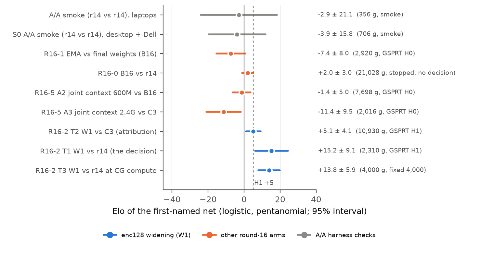
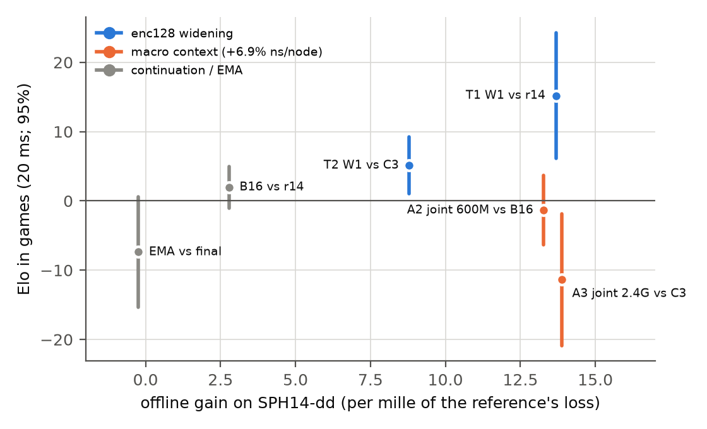
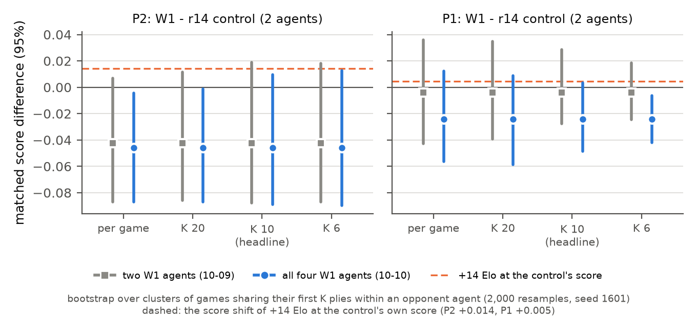

# Round 16: one-idea tests on r14, and the widened encoder that shipped

> **About this report.** It was written for the repository on 2026-10-10 from the round's records. Those records,
> including nets, game files, logs, plans and scripts, live in the local experiment archive `datasets/nnue2/`, which
> is git-ignored and not part of this repository. Paths below are relative to that archive's `r16/` directory unless
> they say otherwise. The figures in [`fig/`](fig/) were drawn with matplotlib from the raw result files: the
> tests' `summary.json`, `results/losses.jsonl` and the CodinGame ladder replays.

**Status (2026-10-10, PDT): final.** Round 16 ran from 10:45 on 2026-10-08 (the first B16 training run) to the
four-agent ladder reading at 01:40 on 2026-10-10. The widened net W1 (`r16_x128_l2400_s1601_rs`) is live on
CodinGame without an opening book.

## Abstract

**Question.** crossfish plays Ultimate Tic-Tac-Toe on CodinGame with an alpha-beta search and a small NNUE
evaluation. The shipped net, `r14_d5_final_s2_rs` ("r14", 35,243 parameters), came from round 14. The scaling study
(generation 15) found that only encoder capacity had moved play. After it, the owner asked for lighter rounds: frozen
data, one idea per short fine-tune, judged by games under a one-line pre-registered rule. Round 16 asked which cheap
change to r14 still gains in play.

**Design.** Every arm fine-tunes r14 on frozen data (e2b + sp14) with round 14's final recipe, using seed 1601, so
each arm sees the same batches as its control. Each test is a pooled pentanomial GSPRT at 20 ms per move, with
logistic-Elo bounds H0 0 / H1 +5, α = β = 0.05 and a 30,000-game cap that counts as a failure. A pass is followed by
4,000 fixed-length games at CodinGame compute (CGC). The round made six training runs (seven nets, counting B16's
EMA weights) in 263 GPU-minutes. It played 53,698 games in nine families, 51,382 of which entered a decision or an
estimate (totals computed for this report). Three written plans fixed the rules before their data. One rule, the
widened net's speed gate, was re-read by a dated ruling after its measurements and before any of its games. "±" is a
95% half-width unless marked SE.

**Key results.**

- **The widened encoder gains and shipped.** W1 widens r14's encoder from 27-64-64-32 to 27-128-128-32 so that it
  computes exactly r14's function at the start. It then trains for 2.4G rows with the same recipe as its matched
  control C3, from which it differs only in the widening.
  - Against r14 at 20 ms the GSPRT accepted H1 at 2,310 games, at **+15.20 ± 9.08 Elo** (a stopped estimate).
  - At CG compute it read **+13.82 ± 5.94** over 4,000 fixed games, with interval [+7.88, +19.76].
  - Against C3 the GSPRT accepted H1 at 10,930 games, at **+5.12 ± 4.12** ([+1.00, +9.24]): the width itself adds play.
  - Its per-node cost on one search tree is +0.08% over an A/A control, and it needs 4.9% fewer nodes to reach
    depth 12.
  - It shipped as a native launcher built on the Dell, without any opening book. All 45 ship checks passed.
- **Nothing else gained.**
  - An EMA of the weights lost to the final weights: H0, −7.38 ± 8.01. Round 14's single +6.0 pair did not
    replicate.
  - A plain 600M continuation of r14 (B16) read +1.98 ± 3.02 at 21,028 games. The owner stopped that test, so it has
    no decision.
  - The HalfKP-style macro context ("joint" mode) led its controls offline by about +13-14 per mille. In games it
    failed both of its screens: −1.35 ± 5.00 at 600M and −11.38 ± 9.49 at 2.4G. The best offline mode, sum44, cost
    +13.2% per node and was blocked by the pre-registered 10% speed rule, so it never played.
  - A featurization scout found no other macro-type input feature worth a round (each at most +2.4 per mille).
- **The offline loss did not order these changes.** Contrasts with offline gains of +13 to +14 per mille played
  anywhere from −11 to +15 Elo ([Figure 2](fig/fig2_offline_vs_play.png)).
- **The ladder cannot resolve the gain, and it does not show it.** Four W1 agents were compared with two r14 agents
  placed between them in time (order W1 W1 r14 r14 W1 W1, so a linear drift of the field cancels).
  - W1's second-player (P2) score differed by −0.046, with a cluster-robust 95% interval of [−0.090, +0.010]. Its
    first-player (P1) score differed by −0.024 ([−0.047, +0.003]).
  - Both intervals hold 0 at the clustering chosen before the last two agents played, so W1 is not shown to be
    worse. Counted game by game, the P2 interval would just exclude 0.
  - The P2 interval ends below the +0.014 that a +14 Elo gain would give at the control's P2 score. So the gain's
    transfer to W1's P2 games against this field is not shown either, and the difference sits in a few opponents.
  - The test has about 14% power to detect that gain, so it cannot resolve a change of this size. The self-play
    result above is the evidence of strength.

## How to read this report

- **Elo** is logistic Elo of the mean pair score s̄: Elo = −400·log10(1/s̄ − 1). Each opening is played as a pair
  of games, one with each net moving first. "±" is a 95% half-width, 1.96 times the pentanomial SE. nElo is
  normalised Elo.
- **Stopped estimates.** An Elo read at a GSPRT's stopping point leans away from zero toward the bound it crossed
  (FINDINGS E6). The fixed 4,000-game CGC match is the round's effect size for W1.
- **Overshoot.** These are pairs that finished after the decision. They are reported but never used.
- **Per mille (‰).** This is a relative difference in held-out label MSE. It is either the candidate's loss against
  its reference's loss on SPH14-dd ("in L"), or, in tables headed "vs r13w_20", each net against r13w_20's loss.
  Positive means better.
- **Names.**

| Name | Meaning |
| --- | --- |
| r14 | `r14_d5_final_s2_rs`, the shipped net before this round; `probe/r14_d5_final_s2.pt` (unscaled) initialises every arm |
| B16 | `r16_b16_s1601`: r14 continued for 600M rows (36,621 steps × 16,384) with the base recipe |
| C3 | `r16_b16_l2400_s1601`: the same recipe at 2.4G rows (146,484 steps), the matched control of A3 and W1 |
| A1, A2, A3 | macro-context arms: sum44 at 600M, joint at 600M, joint at 2.4G |
| W1 | `r16_x128_l2400_s1601`: r14 widened to encoder 27-128-128-32 (51,435 parameters, 16,192 new), with C3's recipe |
| `_rs` | the net's output rescaled by 1/b, where b = sd(e_net) / sd(e_r13w_20) on SPH13, as in round 14; every net plays as `_rs` |
| CGC | CodinGame compute: the move time at which each machine's engine searches about as many nodes as the bot does on CodinGame |
| G1-G6, S0, T1-T3 | W1's gates, its A/A smoke and its three game tests (section 3) |
| FINDINGS X | an entry of `datasets/nnue2/FINDINGS.md`, the cross-round evidence file |

## 1. Introduction

**Where generation 15 left off.** The scaling study fine-tuned r13w_20 at many data levels and lengths. Its
generation-15 operating point lost to r14 by −7.7 ± 4.5 (FINDINGS N8). The study found play flat in fine-tune length
from 600M rows (L17), unique self-play data saturated (L18), and the between-run spread of warm fine-tunes about 0
(upper bound about 2 Elo; E3). The one axis that moved play was encoder capacity. Widening r13w_20's encoder to
enc128, function-preserving, beat its enc64 partner by +7.3 Elo [+2.1, +12.6] (Holm p 0.009; A14). That net was
never played against r14, and it was not shipped, because of a two-sided ±1% ns-per-node rule, in the favourable
direction: it ran 1.2% faster per node.

**The rule this round follows.** The owner's rule for "nimble rounds" (10-05) is frozen data, one idea per short
fine-tune, judgement by games and never by offline loss, and a one-line pre-registered rule per test. The draft plan
`ROUND16_PLAN.md` listed ten candidate tests, R16-0 to R16-9. Four ran: R16-0 (continuation), R16-1 (EMA), R16-5
(macro context, on the owner's request of 10-08, "Pls see if u can get halfkp style to gain") and R16-2 (the widened
encoder, on the owner's request of 10-09: "let's see if you can get the bigger encoder as a gainer. So train it, sprt
it etc."). A featurization scout, analysis only, ran between R16-5 and R16-2. R16-3, R16-4 and R16-6 to R16-9 did not
run.

## 2. Setup

### 2.1 Nets, data and recipe

**Base recipe.** This is round 14's final recipe R\*, continued from r14:

- Data: e2b (4,339,877 rows) and sp14 (213,040,129 rows of r13w_20's depth-13 self-play), mixed 0.4644 / 0.5356.
- Loss: power-2.5 loss with 1.2x weight on over-estimates (`--pow-exp 2.5 --qp-asym 0.2`), PSQT weight 0.06878, and
  a WDL contradiction filter on sp14. The filter skipped 30.0% of the judged sp14 rows in every run.
- Optimiser: cosine lr schedule, peak 1e-3, 1% warmup, floor 1e-5; batch 16,384; K 1600, λ 0, weight decay 1e-5.
- Seed 1601 in every run.

The trainer is a frozen, hash-checked copy of the scaling study's (`frozen_r16/SHA256SUMS` 2a10a04b…). Every arm
starts from r14's unscaled weights. Each arm's arguments differ from its control's only by the tokens that define the
arm, which was checked with a token diff. W1's run repeated C3's data-order lines exactly (gate G1b), and the macro
runs reported B16's data passes.

**Table M1. The nets.** The offline column is on SPH14-dd, in per mille "in L" against the named reference.

| Net | Change | Rows | Params | Train (min) | rows/s | b | Offline vs reference |
| --- | --- | --- | ---: | ---: | ---: | --- | --- |
| B16 `r16_b16_s1601` | base recipe (EMA weights saved too) | 600M | 35,243 | 18.4 | 709,555 | 1.057835 | +2.8 vs r14 |
| A1 `r16_mc44_s1601` | macro context, sum44 | 600M | 52,403 | 19.5 | 610,444 | not run | +14.8 vs B16 |
| A2 `r16_mcj_s1601` | macro context, joint | 600M | 54,548 | 19.2 | 615,526 | 1.070963 | +13.3 vs B16 |
| A3 `r16_mcj_l2400_s1601` | macro context, joint | 2.4G | 54,548 | 66.4 | 629,397 | 1.084846 | +13.9 vs C3 |
| C3 `r16_b16_l2400_s1601` | base recipe | 2.4G | 35,243 | 57.6 | 731,006 | 1.068284 | +2.2 vs B16 |
| W1 `r16_x128_l2400_s1601` | encoder widened to 27-128-128-32 | 2.4G | 51,435 | 81.7 | 507,504 | 1.078737 | +8.8 vs C3, +13.7 vs r14 |

**Training.** Training ran on the desktop's Radeon GPU through DirectML. The six runs took 263 GPU-minutes of
training time.

**How W1 was widened.** The widening is the scaling study's own method (`frozen_r16/widen.py`, a byte copy):

- The old blocks are copied unchanged.
- The new units start with zero outgoing weights. Their incoming weights are calibrated so that they are active on
  95% of live boards.
- The new units train at the same lr as the old ones (M 1).

The check G1 confirmed that step 0 equals r14 exactly. Every inherited element is equal, and the evals are identical
(max |d| 0) on 220,000 rows. W1's SPH14-dd loss was below C3's at all ten epochs: 0.025381 against 0.025606 at the
end.

### 2.2 Runtime and engines

The evaluator is the pattern-generator NNUE (see `documentation/nnue_training_and_implementation.md`).

**Where the encoder runs.** The encoder runs only at start-up, when it is baked into per-pattern tables. A wider
encoder therefore lengthens the bake but leaves the per-node work unchanged.

**Engines.** Every engine in every game is the CodinGame bot's own code with the book stubbed out (`cg_nobook`),
built from one archived runtime commit, sha-checked and named `NAME.<sha8>` in the records. The one exception is the
first A/A smoke, which used the scaling study's r14 build on the older r13 runtime.

- **adda324** (main with ProbCut, PR #41) built the engines for r14, B16, B16's EMA weights and C3 in R16-0, R16-1
  and R16-5. They were compiled with g++ 11.4 using CodinGame's command line on the ThinkPad.
- **`claude/macro-ctx-runtime` f357a24** (local only) is the macro-context port; it built the A2 and A3 engines.
  Context rows fold into the projection, and deciding moves re-context their boards incrementally.
- **Runtime B, `claude/enc128-runtime` 84db7aa** (local only; commits a2672c9 and 84db7aa on adda324), lets the bake
  read any encoder width from the net header. Against adda324 it changes six files: a Makefile target, the
  regenerated `cg_input.cpp` (+286 UTF-16 units), the encoder-only hunks of `nnue_b64.hpp`, the widths line of r14's
  header, a new `nnue_parity.cpp`, and the generic emitter. The search code and `eval_avx` are unchanged.
  - On runtime B, r14 rebuilds bit-identically: payload cde8c610, fingerprint 9446452298351114632, all selfchecks
    and bench 12 499aa1530ed872d3 / 30,721,792 on the desktop and the Dell.
  - Every R16-2 engine was built on runtime B: Dell binaries with g++ 13.3 and CodinGame's command line, desktop
    binaries with clang -O3. No R16-2 engine was paired with an older g++-11 build, because g++-13 runs about 1.4%
    slower.

### 2.3 Games and statistics

**Harness.** The referee is the scaling study's `gauntlet_sc.py`, byte-copied (sha256 8900d565…). It handles
forfeits at 1,000 ms, crashes and illegal replies, and stops cleanly on a stop file. Two drivers pool every host's
pairs into one sequential test, in completion-time order:

- `eval/gsprt16.py` pools the ThinkPad and the Dell (R16-0, R16-1, R16-5).
- `eval/gsprt16x.py` pools the desktop and the Dell (R16-2), because the ThinkPad was away.

The LLR is the referee's pentanomial constrained-MLE LLR, with bounds ±2.944. A late reply is one slower than the move
time plus 30 ms.

**Openings.** The openings come from the cfbook of 50,000 balanced depth-16 openings. No unused range was left in it
(FINDINGS E8), so each test reshuffles the whole book with its own seed. Each test also excludes every line that an
earlier round-16 test could have played (`--exclude`). An independent check confirmed that all nine game families'
openings are pairwise disjoint. They are not unseen: earlier rounds walked the same book. After the round, 22,251
lines remain.

**Table M2. Game conditions.**

| Condition | Tests | Hosts and workers | Move time |
| --- | --- | --- | --- |
| 20 ms, laptops | aa_smoke, R16-1, R16-0, A2, A3 | ThinkPad 7 workers (E-cores 5-11) + Dell 6 (CPUs 1-3, 5-7) | 20 ms |
| 20 ms, desktop + Dell | S0, T1, T2 | desktop 10 workers (CPUs 6-15 of a Ryzen 7 5800XT, 8 cores / 16 threads) + Dell 6 | 20 ms |
| CGC | T3 | desktop 7 workers (one per physical core) + Dell 3 (CPUs 1-3) | desktop 53 ms, Dell 67 ms |

The CGC budgets are the calibrated C++ budgets (desktop 49 ms with 7 threads, Dell 62 ms with 3 threads) times 1.075,
the native build's factor. They were not re-probed for `cg_nobook`. Both hosts' pairs feed one pooled result, so
that result mixes two compute levels; per-host Elo is reported but not judged. Throughput was about 850-1,015 games
per minute on the laptops and 1,240-1,285 on the desktop and the Dell.

## 3. Pre-registration and deviations

**Table M3. The plans.**

| Plan | Covers | Written / frozen | What it fixes |
| --- | --- | --- | --- |
| `ROUND16_PLAN.md` §3 | R16-0, R16-1 | draft of 10-08, before both runs (the file was last edited at 12:01, after them, to add a status line) | one-line rules: B16 vs r14; EMA vs final weights, both GSPRT [0, +5] |
| `MACRO_PLAN.md` | R16-5: A1, A2, A3, C3 | written 00:35 on 10-09, last modified 00:37, before any R16-5 training or game | attempts and rules; speed gate G2 (a mode with more than 10% zero-context overhead is not played); order rule L; build gates G1-G6; openings |
| `WIDEN_PLAN.md` (sha256 591560bd…) | R16-2: W1 | 14:40-14:56 on 10-09 (file modified 14:55), before W1's launch at 14:58; frozen from T1's first game | gates G1-G6, smoke S0, T1 (decides), T3 (CGC veto), T2 (attribution, read by a fixed table), no fallback arm |

**WIDEN_PLAN's rules for W1.**

- **G4 (speed):** the desktop median ns/node ratio W1 / r14 must be at most 1.010 on bench 12, measured over 12 ABBA
  rounds. A faster net passes, by the owner's ruling that the check guards against slowdowns only.
- **G5 (bake):** the Dell's median bake must be at most 300 ms.
- **G6 (size):** the paste must be under 100,000 UTF-16 units.
- **T1:** H1 leads to T3 and then the ship build; H0 or the cap leads to T2, and then R16-2 stops.
- **T3:** veto W1 only if the pooled upper 95% bound is below 0.
- **T2:** its result changes no ship decision.

**Table M4. Deviations.** Every change was logged in `README.md` with a timestamp and a reason.

| # | When | Plan | What happened | Bearing on inference |
| --- | --- | --- | --- | --- |
| 1 | 10-08 11:53 | R16-0 runs to a decision or the 30,000 cap (the cap counts as FAIL) | The owner stopped it at 21,028 games, LLR −1.09 | No decision. The interval [−1.0, +5.0] is reported as a stopped estimate |
| 2 | 10-08 | ROUND16_PLAN: a fresh seed and a fresh opening range per test, and `tools/sprt_cluster.py` | Seed 1601 everywhere, to pair each arm with its control; per-test reshuffles with exclusion; the pooled referee driver | Contrasts are one-factor, but each arm is a single seed (σ_net about 0, upper about 2; E3). Openings are disjoint within the round only |
| 3 | 10-09 01:30-02:45 | MACRO_PLAN §2.4 runtime spec | Five implementation changes to the port (no refresh fallback, payload end check, exporter threshold, header comment, plain paste size) | None on the results: exact integer parity held (9 × 20,000 positions, 0 mismatches) |
| 4 | 10-09 14:40 | ROUND16_PLAN R16-2: enc128 at 600M first, then 2.4G on a fail | One 2.4G arm with its matched control C3 | Logged in WIDEN_PLAN before any training |
| 5 | 10-09 14:40 | ROUND16_PLAN: games on the laptops, engines from g++-11 | Desktop + Dell (owner: "Why only run on dell? You also have the desktop to use"); Dell engines from g++ 13.3, because the ThinkPad was away | Both engines in every pair come from the same compiler on the same host |
| 6 | **10-09 18:45** | **G4: different-tree desktop ns/node ≤ 1.010** | **G4 failed in four independent readings (1.020-1.024). The main session re-read it on the same-tree statistic relative to an A/A control: W1 − A/A = +0.08%, so it PASSES** | **Ruled after the speed data and before any R16-2 game. T1 plays at a fixed 20 ms, so any real speed cost is charged in the games anyway (section 4.5)** |
| 7 | 10-09 18:55 | `gsprt16x.py` keeps the P2-book pause/resume calls | No calls (the owner had stopped the book service); process checks before and after each test instead | None |
| 8 | 10-09 19:05 | T3 command line | Main-CPU flags added to match the layout the plan stated in its text | Not a rule change |
| 9 | 10-09 19:24 | Order: T3, the ship build, then T2 | T2 ran before the ship build | None: the ship build plays no cfbook opening, and it waited for T2's exit |
| 10 | 10-09 20:06-21:25 | Ship: the live book configuration, built on the ThinkPad | Bookless (owner: "ship it with no book"); built on the Dell by a user-space toolchain route; checks run by no-book scripts | The route was validated by rebuilding the live r14 launcher byte for byte (section 4.7) |
| 11 | 10-10 00:05-00:35 | (analysis) | The 10-09 23:25 ladder reading ("P2 is worse by about 0.04-0.06") was corrected to "below resolution" | An analysis correction (section 4.8) |
| 12 | 10-10 00:28-01:40 | (analysis) | W1 was resubmitted twice after the control (agents 6788129 and 6788151), and the ladder reading was extended to four W1 agents | More data for the same comparison, with the 10-ply clusters chosen at 00:05; the reading stays "below resolution" (section 4.8) |

## 4. Results

**Table 1. Every round-16 game family.** All estimates are at the decision unless marked. The pentanomial counts
are LL, LD, DD/WL, WD, WW from the first-named net's side.

| Test | Contrast | Games | Penta | Elo ± 95% | LLR | Verdict |
| --- | --- | ---: | --- | --- | --- | --- |
| aa_smoke | r14 vs r14 (laptops, harness check) | 80 (356 with overshoot) | 0, 7, 24, 7, 2 | −2.93 ± 21.06 (with overshoot) | +0.19 | smoke, clean |
| R16-1 `r16_1_ema` | B16 EMA vs B16 final | 2,920 | 62, 380, 631, 332, 55 | −7.38 ± 8.01 | −2.945 | **H0** |
| R16-0 `r16_0_b16` | B16 vs r14 | 21,028 | 442, 2523, 4471, 2629, 449 | +1.98 ± 3.02 | −1.087 | stopped, no decision |
| R16-5 A2 `r16_5b_mcj` | joint 600M vs B16 | 7,698 | 172, 928, 1678, 900, 171 | −1.35 ± 5.00 | −2.953 | **H0** |
| R16-5 A3 `r16_5c_mcj_l2400` | joint 2.4G vs C3 | 2,016 | 50, 252, 447, 232, 27 | −11.38 ± 9.49 | −2.966 | **H0** |
| S0 `aa2_smoke` | r14 vs r14 (desktop + Dell, harness check) | 400 (706 with overshoot) | 4, 59, 90, 40, 7 | −3.94 ± 15.80 (with overshoot) | −0.62 | smoke, PASS |
| **T1** `r16_2t1_x128_r14` | **W1 vs r14, 20 ms** | 2,310 | 37, 257, 487, 316, 58 | **+15.20 ± 9.08** | +2.951 | **H1** |
| **T3** `r16_2t3_x128_cgc` | **W1 vs r14, CGC** | 4,000 (fixed) | 35, 376, 1037, 499, 53 | **+13.82 ± 5.94** | (+6.11, reported only) | **no veto** |
| **T2** `r16_2t2_x128_c3` | **W1 vs C3, 20 ms** | 10,930 | 197, 1269, 2424, 1326, 249 | **+5.12 ± 4.12** | +2.962 | **H1** |

**Figure 1.** Every round-16 contrast, with its 95% interval. Grey marks the A/A harness checks (with overshoot),
orange the arms that did not gain, and blue W1's three tests. The dashed line is the GSPRT's H1 of +5.

### 4.1 R16-1: EMA weights (FINDINGS H13, refuted)

**Rule.** The EMA of B16's last 20% of steps (decay 0.999863467, from step 29,296) plays B16's final weights head to
head. H1 would mean that every later run plays its EMA weights.

**Result.** H0 at 2,920 games, −7.38 ± 8.01, nElo −11.6 ± 12.6. The EMA was also behind offline: LADHt −20.17
against −14.48 per mille vs r13w_20. The two weight sets are genuinely different nets: their evals differ by 33.8 on
average over LADH's 193,320 positions. Round 14's single pair (+6.0, SE 4.9) does not replicate. Every later run
plays its final weights.

### 4.2 R16-0: the plain continuation B16 (FINDINGS L13)

B16 against r14 read +1.98 ± 3.02 at 21,028 games, with LLR −1.09, when the owner stopped the test about 9 minutes
before the cap. There is no decision under the rule. The interval rules out a loss of more than about 1 Elo and does
not reach +5. The test was on course for the cap, which counts as a FAIL. This matches round 14's few-Elo gains from
continuation (L13). r14 stayed the comparator.

### 4.3 R16-5: the macro context (FINDINGS A16, confirmed)

**The feature.** Each live miniboard's row also gets context rows `enc(p) @ U_k + c_k`, where k is a function of the
macro board alone: each board's status for each player. U and c start at zero, so step 0 is exactly r14.

**Speed was the crux.** On MACRO_PLAN's priors (0.7 Elo per per mille offline, 0.8 Elo per 1% of speed), sum44
breaks even at 8.6% overhead and joint at 7.0%.

**The port was exact.** The integer evaluation matched the Python reference in 9 comparisons × 20,000 positions with
0 mismatches. The bake took 109 ms, and an independent verifier found no blocker.

**Table 2. R16-5.**

| Attempt | Offline SPH14-dd vs control (in L) | Desktop ns/node | Games (20 ms) |
| --- | --- | --- | --- |
| A1 sum44 600M vs B16 | +14.8‰ | +13.19% at zero context (range +11.97 to +14.39%) | not played: G2 blocks above 10% |
| A2 joint 600M vs B16 | +13.3‰ | +6.43% at zero context, +6.93% on its own tree | **−1.35 ± 5.00**, H0 at 7,698 |
| A3 joint 2.4G vs C3 | +13.9‰ | same runtime as A2 | **−11.38 ± 9.49**, H0 at 2,016 |

**Reading.** The priors predicted about +9.3 Elo of eval gain for A2, less about 5.5 Elo for its speed: about +3.8
net. The games measured −1.35, and the interval's upper end of +3.65 sits just below that prediction. A3's stopped
estimate is worse still. A stopped estimate at a lower-bound crossing leans low, so it overstates the loss.

**Independent check.** An independent checker with its own GSPRT code reproduced every verdict from the raw records.
It also confirmed that the binaries that played carried the intended nets, and that the openings were disjoint.

**Outcome.** No macro-context net is a candidate. The runtime branch stays local.

### 4.4 The featurization scout (FINDINGS A17, suggestive)

**Question.** The owner asked on 10-09 whether any other macro-type feature, or any new featurization, was worth
trying. The scout answered it by analysis only, with no nets and no games.

**Method.** It fitted corrections on top of r14's frozen output, using all 5.3M SPH14-dd rows plus V2-dd and LADHt,
with game-clustered bootstrap intervals. A stricter variant trained new rows plus the head on r14's frozen
accumulators.

**Macro-type candidates.** Every one added at most +2.4‰ and was negative on another suite. The candidates were:

- the send class;
- macro status;
- threat counts;
- macro-board rows and line rows;
- forced-board context rows.

**Seat × decided boards.** The one strong signal was seat × min(decided boards, 8), where seat means which player
moved first:

- +13.8‰ [12.4, 15.2] as a residual;
- +21.7 ± 2.0 trained in.

It reverses on ladder positions (−5.1‰ [−9.8, −0.6] after an affine control) and on one-move children (−47.3), and it
changes 0.67% of one-ply choices. The scout reads it as a statistic of the self-play population, not information
about the position.

**Calibration.** The trained macro-context net scored +14.6‰ as a residual oracle, more than the widening's +8.5‰,
yet the widening is the one that played better. Residual signal does not predict play.

**Recommendation.** Open no featurization round, and test the enc128 widening on r14 next.

### 4.5 R16-2: the widened encoder (FINDINGS A18, confirmed)

**Build gates.** These all passed before any game.

- **G1 / G1b (identity at step 0 and the same data order as C3):** PASS.
- **G2 (offline sanity against C3):** PASS. W1's loss was 8.8‰ better than C3's on SPH14-dd, 3.7‰ on LADHt and 12.0‰
  on V2-dd, within the scaling study's widening gains.
- **G3 (exact build):** PASS. The integer evaluation matched in 10 comparisons × 20,000 positions with 0 mismatches.
  The comparisons were the Python integer reference against desktop clang (scratch, incremental and native flags)
  and against Dell g++-13 (CodinGame's command line).
  - Desktop and Dell agree exactly: fingerprint 3846873435862646193, Zobrist 3a74072d5bcdfc91, bench 12
    c12bfc8e73c521ca / 29,208,628.
  - A known-answer test with the scaling study's enc128 net X01 reproduced its header and its tables.
- **G5 (bake):** PASS. The Dell bake had a median of 258.1 ms, against r14's 109.
- **G6 (size):** PASS. The booked paste is 83,216 UTF-16 units.

Three independent verifiers added parity checks on fresh positions from CodinGame games: 56,844, 49,911 and 92,963
positions, plus up to 10.7M incremental play-out evaluations and in-search traces. All gave 0 mismatches.

**Table 3. The speed gate G4.** All readings are W1 / r14.

| Statistic | Readings | Control |
| --- | --- | --- |
| Pre-registered: bench 12 wall ns/node, each net on its own search tree (desktop) | 1.0201 (the record; all 12 rounds above 1.010), 1.021 / 1.024, 1.020-1.023, 1.0230 | C3 / r14 0.997-1.003 |
| Same tree: perft, trace replay, `v7_tree` (desktop) | 1.0032 / 1.0026; 1.0013-1.0044; 1.0092 ± 0.0018 | C3 1.0009; −0.1 to +0.5%; A/A (r14 against a copy of itself) 1.0084 ± 0.0038 |
| Dell, own trees | 1.0042, 1.0058 | – |

**What G4 measured.** The pre-registered statistic compares two different search trees. W1's tree has more nonzero
accumulator pairs per evaluation (31.5 against 30.1). The plan itself had said that a reading above 1.010 would be
tree composition. On one tree, W1 costs +0.08% more than the A/A control. W1 also reaches depth 12 with 4.9% fewer
nodes, so bench 12 finishes 3.2% faster on the desktop and 4.4% faster on the Dell.

**The ruling.** The main session's ruling of 18:45 (deviation 6) re-read G4 on the same-tree statistic, before S0
and before T1. This favours going ahead, and it was made after the speed data. The protection is that T1 and T2 play
at a fixed 20 ms per move on the machines where the cost arises, so any real per-node cost is charged in the games.

**S0 (A/A smoke of the new driver).**

- Games: 706 with the overshoot, −3.94 ± 15.80 [−19.73, +11.86].
- Hygiene: 0 forfeits, 0 illegal replies, 0 late replies.
- Both hosts' pairs entered the pooled sequence.
- Stop and cleanup worked on both hosts.

**T1 (the decision).**

- Result: H1 at 2,310 games, +15.20 ± 9.08 [+6.13, +24.29], LLR +2.951, nElo +23.8 ± 14.2. Draws were 54.7%.
- With the overshoot: +14.14 ± 8.49 over 2,630 games.
- Per host: desktop +13.72 ± 10.96, Dell +17.80 ± 15.99. Both are positive.

**T3 (CGC, fixed length).**

- Result: +13.82 ± 5.94 [+7.88, +19.76] over 4,000 games. Draws were 62.7%, and the pair SD was 0.195.
- The lower bound is also above 0, so at CG compute W1 is better than r14 at 95%.
- Per host: desktop +14.11 ± 6.77 over 3,006 games, Dell +12.94 ± 12.36 over 994.

**T2 (attribution).**

- Result: H1 at 10,930 games, +5.12 ± 4.12 [+1.00, +9.24], LLR +2.962.
- Per host: desktop +3.80 ± 5.00, Dell +7.42 ± 7.20.
- Reading under the plan's fixed table (T1 H1, T2 H1): **"the width is the gainer"**. H1 here means better than 0
  and consistent with +5, not at least +5.
- C3 against r14 was never played. Subtracting T2 from T1 puts C3 at about +10 over r14. That figure comes from two
  stopped estimates, so it is not a test.

**Hygiene and the Dell stall.**

- Over all R16-2 games: 0 forfeits, 0 illegal replies, 0 harness errors. Late-reply rates were at most 0.0044% per
  seat and host.
- T1 and T2 each had one W1 reply of about 325 ms on the Dell's core 1. A probe of 6,800 games, plus an engine-free
  spin loop on CPUs 1-7, traced both to the machine.
  - The Dell's desktop network applet (cosmic-applet-network, with NetworkManager and dbus-broker) stalls pinned CPUs
    for up to 588 ms about every 302 s. The two events sit 22 and 16 periods before a captured one.
  - In the probe the control C3 had 4 of the 6 slow replies.
  - Replays of the slow positions stayed under 20.2 ms.
- So it is machine noise, not a W1 code path. Timing runs on the Dell should use medians and rerun outliers.

**Recheck.** An independent recheck (Check2), with its own code, reproduced S0, T1, T3 and T2 exactly from both
hosts' raw referee files.

### 4.6 Offline loss against play

**Figure 2.** Offline gain on SPH14-dd, in per mille of the reference's loss, against Elo at 20 ms for the six
contrasts that have both. The macro nets carry a +6.9% per-node cost; the others carry none.

**Reading.** Three contrasts with almost the same offline gain played very differently: +13.3, +13.7 and +13.9‰
became −1.35, +15.20 and −11.38 Elo. The widening's +8.8‰ over C3 played +5.1. As in round 14 and the scaling study
(FINDINGS O15), SPH14-dd catches broken runs (it is gate G2) but does not order arms by playing strength.

### 4.7 The ship build

**Owner decisions of 10-09.** W1 ships as a native launcher, built on the Dell, with no book at all: no P1 lines and
no P2 lines. The hard-coded 4 4 opener stays.

**The toolchain route.** The repository's native route needs clang 23.1.2 and g++ 11.4 headers, and those existed
only on the ThinkPad. On the Dell a user-space route was put together:

- LLVM 23.1.2 and g++ 11.4 headers, under `~/cgbin`;
- an ICU-70 forwarding shim, so that lld starts;
- a re-pointed libstdc++ link;
- a clang wrapper that sets `__GLIBC_USE_C2X_STRTOL` to 0.

The route was validated first by rebuilding the live r14 launcher from adda324. The result was byte for byte the live
one (d6d902e2…), with identical selfchecks. With the wrapper, the binary needs at most GLIBC_2.34; without it, it
needs GLIBC_2.38, which CodinGame cannot load.

**No book.** Runtime B's real `play_book.hpp` is linked with a zero-entry data header (0 entries, 0 bytes,
fingerprint 0). `pb_init` rejects that payload at its fingerprint check, so `pb_lookup` never returns a move. Two
pieces of the repository's tooling cannot handle this case:

- W1's packer refuses an empty text book.
- The stock `make cg-native-check` stops at its second step, because the launcher's selfcheck prints
  `book=FAILED entries=0` and exits 1.

The ship therefore used no-book copies of those checks. Making a no-book build pass the repository's own checks is
part of merging runtime B.

**The shipped files.**

- Launcher `cg_input_native_w1_nobook.py` (sha256 dd33df97…): 82,112 UTF-16 units, 0 surrogates.
- Paste fallback (a893a029…): 81,943 units.
- Binary: 310,768 bytes.

**Checks.** All 45 manifest checks passed.

- **Linkage:** at most GLIBC_2.34, GLIBCXX_3.4.29 and CXXABI_1.3.11 (CodinGame has 2.36 / 3.4.30 / 1.3.13); NEEDED
  only libc, libgcc_s, libm and libstdc++. The binary uses AVX2, BMI1 and BMI2 only, which the Haswell judge has.
- **Identity:** the launcher's selfchecks equal a readable build of the same tree (Appendix A). Its fingerprint and
  bench equal W1's build of record.
- **Protocol games through the launcher on the Dell:** 100 of 100 ok, with 0 BOOK replies. The first turn, including
  the bake, had a maximum of 441.8 ms (median 414.8); later moves had a maximum of 91.1 ms. Every first-player game
  opened 4 4.
- **Paste:** 20 games, ok; it compiled with 0 diagnostics under CodinGame's command line (with g++-13 standing in
  for g++ 11.2).
- **Independent verification:** a separate verifier rebuilt the binary and the launcher byte-identically, decoded the
  payload independently, and played 20 games with its own referee written from the CodinGame rules. The first turn
  had a median of 415.2 ms and a maximum of 553.9 ms.

**First-turn cost.** W1's first turn is about 137 ms slower than r14's on the Dell (415 against 278 ms). The cause
is the enc128 bake. It projects to about 550-600 ms on CodinGame, under the 1,000 ms limit. On the ladder W1 had 0
problems on our side in 1,040 games (four agents).

### 4.8 The CodinGame ladder (FINDINGS A19, open)

**Submissions.** Six agents placed in one night, and each played 260 games. W1 is the shipped bookless launcher
(dd33df97…). The control is the r14 launcher that was live before W1, without a P2 book (d6d902e2…), resubmitted
unchanged. The control's two agents sit between W1's two pairs in time, so a drift of the field that is linear in
time cancels from the comparison. The ladder scores themselves are not compared, because one placement's score has an
SD of about 0.36 (FINDINGS A19).

**Table 4. The ladder agents.** "Placed" is the time the placement finished.

| Order | Agent | Build | Placed | Rank, score |
| ---: | --- | --- | --- | --- |
| 1 | 6788025 | W1 | 10-09 22:09 | #6, 30.55 |
| 2 | 6788044 | W1 | 10-09 22:32 | #6, 30.61 |
| 3 | 6788058 | r14 control | 10-09 22:58 | #6, 30.91 |
| 4 | 6788079 | r14 control | 10-09 23:21 | #6, 30.85 |
| 5 | 6788129 | W1, resubmitted (submission 41481777, 00:28) | 10-10 00:59 | #8, 30.21 |
| 6 | 6788151 | W1, resubmitted (submission 41481857, 01:00) | 10-10 01:32 | #9, 29.97 |

**Method.** The comparison uses matched-opponent scores. For each opponent agent that both arms met at least three
times on a seat, it takes the difference of the two arms' mean results, weighted by the harmonic mean of the two
game counts. Uncertainties in this section are SEs unless they are marked as 95% intervals.

**The first reading and its correction (two W1 agents).** With the first W1 pair only, over the same 13 opponent
agents on both sides:

- P2: −0.042 (per-game SE 0.024, from the per-opponent variances, over 213 against 214 games). P1: −0.004 (SE 0.021).
  Both seats: −0.027 (SE 0.032).
- The evening reading of 10-09 at 23:25 said that W1's P2 "is worse by about 0.04-0.06". That overstated the
  difference. The games are not independent: W1's 260 P2 games held only 106 distinct 10-ply openings, against the
  control's 174.
- Bootstrapping over clusters of games that share their first 10 plies within an opponent agent gives an SE of 0.029
  and a 95% interval of [−0.090, +0.023]. A deterministic rerun for this report gives SE 0.028 and [−0.088, +0.019];
  the bootstrap's bounds carry Monte Carlo noise of a few thousandths.
- The owner put it this way: "ladder is too noisy to really tell gains for sure." The reading was corrected at
  00:05-00:35 on 10-10: the gain is below the ladder's resolution, and W1 is not shown to be worse. W1 was then
  resubmitted twice.

**Four W1 agents (10-10, 01:40).** With the restored pair, the comparison covers 14 opponent agents: 393 W1 games
against 217 control games on P2. The 10-ply cluster definition is the one chosen at the 00:05 correction, before the
restored agents had played.

**Table 5. W1 minus the control, four W1 agents against two control agents.** Bootstrap SEs over 2,000 resamples.

| Seat | Difference | SE, each game its own cluster | SE, 10-ply clusters | 95%, 10-ply clusters |
| --- | ---: | ---: | ---: | --- |
| P2 | −0.046 | 0.021 | 0.025 | **[−0.090, +0.010]** |
| P1 | −0.024 | 0.018 | 0.013 | **[−0.047, +0.003]** |

Both seats together read −0.037 (SE 0.028, from the per-opponent variances). The deterministic rerun for Figure 3
gives SE 0.025 and [−0.089, +0.009] for P2, and SE 0.013 and [−0.049, +0.003] for P1.

**What the four agents show.**

- **No significant loss.** Neither 10-ply interval excludes 0, so W1 is still not shown to be worse. That reading
  depends on the clustering. Counting each game as independent, the rerun's P2 interval is [−0.087, −0.004], which
  does exclude 0; at 20-ply clusters it ends at −0.001. W1's P2 games are not independent: the four agents' 520 P2 games
  hold 188 distinct 10-ply openings (the restored pair alone 123 in 260), against the control's 174 in 260.
- **Transfer to P2 not shown.** The P2 interval's upper end, +0.010, is now below +0.014, the shift that a +14 Elo
  gain would give at the control's P2 score of 0.225. P1's upper end, +0.003, is likewise just below its +0.005. So
  the self-play gain is not shown to carry over to W1's P2 games against this field.
- **Opponent-specific.** The P2 difference is concentrated in a few opponents (Table 6). W1 scored worse than the
  control against morph, RoboStac, karliso and Babebibobu, and better against MrSubZero, AllanB, Fancheng, Daporan and
  Apostolique. Several of these cells hold fewer than ten control games.
- **Hygiene.** W1 had 0 problems on our side in 1,040 games. The control had 2 timeouts of its own in 520.

**Table 6. P2 results per opponent agent, four W1 agents against the control.** Mean result (games).

| Opponent | W1 | Control | W1 − control |
| --- | --- | --- | ---: |
| morph | 0.089 (28) | 0.500 (9) | −0.411 |
| RoboStac | 0.075 (40) | 0.292 (24) | −0.217 |
| karliso | 0.113 (31) | 0.326 (23) | −0.213 |
| Babebibobu | 0.048 (31) | 0.167 (15) | −0.118 |
| sZoom | 0.000 (41) | 0.000 (12) | 0.000 |
| YurkovAS | 0.667 (3) | 0.667 (3) | 0.000 |
| zasmu | 0.115 (39) | 0.111 (18) | +0.004 |
| TomAlard | 0.067 (30) | 0.053 (19) | +0.014 |
| Daporan | 0.071 (28) | 0.043 (23) | +0.028 |
| Angecide | 0.050 (10) | 0.000 (3) | +0.050 |
| Apostolique | 0.071 (14) | 0.021 (24) | +0.051 |
| MrSubZero | 0.108 (37) | 0.029 (17) | +0.079 |
| AllanB | 0.095 (37) | 0.000 (22) | +0.095 |
| Fancheng | 0.146 (24) | 0.000 (5) | +0.146 |

**Power.** At the control's P2 score of 0.225, +14 Elo is worth +0.014 per game (computed here; FINDINGS A19 gives
about +0.013 at a base of 0.2 and +0.020 at 50%). With the clustered SE of 0.025, this test detects that shift with
about 14% probability in a one-sided test at 5% (9% two-sided). A two-SE detection needs about 12 times these games.
FINDINGS X1 already recorded that self-play gains of +9 to +20 Elo do not show on the ladder.

**Figure 3.** W1's matched score difference from the r14 control pair, per seat, with bootstrap 95% intervals at four
cluster definitions. Grey squares use the first two W1 agents (the 10-09 reading), blue circles all four. K 10 is
the headline definition. The intervals were recomputed here from the replays with a fixed resampling order (seed
1601). The dashed line is the shift that a +14 Elo gain would produce at the control's own score. For P1 the
intervals narrow as the clusters coarsen, which shared openings alone would not do, so the P1 cluster intervals are
less trustworthy than the P2 ones; only the coarsest P1 interval (K 6) excludes 0.

**The reading.** The ladder cannot resolve W1's self-play gain. The difference is below the ladder's resolution, and
W1 is not shown to be worse. With four agents the ladder also does not show the gain transferring to the second
player's games against this field: the P2 interval ends below the expected shift, and the difference sits in a few
opponents, so any transfer looks opponent-specific. The self-play tests (T1, T3 and T2) remain the evidence of
strength. W1 is the live build.

## 5. Limitations

- **One seed per arm.** Every net is seed 1601. ROUND16_PLAN's promotion step was not run for W1: a fresh-seed retrain
  and a 90 ms GSPRT. The evidence that warm fine-tunes barely differ by seed (σ_net about 0, upper bound about 2; E3)
  is what supports a single net.
- **Stopped estimates.** T1's +15.2 and T2's +5.1 are stopped estimates, so they lean high. T3's +13.8 ± 5.9 is the
  effect size.
- **T3 is not the shipped binary.** T3 played the C++ `cg_nobook` engines at native-equivalent budgets, not the
  shipped native binary. Those budgets were not re-probed for this engine.
- **Two compute levels per pool.** Every pooled result mixes the desktop's clang on SMT-shared cores with the Dell's
  g++ 13.3. The per-host estimates agree within their intervals.
- **Narrow comparison.** The only opponents were sibling nets on the same search. There was no third-party engine, no
  booked 90 ms test, and C3 never played r14. The openings are disjoint within the round but were seen by earlier
  rounds.
- **G4 was re-read after its data.** The ruling came before any game, and the fixed-time games charge any real speed
  cost. Even so, it is a decision made after seeing the measurement.
- **The macro-context results are narrow.** They hold at 20 ms only and include a +6.9% per-node cost. sum44, the best
  offline mode, never played.
- **The ladder test is weak.** It has four W1 agents and two control agents in one night, and line diversity that
  differs between the arms for reasons not explained. Its verdict depends on the cluster definition: the per-game P2
  interval excludes 0, the 10-ply one does not. Its power for the expected effect is about 14%.
- **The ship route is outside the repository.** The ship toolchain is a user-space route on the Dell, validated by one
  byte-identical rebuild, not the repository's documented route. The no-book configuration does not yet pass the
  stock checks.
- **Less first-turn margin.** The first turn has less margin than r14's: about 415 ms on the Dell, projected to
  550-600 ms on CodinGame.

## 6. Conclusions

1. **W1 is the strongest net so far in self-play, and it is live.** It beats r14 by +13.8 ± 5.9 Elo at CG compute
   (+15.2 at 20 ms, stopped). It beats its matched enc64 continuation by +5.1 ± 4.1, so the width carries the gain.
2. **Capacity that preserves the shipped net's function is the eval lever that reached play.** The plain
   continuation, EMA and the HalfKP-style macro context did not. The featurization scout found no input feature
   worth a round.
3. **Offline loss is a broken-run check, not a judge.** Equal offline gains of +13-14‰ played anywhere from −11 to +15
   Elo.
4. **The ladder cannot certify Elo changes in the teens.** With four W1 agents against two control agents, W1 is not
   shown to be worse, but its P2 interval ends below the expected +0.014, so the gain's transfer to the second
   player's ladder games is not shown, and the difference is opponent-specific. The self-play tests are the
   evidence. A lower-noise transfer check, if one is wanted, would be position-level (W1 against r14 moves on
   positions from our ladder games, judged by deep search) or games against a non-sibling engine.
5. **Next.** Open items:
   - the planned search-constant SPSA (ProbCut's constants are tuned to the net's eval scale) on W1;
   - merging runtime B with a supported no-book configuration;
   - the plan's untested ideas, if wanted: e2b share, wider head, output buckets, λ jitter, 300M length.

## Sources

The paths are in the local experiment archive `datasets/nnue2/`, which is not in this repository.

- **Round log and plans:**
  - `r16/README.md`, every dated entry from 2026-10-08 10:45 to the four-agent ladder entry of 2026-10-10 01:40;
  - `ROUND16_PLAN.md`;
  - `r16/MACRO_PLAN.md`;
  - `r16/WIDEN_PLAN.md`;
  - `r16/feat_scratch/FEATURIZATION_SCOUT.md`.
- **Games:** `r16/gsprt/{aa_smoke, r16_1_ema, r16_0_b16, r16_5b_mcj, r16_5c_mcj_l2400, aa2_smoke, r16_2t1_x128_r14,
  r16_2t3_x128_cgc, r16_2t2_x128_c3}/` (`summary.json`, `records_*.jsonl`, `hosts/`); `r16/openings/`.
- **Offline, speed and checks:**
  - `r16/results/{losses, scale_b, init_check_widen, enc_speed, macro_speed, ema_delta}.jsonl`;
  - `r16/nets/*.json`;
  - `r16/build/r16_x128_l2400_s1601_rs_rtB84db7aa2/build.json`;
  - the verifier and checker outputs in `r16/enc128_scratch/{verify1, verify2, verify3, check, check2}/` and
    `r16/macro_scratch/{verify1, check}/`.
- **Ship:** `cg/ladder/prep/r16_ship/` (`manifest.json`, `ship_native/`, `toolchain_validate/`, `verify/`).
- **Ladder:**
  - `cg/ladder/prep/r15/ana_w1nobook_matched.out`, `ana_w1nobook_vs_ctl.out` (two W1 agents) and
    `ana_w1x4_vs_ctl.out` (four);
  - the watcher logs and health checks `cg/ladder/prep/r15/{watch, check}_{w1nobook, ctlW1, w1nobookR}.*`;
  - the replays under `cg/ladder/prep/games/`.
  The matched-score and cluster-bootstrap scripts (`matched_w1c.py`, `cluster_w1.py`) and the figure script were
  kept with the session's working files, not in the archive.
- **Cross-round evidence:** `FINDINGS.md` entries A16, A17, A18, A19 (as updated at 01:40 on 10-10), L13 and H13,
  with A14, E3, E6, E8, N8, O15 and X1 for context.
- **Related reports in this repository:** [round 14](../round14/REPORT.md) and [the scaling study](../scaling_study/REPORT.md).

## Appendix A. W1's ship of record

| Item | Value |
| --- | --- |
| Net | `r16_x128_l2400_s1601_rs` (.pt sha256 8a0f7398…; unscaled d14b4f35…), b 1.078737 |
| Runtime | `claude/enc128-runtime` 84db7aa (on adda324); archive of 137 files |
| Header | `nnue_b64_net.hpp` sha256 e29d7218…; payload of 42,682 U15 characters; widths A 64 / L1 16 / L2 32 / E 32 / ENC 128-128 |
| Determinism | fingerprint 3846873435862646193; Zobrist 3a74072d5bcdfc91; bench 12 = 635 searches, 29,208,628 nodes, hash c12bfc8e73c521ca; 16 table hashes in build.json |
| Launcher / paste | `cg_input_native_w1_nobook.py` dd33df97… (82,112 units) / `cg_input_paste_w1_nobook.cpp` a893a029… (81,943 units) |
| Book | none: `play_book_data.hpp` 3bce566b… (ENTRIES 0, BYTES 0, FINGERPRINT 0) |

**Selfcheck values of the W1 search.** These are from the launcher's `selfcheck` mode, with each setting given as
"movetime depth"; each entry is nodes / checksum. Every value equals a readable build of the same tree.

| Setting | Nodes / checksum | Setting | Nodes / checksum |
| --- | --- | --- | --- |
| 120 5 | 581,761 / 2961480880280574853 | 60 11 | 2,175,739 / 6273588726557586242 |
| 120 7 | 870,788 / 17722219369592891007 | 30 13 | 2,397,704 / 10765171953305468990 |
| 120 9 | 1,933,752 / 17063734611541076025 | 25 15 | 4,136,091 / 657249701197255696 |
| 200 6 | 1,147,995 / 9992545704861880294 | 20 16 | 6,365,625 / 13532556547547119207 |
