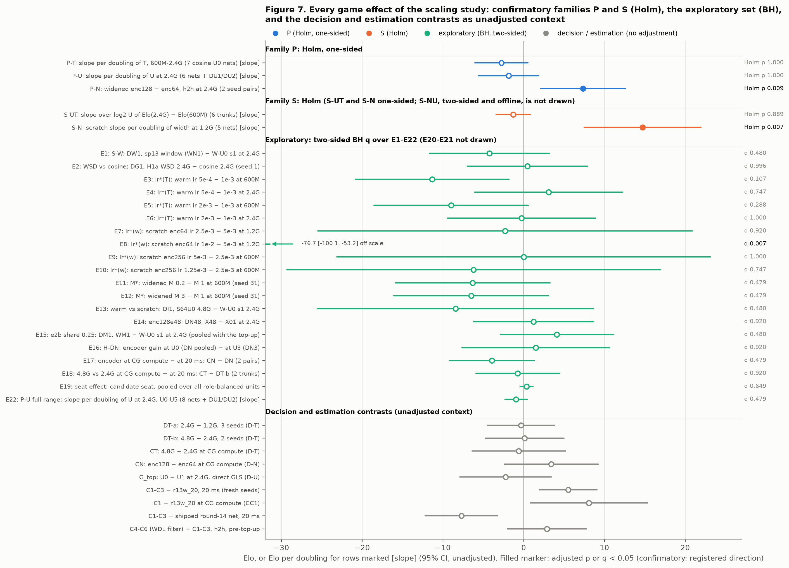
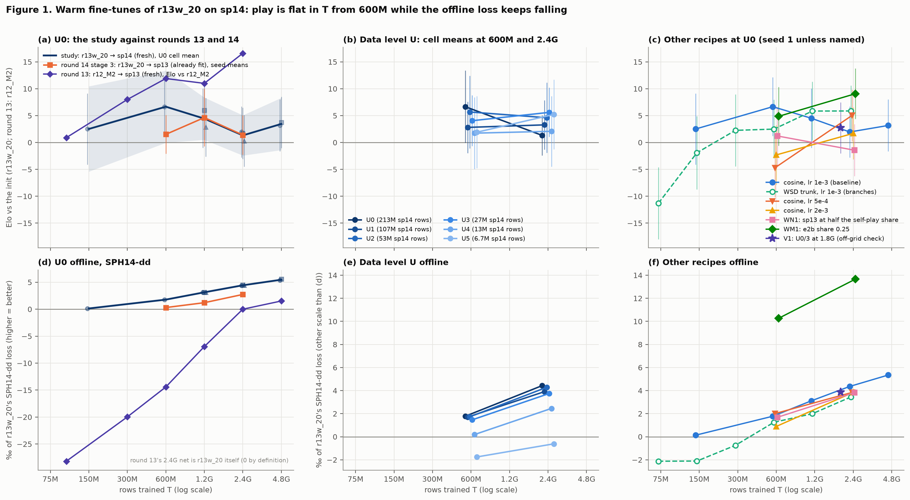
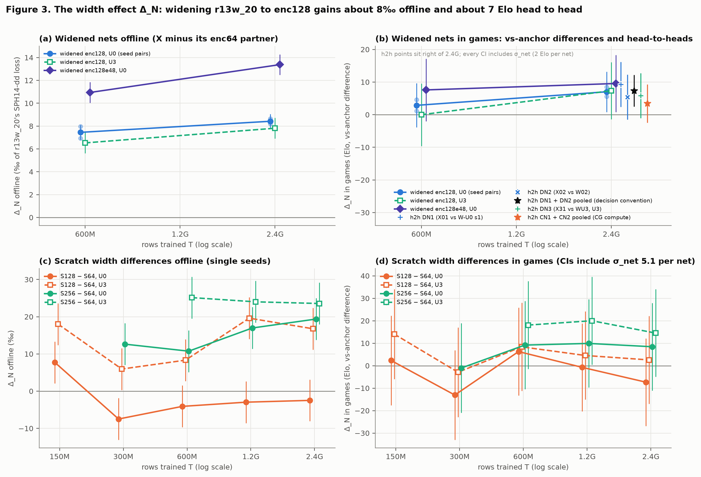
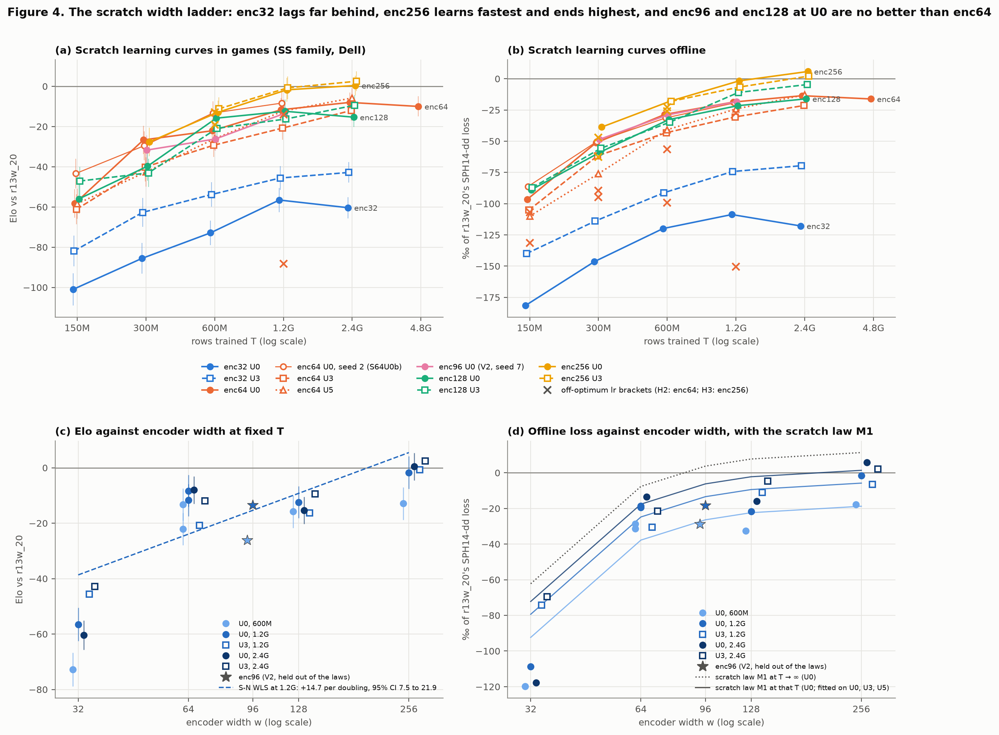
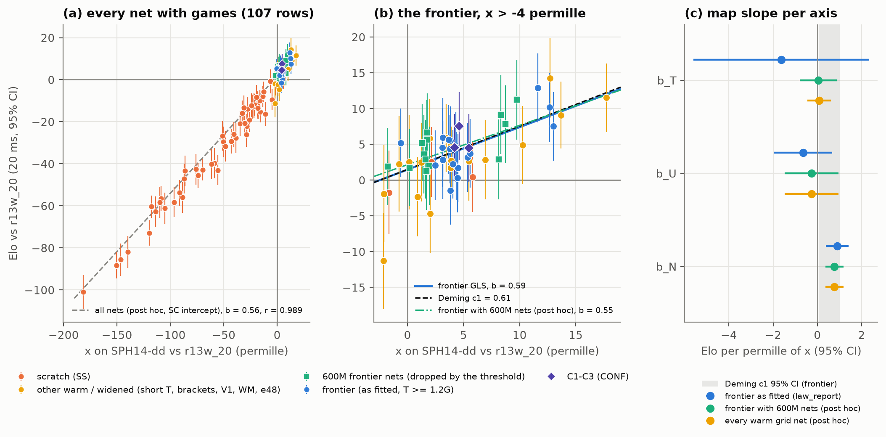
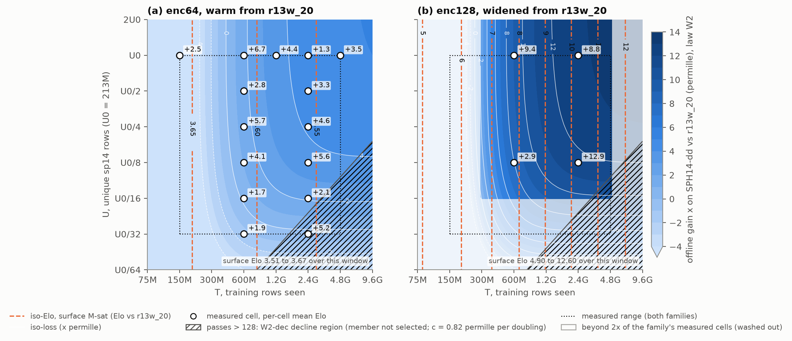
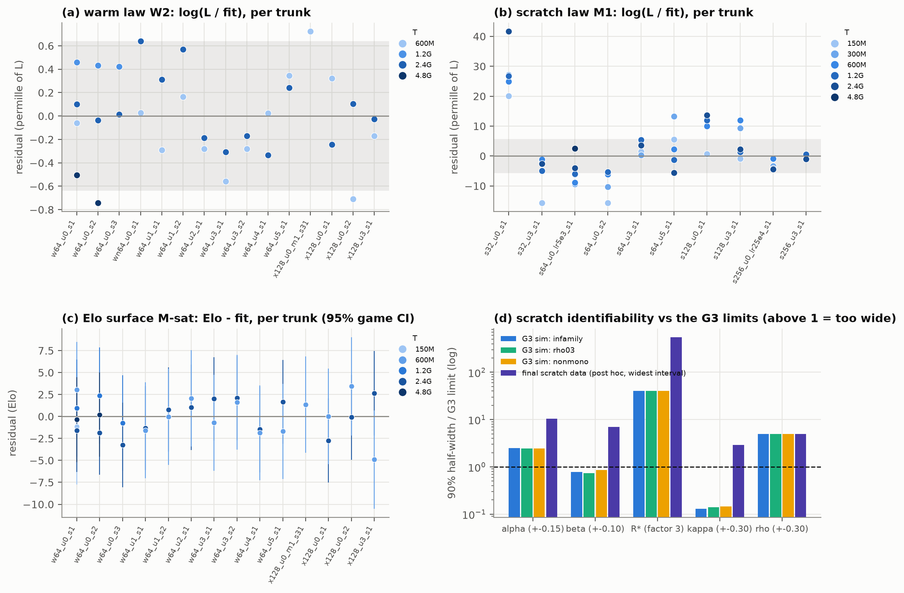

# Scaling study: data, fine-tune length and encoder width for a 35k-parameter UTTT NNUE (generation 15)

> **Repository copy.** The source of this report is `datasets/nnue2/scaling/REPORT.md`, which is not in git
> (`datasets/` is gitignored), together with the records, scripts and logs it cites. Paths in the report are
> relative to `datasets/nnue2/scaling/` unless the report says otherwise. The figures are copied to [`fig/`](fig/)
> next to this file and the figure links point there; everything below the title is otherwise verbatim
> (copied 2026-10-08).

**Status (2026-10-08, PDT): final for the pre-registered Tiers 1 and 2.** Data collection ended at 22:46 on
2026-10-07, the closing analyses ran from 22:47 to 23:08, and `results/UNBLINDED` was written at 00:38 on 10-08.
Tier 3 (lanes, datagen depth, 2x data) was outside the scope the owner approved and did not run. The study's
operating point lost to the shipped round-14 net, so nothing from this study is recommended for CodinGame as it
stands (section 4.3).

**Timeline and snapshots.** The study ran from the GPU start S = 22:21:24 on 2026-10-04 to the last game at 22:46 on
2026-10-07. The report uses these snapshots:

| Time (PDT) | What was read |
| --- | --- |
| 10-07 22:47-23:08 | the closing records `results/dl.json`, `law_report.json` and `planner.json` (fit_law `53fc41b3…`) |
| 10-08 00:38 | `results/UNBLINDED`; every game family readable |
| 10-08 00:40-01:37 | the five section analyses and their numbers files (`report_work/num_decisions.json` 01:03, `num_stats.json` 01:17, `num_curves.json` 01:17, `num_methods.json` 01:24, `num_laws.json` 01:37) |
| 10-08 02:01 | `report_work/num_writer.json`: the numbers this assembly adds or re-states, with a rounding check against their sources |
| 10-08 03:01 | `report_work/lfo_t_posthoc.json`: LFO_T, computed after unblinding with a one-constant fix (a deviation; section 3.11.3) |
| 10-08 03:37 | `report_work/num_fixes.json`: the fixer pass, which checked the assembled report against the records and corrected or added the numbers listed in `report_work/verify_log.md` |

Design section 14 also calls for an HTML version of this report as a published artifact. It follows this file and
carries the same content.

## Abstract

**Question.** The owner asked: "Let's try to cleanly figure out data and training step scaling laws and how they
interact with net size and stuff as well so we can plan future generations better." crossfish plays Ultimate
Tic-Tac-Toe on CodinGame with an alpha-beta search and a 35,243-parameter NNUE evaluation. The study measured how the
net's playing strength depends on the fine-tune length T, the number of unique self-play rows U and the encoder width,
and whether an offline loss law can plan the next generations. It was also generation 15's training round: the
generation-15 choices of length, encoder and data window were fixed in advance as mechanical rules on head-to-head
games.

**Design.** The design was pre-registered and frozen at 22:04 on 2026-10-04, before the first GPU job. Its core grid
fine-tunes the round-13 net r13w_20 on sp14, 213,040,129 rows of r13w_20's own depth-13 self-play, at six nested data
levels U0 to U5 (213M down to 6.7M unique rows) and lengths from 150M to 4.8G rows. A function-preserving widening
of the encoder from 64 to 128 units is trained at U0 (two seeds) and U0/8 (one) at 600M and 2.4G, and a scratch width
ladder (encoder widths 32 to 256) trains from random init. In all, 68 training jobs wrote 118 nets, the 70 GPU jobs used 60.33 GPU-hours, and the
study played 933,000 games, almost all at 20 ms per move; every head-to-head was role-balanced. Six confirmatory
hypotheses form two families, P and S, each Holm-corrected at α 0.05; everything else is exploratory. The pre-registered warmup-stable-decay
(WSD) schedule failed its gate G1, so every warm length is a separate cosine run (the pre-registered fallback F1).
"±" is a 95% half-width that includes the between-run variance of the noise model (section 2.9).

**Key results.**

- **The generation-15 operating point does not beat the shipped round-14 net.** The decision step chose r13w_20
  fine-tuned for 2.4G rows (146,484 steps) on all of sp14 at the shipped width enc64, cosine schedule, peak lr 1e-3:
  P\* = 6.03 sp14 passes. Three fresh-seed runs of that recipe beat r13w_20 by **+5.5 ± 3.6 Elo** at 20 ms (24,000
  games, role-balanced, z 3.04), and the first seed beat it by +8.1 ± 7.3 at CodinGame compute. Against the shipped
  round-14 net r14_d5_final_s2_rs the three lost by **−7.7 ± 4.5** (12,000 games, z −3.36). No study net was shown to
  be stronger than r14; adding the encoder contrast to that result puts the widened recipe at −0.4 ± 6.6 against r14
  (exploratory).
- **Length (T\*): 2.4G stays by default.** Neither pre-registered length rule fired: 2.4G against 1.2G −0.3 ± 4.2, 4.8G
  against 2.4G +0.1 ± 4.9, and at CodinGame compute −0.6 ± 5.8. Warm cosine play stops rising by 600M rows at every data level,
  while the offline loss keeps improving by 1.24 per mille per doubling of T.
- **Data (U\*): "saturated".** Nets trained on half of sp14 played as well as nets trained on all of it (direct G_top
  −2.2 ± 5.7). By rule D-U, generation 16 should generate about U0/2 rows and spend the saved CPU on datagen depth
  (D-Dp), but datagen depth was never tested (Tier 3).
- **Encoder: enc64 kept, although the widened enc128 won.** Widening r13w_20 to enc128 gained +7.3 ± 4.9 Elo head to
  head at 2.4G and +3.4 ± 5.8 at CodinGame compute, and passed the bake and paste limits. It failed only the ±1%
  nanoseconds-per-node check, in the favourable direction (ratio 0.988: enc128 ran 1.2% faster per node), on a bench
  that cannot resolve ±1%; how to read that check is one of the owner's open rulings (section 6.5).
- **Confirmatory tests.** Two of six pass Holm: **P-N**, the widened enc128 over enc64, +7.34 Elo [+2.08, +12.61], Holm
  p 0.009; and **S-N**, encoder capacity from scratch, +14.71 Elo per width doubling [+7.49, +21.94], Holm p 0.007.
  S-N rests on the enc32 net (without it +3.52), and its straight line fits the five nets poorly (χ² 22.1 on 3 df);
  with the SE scaled for that misfit it would not survive Holm (post hoc, Holm p about 0.19). Not confirmed: P-T, longer
  cosine fine-tunes, −2.77 Elo per doubling of T [−6.05, +0.51] (the one WSD trunk, outside the grid, rose by +1.85 per
  doubling; exploratory); P-U, more unique rows, −1.88 per doubling of U [−5.59, +1.84]; S-UT, data matters more at
  more passes, on an endpoint this report substituted after unblinding because F1 left no 300M nets (2.4G − 600M over 6
  trunks), −1.32 [−3.43, +0.80]; S-NU, the encoder's offline gain depends on U, +0.61 per mille [−0.59, +1.81]. The
  three length and data slopes have the wrong sign, and their upper bounds lie below the designed minimum detectable
  effects.
- **Exponents** (95% intervals post hoc: the widest of a parametric bootstrap, a wild cluster bootstrap and a
  jackknife). The warm law's fitted saturation in effective data is fast: data exponent β 1.61 (0.48 to 5.00, the
  upper limit at the search bound) and repetition constant R\* 26.1 (15.6 to 43.5), with an enc64 asymptote of +5.14
  per mille, which the 4.8G nets already exceed (+5.35 and +5.59), so the law saturates too fast along T. The scratch
  law has width exponent α 1.35 (0.42 to 4.35), data exponent β 0.85 (0.34 to 2.09) and R\* 495, whose interval reaches
  both search bounds; it misfits the scratch nets by about four times their noise, and its enc64 asymptote is 7.6 per
  mille worse than r13w_20's loss at the point estimate (−37.5 to +22.3).
- **Law validation: V1 passed, and no axis is validated.** V1, a held-out warm enc64 cell inside the grid,
  passed. V2 (a held-out width from scratch), LFO_U and LFO_N (leave-the-frontier-out along U and N) failed. LFO_T
  (along T), which a length threshold in the frozen code skipped, was computed after unblinding with a one-constant
  fix (a deviation) and fails too. The loss-to-Elo gate G-V failed: on the nine decision pairs the games gave 0.66 of
  the predicted Elo, with a one-sided 90% lower bound of −0.21 against the required 0.3 (post hoc with the 600M and WM1
  nets that the frozen frontier left out, it still fails). So the fitted Elo surface may interpolate inside the warm
  enc64 grid and the offline law may not extrapolate along any axis. Planning uses measured cells and, where V1 allows,
  the surface; the planner's 1-GPU-hour picks are surface-interpolated enc128 cells outside what V1 tested, and the
  frozen planner never searched the enc128e48 and scratch options that §8.9 lists (section 3.11.8).
- **Other decisions and checks.** A lower e2b share (0.25) passed its D-mix rule (+3.6 ± 6.8 before its top-up) and
  goes to round 15's ship tests; its offline gain on SPH14-dd comes with a loss on the ladder positions (LADHt
  −11.4‰). The sp13 window was not added (DW1 −4.2 ± 6.9; RLL14 worse). Round 14's WDL filter read +2.9 ± 4.9 head to
  head before its top-up, which passes §9.9's rule (p 0.125), and +1.5 ± 4.4 on the pooled data (p 0.253), which fails.
  §9.9 has no frozen code; this report reads it on the pooled data, because the pool was topped up against §9.9's own
  threshold, so the filter does not enter, and the owner is asked to rule on that reading (section 6.5). A scratch
  retrain did not beat the warm chain (−8.4 ± 9.7). The warm between-run SD of strength was estimated
  at 0, so the pre-set floors carry the warm SEs, while the scratch estimate (5.09 Elo) lies above its floor. All
  placebos and A/A tests passed, and the seat term was +0.36 ± 0.80, so round 14's −3.7 seat offset did not recur.

**What it means.** The study's enc64 fine-tunes (35,243 parameters, the shipped size) see 17,025 to 136,197 training
rows per parameter (600M to 4.8G rows) and 6,045 unique sp14 rows per parameter, far beyond the roughly 20 tokens per parameter of
compute-optimal language-model training. In that regime the study found language-model-like behaviour offline
(smooth gains in T, cheap repetition, capacity helps) and very little of it in play: along T and U the offline gains of a few
per mille did not reach the board at 20 ms, and only encoder capacity moved play. The owner has decided that the next
rounds will be lighter: frozen data, one idea per short fine-tune, judged by games. The study supports that choice
(section 4.3).

**Deviations.** G1's failure turned the warm grid into separate cosine runs: P-T's cells changed by §5.8's rule, and
S-UT lost its 300M cells, so this report substituted a 2.4G − 600M endpoint after unblinding. Owed files and a missing
game plan delayed the decision step by 7.4 h. The frozen law code skipped LFO_T, dropped the 600M nets from G-V's
frontier and from LFO_U's targets (verdicts unchanged post hoc), left WM1 out of the frontier, fitted the Elo surface
without §8.3's transient rule and searched no enc128e48 or scratch cells in the planner (section 6.2); LFO_T was
computed after unblinding. The law code had a one-line, owner-approved fix on 10-07. Interim Elo was on the dashboard from 11:05 on 10-05, 25 minutes before the law
code was hashed, and the hashed code changed on 10-07, so the law and surface results (and D-U, D-L and the planner,
which the law code computes) carry the design's label "analysis code finalised after unblinding". The gen-15
decisions of the frozen decision code were mechanical and do not (section 6).

**Sources.** `results/decisions_t1.json`, `dn_gates.json`, `du.json`, `dl.json`, `law_report.json`, `planner.json`,
`results/arms.jsonl` (CONF, DEC, DEC2, CGC, SC, SS, TP records); `report_work/num_*.json`. Table 1 has the operating
point, Table 2 every decision contrast, Table 5 the confirmatory tests and [Figure 7](fig/fig7_forest.png) every
game effect.

## Contents

- [Abstract](#abstract)
- [How to read this report](#how-to-read-this-report)
- [1. Introduction](#1-introduction)
  - [1.1 The question](#11-the-question)
  - [1.2 Where rounds 12 to 14 left it](#12-where-rounds-12-to-14-left-it)
  - [1.3 Pre-registration](#13-pre-registration)
- [2. Methods](#2-methods)
  - [2.1 Net, trainer and runtime](#21-net-trainer-and-runtime-41)
  - [2.2 Data and the S14 freeze](#22-data-and-the-s14-freeze-42)
  - [2.3 Holdouts and offline suites](#23-holdouts-and-offline-suites-43)
  - [2.4 Base recipe and pinned settings](#24-base-recipe-and-pinned-settings-45)
  - [2.5 Axes and the run list as trained](#25-axes-and-the-run-list-as-trained-5)
  - [2.6 Schedule, branching and states](#26-schedule-branching-and-states-52)
  - [2.7 Gates, brackets and the decision step](#27-gates-brackets-and-the-decision-step-57-91-95)
  - [2.8 Games protocol](#28-games-protocol-7)
  - [2.9 Noise model and the two SE conventions](#29-noise-model-and-the-two-se-conventions-81)
  - [2.10 Laws, Elo surface, frontier map, G-V and D-L](#210-laws-elo-surface-frontier-map-g-v-and-d-l-83-89-97)
  - [2.11 Inference](#211-inference-310-810)
- [3. Results](#3-results)
  - [3.1 The generation-15 operating point (Table 1)](#31-the-generation-15-operating-point-table-1)
  - [3.2 Decision contrasts and the gate timeline (Table 2)](#32-decision-contrasts-and-the-gate-timeline-table-2)
  - [3.3 Harness checks and variance components (Table 4)](#33-harness-checks-and-variance-components-table-4)
  - [3.4 Confirmatory hypotheses (Table 5)](#34-confirmatory-hypotheses-table-5)
  - [3.5 Exploratory effects (Table 6)](#35-exploratory-effects-table-6)
  - [3.6 All game effects at once (Figure 7)](#36-all-game-effects-at-once-figure-7)
  - [3.7 Warm learning curves (Figure 1)](#37-warm-learning-curves-figure-1)
  - [3.8 The width effect (Figure 3)](#38-the-width-effect-figure-3)
  - [3.9 The scratch width ladder (Figure 4)](#39-the-scratch-width-ladder-figure-4)
  - [3.10 Warm chain against scratch, the e2b share and the Tier-2 warm runs](#310-warm-chain-against-scratch-the-e2b-share-and-the-tier-2-warm-runs)
  - [3.11 Laws, validation and the planner (Table 3; Figures 2, 5, 6)](#311-laws-validation-and-the-planner-table-3-figures-2-5-6)
- [4. Discussion](#4-discussion)
  - [4.1 What scales like a language model and what does not](#41-what-scales-like-a-language-model-and-what-does-not)
  - [4.2 Offline loss against play](#42-offline-loss-against-play)
  - [4.3 What this means for generation 15 and the next rounds](#43-what-this-means-for-generation-15-and-the-next-rounds)
- [5. Limitations](#5-limitations)
- [6. Deviations](#6-deviations)
  - [6.1 The section-16 log, entry by entry](#61-the-section-16-log-entry-by-entry)
  - [6.2 Problems found while writing this report](#62-problems-found-while-writing-this-report)
  - [6.3 Compute, games and timeline as run](#63-compute-games-and-timeline-as-run)
  - [6.4 Interim figures and working assumptions, against the records](#64-interim-figures-and-working-assumptions-against-the-records)
  - [6.5 Open items for the owner](#65-open-items-for-the-owner)
- [Appendix A. Reproducibility](#appendix-a-reproducibility)

**Tables and figures.** Tables 1-4 and Figures 1-7 carry the numbers of the pre-registered outline (design section
14), so they do not appear in numeric order. Tables added for this report carry the number of the outline table they
belong to plus a letter, or the numbers 5-7 (confirmatory tests, exploratory effects, learning curves). Introduction,
methods, limitations, deviations and appendix tables are I1, M1-M5, L1-L2, D1-D5 and A1-A8.

| Table | Content | Where |
| --- | --- | --- |
| I1 | Prior evidence and what the design did with it | [1.2](#12-where-rounds-12-to-14-left-it) |
| M1-M5 | Encoder widths, data levels, holdouts, run list, game families | [2](#2-methods) |
| 1a-1e | Operating point; confirmation; C4-C6; third party; grid context | [3.1](#31-the-generation-15-operating-point-table-1) |
| 2, 2b, 2c | Every decision contrast; the matches behind them; the gate timeline | [3.2](#32-decision-contrasts-and-the-gate-timeline-table-2) |
| 4a-4f | Variance components, placebos, A/As, seat term, pair SD, forfeits | [3.3](#33-harness-checks-and-variance-components-table-4) |
| 5a-5c | Confirmatory endpoints; power; sensitivities | [3.4](#34-confirmatory-hypotheses-table-5) |
| 6a-6b | Exploratory effects; which offline metric predicts games | [3.5](#35-exploratory-effects-table-6) |
| 7a-7j | Learning curves, width effect and scratch ladder | [3.7](#37-warm-learning-curves-figure-1)-[3.10](#310-warm-chain-against-scratch-the-e2b-share-and-the-tier-2-warm-runs) |
| 3a-3k | Law model sets, parameters, validation, D-proxy, G-V pairs, map slopes, surface, G3, planner | [3.11](#311-laws-validation-and-the-planner-table-3-figures-2-5-6) |
| L1-L2 | Threats to validity as they turned out; new threats | [5](#5-limitations) |
| D1-D5 | Section-16 log; problems found for this report; GPU hours; games; milestones (6.5 adds the owner's open items) | [6](#6-deviations) |
| A1-A8 | Hashes, sums files, data pins, queue, gates, result files, report scripts | [Appendix A](#appendix-a-reproducibility) |

| Figure | Content | File |
| --- | --- | --- |
| 1 | Warm learning curves in Elo and loss, with the round-13 and round-14 curves | [fig/fig1_curves.png](fig/fig1_curves.png) |
| 2 | Iso-loss and iso-Elo contours over (U, T) for enc64 and enc128 | [fig/fig2_contours.png](fig/fig2_contours.png) |
| 3 | The width effect Δ_N, widened and scratch | [fig/fig3_delta_n.png](fig/fig3_delta_n.png) |
| 4 | The scratch width ladder | [fig/fig4_width_ladder.png](fig/fig4_width_ladder.png) |
| 5 | The loss-to-Elo map, frontier against all nets, and per-axis slopes | [fig/fig5_loss_to_elo.png](fig/fig5_loss_to_elo.png) |
| 6 | Residuals per trunk and the identifiability simulation | [fig/fig6_residuals.png](fig/fig6_residuals.png) |
| 7 | Forest plot of every game effect | [fig/fig7_forest.png](fig/fig7_forest.png) |

## How to read this report

**Citations.**

- `SC` is `datasets/nnue2/scaling`; paths are relative to `SC` unless stated. "§7.2" is a section of the frozen design
  `DESIGN_scaling_v1.md`. "16 [10-05 11:05]" is the entry with that stamp in section 16 of `DESIGN_scaling.md`, the
  live deviation log. "FINDINGS L10" is an entry of `datasets/nnue2/FINDINGS.md`.
- Times are PDT. "10-05" means 2026-10-05; 10-04 was a Sunday. S is the study's GPU start, 22:21:24 on 10-04
  (`queue/STARTED`), and "S+26.7 h" counts hours from it.
- A match is cited by its `results/arms.jsonl` record id, for example `sc_DEC/DN1_f1.h1`. Every number in this report
  is in one of the numbers files `report_work/num_decisions.json`, `num_stats.json`, `num_curves.json`,
  `num_laws.json`, `num_methods.json`, `num_writer.json`, `num_fixes.json` and `lfo_t_posthoc.json`, each written by the
  script of the same name, with its source record or formula (Appendix A.8). Where the text rounds, the JSON keeps all
  digits. `report_work/verify_log.md` lists what the fixer pass changed and why.

**Conventions.**

- **Elo** is logistic Elo of the pentanomial mean pair score (`tools/sc_stats.match_stats`); each opening is played
  with both colours. Games are at **20 ms per move** on the bookless `cg_nobook` build with the eval scale matched to
  r13w_20 (`_rs` builds, section 2.8), unless the family says otherwise.
- **CG compute** is the Dell at 62 ms per move with 3 workers, about CodinGame's node budget. It is not CodinGame
  itself.
- **Role balance.** A role-balanced match is played in two halves on disjoint openings with the seats swapped. Its
  estimate is (Elo_AB − Elo_BA)/2 and its seat term (Elo_AB + Elo_BA)/2. Every head-to-head (h2h) and every CONF and CGC
  match of a study net against r13w_20 is role-balanced; the CONF placebo plays in the candidate seat only. SC, SS and TP play each net in the candidate seat only; any seat effect sits
  in the family's free intercept.
- **Intervals.** "±" is a 95% half-width and "SE" a standard error, unless stated. A single net's ± against a fixed
  reference covers game noise only where marked "games only". Contrasts between trained nets add the between-run
  variance of the noise model (section 2.9) in one of two conventions: the **decision convention** of the frozen gate
  and decision code (Tables 1 and 2) and the **strict 8.1 model** with the random-slope term and the estimated scratch
  variance (Tables 5 and 6). Section 2.9 gives both; no verdict depends on the choice. Prediction intervals (PI) and
  surface quantities are 90%, as the design writes them.
- **Decision contrasts** are reported before any top-up, as design section 14 requires; where a top-up ran, the pooled
  number is given beside it. For D-mix both readings agree; for §9.9's WDL option they do not, and section 3.2 says
  which one this report applies and why.
- **Rounding.** Prose gives Elo to 0.1 and z to 0.01; the statistics tables give Elo and slopes to 2 decimals and p to
  3 decimals. ‰ (per mille) values are as printed.

**Game families.**

| Family | What plays | Machine | Condition | Seats |
| --- | --- | --- | --- | --- |
| SC | warm and widened grid nets vs r13w_20 | ThinkPad | 20 ms | candidate seat only |
| SS | scratch nets vs r13w_20 | Dell | 20 ms | candidate seat only |
| DEC, DEC2 | decision h2h between study nets (DEC2: Tier 2) | desktop | 20 ms | role-balanced |
| CGC | h2h at CG compute, and C1 vs r13w_20 | Dell | 62 ms × 3 workers | role-balanced |
| CONF | C1-C6 vs r13w_20; C1-C3 vs r14 | ThinkPad | 20 ms | role-balanced |
| TP | four nets vs the third party r12_M2 | ThinkPad | 20 ms | candidate seat only |

**Terminology.**

| Term | Meaning |
| --- | --- |
| UTTT, NNUE, CG | Ultimate Tic-Tac-Toe; the bot's neural evaluation (B-64 "Gen", 35,243 parameters as shipped); CodinGame |
| r13w_20 | The round-13 net (r12_M2 fine-tuned for 2.4G rows): the init of every warm run and the anchor of SC, SS and CONF |
| r14 | `r14_d5_final_s2_rs`, the round-14 net shipped on CodinGame on 10-04, +9.1 ± 5.9 over r13w_20 at 90 ms in round 14 |
| r12_M2 | r13w_20's own init; the third-party anchor (TP) |
| sp14, e2b, sp13 | r13w_20's depth-13 self-play in play mode (this study's data); round 12's eval2 positions with depth-14 labels (4,339,877 rows, share 0.4644); round 13's self-play (r12_M2's) |
| T | Rows trained, both sources, at batch 16,384 (600M rows = 36,621 steps; nominal lengths fall just under their names, for example 4.8G = 4,799,987,712 rows) |
| U, U0-U5 | Unique sp14 rows a run may draw; U0 is all 213,040,129 training rows and U_k about U0/2^k, nested. U0/2 = U1, U0/8 = U3 |
| p, P\* | sp14 passes, p = s·T/U with s = 0.5356 the sp14 share; P\* is the passes rule of the operating point |
| w, N, enc32-enc256 | Encoder width (27 → w → w → 32) and encoder parameters N = w² + 61w + 32; enc128e48 has a 48-wide encoder output |
| W, X, X48, XM, S | Warm enc64 from r13w_20; warm, widened to enc128 (new units start at zero, so a widened net starts as r13w_20's function); X with encoder output 48; the widened M bracket; scratch (random init) |
| W01-W03, E01/E02, WU1-WU5, WU1b, WU3b | The W-U0 seeds 1-3; the 4.8G runs of seeds 1 and 2; warm runs at U1-U5; the U1 and U3 subset replicates (cap seed 15) |
| WN1, WM1, V1, V2 | W with sp13 at half the self-play share; W with e2b share 0.25; held-out warm cell U0/3 at 1.8G; held-out scratch width enc96 |
| X01, X02, X31 | Widened U0 seeds 1 and 2; widened at U3 (U0/8) |
| S32U0, S64U0, S64U0b, … | Scratch nets by width and U level; S64U0b is the scratch seed replicate |
| C1-C3, C4-C6 | `sc_op_s21..s23`, the fresh-seed confirmation runs of the operating point; `sc_opx_s24..s26`, the same recipe plus round 14's WDL contradiction filter on sp14 (§9.9). Both are enc64 |
| WSD, F1 | Warmup-stable-decay schedule with cooldown branches; the pre-registered fallback to standalone cosine runs, taken when WSD failed gate G1 |
| M, M\* | The lr multiplier on a widened net's new units; its chosen value (1) |
| lr\*_w, lr\*_s64, lr\*_s256 | Chosen peak lr for warm fine-tunes (1e-3), scratch enc64 (5e-3) and scratch enc256 (2.5e-3) |
| L, x, ‰ | Holdout MSE in win-probability space on SPH14-dd at K 1600, unscaled net; x = 1000·(L_ref − L)/L_ref against r13w_20, per mille, positive is better |
| SPH14-dd and other suites | The sp14 holdout with every position that occurs in training removed (the law's L); SPH14 (full), LADHt (ladder positions), RLL14 (result log-loss), OBJ14 and OLD (round 13's objective on new and old suites) |
| b, `_rs` | Eval-scale ratio b = sd(e_net)/sd(e_r13w_20); a net with \|b − 1\| > 1% plays as `<net>_rs`, its output scaled by 1/b |
| σ_net, τ, σ_b, γ | Between-run SD of strength for one recipe; its trunk-intercept, per-net and per-doubling-slope parts (§8.1) |
| h2h, A/A, placebo | Head-to-head of two study nets; a match between two byte copies of one study net; a byte copy of r13w_20 in the candidate seat |
| Gates | G1 (WSD vs cosine), G2 (warm lr), G-M (multiplier M), H2 and H3 (scratch lr for enc64 and enc256), SR-N and SR-flat (triggers), G3 (scratch identifiability), PV1 and PV2 (prediction steps before V1 and V2) |
| Decisions | D-T (length), D-N (encoder), D-W (sp13 window), D-U (data for gen 16), D-mix (e2b share), D-lr, D-I (warm chain vs scratch), D-A and D-Dp (Tier 3), D-L (may the law plan), D-proxy (may an offline metric screen arms) |
| Decision contrasts | DT-a (2.4G − 1.2G), DT-b (4.8G − 2.4G), CT (DT-b at CG compute), DN1-DN3 (widened − enc64), CN1-CN2 (DN at CG compute), DU1-DU2 (U0 − U1), DW1, DG1 (WSD − cosine), DM1, DI1, DN48 (X48 − X01), CC1 (C1 vs r13w_20 at CG compute) |
| P-T, P-U, P-N, S-UT, S-NU, S-N; E1-E22 | The confirmatory hypotheses (§3.2), families P and S; the exploratory rows of Table 6a |
| V1, V2, LFO_U/N/T, G-V | Held-out interpolation tests; leave-the-frontier-out extrapolation tests along U, N and T; the frontier loss-to-Elo validity gate (§8.5) |
| W2, W2-dec, M1, M2, M1ρ, M-sat | The selected warm law, its decline member, the selected scratch law and its alternatives, the selected Elo surface |
| α, β, R\*, κ, ρ, E, D', D_w, D_x, η(N) | Width exponent, data exponent, repetition constant, N-D coupling, width dependence of R\*, irreducible loss, effective data, the rows a warm or widened start is worth, and the widened-start efficiency (§8.3, §8.7) |
| G_top, T_law, Δ_N | The Elo gain from U0/2 to U0 at 2.4G; the shortest T whose next doubling gains under 1 Elo; a wider net minus its enc64 partner |
| REML, MoM, GLS, WLS, LOTO, CV | Restricted maximum likelihood; method of moments; generalised and weighted least squares; leave one trunk out; cross-validation |
| Holm, BH, MDE, OC, TTD | Holm's step-down correction; Benjamini-Hochberg q-value; minimum detectable effect at power 0.8; operating characteristic of a rule; time to depth |
| Overloaded names | **S** is the scratch net group, family S of the tests, and the GPU start time; the context says which. **H2, H3** are scratch lr gates, not hypotheses. **V2** is the held-out enc96 net (round 14's eval2 holdout of the same name plays no part here). **W2** is a law member and **W02** a net. **M** is the lr multiplier and **M1, M2** are scratch law members. **C1-C3** are nets; the curves tables are 7a-7j |

## 1. Introduction

### 1.1 The question

The owner's question, verbatim (§0): "Let's try to cleanly figure out data and training step scaling laws and how
they interact with net size and stuff as well so we can plan future generations better."

The design turned this into four axes and one planning question. How does the playing strength of crossfish's
35,243-parameter NNUE change with the fine-tune length T, the number of unique self-play rows U, the encoder width N
and the init (warm from r13w_20, widened warm, or scratch)? And can an offline law, fitted to holdout loss, plan the
next generation's training budget, or must planning stay on measured cells? The study was also generation 15's
training round: the generation-15 choices of length, encoder and data window (T\*, N\*, W\*) were fixed in advance as
mechanical rules on head-to-head games (§3.1, §9.2-9.5).

### 1.2 Where rounds 12 to 14 left it

**Table I1. Prior evidence and what the design did with it.**

| Round | What was known | Source | Consequence in the design |
| --- | --- | --- | --- |
| 12, from scratch | More rows of the same kind at a fixed step budget never helped B-64. Beyond 57 epochs at peak lr 1e-2, longer training made nets worse in loss and play | FINDINGS L9, L4 | U varies sp14 rows only; lr is bracketed per scale; the laws and the Elo surface include members that can decline with repetition |
| 13, warm from r12_M2 | The offline objective rose about +2 to +4 per doubling from 100M to 4.8G rows. In play: +11.9 at 600M, +11.0 at 1.2G, +16.6 at 2.4G, and 4.8G not better (−7.3 ± 9.4 at 90 ms; +3.6 ± 6.6 at 20 ms in round 14's V4). A warm start beat scratch by about +30 Elo at 2.4G | FINDINGS L10, L11, H7; §2 | 4.8G runs on two U0 trunks unconditionally; every net that enters a law plays games |
| 11 to 13, width | B-128 kept part of its offline gain in games (+5 to +11 against +15-16 offline), and its 16-31% node-rate loss is the likely cause | FINDINGS A8 | Capacity comes from the encoder, which is baked into tables at start-up and costs no search speed |
| 14, from r13w_20 on round 13's data | 600M more rows were null (4 replicates +0.5 to +3.7); 600M to 2.4G gave +0.2 ± 2.5 Elo per doubling; σ_net was 0.0 Elo [0, 1.65]. The shipped r14_d5_final_s2_rs beat r13w_20 by +9.1 ± 5.9 at 90 ms. Offline metrics ranked arms only within one family | §2; r14 `REPORT.md` abstract; FINDINGS executive summary item 4 | The grid trains on sp14, r13w_20's own fresh self-play; decisions use games; the law must pass a frontier-only validity gate before it may extrapolate |

Gains per generation had shrunk from about +270 to +55, +17 and +9 to +13 Elo (FINDINGS N6), so contrasts of a few
Elo needed 8,000 to 10,000 games and seed replicates.

### 1.3 Pre-registration

- **Design.** Three independent proposals (`proposals/A_*`, `B_*`, `C_*`) were merged into a draft on 10-04 between
  01:00 and 02:30. Two adversarial reviews (`reviews/stats.md`, `reviews/ops.md`) produced v1. The owner approved v1 at
  about 10:25 on 10-04 for Tiers 1 and 2; Tier 3 was to be decided after Tier 1 (16 [10-04 11:00]) and was never
  authorised.
- **Tooling before the freeze.** The tools needed before the first GPU job (T1-T4, T6-T8, T11, T13) and the
  pre-freeze simulations (P-sim) were built, and checked by independent verifiers, between 11:00 and 15:20 on 10-04
  (Table D1 rows 2 to 17). T5, the law code, followed on 10-05 (row 28); T10 belongs to Tier 3 and was not built.
- **Freeze.** v1 was frozen at 22:04 on 10-04 as `DESIGN_scaling_v1.md` (2,376 lines; sha256 `8daf4670…`, recomputed
  equal). `DESIGN_HASHES.txt` listed 61 files at the freeze; its first 73 lines reproduce the logged freeze sha256
  `6d3f3b2a…`. All 61 freeze entries verify today, the 20 phase-0 queue files under `queue/done/` and
  `queue/MANIFEST.sha256` as its first 20 lines.
- **Law code.** `tools/fit_law.py` was written at 11:30 on 10-05 and hashed at about 11:30 (`2e5406f4…`; 16 [10-05
  11:45] corrects the "12:10" of the entry stamped [12:15]). That was before the decision step, before any driver
  printed Elo and before the S+18 h deadline of §8.12, but about 25 minutes after the dashboard began to show interim
  Elo (section 6.2, Table D2 row 2). An owner-approved one-line fix replaced it on 10-07 (`53fc41b3…`; 16 [10-07
  15:05]). Both lines are in `DESIGN_HASHES.txt`; the first now fails `sha256sum -c`, as it should.
- **Start.** The GPU work started at S, 17 minutes after the freeze and 77 minutes after round 14 released the GPU
  (21:04:20; `queue/R14_RELEASED`).
- **Inference.** Two confirmatory families, P (P-T, P-U, P-N) and S (S-UT, S-NU, S-N), each Holm-corrected at α 0.05,
  one-sided unless marked (§3.2, §8.10). Everything else is exploratory, with 95% CIs and BH q-values.
- **Log.** Section 16 has 60 dated entries, from 10-04 11:00 to 10-08 02:13; section 6.1 classifies each. Data
  collection ended with the last game record at 22:46:54 on 10-07, the closing analyses ran from 22:47 to 23:08, and
  `results/UNBLINDED` was written at 00:38 on 10-08.

## 2. Methods

This is a summary with references; the design has the full specification.

### 2.1 Net, trainer and runtime (§4.1)

**Net.** B-64 "Gen" as shipped: 64 accumulator lanes plus a PSQT lane, a 128 → 16 → 32 → 1 head, and a pattern encoder
27 → w → w → 32 with per-location projections, baked at start-up into int16 tables. Only the encoder width varies
(Table M1).

**Table M1. Encoder widths (parameter counts from §4.1).**

| Variant | Encoder | Total parameters | Shippable | Role |
| --- | --- | ---: | --- | --- |
| enc32 | 27-32-32-32 | 30,219 | yes | scratch ladder |
| enc64 | 27-64-64-32 | 35,243 | yes (shipped) | W, S |
| enc96 | 27-96-96-32 | 42,315 | yes | V2, the off-grid scratch width |
| enc128 | 27-128-128-32 | 51,435 | yes | X, S |
| enc128e48 | 27-128-128-48 | 63,899 | barely | X48 |
| enc256 | 27-256-256-32 | 108,395 | no (over the paste limit) | S256 |

**Trainer.** `frozen_sc1/gen_scale.py` (sha256 `d806f79a…`), a fork of round 14's trainer that adds WSD, branches,
saved states, resume and extension, the study holdouts and the sp14 registry overlay. Every training job first runs
`sha256sum -c frozen_sc1/SHA256SUMS` (12 files) and exits 3 on a mismatch. Training ran on the desktop's Radeon
through DirectML at batch 16,384, where a fixed seed reproduces a run bit for bit (P0b, 18 of 18 checks; 16 [10-04
22:56]). P0a measured 2.92 G rows/h for enc64, 3.79 for enc32, 2.28 for enc96 and 1.05 for enc256; the enc128 (1.82)
and enc128e48 (1.68) rates came from round 14's logs (16 [10-04 22:52]).

**Runtime for games.** Commit `425aa1a` on `claude/sc-generic-runtime`, the generic-width runtime rebased onto the r13
ship commit f4d6b3d, built by `eval/build_candidate_sc.py` as bookless `cg_nobook` engines: clang on the desktop and
CodinGame's g++-11 command on the ThinkPad for the laptops, never `-march=native` (16 [10-04 12:38]). All 116 engines
that played have a build record on that commit.

### 2.2 Data and the S14 freeze (§4.2)

sp14 is r13w_20's depth-13 self-play in play mode: a position's label is the root score of the in-game search that
chose the move. Three machines generated it until about 21:00 on 10-04: the desktop (clang build, 110,692,140 records),
the ThinkPad (65,365,315) and the Dell (44,062,947), the last two with the g++-11 build. The pack splits by game:
213,040,129 training rows (U_max) and 6,604,581 SPH14 holdout rows (3% of games). Ladder (LADH) positions were dropped
from both parts, 461,563 training and 14,129 holdout rows. All 12 freeze checks passed, including a column
re-derivation of all 220,120,402 records (16 [10-04 22:08]).

**Nested caps.** U_k keeps the first round(U_max/2^k/8,192) blocks of 8,192 rows of one fixed block permutation (cap
seed 14), so U5 ⊂ U4 ⊂ … ⊂ U0. The replicate subsets WU1b and WU3b use cap seed 15.

**Table M2. The data levels (`train/sp14_pins.json`, `train/sp14_distinct.json`).**

| Level | Rows | Blocks | Distinct positions (share of rows) | sp14 passes at 2.4G |
| --- | ---: | ---: | ---: | ---: |
| U0 | 213,040,129 | 26,006 | 177,744,971 (83.43%) | 6.0 |
| U1 | 106,520,576 | 13,003 | 90,649,200 (85.10%) | 12.1 |
| U2 | 53,256,192 | 6,501 | 46,164,434 (86.68%) | 24.1 |
| U3 | 26,632,192 | 3,251 | 23,465,910 (88.11%) | 48.3 |
| U4 | 13,312,000 | 1,625 | 11,893,827 (89.35%) | 96.6 |
| U5 | 6,660,096 | 813 | 6,020,427 (90.40%) | 193.0 |

Distinct positions are canonical keys over the 8 board symmetries. e2b (4,339,877 rows) enters every run at share
0.4644 (WM1: 0.25), so at a fixed T every U level sees e2b equally often: 256.8 passes at 2.4G and 513.6 at 4.8G. sp13
enters only WN1, at share 0.2678.

### 2.3 Holdouts and offline suites (§4.3)

**Table M3. Holdout suites (`train/masks/masks.json`).**

| Suite | Rows | After deduplication | Labels | Role |
| --- | ---: | --- | --- | --- |
| SPH14 | 6,604,581 | SPH14-dd 5,306,893 (19.65% dropped) | r13w_20, d13, play mode | SPH14-dd is the law's L |
| V2 | 482,136 | V2-dd 365,340 (24.22% dropped) | r12_M2's engine, d14 | the shared source |
| SPH13 | 2,388,278 | SPH13-dd 1,958,797 (17.98% dropped) | r12_M2's engine, d13 | cross-generation transfer |
| LADHt | 193,320 | no overlap | r13w_20, d14 | ladder positions |
| DUMPHt | 106,495 | | r13w_20, d13 | continuity with round 13 |

A -dd suite drops every holdout row whose position, under any of the 8 symmetries, occurs in the training part of e2b,
sp13 or sp14 (all of U_max). `tools/score_scale.py` (sha256 `4c041445…`) writes one record per net to
`results/losses.jsonl`: L on each suite, RLL14 (result log-loss), OBJ14 and OLD (round 13's objective on the new and old
suites), per-ply buckets and game-cluster bootstrap SEs. A queue post-step writes the records of a job's nets when the
job ends (16 [10-04 22:08], checklist item 1). r13w_20's L on SPH14-dd is L_ref = 0.0251452.

### 2.4 Base recipe and pinned settings (§4.5)

Every warm run uses `--init r13w_20 --batch 16384 --wd 1e-5 --psqt-w 0.1 --clip 1.0 --row-std 0.05 --k 1600 --lam 0
--mix e2b=0.4644,sp14=0.5356 --train-n e2b=4339877,sp14=213040129 --cap-seed 14`, plus `--cap sp14=U_k` below U0.
Because gate G1 chose F1, every warm run after G1 is a standalone cosine run (`--sched cosine --warmup 0.01 --lr-floor
1e-5`). X adds `--widen-enc 128,128,32 --new-lr-mult 1` (X48: `128,128,48`); the new parameters start at zero, so a
widened net starts as r13w_20's function. Scratch runs use `--init random` and WSD on every path (732 warmup steps, a
1-sqrt decay over the last 20% of each length). Pinned because they define the target or cannot ship: K 1600, λ 0, MSE
loss, batch 16,384, wd, psqt_w, clip, row_std, and the e2b share outside WM1. C4-C6 add round 14's WDL contradiction
filter on sp14 (§9.9; `train/wdl_sp14.json`, s0 615.4, expected keep 0.700).

### 2.5 Axes and the run list as trained (§5)

**Table M4. Every run, by tier (queue files in Table A4).**

| Tier | Runs | Init, width, U | lr, schedule | Lengths (rows) |
| --- | --- | --- | --- | --- |
| 1 | P0a, P0b | throughput and DirectML checks | | |
| 1 | H1a `sc_w64_u0_lr1e3_s1` | warm 64, U0, seed 1 | 1e-3, WSD | branches 75M-1.2G, final 2.4G (G1's WSD arm; no law point under F1) |
| 1 | G1c, G1a, G1b, W01 (W-U0 seed 1) | warm 64, U0, seed 1 | 1e-3, cosine | 150M, 600M, 2.4G; 1.2G |
| 1 | H1b, H1c (warm lr bracket) | warm 64, U0, seed 1 | 5e-4 and 2e-3, cosine | 600M, 2.4G |
| 1 | XM02, XM10, XM3 (M bracket, seed 31) | widened 128, U0 | 1e-3; M 0.2, 1, 3 | 600M |
| 1 | W02, W03 | warm 64, U0, seeds 2 and 3 | 1e-3, cosine | 1.2G, 2.4G |
| 1 | E01, E02 | warm 64, U0, seeds 1 and 2 | 1e-3, cosine | 4.8G |
| 1 | WN1 | warm 64, U0, sp13 window | 1e-3, cosine | 600M, 2.4G |
| 1 | X01, X02; X31 | widened 128, U0 seeds 1 and 2; U3 | 1e-3, M\* 1, cosine | 600M, 2.4G |
| 1 | WU1, WU1b, WU2, WU5, WU3 | warm 64 at U1 (cap seed 14 and 15), U2, U5, U3 | 1e-3, cosine | 600M, 2.4G |
| 1 | C1-C3 `sc_op_s21..s23` (operating point) | warm 64, U0, seeds 21-23 | 1e-3, cosine | 2.4G |
| 1 | C4-C6 `sc_opx_s24..s26` (C1-C3's recipe plus the WDL filter) | warm 64, U0, seeds 24-26 | 1e-3, cosine | 2.4G |
| 1 | V1 `sc_v1_w64_u0d3_cos1800_s7` | warm 64, U0/3 (71,016,448 rows), seed 7 | 1e-3, cosine | 1.8G |
| 2 | H2a, H2b, H2c (scratch enc64 lr bracket) | scratch 64, U0, seed 1 | 5e-3, 2.5e-3, 1e-2; WSD | 150M-1.2G |
| 2 | S64U0b (scratch replicate) | scratch 64, U0, seed 2 | 5e-3 | 150M-1.2G |
| 2 | S64U0 (H2a extended) | scratch 64, U0 | 5e-3 | 2.4G, 4.8G |
| 2 | H3a, H3b, H3 edge (enc256 lr bracket) | scratch 256, U0 | 5e-3, 2.5e-3, 1.25e-3 | 300M, 600M |
| 2 | S256U0 (H3b extended) | scratch 256, U0 | 2.5e-3 | 1.2G, 2.4G |
| 2 | S32U0, S32U3, S64U3, S128U0, S128U3 | scratch 32, 64, 128 at U0 and U3 | 7.071e-3, 5e-3, 3.536e-3 | 150M-2.4G |
| 2 | S64U5, S256U3 (added by G3) | scratch 64 at U5; 256 at U3 | 5e-3; 2.5e-3 | 150M-2.4G; 600M-2.4G |
| 2 | V2 `sc_v2_s96_u0_s7` | scratch 96, U0, seed 7 | 3.536e-3 | 300M, 600M, 1.2G |
| 2 | WU4, WU3b, WM1 | warm 64 at U4; U3 (cap seed 15); U0 with e2b 0.25 | 1e-3, cosine | 600M, 2.4G |
| 2 | X48 | widened 128e48, U0 | 1e-3, M 1, cosine | 600M, 2.4G |

The enc32 and enc128 lrs are gate H3's log-linear interpolation between enc64's and enc256's optima on the √2 grid;
V2 at width 96 used 3.536e-3. In all, 68 training jobs wrote 118 nets.

### 2.6 Schedule, branching and states (§5.2)

A WSD trunk warms up and then holds its peak lr; a branch for length T_b leaves the trunk at 0.8·T_b, decays on its
own data stream and is saved as `<run>_T<rows in M>`. Under F1 only H1a and the scratch runs have branches. Every run
saved resumable states every 15 minutes. No trainer paused or crashed: the GPU log has no exit 75, and the only
resumes in the net records are the two planned extensions, S64U0 from H2a's 0.96G decay state (step 58,594) and S256U0
from H3b's 0.48G decay state (step 29,297), both under the frozen trainer.

### 2.7 Gates, brackets and the decision step (§5.7, §9.1-9.5)

Gate jobs evaluated their rules with hashed code and wrote the next queue files from hashed templates
(`tools/SHA256SUMS_gates`, 107 files). A gate whose inputs were missing re-queued a copy of itself behind the next
pending file; 119 such copies ran. The decision step `tools/decide_t1.py` read the DEC, CGC and SC records,
`results/dn_gates.json` and `results/r14_verdicts.json`, applied §9.2, 9.4, 9.5 and 9.9 mechanically and wrote the
confirmation runs. The prediction steps PV1 and PV2 ran `fit_law.py predict` before V1 and V2 were trained (PV1 on 29
Tier-1 grid nets, PV2 on 72 grid nets, 2,000 bootstrap draws each). Table 2c in section 3.2 lists every gate with its
inputs, rule and outcome; Table A5 gives the gate records' hashes.

### 2.8 Games protocol (§7)

**Harness.** `eval/gauntlet_sc.py` is a copy of round 14's gauntlet: CodinGame rules, persistent match-mode engines,
each worker pinned to one CPU with both engines, a forfeit at 1,000 ms, pentanomial records. Openings are cfbook pairs
(each opening with both colours) played pair-major, on disjoint pair ranges per family. One driver per machine
(`eval/sc_driver.py`) plays the arms of the plan files in `eval/plans/` and writes one record per match half to
`results/arms.jsonl`.

**Table M5. Families as played (`results/arms.jsonl`; machine settings from the driver logs).**

| Family | What plays | Machine, CPUs, workers | Move time | Opponent | Pairs used | Games |
| --- | --- | --- | --- | --- | --- | ---: |
| SC | warm grid nets, lr and M brackets, WN1, V1, r12_M2, placebo | ThinkPad, E-cores 5-11, 7 | 20 ms | r13w_20, net in the candidate seat | [0, 4,000) | 342,000 |
| SS | scratch nets, V2, placebo | Dell, CPUs 1-3 and 5-7, 6 | 20 ms | r13w_20 | [5,000, 9,000) | 312,000 |
| DEC | DT-a, DT-b, DN1-2, DU1-2, DW1, DG1, A/A, C4-C6 against C1-C3 | desktop, CPUs 10-15, 6 | 20 ms | role-balanced h2h | [10,000, 15,000); top-ups [41,000, 42,000) | 128,000 |
| DEC2 | DI1, DM1, DN3, DN48, A/A | desktop, CPUs 10-15, 6 | 20 ms | role-balanced h2h | [15,000, 20,000); top-up [44,000, 46,500) | 51,000 |
| CGC | CN1-2, CT1-2, CC1 (C1 against r13w_20), A/A | Dell, CPUs 1-3, 3 | 62 ms | role-balanced | [20,000, 22,000) | 22,000 |
| CONF | C1-C6 against r13w_20, C1-C3 against r14_d5_final_s2_rs, placebo | ThinkPad, E-cores 5-11, 7 | 20 ms | role-balanced | [25,000, 29,000) | 62,000 |
| TP | C1, X01 at 2.4G, S64U0 at 4.8G, S128U0 at 2.4G | ThinkPad, E-cores 5-11, 7 | 20 ms | r12_M2 | [29,000, 31,000) | 16,000 |
| All | | | | | | 933,000 in 190 match records |

- **Role balance (§7.1).** Every h2h, and every match of a study net against r13w_20 in CONF and CGC, plays two halves
  on disjoint halves of its pair range with the seats swapped; the CONF placebo plays in the candidate seat only (pairs
  [25,000, 26,000)). The estimate is (Elo_AB − Elo_BA)/2 and the seat term
  (Elo_AB + Elo_BA)/2 (`sc_stats.role_balanced`); 39 role-balanced pairs were played. SC, SS and TP play every net in
  the candidate seat, so any seat effect is common to the family and sits in its free intercept.
- **Placebos and A/As.** SC, SS and CONF each played a byte copy of r13w_20 in the candidate seat (2,000 games). DEC and
  DEC2 each played a 6,000-game A/A between two byte copies of W02's 2.4G net, and CGC a 2,000-game A/A.
- **Eval scale (§4.5).** For every net, b = sd(e_net)/sd(e_r13w_20) on 200,000 SPH14 positions; a net with
  |b − 1| > 1% plays as `<net>_rs`, its output scaled by 1/b, while its L stays the unscaled net's. Of 110 nets
  measured, 109 played rescaled (b from 1.0127 to 1.1131); sc_wn64_u0_cos600_s1 (b 1.0038) played as trained.
- **Near-identical rule (§7.1).** A net whose integer evals on LADH lie within mean |Δ| < 1 and max < 8 of a played net
  inherits its result. Of 105 checks, the smallest mean |Δ| was 53.9, so no net inherited.
- **Top-ups (§7.1).** A pool whose interim z fell within 0.5 of its threshold got one +50% top-up. Two pools qualified
  (C4-C6 against C1-C3 in DEC, DM1 in DEC2) and added 11,000 games; the results report the pre-top-up estimates.
- **Blinding and read times.** Nets kept open names (16 [10-04 11:00]). A driver printed no Elo for a family before
  its read time: SC, SS and TP once `DESIGN_HASHES.txt` named fit_law.py (the first SC Elo line is at 11:52 on 10-05,
  the first SS line at 09:24 on 10-06), DEC and CGC once `decisions_t1.json` existed (10-06 01:03), CONF when its arms
  were complete, and DEC2 at `UNBLINDED`. The dashboard showed interim Elo for every family from 11:05 on 10-05 (Table
  D1 row 27).

### 2.9 Noise model and the two SE conventions (§8.1)

**The model.** For a match m, Elo_m = θ(a) − θ(b) + u_a − u_b + s·seat_m + e_m, where e_m's variance comes from the
pentanomial counts. For a net j of length T_j on trunk r, u_j = v_r + g_r·log2(T_j/600M) + b_j: a trunk intercept
(variance τ²), a trunk slope per doubling (γ²) and a per-net term (σ_b²); σ²_net = τ² + σ_b² at 600M. The split is
fixed: τ² = σ_b² = σ_floor²/2 and γ = 0.5 Elo per doubling. The floors are σ 2 for warm nets at U0, 3 for warm nets
below U0 and 4 for scratch nets; a region moves to its pooled estimate with floor 2 once its replicates give df ≥ 4.
Each component is the larger of its REML estimate and its floor. While a floor binds the variance counts as known (z
quantiles); a component estimated above its floor carries t quantiles with the REML residual df (fit_law pin P7
simplifies the design's Satterthwaite df this way).

**As run.** REML put τ², σ_b² and γ² for the warm nets at the search's lower bound (about 1e-6, df 12), and the method
of moments gave σ²_net = 0 (df 12), so every warm floor binds. Both replicated regions reached df 4: warm below U0
(WU1/WU1b and WU3/WU3b at two lengths, complete only with Tier 2's WU3b) and scratch (S64U0/S64U0b at four lengths).
So 8.1's rule gives floor 2 in every region (fit_law pin P7), and in the scratch region, whose REML estimate on the
SS games (σ_net 5.09) lies above that floor, it gives the estimate itself.

| Region | Floor in the design | Replicate df at the end | REML estimate | Used in Tables 5-7 |
| --- | --- | ---: | --- | --- |
| warm U0 | σ 2 | (12 pooled over all warm cells) | τ², σ_b², γ² all at the search's lower bound (about 0) | floor: τ² = σ_b² = 2, γ² = 0.25, z |
| warm U < U0 | σ 3 until the subset replicates reach df 4, then the estimate with floor 2 | 4 (WU1/WU1b and WU3/WU3b at 600M and 2.4G) | as above | floor 2 (8.1's rule); P-U's endpoint text pins floor 3, so P-U uses 3 |
| scratch | σ 4 until df 4, then the estimate with floor 2 | 4 (S64U0 vs S64U0b at 150M, 300M, 600M, 1.2G) | τ² 11.88, σ_b² 13.99 (σ_net 5.09), γ² about 0 | the estimate, t with 4 df (γ² at its floor 0.25) |

**The two conventions.**

1. **Decision convention (Tables 1 and 2).** The frozen gates and `decide_t1.py` kept their pre-set values: τ² = σ_b²
   = 2 per warm net, so a contrast between two warm runs carries 8 Elo² of net variance (4 for one warm U0 net against
   a fixed net, 13 for a U0 net against a U1 net, 16 for one scratch net at floor 4, 20 for the scratch-against-warm
   DI1), with no slope term. Under F1, decide_t1 treated cosine runs of one seed at different lengths as separate
   runs. This is the convention of the SEs quoted in §3.2 and §7.6.
2. **Strict 8.1 model (Tables 5-7).** §3.2 says its SEs "include σ_net and the trunk random slope (8.1)", but the
   quoted SEs for between-run contrasts at 2.4G leave out the slope term (P-sim item 1a, 16 [10-04 13:35], not adopted
   at the freeze). The statistics in section 3.4 onward add γ²·log2(T/600M)² to every net's variance, as
   `fit_law.cov_matrix` and `du_block` do; cluster a trunk as one configuration and seed (fit_law pin P2), so
   sc_w64_u0_cos600_s1, cos1200_s1 and cos2400_s1 form one cluster; and take the scratch components from the SS games.
   For P-N the two conventions give SE 2.50 and 2.69 (z 2.94 and 2.73).

The frozen tools disagree on the slope term (`sc_stats.NetVar` and `decide_t1` follow the quoted convention,
`fit_law.cov_matrix` and `du_block` the strict model). The strict choices were made for this report after the
unblinding, so each one's alternative is reported beside it (Table 5c). `law_report.json` and `predictions_V2.json`
record scratch replicate df 0 and floor 4, because fit_law stores the noise block from the SC games before it adds the
scratch nets' SS Elo; the components actually used for V2 and LFO_N are not in any record (Table D2).

### 2.10 Laws, Elo surface, frontier map, G-V and D-L (§8.3-8.9, §9.7)

Section 3.11 reports the fits; this section only says what was fitted.

**Offline law (§8.3).** L on SPH14-dd is fitted as a data-constrained law in N and the effective data D', which
discounts repeated rows per source with a repetition constant R\* (Muennighoff et al. 2023). The model set runs from M1
(additive power laws in N and D') through M2 (a coupling exponent κ) and ρ variants (bigger nets use up repeats sooner)
to -dec members, which allow a decline with sp14 passes. The warm and widened laws add init bridges D_w and D_x. Fits
use a Huber loss on log L from 512 Latin-hypercube starts; selection is by leave-one-cluster-out CV with a 1-SE rule
toward the simpler model; the CI is the widest of a parametric bootstrap, a wild cluster bootstrap and a jackknife.
`fit_law.py` adds interpretation pins P1-P11 in its docstring (16 [10-05 11:30]).

**Elo surface (§8.4).** The SC family's net-level Elo against r13w_20 (vs-anchor games only) is fitted with M-sat
(saturating in D'), M-dec, M-sep and M-quad under the noise model above, selected by leave-one-trunk-out CV. It
describes shape inside the grid; nothing is extrapolated beyond 2x a measured U or T.

**Frontier map and G-V (§8.5).** Elo_j = a_f + b·x_j on the frontier (W, X and WN nets at T ≥ 600M plus C1-C3), with
slopes b_T, b_U and b_N per axis. G-V passes only if (1) c1's 95% CI excludes 0, (2) on the decision pairs the pooled
ratio of the games Δ to the predicted Δ has a one-sided 90% lower bound of at least 0.3, and (3) no decision pair has
offline predicting more than +2 Elo while games show a loss at p < 0.05.

**D-L, D-U and the planner (§9.3, §9.7, §8.9).** Before V1 and V2 trained, `fit_law.py predict` wrote their predicted
loss and Elo with 90% PIs to `results/predictions.json`, with leave-the-frontier-out predictions along U and N (and,
by design, T: the frozen code skipped it, and this report computed it after unblinding as a deviation; Table D2 row
1). A test passes if the observation lies inside the 90% PI, the half-width is at most
4 Elo-equivalent (applied to the model CI by the owner's decision, 16 [10-05 12:15]) and the Gaussian log score beats
both naive predictors. The surface may interpolate if V1 passes; the law may extrapolate along an axis, by at most 2x,
only if that axis's LFO test and its per-axis map gate both pass. D-U plans generation 16's data from the direct
U0-versus-U1 contrast and the surface's G_top. The planner turns a GPU and datagen budget into (init, w, U, T) and states
the source of each row. D-U, D-L and the planner run inside `fit_law.py`, not `decide_t1.py`.

### 2.11 Inference (§3.10, §8.10)

The six confirmatory hypotheses are tested exactly at their pre-set endpoints where the cells exist, one-sided (S-NU
two-sided), Holm within each family at α 0.05. When the upper 95% bound of a hypothesis lies below its designed MDE,
§8.10's verdict is "no evidence at MDE x". The exploratory effects of §3.3 carry two-sided 95% CIs and BH q-values over
their own set. Decision rules are decisions and not claims (§8.10): a rule that fires says what the next generation
does, not that an effect exists. Two endpoints needed adapting to F1 (P-T, S-UT); section 3.4 states each change.

## 3. Results

Sections 3.1 and 3.2 give the generation-15 decisions in the decision convention of the frozen code; sections 3.3 to
3.6 the harness checks, the confirmatory and exploratory tests and the forest plot in the strict 8.1 model; sections
3.7 to 3.10 the learning curves and width effects; and section 3.11 the laws, the validation tests and the planner.
Numbers in 3.1-3.2 are from `report_work/num_decisions.json`, 3.3-3.6 from `num_stats.json`, 3.7-3.10 from
`num_curves.json` and 3.11 from `num_laws.json`.

### 3.1 The generation-15 operating point (Table 1)

#### 3.1.1 The recipe

The decision step `decide_t1.py` ran at 01:03 on 10-06 (S+26.7 h; the design planned S+19.3 h) and wrote the recipe
below with three fresh-seed confirmation runs C1-C3.

**Table 1a. The operating point.**

| Item | Value |
| --- | --- |
| Init | r13w_20 (warm fine-tune) |
| Encoder N\* | enc64 (27 → 64 → 64 → 32), lanes A = 64, 35,243 parameters |
| Length T\* | 2.4G: 146,484 steps × batch 16,384 = 2,399,993,856 rows |
| Data W\* | sp14 only, U0 = 213,040,129 rows (no cap); mix e2b 0.4644, sp14 0.5356 |
| Schedule | cosine (G1 chose F1), warmup 1%, floor 1e-5 |
| Peak lr | 1e-3 (lr\*_w from gate G2) |
| M\* | 1 (gate G-M); not used, since N\* = enc64 |
| Passes P\* | s·T\*/U0 = 6.03 sp14 passes (realised 6.04; e2b 257) |
| Pinned settings | K 1600, lam 0, MSE loss, wd 1e-5, psqt weight 0.1, clip 1.0, row std 0.05 |
| Confirmation runs | C1-C3 = `sc_op_s21`, `sc_op_s22`, `sc_op_s23` (seeds 21-23), 52.5-52.8 GPU-min each |
| Round-14 options (§9.9) | C4-C6 = `sc_opx_s24`, `sc_opx_s25`, `sc_opx_s26`: the same recipe plus round 14's WDL filter on sp14 |

#### 3.1.2 Confirmation

**Table 1b. C1-C3 against r13w_20, at CodinGame compute, and against the shipped r14.** "Half 1" is the C net's Elo
with the C net as candidate; "half 2" is the C net's Elo with it as reference (sign-flipped). Net variance 4 per C net
(decision convention); the seat term's ± is games only.

| Match | Family, condition | Games | Half 1 | Half 2 | Estimate ± 95% | z | Seat term |
| --- | --- | ---: | ---: | ---: | ---: | ---: | ---: |
| C1 vs r13w_20 | CONF, 20 ms | 8,000 | +9.7 | +5.4 | **+7.6 ± 6.2** | +2.40 | +2.2 ± 4.8 |
| C2 vs r13w_20 | CONF, 20 ms | 8,000 | +8.9 | +0.1 | **+4.5 ± 6.2** | +1.42 | +4.4 ± 4.8 |
| C3 vs r13w_20 | CONF, 20 ms | 8,000 | +7.6 | +1.5 | **+4.5 ± 6.1** | +1.45 | +3.0 ± 4.7 |
| **C1-C3 pooled vs r13w_20** | CONF, 20 ms | 24,000 | | | **+5.5 ± 3.6** (games only ± 2.7) | +3.04 | |
| C1 vs r13w_20 (CC1) | CGC, 62 ms × 3 | 4,000 | +9.2 | +6.9 | **+8.1 ± 7.3** | +2.18 | +1.1 ± 6.1 |
| C1 vs r14 | CONF, 20 ms | 4,000 | −8.0 | −10.3 | **−9.1 ± 7.8** | −2.30 | +1.1 ± 6.7 |
| C2 vs r14 | CONF, 20 ms | 4,000 | −9.7 | −4.2 | **−7.0 ± 7.9** | −1.73 | −2.8 ± 6.8 |
| C3 vs r14 | CONF, 20 ms | 4,000 | −5.0 | −9.0 | **−7.0 ± 7.7** | −1.79 | +2.0 ± 6.6 |
| **C1-C3 pooled vs r14** | CONF, 20 ms | 12,000 | | | **−7.7 ± 4.5** (games only ± 3.9) | −3.36 | |

Only C1 has a CodinGame-compute absolute: §7.3 pre-registers CC1 for C1 alone. The match against r14 is §7.3's
conditional "C1-C3 vs round 14's recommended net", added by the main session at 04:05 on 10-06 as
`eval/plans/510_conf_r14.json` (3 × 4,000 games) after the decision step had chosen the operating point. The pooled
loss to r14 has one-sided p < 0.001; the interim figure quoted to the owner (−7.7 ± 3.9) is the games-only interval.
Pooled over the six CONF matches of C1-C3 the seat term is +2.2 ± 2.2. The CONF placebo (a byte copy of r13w_20 in
the candidate seat, 2,000 games) read +5.0 ± 9.3 (z 1.06), inside §8.2's 2.58-SE check. §8.2 asks for a
placebo-corrected absolute only when round 14's A/A attributes its offset to the binary rather than the seat. Round 14
judged that offset to be noise, neither a seat nor a binary effect (round-14 report, E5; its role swap read +1.3 ±
4.1), so §8.2's condition does not hold and the absolutes above are not placebo-corrected.

Offline, C1-C3 sit at x = +4.60, +5.48 and +4.19‰ on SPH14-dd (mean +4.76‰). Their eval scales b are 1.026, 1.024 and
1.025, so they played as `_rs` builds. In bench SC1b (Dell, depth 14) they search 1.108, 1.097 and 1.084 times
r13w_20's nodes to depth 14 (time to depth 1.107, 1.093 and 1.069), at ns-per-node ratios 0.999, 0.997 and 0.986
(`results/bench/SC1b_dell_d14_analysis.json`).

**Table 1c. C4-C6: the operating point plus the WDL filter (§9.9).** The CONF rows are role-balanced matches against
r13w_20 (8,000 games each); the h2h rows are §9.9's contrasts against each net's C-seed partner (DEC, 20 ms).

| Net | CONF vs r13w_20 | z | Seat term | h2h vs partner, pre-top-up (4,000) | h2h with top-up (6,000) | x‰ SPH14-dd |
| --- | ---: | ---: | ---: | ---: | ---: | ---: |
| C4 `sc_opx_s24` | +11.0 ± 6.1 | +3.52 | +0.8 ± 4.7 | +7.0 ± 8.5 vs C1 | +6.1 ± 7.6 | +2.64 |
| C5 `sc_opx_s25` | +11.8 ± 6.2 | +3.75 | +1.7 ± 4.8 | +6.3 ± 8.5 vs C2 | +4.9 ± 7.6 | +0.79 |
| C6 `sc_opx_s26` | +6.0 ± 6.1 | +1.92 | +0.4 ± 4.7 | −4.7 ± 8.5 vs C3 | −6.7 ± 7.6 | +2.28 |
| **Pooled** | **+9.6 ± 3.5** | +5.30 | | **+2.9 ± 4.9** (z 1.15) | **+1.5 ± 4.4** (z 0.67) | mean +1.90 |

The difference of the two pooled CONF absolutes, C4-C6 minus C1-C3, is +4.1 ± 5.0 (exploratory; §9.9's rule reads the
h2h). The WDL nets lose about 2.9‰ offline and build a larger eval scale (b 1.078-1.083).

**Table 1d. Third party (TP, vs r12_M2, single seat, 4,000 games each; decision-convention net variance).**

| Net | Elo vs r12_M2 | Net variance |
| --- | ---: | ---: |
| C1 `sc_op_s21` | +15.3 ± 7.9 | 4 |
| X01 `sc_x128_u0_cos2400_s1` (widened, 2.4G) | +31.7 ± 8.0 | 4 |
| S64U0 at 4.8G `sc_s64_u0_lr5e3_s1_T4800` (scratch) | +11.0 ± 10.4 | 16 |
| S128U0 at 2.4G `sc_s128_u0_s1` (scratch) | +7.4 ± 10.6 | 16 |
| Reference: r12_M2 vs r13w_20 (SC family) | −26.7 ± 7.0 (games only) | |

Transitivity (exploratory). From C1's CONF result and the SC anchor match, C1 should score about +34.3 against
r12_M2; it scored +15.3, a gap of −19.0 (games-only SE 5.6, z −3.42). X01's TP result is within −2.5 (SE 5.6) of
the value its SC result predicts, and S64U0 at 4.8G and S128U0 are within noise as well (section 5, F14). A seat term
s shared by the single-seat ThinkPad families would give gaps of 2s for C1 (CONF is role-balanced) and s for X01; the
observed −19.0 and −2.5 do not fit that pattern well. No decision reads TP, and the records do not explain C1's gap.

**Table 1e. Context: the grid nets around the chosen cell (SC family, single seat vs r13w_20, games-only ±).** These
nets were used to choose the operating point, so by §8.11 their numbers are selection-biased and are not the operating
point's Elo.

| Net | SC Elo vs r13w_20 | x‰ SPH14-dd |
| --- | ---: | ---: |
| W-U0 seeds 1 / 2 / 3, cosine 2.4G (mean +1.3) | +2.0 ± 4.7 / +1.7 ± 4.8 / +0.3 ± 4.8 | +4.36 / +4.49 / +4.44 |
| E01 / E02, cosine 4.8G | +3.2 ± 4.8 / +3.7 ± 4.8 | +5.35 / +5.59 |
| X01 / X02, widened enc128 at U0, 2.4G (mean +8.8) | +7.5 ± 4.8 / +10.2 ± 4.8 | +13.02 / +12.68 |
| X31, widened enc128 at U3, 2.4G | +12.9 ± 4.8 | +11.63 |
| X48, widened enc128e48 at U0, 2.4G | +11.5 ± 4.8 | +17.74 |
| WM1, e2b share 0.25, 2.4G | +9.1 ± 4.7 | +13.67 |
| SC placebo (2,000 games) | +2.4 ± 9.1 | |

#### 3.1.3 Does any study net beat the shipped r14 net?

No. C1-C3 are the only study nets that played r14, and all three lost: pooled −7.7 ± 4.5 (z −3.36). Two exploratory
readings frame the gap. First, each C net's result against r13w_20 minus its result against r14 cancels the net's own
effect and gives r14 at +13.2 ± 4.8 (games only) above r13w_20 at 20 ms (per seed +16.7, +11.4, +11.6). Second, adding
each recipe contrast of Table 2 to the pooled C1-C3 vs r14 places the widened enc128 recipe at −0.4 ± 6.6 against r14,
the e2b-0.25 recipe (with DM1's top-up) at −3.6 ± 7.8 and the WDL-filter recipe at −6.2 ± 6.3. The best of these
three exploratory chains, picked after the fact, is level with r14 within about ±7 Elo (−0.4 ± 6.6 allows anything
from 7.0 below to 6.3 above r14), and no study net was shown to be stronger.

### 3.2 Decision contrasts and the gate timeline (Table 2)

**Table 2. Every pre-registered decision of §9.2-9.6, §9.9 and D-L, pre-top-up (decision convention).** The other
decision rules of section 9 are reported where their numbers are: D-proxy and the G-V gate in section 3.11, the
placebo gate in section 3.3. "OC" gives the design's operating characteristics where section 9 states them and,
marked "realised", the same rule at the SEs this study actually had (exploratory, computed in `num_decisions.py` with
the construction of `sim/oc_design.py`; at the design's SEs that code reproduces the design's figures to within 0.01).
Abbreviations in the table: GLS is generalised least squares over the vs-anchor games and the DU1/DU2 h2h; θ(U_k) is
a data level's cell mean in that GLS; M-sat is the saturating Elo-surface model of §8.4 (section 3.11.5); P-sim is the
pre-freeze surface simulation of 16 [10-04 13:35]; x‰ is the SPH14-dd loss improvement over r13w_20 in per mille.

| Decision | Contrast (games) | Pre-registered rule | Estimate ± 95% (z) | OC | Decision taken |
| --- | --- | --- | --- | --- | --- |
| D-T down | DT-a: 2.4G vs 1.2G within seeds 1-3, 3 × 8,000 (DEC) | step down to 1.2G if pooled z < −0.84 | −0.3 ± 4.2 (−0.16) | fires 0.20 / 0.08 / 0.03 at a true +0 / +1 / +2 (design, SE 1.84); 0.20 / 0.09 / 0.04 realised (SE 2.12) | not fired |
| D-T up | DT-b: 4.8G vs 2.4G on E01, E02, 2 × 10,000 (DEC); CT: the same pairs at CG compute, 2 × 4,000 (CGC) | 4.8G if DT-b z > 0.84 and estimate ≥ 1.0 Elo (1 Elo per GPU-h × 1.0 h, enc64) and CT z > −0.84 | DT-b +0.1 ± 4.9 (+0.05); CT −0.6 ± 5.8 (−0.21) | fires 0.19 / 0.34 / 0.53 / 0.71 / 0.85 at +0 to +4 (design); 0.19 / 0.32 / 0.48 / 0.64 / 0.78 realised | not fired: **T\* = 2.4G**, P\* = 6.03 |
| D-N | DN1 + DN2: X vs W at 2.4G, seeds 1-2, 2 × 10,000 (DEC); CN1 + CN2 at CG compute, 2 × 4,000 (CGC); `dn_gates.json` | enc128 only if DN z ≥ 1.645, CN z > −0.84, bake ≤ 300 ms, booked paste < 100,000 characters and ns per node within ±1% of W's | DN +7.3 ± 4.9 (+2.94); CN +3.4 ± 5.8 (+1.14); bake 260.7 ms; paste 87,401; ns-per-node ratio 0.988 | adopt 0.049 / 0.20 / 0.48 / 0.77 / 0.94 at +0 / +2 / +4 / +6 / +8 (design); 0.049 / 0.20 / 0.48 / 0.78 / 0.94 realised (games and CG conditions) | **enc64**: games, CG compute, bake and paste pass; the ns-per-node check fails by 0.22 points with X faster |
| D-W | DW1: WN1 (sp13 window) vs W-U0 s1 at 2.4G, 10,000 (DEC) | sp13 at half the self-play share if DW1 z > 0.84 and RLL14 not worse than its replicate margin | −4.2 ± 6.9 (−1.21); RLL14 +4.1e-4 against a margin of 1.4e-4 | fires 0.20 / 0.51 / 0.81 at +0 / +3 / +6 (realised) | **sp14 only** (both parts fail) |
| Recipe | DG1: WSD (H1a at 2.4G) vs cosine (G1b), 10,000 (DEC) | cosine unless WSD wins at one-sided p < 0.05; under F1 cosine regardless | +0.5 ± 6.9 (+0.13) | | **cosine** (F1); DG1 is reported only |
| D-U | Direct G_top: U0 (3 nets) minus U1 (2 nets) at 2.4G by GLS over their SC games and DU1, DU2 (2 × 10,000, DEC); surface G_top (M-sat, CV-selected) | data-binding if G_top_dir z > 0.84 and surface G_top ≥ 1.0; saturated if θ(U0) − θ(U1) ≤ 0 and θ(U0) − θ(U2) ≤ 0 and the surface's 80% upper bound < 1.0; else repeat U0 | G_top_dir −2.2 ± 5.7 (−0.77); θ(U0) − θ(U2) −3.4; surface G_top 0.0 (SE 0.69, 80% upper bound 0.58); DU1 −3.1 ± 8.2, DU2 −1.2 ± 8.1 | verdict rates binding / saturated / repeat: 0.055 / 0.110 / 0.835 under the in-family truth, 0.010 / 0.280 / 0.710 under a saturated truth (P-sim) | **saturated**: plan generation 16 at U0/2 and spend the saved CPU on datagen depth (D-Dp) |
| D-mix | DM1: WM1 (e2b 0.25) vs W-U0 s1 at 2.4G, 10,000 (DEC2) + 5,000 top-up | e2b 0.25 replaces 0.4644 if DM1 z > 0.84; it amends the gen-15 recipe only through round 15's own ship tests | +3.6 ± 6.8 (+1.04); with top-up +4.1 ± 6.4 (+1.25) | fires 0.20 / 0.51 / 0.81 at +0 / +3 / +6 (realised) | **fires**: e2b 0.25 goes to round 15's ship tests (computed here; no frozen tool records it) |
| D-lr, warm | G2 brackets 5e-4 / 1e-3 / 2e-3 at 600M and 2.4G (offline, SPH14-dd) | lr\*_w = argmin at 2.4G, ties within 1.0‰ to 1e-3; a non-default lr becomes a rule only if it wins at that T and its games are ≥ 0 vs 1e-3 | x‰ at 2.4G 3.84 / 4.36 / 3.85; at 600M 2.01 / 1.78 / 0.89 (5e-4 ahead by 0.23‰, a tie) | | **1e-3** at 600M and 2.4G |
| D-lr, M | G-M: XM nets at 600M (seed 31), M 0.2 / 1 / 3, SC 6,000 each | M\* by games at one-sided p < 0.2 (σ included, about 4.1 Elo), else offline with ties to 0.2; an edge winner adds a level | M 1 minus M 0.2 +6.3 (+1.29); M 1 minus M 3 +6.5 (+1.33); x‰ 6.92 / 8.32 / 5.46 | | **M\* = 1**, the rule for widened fine-tunes at 600M |
| D-lr, scratch | H2: enc64 at 1.2G, 2.5e-3 / 5e-3 / 1e-2; H3: enc256 at 600M, 5e-3 / 2.5e-3 and the edge 1.25e-3 (offline) | argmin; ties to the middle (H2) or to lr\*_s64 (H3); H3's edge goes down | H2 x‰ −27.6 / −18.6 / −150.4; H3 x‰ −22.9 / −17.8 / −25.9; H3 games, 2.5e-3 minus 5e-3 at 600M: 0.0 ± 13.8 (SS) | | **lr\*_s64 = 5e-3, lr\*_s256 = 2.5e-3**; enc32 7.07e-3 and enc128 3.54e-3 interpolated |
| D-I | DI1: scratch S64U0 at 4.8G vs W-U0 s1 at T\* = 2.4G, 10,000 (DEC2) | replace the warm chain only if DI1 z > 1.645 | −8.4 ± 9.7 (−1.70) | fires 0.05 / 0.26 / 0.64 at +0 / +5 / +10 (realised) | **warm chain kept** (computed here) |
| enc128e48 | DN48: X48 vs X01 at 2.4G, 10,000 (DEC2) | enc128e48 replaces enc128 only if z > 1.645 | +1.2 ± 6.9 (+0.35) | fires 0.05 / 0.31 / 0.74 at +0 / +4 / +8 (realised) | not adopted (moot: enc128 was not adopted) |
| H-DN (reported) | DN3: X31 vs WU3 at U3, 2.4G, 10,000 (DEC2) | estimate with its CI | DN3 +5.8 ± 6.9 (+1.65; ± 9.3 at σ 3); DN at U0 minus DN3: +1.5 ± 8.5 | | no decision |
| §9.9 options | `r14_verdicts.json`: H4b (WDL filter) Holm p 0.039, H4c (loss cell) 0.083; C4-C6 vs C1-C3, 3 × 4,000 (DEC) + 3 × 2,000 top-up | an option enters gen 15 only if the pooled C4-C6 h2h is > 0 at one-sided p < 0.2 | +2.9 ± 4.9 (+1.15, p 0.125: passes); with top-up +1.5 ± 4.4 (+0.67, p 0.253: fails) | fires 0.20 / 0.48 / 0.78 at +0 / +2 / +4 at the pre-top-up SE 2.50; 0.20 / 0.52 / 0.83 at the pooled SE 2.24 (realised) | **WDL filter not included**, on this report's reading of the rule on the pooled data (see below); on the pre-top-up data it would be included (computed here; no frozen tool records it) |
| D-A, D-Dp | Tier 3: lanes at CG compute; datagen depth at equal CPU | §9.6 | not run | | defaults stand: A = 64, depth 13 |
| D-L | V1, V2, LFO_T, LFO_U, LFO_N (section 3.11) | §9.7 | V1 passes; LFO_U, V2 and LFO_N fail; LFO_T, skipped by the frozen code, fails when computed post hoc (Table D2 row 1) | | the surface may interpolate between warm enc64 cells; the law may not extrapolate along any axis |
| D-proxy, G-V, placebo gate | see section 3.11.3 (D-proxy), 3.11.4 (G-V) and 3.3 (placebos) | §9.7, §8.5, §9.1 | | | |

**The confirmatory P-N.** P-N's endpoint is D-N's first condition. In the decision convention its one-sided p is
0.002, below α/3 = 0.017, so P-N survives Holm in family P whatever P-T and P-U give; section 3.4 gives the test in
the strict model (Holm p 0.009).

**Tier 3 was not run.** The owner approved Tiers 1 and 2 on 10-04 with Tier 3 "decided after Tier 1's results" (16
[10-04 11:00]). No later entry records a go-ahead, and no Tier-3 file (P0c, L48, L96, DP1-DP6, XE, W2U) was ever
queued. D-A and D-Dp therefore have no data. SR-flat, whose target was DP1-DP6, did not fire anyway.

**Table 2b. The individual h2h matches behind Table 2.** A minus B, both halves, pre-top-up unless marked. "Half 2" is
A's Elo with A as reference.

| Contrast | A vs B | Games | Half 1 | Half 2 | Estimate ± 95% | z | Seat term (games only) |
| --- | --- | ---: | ---: | ---: | ---: | ---: | ---: |
| DT-a s1 | W-U0 s1: 2.4G vs 1.2G | 8,000 | −1.9 | +6.8 | +2.4 ± 7.2 | +0.66 | −4.3 ± 4.6 |
| DT-a s2 | W02: 2.4G vs 1.2G | 8,000 | +5.3 | −3.7 | +0.8 ± 7.2 | +0.21 | +4.5 ± 4.6 |
| DT-a s3 | W03: 2.4G vs 1.2G | 8,000 | −6.7 | −1.8 | −4.3 ± 7.2 | −1.16 | −2.4 ± 4.6 |
| DT-b E01 | 4.8G vs 2.4G, seed 1 | 10,000 | +3.8 | +1.0 | +2.4 ± 6.9 | +0.68 | +1.4 ± 4.1 |
| DT-b E02 | 4.8G vs 2.4G, seed 2 | 10,000 | −5.0 | +0.8 | −2.1 ± 6.9 | −0.60 | −2.9 ± 4.1 |
| CT1 | 4.8G vs 2.4G, seed 1, CG compute | 4,000 | +3.5 | −4.0 | −0.3 ± 8.2 | −0.06 | +3.7 ± 6.0 |
| CT2 | 4.8G vs 2.4G, seed 2, CG compute | 4,000 | +1.0 | −3.0 | −1.0 ± 8.2 | −0.23 | +2.0 ± 6.0 |
| DN1 | X01 vs W-U0 s1 at 2.4G | 10,000 | +9.0 | +9.5 | +9.3 ± 6.9 | +2.63 | −0.2 ± 4.2 |
| DN2 | X02 vs W02 at 2.4G | 10,000 | +3.7 | +7.2 | +5.4 ± 6.9 | +1.54 | −1.7 ± 4.1 |
| CN1 | X01 vs W-U0 s1, CG compute | 4,000 | +6.6 | +6.6 | +6.6 ± 8.3 | +1.56 | 0.0 ± 6.2 |
| CN2 | X02 vs W02, CG compute | 4,000 | −1.6 | +2.1 | +0.3 ± 8.2 | +0.06 | −1.8 ± 6.1 |
| DU1 | W-U0 s1 vs WU1 at 2.4G | 10,000 | −0.6 | −5.6 | −3.1 ± 8.2 | −0.75 | +2.5 ± 4.1 |
| DU2 | W02 vs WU1b at 2.4G | 10,000 | −2.9 | +0.5 | −1.2 ± 8.1 | −0.29 | −1.7 ± 4.0 |
| DW1 | WN1 vs W-U0 s1 at 2.4G | 10,000 | −4.3 | −4.2 | −4.2 ± 6.9 | −1.21 | −0.1 ± 4.1 |
| DG1 | WSD H1a vs cosine G1b at 2.4G | 10,000 | +1.6 | −0.7 | +0.5 ± 6.9 | +0.13 | +1.1 ± 4.1 |
| DM1 | WM1 vs W-U0 s1 at 2.4G | 10,000 | +4.1 | +3.1 | +3.6 ± 6.8 | +1.04 | +0.5 ± 4.0 |
| DM1 with top-up | as above | 15,000 | +4.9 | +3.3 | +4.1 ± 6.4 | +1.25 | +0.8 ± 3.3 |
| DI1 | S64U0 at 4.8G vs W-U0 s1 at 2.4G | 10,000 | −7.2 | −9.7 | −8.4 ± 9.7 | −1.70 | +1.2 ± 4.3 |
| DN3 | X31 vs WU3 at U3, 2.4G | 10,000 | +5.1 | +6.5 | +5.8 ± 6.9 | +1.65 | −0.7 ± 4.1 |
| DN48 | X48 vs X01 at 2.4G | 10,000 | −1.9 | +4.3 | +1.2 ± 6.9 | +0.35 | −3.1 ± 4.1 |
| C4 vs C1 | `sc_opx_s24` vs `sc_op_s21` | 4,000 | +10.9 | +3.0 | +7.0 ± 8.5 | +1.61 | +4.0 ± 6.4 |
| C5 vs C2 | `sc_opx_s25` vs `sc_op_s22` | 4,000 | +8.2 | +4.5 | +6.3 ± 8.5 | +1.46 | +1.8 ± 6.4 |
| C6 vs C3 | `sc_opx_s26` vs `sc_op_s23` | 4,000 | −9.6 | +0.2 | −4.7 ± 8.5 | −1.08 | −4.9 ± 6.4 |

Pooled values (precision weights): DT-a −0.3 ± 4.2 (24,000 games), DT-b +0.1 ± 4.9 (20,000), CT −0.6 ± 5.8 (8,000),
DN +7.3 ± 4.9 (20,000; one-sided p 0.002; games only ± 2.9), CN +3.4 ± 5.8 (8,000; games only ± 4.3), DU1 + DU2 −2.2 ±
5.8 (20,000, exploratory; D-U's rule uses the GLS of `du.json`), C4-C6 +2.9 ± 4.9 (12,000) and +1.5 ± 4.4 with the
top-up (18,000). No DN, CN or DN48 pool was topped up (`results/topups.jsonl`).

**Checks that bear on the decisions.**

- **A/As.** The cand-vs-cand A/As (two pipeline copies of W02's 2.4G net, role-balanced) read DEC +3.9 ± 5.3 (z 1.46,
  6,000 games), DEC2 +1.1 ± 5.1 (z 0.42, 6,000) and CGC −7.8 ± 8.3 (z −1.84, 2,000). All three are inside §8.2's
  2.58-SE check; their seat terms are +0.7, +1.4 and −3.0. decide_t1's seat term over its 12 DEC and CGC matches is
  −0.4 ± 1.4.
- **Top-ups.** Recomputing each pool's interim z reproduces the recorded top-up decisions: C4-C6 (z 1.15) and DM1
  (z 1.04) were within 0.5 of their threshold 0.84 and were topped up by 50%; the eight Tier-1 pools (DT-a, DT-b, CT,
  DN, CN, DU, DW1, DG1) were not.
- **Reproduction.** The pooled DT-a, DT-b, CT, DN and CN and the DW1, DU1 and DU2 estimates computed for this report
  equal `decisions_t1.json` and `du.json` to 1e-9.

**Deviations that touch Table 2.**

- **F1 changed the variance of every length contrast.** G1 failed, so 1.2G, 2.4G and 4.8G are separate cosine runs,
  and decide_t1 used the between-run net variance 8 (pinned in 16 [10-04 13:32]: "under F1 every T contrast is between
  runs") where the design's OCs assumed within-trunk pairs (4.25). The realised SEs are DT-a 2.12 (design 1.84), DT-b
  2.49 (2.12) and CT 2.96 (2.83); "up" at a true +2 fires with probability 0.48 (design 0.53).
- **Owed inputs delayed the decision step.** decide_t1 had all its game inputs by 19:22 on 10-05 and began waiting
  for `results/dn_gates.json`, which the main session had owed since the freeze, at 20:25 (`results/gate_waits.log`;
  16 [10-06 00:50] dates the wait from 21:39). The file landed at 00:45:27, 4.3 h later, and the decision ran at 01:03,
  4.6 h after the wait began. `r14_verdicts.json` was written in the same window (00:38). Earlier, G-M stalled from
  04:58 to 11:25 because no F1 game plan existed (fixed by plan files 115 and 125, 16 [10-05 11:25]). The decision
  landed at S+26.7 h.
- **The ns-per-node check.** X ran 1.2% faster per node than W (pair ratios 0.986 and 0.990; per-round ratios
  0.975-1.001; the bench's own A/A nps ratio has SD 0.025; same-shape W nets differ by up to 0.7% in bench SC1a2).
  §9.4 reads any |ratio − 1| > 0.01 as a runtime bug that "blocks adoption until fixed". The dn_gates record
  attributes the gap to tree composition and flagged it for the owner; the owner did not intervene, so the mechanical
  rule chose enc64. No runtime fix or re-bench followed. The bake (260.65 ms on Dell CPU 0 with an idle sibling) also
  retires the earlier risk note of §9.4 and §7.5 (568 ms on the Dell with busy siblings, T3 on 10-04). Section 6.5 lists
  this check among the rulings the owner still has to make.
- **Rules with no frozen code.** No frozen tool evaluates §9.9's last sentence (the C4-C6 option verdict; the RUN
  verifier's item 3, 16 [10-04 14:58]), D-mix, D-I or DN48. Their verdicts in Table 2 are computed in
  `num_decisions.py` from the pre-registered rules and the frozen statistics. The WDL verdict depends on the data
  read: it passes on the pre-top-up data (z 1.15, p 0.125) and fails on the pooled data (z 0.67, p 0.253). §7.1 says
  only that "the confirmatory p uses the pooled data"; §9.9's option rule is a decision rule, and the design does not
  say which data it reads. This report reads it on the pooled data, because the driver topped the pool up against
  §9.9's own threshold (`results/topups.jsonl`: pool DEC/C46-h2h, thresholds [0.8416]) and a top-up only makes sense if
  the decision reads the pooled data. That reading is this report's interpretation, made after unblinding; on the
  pre-top-up data the filter would enter. Section 6.5 asks the owner to rule on it.
- **Interim exposure.** From 11:05 on 10-05 the dashboard showed interim Elo (labelled INTERIM). That preceded the
  decision step, which ran 13 minutes after `dn_gates.json` was logged (00:50) without owner intervention. The main
  session also reported interim SS, SC and CONF numbers to the owner on 10-06 and 10-07 (16 [10-08 00:38]; the −7.7 ±
  3.9 above is one of them); no gate, plan or decision changed on them. The decisions themselves were mechanical.

**Table 2c. Every gate and trigger, in order.** "S+" is hours after the GPU start. Rows in italics are operational
events or owed files that changed when a gate could run.

| Time (S+h) | Gate | Inputs | Rule | Outcome | Queued or effect |
| --- | --- | --- | --- | --- | --- |
| 10-04 22:02 (−0.3) | Freeze | v1 design, templates, hashes | | 20 queue files | P0a, P0b, H1a, G1a-c, the gate and decision jobs, H2 trunks |
| 10-04 22:52 (+0.5) | P0a re-plan | measured G rows/h at batch 16,384: enc64 2.92, enc32 3.79, enc96 2.28, enc256 1.05; enc128 1.82 and enc128e48 1.68 from round 14's x500 logs | §5.3 table | enc128 ≥ 1.3: X31 into Tier 1; enc256 ≥ 0.6: S256U0 to 2.4G; every rate > 15% off plan: timeline recomputed (Tier 1 26.96, Tier 2 19.27 GPU-h) | no file |
| 10-04 22:56 (+0.6) | P0b | DirectML branch, resume and state checks | T1 (f), (g) | 18 of 18 pass | |
| 10-05 01:43 (+3.4) | **G1** WSD vs cosine | H1a WSD branches vs G1c / G1a / G1b cosine at 150M / 600M / 2.4G, SPH14-dd | WSD if within 1.5‰ at all three lengths and flat within 0.75‰ | gaps (WSD minus cosine) +2.24 / +0.53 / +0.92‰; flatness 1.33 > 0.75: **F1** | H1b, H1c (cosine 600M, 2.4G), XM02, XM10 (cosine 600M) |
| 10-05 04:58 (+6.6) | **G2** warm lr | H1a-c at 2.4G | argmin, ties within 1.0‰ to 1e-3 | x‰ 3.84 / 4.36 / 3.85: **lr\*_w = 1e-3** (no Elo check needed) | 25 files: W01 1.2G; W02, W03 1.2G + 2.4G; WN1; E01, E02 (4.8G); WU1, WU1b, WU2, WU5, WU3, WU4, WU3b, WM1 |
| *10-05 04:58-11:25* | *G-M waits* | *XM nets' SC games* | | *no F1 game plan existed, so the XM nets could not play; SC recorded nothing from 02:01 to 11:52* | *plan files 115 and 125 written at 11:25* |
| 10-05 12:35-22:00 | Top-up checks, Tier 1 | interim z of eight pools | +50% if within 0.5 of the threshold | none in band | |
| 10-05 13:20 (+15.0) | **G-M** edge | XM 600M nets, SC 6,000 each; offline | games route at p < 0.2 (σ included) | M 1 beats M 0.2 (z 1.29): the edge level M 3 is added | `301_XMedge` (M 3, cosine 600M) |
| 10-05 15:05 (+16.7) | **G-M** final | three levels | the winner must beat each other level at p < 0.2 | M 1 beats M 0.2 (z 1.29) and M 3 (z 1.33): **M\* = 1** | X01, X02 (cosine 600M, 2.4G); X31 at U3 |
| 10-05 20:25 (+22.1) | **SR-N** | X01, X02 minus their W partners at 2.4G, SPH14-dd | both > 1.0‰ | +8.66 and +8.18‰: **fired** | X48 (cosine 600M, 2.4G); DN48 in DEC2 |
| *10-05 20:25-10-06 00:45* | *decide_t1 waits* | *`results/dn_gates.json`* | | *owed by the main session since the freeze; `results/gate_waits.log` has the first wait at 20:25:05, where 16 [10-06 00:50] says 21:39* | *4.3 h until the file, 4.6 h until the decision* |
| 10-06 00:08 (+25.8) | **SR-flat** | W-U0 s1 and s2 minus WU5 at 2.4G | both under 2‰ | +4.98 and +5.11‰: **not fired** | nothing (its target DP1-DP6 is Tier 3) |
| 10-06 00:38 (+26.3) | *r14_verdicts.json* (owed; file time 00:38:29, section 16 entry stamped 00:45) | round 14's family-S Holm verdicts | §9.9 | H4b (WDL filter) true, Holm p 0.039, borderline (0.050 under t36); H4c false, 0.083 | C4-C6 get the WDL filter |
| 10-06 00:45-00:50 (+26.4) | *dn_gates.json* (owed) | 20 cold-start bakes per net; booked paste; bench SC1a1 | §9.4 conditions 3-4 | bake 260.65 ms (Dell CPU 0; 189 ms on ThinkPad CPU 4): pass; paste 87,401 characters: pass; ns per node 0.988: **fail** | |
| 10-06 01:03 (+26.7) | **Decision step** (decide_t1) | DEC, CGC, losses, dn_gates, r14_verdicts | §9.2, 9.4, 9.5, 9.9 | T\* 2.4G, N\* enc64, W\* sp14, cosine, lr 1e-3, P\* 6.03 | C1-C3 (`505_C*`), C4-C6 (`507_C*`); requests CONF 3 × 8,000, CC1 4,000, C46-CONF 3 × 8,000, C46-h2h 3 × 4,000 |
| *10-06 03:54-04:00* | *C4 exits 3* | *`frozen_sc1/SHA256SUMS_c4` missing* | | *the main session fits and hashes `wdl_sp14.json`; C4-C6 go back unchanged* | *about 1 min of GPU lost* |
| 10-06 04:05 (+29.7) | §7.3 conditional | the shipped net's role | | C1-C3 also play r14 | plan `510_conf_r14.json` (3 × 4,000, CONF) |
| *10-06 07:02-10-07 00:33* | *PV1 waits* | *X31's SC games, then the re-queued gate's place in the GPU queue* | | *refused at 07:02 and 08:30 (`logs/fit_law_V1.log`: SC games of `sc_x128_u3_cos600_s1` and `_cos2400_s1` missing); those arms had no plan until the 09:18 Tier-2 plan fix and played 09:46-09:55; the re-queued gate then sat behind GPU jobs until its inputs-complete pass at 00:33 on 10-07* | *D-U and PV1 at S+50.4 h instead of the design's S+28.5 h; Table D2 row 3* |
| 10-06 07:14 (+32.9) | Top-up C4-C6 h2h | interim z 1.15 | within 0.5 of 0.84 | topped up | plan `900_topup_DEC_C46-h2h.json` (3 × 2,000) |
| 10-06 09:14 (+34.9) | **H2** scratch enc64 lr | H2a-c at 1.2G | argmin, ties to the middle; no edge | x‰ −27.6 / −18.6 / −150.4: **lr\*_s64 = 5e-3**; enc256 fast | S64U0b, S64U0 (to 4.8G), S64U3, H3a, H3b |
| 10-06 11:40 (+37.3) | **H3** edge | H3a, H3b at 600M | edge goes down if lr\*_s64/2 wins by > 1.0‰ | 2.5e-3 beats 5e-3 by 5.05‰: 1.25e-3 added | `731_H3edge` |
| 10-06 12:28 (+38.1) | **H3** final | three levels at 600M | argmin, ties to lr\*_s64 | x‰ −22.9 / −17.8 / −25.9: **lr\*_s256 = 2.5e-3** (it won outright; the gate log's "ties to lr\*_s64" names the tie rule); enc32 7.07e-3, enc128 3.54e-3 | S256U0 (to 2.4G), S32U0, S32U3, S128U0, S128U3 |
| *10-06 16:25-10-07 17:10* | *G3 waits* | *`results/g3.json`* | | *owed by the main session* | *24.8 h* |
| *10-06 17:35-17:43* | *hold of the desktop and ThinkPad drivers* | *PR #41 CG-compute SPRT* | | *about 8 minutes in the driver logs; section 16 gives no end* | |
| 10-07 00:45 (+50.4) | **D-U** (inside PV1's predict) | U0 ×3, U1 ×2, U2 at 2.4G; DU1, DU2; surface | §9.3 | **saturated** | `du.json`; SR-D not fired (D-U saturated; no sp14b source was ever registered) |
| 10-07 01:47 (+51.4) | **PV1** | `fit_law.py predict` on 29 Tier-1 grid nets, 2,000 bootstrap draws; `predictions.json` sha256 ccb8a712 (V1, LFO_U; no LFO_T, which this report computed post hoc) | §9.7 | prediction frozen before V1 trains | `620_V1` |
| *10-06 23:36-10-07 15:05* | *PV2 waits* | *SS games of the enc256 nets, then the fit_law classing of scratch nets* | | *214 passes refused for missing SS games (to 12:40: the enc256 builds were blocked, then the drivers were down), then 72 passes crashed on "scratch backbone on 0 nets" (12:51 to the owner-approved one-line fix at 15:05, fit_law sha256 53fc41b3)* | |
| *10-07 03:42-11:21; 11:28-12:02; 12:13-13:54* | *driver outage, then two pauses* | *host-app crash; PR #42 SPRT* | | *games only* | |
| 10-07 14:01 (+63.7) | Top-up DM1 | interim z 1.04 | within 0.5 of 0.84 | topped up | plan `901_topup_DEC2_DM1.json` (5,000 games) |
| 10-07 17:11 (+66.8) | **G3** | `g3.json`: in-family 90% half-widths α 0.37, β 0.08, κ 0.04, ρ 1.5 (at its bounds); R\* within a factor 122 | §8.6: α ±0.15, β ±0.1, κ ±0.3, ρ ±0.3, R\* within 3 | ρ too wide, R\* too wide (α too wide, with no prescribed action; β and κ within) | S256U3, S64U5 |
| 10-07 21:22 (+71.0) | **PV2** | `fit_law.py predict` on 72 grid nets, 2,000 bootstrap draws; `predictions.json` sha256 dfb81a37 (V2, LFO_N) | §9.7 | prediction frozen before V2 trains | `795_V2` |
| 10-07 22:46-10-08 00:38 | Close | last arm 22:46; `fit_law score / report / plan` 22:47-23:08 | | V1 passes; LFO_U, V2, LFO_N fail | `UNBLINDED` at 10-08 00:38 |

Never triggered: DT-c and DT-d (no step-down), DN and CN at a T\* other than 2.4G, XE and its no-harm h2h (they need
T\* = 4.8G with enc128), G1's 4.8G cosine check G1X, WN2 and DW2 (DW1 was in time), SR-D's W2U, and every Tier-3 file.

### 3.3 Harness checks and variance components (Table 4)

Sections 3.3 to 3.6 come from `report_work/num_stats.py`, which reads `results/arms.jsonl`, `losses.jsonl`, `pairs/`,
`law_report.json`, `decisions_t1.json` and `du.json` and imports the frozen `tools/sc_stats.py` and `tools/fit_law.py`
(sha256 `53fc41b3…`) for their functions only. The tables are printed from its JSON by `report_work/tables_stats.py`.
It reproduces three frozen results exactly: `law_report.json`'s warm REML from the same code on the same 33 nets;
decide_t1's D-N pool, +7.34 with SE 2.50, under the decision convention; and `du.json`'s direct G_top, −2.23 with SE
2.90, from the P-U GLS with cell means in place of the slope.

**Table 4a. Variance components against their floors.**

| Region (nets, replicate df) | REML τ² / σ_b² / γ² | σ_net estimate [95% profile upper bound] | MoM σ²_net (raw) | Floor | Used |
| --- | --- | --- | --- | --- | --- |
| warm, SC games (33 nets, 12 df) | 0 / 0 / 0 (search lower bound 1e-6; `law_report.json`) | 0.00 [up to 2.06] | −5.04 (the frozen code truncates to 0) | 2 at U0; 3, then 2 after df 4 at U < U0 | floor 2 (γ 0.5); floor 3 for P-U |
| warm U0 only (17 nets, 8 df) | | 0.00 [up to 2.69] | | 2 | |
| scratch, SS games (47 nets, 4 df) | 11.88 / 13.99 / 0 | 5.09 [up to 16.17] | 28.91 | 4, then 2 after df 4 | the estimate (t, 4 df), γ at floor |
| scratch without the 150M nets (39 nets, 3 df) | | 2.73 [up to 13.43] | | | sensitivity only |

- **The profile bound** assumes the design's split τ² = σ_b², with γ² fixed at 0.25, and is the point where −2 log
  restricted likelihood rises by 3.84.
- **The scratch replicate pairs.** S64U0 minus S64U0b reads −14.91, +2.89, −8.82 and −3.30 Elo at 150M, 300M, 600M
  and 1.2G (game SE 5.20, 5.12, 4.18, 4.17). The 150M pair carries most of the scratch estimate.
- **The warm region.** Warm fine-tunes differ by seed less than an 8,000-game match resolves, as in round 14. The
  floor of 2 sits at the upper end of what the data allow.
- **The random slope.** The trunk random-slope SD is estimated at 0 in both regions, so its floor of 0.5 binds
  everywhere.

**Table 4b. Placebos.** Each placebo is a byte copy of r13w_20 (`sc_pl_r13w20`) in the candidate seat, 2,000 games per
family. §8.2 requires each to lie within 2.58 SE of 0.

| Family | Machine | Games | Elo ± 95% | z | Within 2.58 SE |
| --- | --- | ---: | --- | ---: | --- |
| SC | ThinkPad | 2,000 | +2.43 ± 9.10 | +0.52 | yes |
| SS | Dell | 2,000 | −6.78 ± 9.40 | −1.41 | yes |
| CONF | ThinkPad | 2,000 | +5.04 ± 9.33 | +1.06 | yes |
| pooled | | 6,000 | +0.30 ± 5.35 | +0.11 | |

The SC surface intercept a_SC is +3.70 (`law_report.json`, M-sat coefficient 0). It differs from the SC placebo by
1.27, which is 0.27 placebo SEs, below §8.2's flag of 2.58. That check carries little information: M-sat's enc64 gain
coefficient is −0.59 with a saturation factor of at most about 0.25, so a_SC is in effect the mean Elo of the enc64
surface nets (+3.59), not an anchor offset. Round 14 pooled −3.74 ± 2.69 over its candidate-seat placebos (r14 REPORT
Table 4c). This study's pooled placebo (+0.30 ± 5.35) cannot tell 0 from −3.74: the difference is 4.04 with SE 3.06
(z 1.32). The evidence against a seat offset of that size is the role-balanced seat term (Table 4d, +0.36 ± 0.80),
not the placebos. The placebo copies are byte-identical to r13w_20's desktop engine; their g++-11 laptop builds differ
in bytes.

**Table 4c. A/A tests.** Two pipeline-built byte copies of W02's 2.4G net (`sc_aa_w02_a`, `sc_aa_w02_b`) play a
role-balanced cand-vs-cand A/A. §8.2 requires each to lie within 2.58 SE of 0.

| Family | Machine, condition | Games | A − B ± 95% | z | Seat term |
| --- | --- | ---: | --- | ---: | ---: |
| DEC | desktop, 20 ms | 6,000 | +3.94 ± 5.27 | +1.46 | +0.69 |
| DEC2 | desktop, 20 ms | 6,000 | +1.10 ± 5.12 | +0.42 | +1.45 |
| CGC | Dell, CG compute | 2,000 | −7.82 ± 8.33 | −1.84 | −2.95 |

All three pass.

**Table 4d. Seat term per family.** The precision-weighted mean of (Elo_AB + Elo_BA)/2 over each family's
role-balanced units; top-up blocks count as their own units. A positive value favours the candidate seat. The design
expected an SE of about 0.7 over Tier 1's h2h.

| Family | Units | Games | Seat ± 95% | z | p | Heterogeneity χ² |
| --- | ---: | ---: | --- | ---: | ---: | --- |
| DEC | 18 | 128,000 | −0.10 ± 1.14 | −0.17 | 0.865 | 19.6 on 17 df |
| DEC2 | 6 | 51,000 | −0.10 ± 1.81 | −0.11 | 0.915 | 3.2 on 5 df |
| CGC | 6 | 22,000 | +0.64 ± 2.59 | +0.48 | 0.628 | 2.6 on 5 df |
| CONF | 9 | 60,000 | +1.69 ± 1.73 | +1.92 | 0.055 | 3.7 on 8 df |
| all | 39 | 261,000 | +0.36 ± 0.80 | +0.87 | 0.383 | 32.3 on 38 df |
| decide_t1.py at the decision step | 12 contrasts | | −0.38 ± 1.35 | | | |

The data show no seat effect (+0.4 ± 0.8 overall) and no heterogeneity across units. The SE (0.41) is smaller than
designed, because more h2h games were played than Tier 1 planned. With a seat term this close to 0, single-seat and
role-balanced estimates agree within noise. CONF has the largest term (+1.7, p 0.055); it enters none of the CONF
estimates, which are all role-balanced. In SC, SS and TP any seat effect sits in the family intercept a_f.
decide_t1's term at the decision step (−0.38 over 12 contrasts) has the other sign; both are consistent with 0.

**Table 4e. Pair SD (sd_pair) per family and machine.** The design assumed 0.221 at 20 ms and 0.202 at CG compute
(P-sim E1).

| Family | Machine | Condition | Pairs | Matches | sd_pair (pooled) | Range over matches | Designed |
| --- | --- | --- | ---: | ---: | ---: | --- | ---: |
| SC | ThinkPad | 20 ms | 171,000 | 52 | 0.222 | 0.211-0.229 | 0.221 |
| SS | Dell | 20 ms | 156,000 | 55 | 0.232 | 0.218-0.241 | 0.221 |
| DEC | desktop | 20 ms | 64,000 | 36 | 0.212 | 0.197-0.219 | 0.221 |
| DEC2 | desktop | 20 ms | 25,500 | 12 | 0.212 | 0.202-0.223 | 0.221 |
| CONF | ThinkPad | 20 ms | 31,000 | 19 | 0.220 | 0.214-0.229 | 0.221 |
| TP | ThinkPad | 20 ms | 8,000 | 4 | 0.228 | 0.224-0.234 | 0.221 |
| CGC | Dell | CG compute | 11,000 | 12 | 0.199 | 0.192-0.207 | 0.202 |

All 20 ms matches pool to 0.223. The study played 466,500 pairs (933,000 games). SS is 5% above design, so its SEs
are about 5% larger than planned; the desktop h2h families are 4% below design.

**Table 4f. Forfeits, late moves, illegal moves and harness errors**, from the per-pair records in `results/pairs/`.
A forfeit is a timeout or crash (1,000 ms limit). A late move is a reply over budget + 30 ms; it is counted, not
penalised.

| Family | Pairs (pair files / arms.jsonl) | Forfeits | Late moves (cand + ref) | Illegal moves | Harness errors | Max move ms (cand / ref) |
| --- | --- | ---: | --- | ---: | ---: | --- |
| SC | 171,000 / 171,000 | 0 | 5 + 8 | 0 | 0 | 65.1 / 65.5 |
| SS | 156,000 / 156,000 | 0 | 125 + 115 | 0 | 0 | 762.0 / 689.2 |
| DEC | 64,000 / 64,000 | 0 | 47 + 42 | 0 | 0 | 113.7 / 96.1 |
| DEC2 | 25,500 / 25,500 | 0 | 22 + 14 | 0 | 0 | 104.3 / 65.9 |
| CONF | 31,000 / 31,000 | 0 | 0 + 0 | 0 | 0 | 22.7 / 33.9 |
| TP | 8,000 / 8,000 | 0 | 0 + 0 | 0 | 0 | 23.3 / 23.3 |
| CGC | 11,000 / 11,000 | 0 | 0 + 0 | 0 | 0 | 78.1 / 77.7 |

No game in the study was decided by a forfeit. The Dell's SS family had the most late replies, at most 762 ms.

### 3.4 Confirmatory hypotheses (Table 5)

**Table 5a. Each endpoint as computed (strict 8.1 model).** One-sided tests (S-NU two-sided), Holm within each family
at α 0.05. The designed SE is the one quoted in §3.2 / §7.6. "No evidence at MDE x" is §8.10's verdict when the upper
95% bound lies below the designed MDE.

| ID | Endpoint as run | Games | Estimate | 95% CI | SE realised / designed | df | p | Holm p | Verdict |
| --- | --- | ---: | ---: | --- | --- | --- | ---: | ---: | --- |
| P-T | GLS slope of SC Elo on log2 T, 7 cosine U0 nets 600M-2.4G | 48,000 | −2.77 per doubling | [−6.05, +0.51] | 1.67 / 0.72 | ∞ (z) | 0.951 | 1.000 | not confirmed for cosine fine-tunes; no evidence at MDE 1.8 (upper bound 0.51) |
| P-U | GLS slope on log2 U, 2.4G nets U0 x3, U1 x2, U2 + DU1/DU2 | 68,000 | −1.88 per doubling | [−5.59, +1.84] | 1.90 / 1.81 | ∞ (z) | 0.839 | 1.000 | not confirmed; no evidence at MDE 4.5 (upper bound 1.84) |
| P-N | pooled role-balanced h2h DN1, DN2 at 2.4G | 20,000 | +7.34 | [+2.08, +12.61] | 2.69 / 2.52 | ∞ (z) | 0.003 | 0.009 | **confirmed** |
| S-UT | WLS slope on log2 U of Elo(2.4G) − Elo(600M), 6 trunks (endpoint substituted after unblinding; post hoc) | 84,000 | −1.32 per doubling | [−3.43, +0.80] | 1.08 / 1.11 | ∞ (z) | 0.889 | 0.889 | not confirmed; no evidence at MDE 2.8 (1.9 on the substitute's 2-doubling scale; upper bound 0.80) |
| S-NU | offline: (L_W − L_X)(U0) − (L_W − L_X)(U3), 2.4G, SPH14-dd | offline | +0.61‰ | [−0.59, +1.81] | 0.56 / 0.70 | 15 (t) | 0.297 (two-sided) | 0.595 | not confirmed |
| S-N | WLS slope of SS Elo on log2 w, S32, S64 x2, S128, S256 at 1.2G | 30,000 | +14.71 per doubling | [+7.49, +21.94] | 2.60 / 2.14 | 4 (t) | 0.002 | 0.007 | **confirmed** (the line fits poorly: χ² 22.1 on 3 df) |

Two of six hypotheses are confirmed under their family's Holm correction: P-N, the widened enc128 over enc64 on the
ship path, +7.3 Elo [+2.1, +12.6] (Holm p 0.009); and S-N, scratch encoder capacity, +14.7 Elo per width doubling
[+7.5, +21.9] (Holm p 0.007). S-N's straight line in log2 w does not fit its five points, and the confirmation rests on
the enc32 net; with the SE scaled for the misfit it would not survive Holm (post hoc, below). The three hypotheses about
length and data (P-T, P-U, S-UT) have the wrong sign. None is significant in that direction, and each upper 95% bound
lies below its designed MDE. S-NU, the offline encoder-by-data interaction, is within noise.

**P-T (longer fine-tunes play better).**

- **What changed under F1.** The pre-set cells were 14 WSD branch nets from 150M to 2.4G on three U0 trunks. §5.8
  says that under F1 "P-T then uses the 600M-2.4G points that exist". Those are seven cosine runs: seed 1 at 600M,
  1.2G and 2.4G (+6.66, +4.52, +1.95); seed 2 at 1.2G and 2.4G (+5.96, +1.69); seed 3 at 1.2G and 2.4G (+2.84, +0.30).
- **Why the SE grew.** The span is now 2 doublings instead of 4, and there are 7 nets instead of 14. Under the primary
  model (fit_law pin P2) each seed's cosine runs still form one cluster with a shared trunk effect, as the WSD branches
  would have, so the cluster structure adds nothing: the same GLS on the design's layout of 14 branch nets gives an SE
  of 0.67 and on the 7 cosine nets 1.67 (post hoc, `num_fixes.json` PT_se_design). The realised SE is 1.67 against the
  designed 0.72, and power at the prior midpoint of +2 per doubling falls from 0.87 to 0.33 (Holm worst 0.74 to 0.18;
  Table 5b).
- **The estimate.** Every seed's 2.4G cosine net reads lower against r13w_20 than its shorter cosine nets, which gives
  −2.8 per doubling.
- **The verdict covers cosine fine-tunes only.** The study's one WSD trunk, H1a (seed 1, U0, lr 1e-3), is outside the
  grid under F1 (fit_law pin P1), and its branch nets, the recipe the P-T endpoint pre-set, rise with T: −1.91, +2.26,
  +2.49, +5.85 and +5.86 Elo at 150M, 300M, 600M, 1.2G and 2.4G. Over the pre-registered 150M-2.4G range H1a alone gives
  +1.85 per doubling (SE 1.15, one-sided p 0.054), and over 600M-2.4G +1.63 (SE 2.16). With H1a's 600M-2.4G nets added as
  a fourth trunk the pooled slope is −1.19 (SE 1.31). These readings are exploratory and post hoc (`num_fixes.json`
  PT_H1a); they show that "no evidence at MDE 1.8" is a statement about separate cosine runs, not about fine-tune length
  in general.
- **The h2h reads flatter.** Against r13w_20 the 2.4G nets average 3.1 below their 1.2G partners. The within-seed
  DT-a h2h (2.4G vs 1.2G) pools to −0.3 (`decisions_t1.json`). The gap between the two, −2.8 with SE 2.5 (z −1.1, p
  0.273), is game noise alone, since the same nets play both. Adding DT-a to the GLS moves the slope to −1.6
  [−4.3, +1.0]. Adding the 150M net G1c (+2.52) moves it to −0.8.
- **Robustness.** Dropping the random slope, or treating every run as its own cluster, changes the estimate by under
  0.1 (Table 5c).

**P-U (more unique rows play better at the top of the data axis).**

- **Inputs.** The six 2.4G nets read +1.95, +1.69 and +0.30 at U0, +2.21 and +4.34 at U1, and +4.60 at U2. The h2h
  DU1 and DU2 (U0 minus U1) read −3.13 and −1.22.
- **The estimate.** The GLS slope is −1.9 per doubling of U [−5.6, +1.8]. The realised SE (1.90) matches the strict
  design value (1.89), so power is as designed: 0.13 at +1 and 0.28 at +2.
- **Floor choice.** The endpoint pins σ floor 3 for the U1 and U2 cells. §8.1's replicate rule would allow floor 2 by
  the end of Tier 2, and the frozen report uses 2. Floor 2 gives SE 1.66 and the same verdict.

**P-N (the widened enc128 beats enc64).**

- **Inputs.** DN1 (X01 vs W-U0 s1) read +9.28 and DN2 (X02 vs W02) +5.42, 10,000 games each, with no top-up
  (`topups.jsonl`: DEC/DN_f1 false).
- **The estimate.** Pooled with net variance 10 per pair (strict), the gain is +7.3 [+2.1, +12.6], one-sided p 0.003,
  Holm p 0.009. Under the decision convention (net variance 8) it is +7.3 with SE 2.50, p 0.002, which is decide_t1's
  D-N contrast.
- **Power.** The realised SE (2.69) sits between the designed 2.52 and the strict 2.71, so power at +4 is 0.44
  (designed 0.48).
- **The decision is a separate matter.** D-N still chose enc64, because the ns-per-node check failed (0.988;
  `dn_gates.json`). §8.10 says a decision is not a claim.

**S-UT (data matters more at more passes).**

- **What changed under F1.** The endpoint is Elo(2.4G) − Elo(300M) on 8 Tier-1 W trunks. Under F1 no W trunk has a
  300M net, U0 seeds 2-3 have no 600M net, and §5.8 has no rule for S-UT. The substitute used here, chosen for this
  report after every family was unblinded (so post hoc), is Elo(2.4G) − Elo(600M), 2 doublings instead of 3, on the 6
  Tier-1 trunks that have both lengths. The designed MDE of 2.8 refers to the 3-doubling difference; on the
  substitute's 2-doubling scale the same per-doubling effect gives about 1.9, still above the upper bound of 0.80.
- **Inputs.** The per-trunk differences tend to rise as U falls: −4.71 at U0, +0.19 and +0.75 at U1, −1.07 at U2,
  +2.66 at U3 and +3.30 at U5. The 2.4G nets see 6.0 sp14 passes at U0 and 193.0 at U5.
- **The estimate.** The slope is −1.3 [−3.4, +0.8], the opposite of the hypothesis. In play, the gain from 600M to
  2.4G was no smaller at heavy repetition than on fresh data.
- **Sensitivities.** Adding the Tier-2 trunks WU4 and WU3b (8 trunks) gives −1.1 [−3.0, +0.8], and floor 3 gives
  −1.4.

**S-NU (the encoder's offline gain depends on U; two-sided).**

- **Inputs.** The enc128 minus enc64 gain on SPH14-dd at 2.4G is +8.66‰ and +8.18‰ for the two U0 seed pairs, and
  +7.81‰ for X31 vs WU3 (same seed and cap seed, so the same U3 subset).
- **The SE.** I = +0.61‰ with SE 0.56. The SE is √3 times the per-net replicate SD of 0.326‰: the replicate SD of L
  pooled over the study's 12 replicate df and round 14's prior (df 3), from `law_report.json` offline_noise. That
  gives t on 15 df. The frozen `offline_noise` pools the warm law points only, so §8.1's S64 seed pairs (listed with
  the warm pairs) are left out without comment. Pooling the 4 S64U0 / S64U0b length pairs as well gives a replicate SD
  of 1.77‰ and an SE of 3.07‰ for I (post hoc, `num_fixes.json` S_NU_with_scratch_pairs), under which the power
  statement below would not hold.
- **Result.** Two-sided p 0.297, Holm p 0.595. The realised MDE is 1.68‰ (designed 1.8‰), so a 2‰ interaction would
  probably have been seen. Using the mean of WU3 and WU3b (Tier 2) gives +0.54‰.

**S-N (encoder capacity pays from scratch).**

- **The cells are as pre-set**, with the gates' learning rates: S32 at 7.071e-3 and S128 at 3.536e-3, interpolated
  after H3; both S64 seeds at lr\*_s64 5e-3 (H2); S256 at 2.5e-3.
- **The S256 cell** is the 1.2G branch of S256U0, continued from H3's winner. H3 chose lr\*_s256 = 2.5e-3
  (lr\*_s64/2) after adding the edge level 1.25e-3 (10-06 11:40, final 12:28). This net played only because of the
  10-07 minifier fix for enc256 pastes over the 100,000-unit cap (16 [10-07 11:25]).
- **Inputs.** S32 −56.55, S64 −11.64 and −8.34, S128 −12.40, S256 −1.74.
- **The estimate.** The slope is +14.7 per doubling, t on 4 df, Holm p 0.007. With the design's known floor of 4 it
  is +14.7 with SE 2.21. The 4 df are fit_law pin P7's REML residual df, a conservative choice: §8.1 asks for
  Satterthwaite df, and since the estimated scratch net variance makes up 74% of the slope's variance, Satterthwaite
  gives about 7 df, which would narrow the CIs. The scratch variance components exist only because of the 10-07 15:05
  fit_law scratch-init fix (16 [10-07 15:05]); before it every S net parsed as warm or widened.
- **The line does not fit.** With the same variances (game SE² plus the REML σ²_net of 26.12 per net), the residual χ²
  is 22.1 on 3 df (p 0.0001); the residuals are S32 −17.9, S64 +12.3 and +15.6, S128 −3.2 and S256 −7.2. With the floor
  of 4 instead the χ² is 30.8. Without S32 the line fits (χ² 1.05 on 2 df). The SE of 2.60 and the CI [+7.49, +21.94]
  assume a linear model that the data reject. Scaled for the lack of fit (SE × √(χ²/3)), the SE becomes 7.07, the
  one-sided p 0.064 on t with 3 df, and the Holm p in family S about 0.19, so the slope would not be confirmed (post
  hoc, Table 5c).
- **What drives it.** The confirmation rests on S32. Without S32 the slope is +3.5 [−6.4, +13.4] (p 0.189). The
  ladder is irregular: a step of +46.6 from 32 to the S64 mean, flat from 64 to 128 (−2.4), and +10.7 from 128 to 256.
  The S32 U0 run itself looks anomalous: its SPH14-dd loss gets worse from 1.2G to 2.4G (x −108.7 to −117.8‰), its U3
  sibling is 34.5‰ better at 1.2G, and its interpolated lr of 7.071e-3 lies beyond the bracketed optima (enc64 5e-3,
  enc256 2.5e-3), toward the 1e-2 level that wrecked enc64 (E8). The pre-registered verdict stands as computed; how
  much of it is width and how much is one run is not settled.
- **Power.** The estimated scratch σ_net of 5.1, with t on 4 df, cuts power at +4 from the designed 0.59 to 0.28.
- **Nets added by G3 are not in S-N.** G3 (10-07 17:11) added S256U3 and S64U5. They enter only the scratch variance
  REML and the law fits, and they add no replicate df.

**Table 5b. Power and MDE, designed against realised.** Realised power is Φ(δ/SE − c), with c the one-sided critical
value (t on 4 df for S-N, a normal approximation that is slightly optimistic). "Holm worst" is α/3.

| ID | Effect δ | Designed power α 0.05 / Holm worst | Realised power α 0.05 / Holm worst | Designed MDE | Realised MDE α 0.05 / Holm worst |
| --- | ---: | --- | --- | ---: | --- |
| P-T | +2 | 0.87 / 0.74 | 0.33 / 0.18 | 1.8 | 4.16 / 4.97 |
| P-U | +1 | 0.14 / not stated | 0.13 / 0.05 | 4.5 | 4.72 / 5.63 |
| P-U | +2 | 0.30 / 0.15 | 0.28 / 0.14 | | |
| P-N | +4 | 0.48 / 0.29 | 0.44 / 0.26 | 6.3 | 6.68 / 7.98 |
| P-N | +6 | 0.77 / 0.60 | 0.72 / 0.54 | | |
| S-UT | MDE only | | | 2.8 | 2.68 / 3.20 |
| S-NU | MDE only (two-sided, t on 15 df) | | | 1.8‰ | 1.68‰ / 1.99‰ |
| S-N | +4 | 0.59 / 0.40 | 0.28 / 0.05 | 5.3 | 7.74 / 10.48 |

**Table 5c. Sensitivities.**

| ID | Variant | Estimate | SE | 95% CI | p |
| --- | --- | ---: | ---: | --- | ---: |
| P-T | **primary** | −2.77 | 1.67 | [−6.05, +0.51] | 0.951 |
| P-T | no trunk random slope (§3.2's sensitivity) | −2.76 | 1.65 | [−5.99, +0.47] | 0.953 |
| P-T | each cosine run its own cluster (decide_t1's F1 convention) | −2.78 | 1.82 | [−6.35, +0.79] | 0.936 |
| P-T | plus the 150M cosine net G1c | −0.80 | 1.04 | [−2.83, +1.23] | 0.780 |
| P-T | plus the DT-a h2h (2.4G vs 1.2G per seed) | −1.61 | 1.35 | [−4.26, +1.04] | 0.883 |
| P-U | **primary** (floor 3 for U1, U2) | −1.88 | 1.90 | [−5.59, +1.84] | 0.839 |
| P-U | floor 2 for U < U0 (§8.1's replicate rule at the end) | −1.88 | 1.66 | [−5.14, +1.38] | 0.871 |
| P-U | decision convention (no slope term at 2.4G) | −1.87 | 1.81 | [−5.42, +1.67] | 0.850 |
| P-U | vs-anchor games only (no DU1/DU2) | −1.72 | 2.05 | [−5.73, +2.30] | 0.799 |
| P-N | **primary** (net variance 10 per pair) | +7.34 | 2.69 | [+2.08, +12.61] | 0.003 |
| P-N | decision convention, net variance 8 (= decide_t1's D-N) | +7.34 | 2.50 | [+2.45, +12.23] | 0.002 |
| S-UT | **primary** (floor 2 for U < U0) | −1.32 | 1.08 | [−3.43, +0.80] | 0.889 |
| S-UT | floor 3 for U < U0 | −1.38 | 1.18 | [−3.69, +0.92] | 0.880 |
| S-UT | each length its own run | −1.32 | 1.19 | [−3.64, +1.01] | 0.866 |
| S-UT | plus Tier-2 WU4 and WU3b (8 trunks) | −1.08 | 0.97 | [−2.98, +0.81] | 0.868 |
| S-NU | **primary** (‰) | +0.61 | 0.56 | [−0.59, +1.81] | 0.297 |
| S-NU | U3 W = mean of WU3 and WU3b (‰) | +0.54 | 0.52 | [−0.56, +1.64] | 0.310 |
| S-N | **primary** (scratch REML, t on 4 df) | +14.71 | 2.60 | [+7.49, +21.94] | 0.002 |
| S-N | scratch floor 4 known, z (as designed) | +14.68 | 2.21 | [+10.36, +19.01] | <0.001 |
| S-N | without S256 | +21.96 | 4.20 | [+10.32, +33.61] | 0.003 |
| S-N | without S256, floor 4 | +21.92 | 3.56 | [+14.95, +28.90] | <0.001 |
| S-N | without S32 | +3.52 | 3.56 | [−6.37, +13.42] | 0.189 |
| S-N | SE scaled for lack of fit, √(χ²/3), t on 3 df (post hoc) | +14.71 | 7.07 | [−7.77, +37.20] | 0.064 (Holm about 0.19) |

No verdict in Table 5a changes under the pre-registered or design-convention variants. Two S-N variants would change
it: without S32 the slope is not significant, and with its SE scaled for the line's lack of fit (post hoc) it would
not survive Holm.

### 3.5 Exploratory effects (Table 6)

**Table 6a.** The §3.3 items that game records support, plus the two exploratory estimates of §3.2's notes: H-DN (the
encoder gain's change with U, in games) and P-U's full-range slope over U0-U5 (E22). All tests are two-sided, and BH
runs over these 22 rows. E1-E21 are from `num_stats.json`; E22 and the q-values over 22 rows are from
`num_fixes.json` (E22 was added in the fixer pass, which moved every q). Each row carries game variance plus the 8.1 net
variance of its two nets (strict; scratch components as in Table 4a). E17 and E18 compare the same nets at two time
controls, so the net effects cancel and only game variance remains. E20 and E21 are Deming slopes in Elo per ‰, with
CIs and p from a bootstrap over nets (2,000 draws, seed 20261008).

| ID | Contrast | Estimate | 95% CI | p | BH q |
| --- | --- | ---: | --- | ---: | ---: |
| E1 | S-W: DW1, sp13 window (WN1) − W-U0 s1 at 2.4G | −4.24 | [−11.64, +3.16] | 0.262 | 0.480 |
| E2 | WSD vs cosine: DG1, H1a WSD 2.4G − cosine 2.4G (seed 1) | +0.45 | [−6.98, +7.89] | 0.905 | 0.996 |
| E3 | lr\*(T): warm lr 5e-4 − 1e-3 at 600M | −11.35 | [−20.87, −1.83] | 0.019 | 0.107 |
| E4 | lr\*(T): warm lr 5e-4 − 1e-3 at 2.4G | +3.08 | [−6.07, +12.24] | 0.509 | 0.747 |
| E5 | lr\*(T): warm lr 2e-3 − 1e-3 at 600M | −8.98 | [−18.52, +0.57] | 0.065 | 0.288 |
| E6 | lr\*(T): warm lr 2e-3 − 1e-3 at 2.4G | −0.26 | [−9.44, +8.92] | 0.956 | 1.000 |
| E7 | lr\*(w): scratch enc64 lr 2.5e-3 − 5e-3 at 1.2G | −2.32 | [−25.50, +20.86] | 0.795 | 0.920 |
| E8 | lr\*(w): scratch enc64 lr 1e-2 − 5e-3 at 1.2G | −76.66 | [−100.10, −53.23] | <0.001 | 0.007 |
| E9 | lr\*(w): scratch enc256 lr 5e-3 − 2.5e-3 at 600M | +0.00 | [−23.13, +23.13] | 1.000 | 1.000 |
| E10 | lr\*(w): scratch enc256 lr 1.25e-3 − 2.5e-3 at 600M | −6.21 | [−29.33, +16.91] | 0.497 | 0.747 |
| E11 | M\*: widened M 0.2 − M 1 at 600M (seed 31) | −6.31 | [−15.88, +3.26] | 0.196 | 0.479 |
| E12 | M\*: widened M 3 − M 1 at 600M (seed 31) | −6.49 | [−16.07, +3.10] | 0.185 | 0.479 |
| E13 | warm vs scratch: DI1, S64U0 4.8G − W-U0 s1 2.4G | −8.44 | [−25.52, +8.63] | 0.242 | 0.480 |
| E14 | enc128e48: DN48, X48 − X01 at 2.4G | +1.22 | [−6.21, +8.64] | 0.748 | 0.920 |
| E15 | e2b share 0.25: DM1, WM1 − W-U0 s1 at 2.4G, with the top-up (15,000 games) | +4.10 | [−2.90, +11.10] | 0.251 | 0.480 |
| E16 | H-DN: encoder gain at U0 (DN pooled) − at U3 (DN3) | +1.51 | [−7.62, +10.64] | 0.746 | 0.920 |
| E17 | b_CG vs b_20ms, encoder: CN − DN (2 pairs) | −3.93 | [−9.16, +1.29] | 0.140 | 0.479 |
| E18 | b_CG vs b_20ms, length: CT − DT-b (2 trunks) | −0.74 | [−5.89, +4.42] | 0.780 | 0.920 |
| E19 | seat effect, candidate seat, all 39 role-balanced units | +0.36 | [−0.44, +1.16] | 0.383 | 0.649 |
| E20 | S-cal: Deming c1 on the §8.5 frontier (35 points), Elo per ‰ | +0.570 | [+0.293, +0.814] | 0.001 | 0.007 |
| E21 | S-cal: Deming c1 over all study nets (110 points), Elo per ‰ | +0.600 | [+0.572, +0.609] | <0.001 | <0.001 |
| E22 | P-U full range (§3.2 note): GLS slope of SC Elo on log2 U, 2.4G nets U0 x3, U1 x2, U2, U3, U5 + DU1/DU2, floor 2 | −0.95 | [−2.31, +0.41] | 0.173 | 0.479 |

- **DM1 (E15).** Before the top-up, DM1 read +3.61 [−3.76, +10.98] on 10,000 games. The table shows the pooled data,
  as §7.1 does for p.
- **Scratch rows (E7-E10, E13).** These use the estimated scratch σ_net (5.1, t on 4 df). With the floor of 4 their
  CIs narrow, for example E13 to [−18.81, +1.92] (`num_stats.json` `scratch_floor4`); Table 2 gives DI1 in the
  decision convention (−8.4 ± 9.7).
- **E9** is exactly 0.00 because the two enc256 600M nets scored the same pair total (1,444.25 of 3,000 pairs), from
  different pentanomials: [166, 798, 1248, 669, 119] and [194, 750, 1256, 685, 115]. It is not a duplicated record.
- **E20's frontier.** §8.5 adds "Tier 2 adds WU4, WU3b, WM1, X31" to the frontier, but E20 follows fit_law's family
  filter, and the e2b-0.25 net WM1 (family "WM" in `fit_law.parse`) is not in it. With both WM1 nets added, c1 is
  0.525 [0.316, 0.734] (post hoc, `num_fixes.json` scal_wm1). §8.5's sensitivity that drops the `_rs` nets cannot be
  run: 31 of the 32 frontier nets played rescaled, and only `sc_wn64_u0_cos600_s1` is unscaled.
- **E20 and E21's bootstrap.** The point estimates give Deming's x-variance as se_x² plus the offline replicate
  variance, but the bootstrap refits use se_x² alone, which changes Deming's variance ratio; the choice is inherited from
  fit_law's `gv_block`, and the bootstrap resamples single nets, not trunks. That is why E21's CI lies almost entirely
  below its point estimate. With the point estimate's x-variance in the refits, E21's CI is [0.583, 0.625] and E20's
  [0.300, 0.812] (post hoc, `num_fixes.json` E21_consistent_boot).
- **E22.** P-U's full-range slope uses the strict model with floor 2 below U0 (floor 3 gives −0.99 [−2.54, +0.55];
  adding Tier 2's WU4 and WU3b gives −0.74 [−1.93, +0.46]). Over 213M down to 6.7M unique rows the slope is slightly
  negative and within noise, like P-U at the top of the axis.

Three rows have q < 0.05. Learning rate 1e-2 for scratch enc64 is harmful: −76.7 Elo at 1.2G (E8, q 0.007). The
frontier calibration slope c1 is positive, about 0.57 Elo per ‰ (E20, q 0.007). The all-nets c1 is about 0.60 (E21);
it is a wide-range calibration, 54 of its 110 points being scratch nets between −101.0 and +2.5 Elo against r13w_20,
and as round 14 showed, such a slope says little about near-identical nets.

Unadjusted readings, none surviving BH:

- **Warm lr at 600M.** At 600M both off-optimum warm learning rates play worse than 1e-3 (E3 −11.4, E5 −9.0). At
  2.4G neither differs (E4 +3.1, E6 −0.3). G2 chose 1e-3 offline at 2.4G.
- **M\*.** Both off-levels read about −6.4 against M 1, consistent with G-M's choice M\* = 1.
- **The sp13 window (E1)** reads −4.2 [−11.6, +3.2]. D-W kept sp14 alone.
- **The rest.** WSD vs cosine (E2), enc128e48 (E14), the e2b share (E15), H-DN (E16), warm vs scratch (E13) and P-U's
  full-range slope (E22) are all within noise.
- **CG transfer (b_CG / b_20ms).** At CG compute the encoder gain (CN, +3.41) is 3.9 Elo smaller than at 20 ms (DN,
  +7.34), CI [−9.2, +1.3] (E17), and the ratio CN/DN is 0.46 with SE 0.36 (delta method with the two contrasts'
  shared net variance, about 5.0, as their covariance; descriptive). `num_stats.json` records SE 0.30, because it took
  DN's whole pooled variance, game noise included, as the covariance, which makes the SE too small. The
  4.8G-against-2.4G contrast is the same at both time controls (E18, −0.7).

**Which offline metric predicts games (§8.5, exploratory).** Each metric replaces SPH14-dd in the frontier map, which
is fitted by GLS with the 8.1 covariance. Each is scored by the LOTO prediction RMSE of net Elo; "disattenuated"
subtracts the mean game SE² (6.90). Table 6b uses the §8.5 frontier: W, WN, X and XM(M\*) nets at nominal T ≥ 600M,
32 nets in 15 clusters. The CIs for ΔRMSE come from a cluster bootstrap of the held-out residuals (2,000 draws).
Section 3.11.3 applies the same idea to the D-proxy rule, on the frozen code's frontier and with C1-C3.

**Table 6b. Offline metrics against frontier Elo.**

| Metric | Map slope [95% CI] | r | LOTO RMSE | Disattenuated | ΔRMSE vs SPH14-dd [95% CI] |
| --- | --- | ---: | ---: | ---: | --- |
| none (intercept only) | | | 3.33 | 2.05 | +0.721 [+0.046, +1.398] |
| SPH14-dd (primary) | +0.55 [+0.21, +0.89] | 0.64 | 2.61 | 0.00 | 0 |
| SPH14 | +0.55 [+0.22, +0.89] | 0.66 | 2.57 | 0.00 | −0.038 [−0.088, −0.004] |
| LADHt | +0.26 [−0.30, +0.82] | 0.23 | 3.31 | 2.02 | +0.701 [+0.119, +1.270] |
| RLL14 | +1.01 [+0.38, +1.65] | 0.64 | 2.59 | 0.00 | −0.022 [−0.370, +0.256] |
| OBJ14 | +0.88 [+0.31, +1.45] | 0.63 | 2.63 | 0.11 | +0.017 [−0.233, +0.219] |
| OLD | +0.87 [+0.30, +1.45] | 0.62 | 2.66 | 0.40 | +0.045 [−0.196, +0.245] |

- **Most metrics predict to within game noise.** SPH14-dd, SPH14, RLL14, OBJ14 and OLD predict frontier Elo about as
  well as game noise allows (disattenuated RMSE 0 to 0.4).
- **LADHt does no better than no metric.** Neither LADHt nor the intercept-only map is useful here.
- **The spread being predicted is mostly the encoder.** X nets sit 7.8-8.7‰ above their enc64 partners (S-NU) and
  5.4-9.3 Elo higher in play (DN1, DN2, DN3). The map therefore mainly carries the N axis, in line with the per-axis
  slopes of section 3.11.4.
- **REG** is not reported, because it was never validated.
- **The frozen code's frontier.** On the 19 nets that fit_law's frontier keeps (Table D2 row 12), the ranking is the
  same except that RLL14, OBJ14 and OLD read 0.22-0.32 better than SPH14-dd, inside their CIs (`num_stats.json`
  `metric_choice.frozen_frontier_19`).

**Items of §3.3 reported elsewhere.** The law parameters α, β, R\*, κ, ρ, E, the decline c and its onset P0, D_w, η(N)
and the per-axis map slopes b_T, b_U and b_N are in section 3.11 (`results/law_report.json` keys `law_warm`,
`law_scratch`, `warm_bridges`, `surface`, `G_V.axes`). The data-age rate q of §8.4 was computed by the frozen report:
WN1's mean residual from the W surface is −3.7 Elo (`law_report.json` surface.q_WN_mean_residual; section 3.11.5).
Lanes and depth were not run (Tier 3), and the DW2 pool was not triggered (WN2 not run). Time to depth (TTD) is in the
bench records (sections 3.1.2 and 3.11.7).

### 3.6 All game effects at once (Figure 7)



**Figure 7.** Estimate and unadjusted 95% CI of every confirmatory and exploratory game effect, with the decision and
estimation contrasts as context. Families P (blue) and S (orange) carry their one-sided Holm p; the exploratory rows
E1-E19 and E22 (green) carry two-sided BH q over E1-E22; the grey rows are pre-registered decision contrasts and the
confirmation estimates, with no adjusted p (sections 3.1-3.2 report them). A filled marker means an adjusted p or q
below 0.05, in the registered direction for the confirmatory rows. Rows marked [slope] are Elo per doubling. E8
(−76.7) is off scale: it is drawn as an arrowhead at the axis edge with no estimate marker, and its value is printed;
S-NU (offline, ‰) and S-cal (E20, E21, Elo per ‰) are not drawn. DT-a,
DT-b, CT and CN are `decisions_t1.json`'s pooled contrasts (decision convention, pre-top-up by construction); G_top is
`du.json`'s direct GLS. C1-C3 against r13w_20 read +5.52 [+1.96, +9.07]; CC1 +8.08 [+0.83, +15.33]; and C1-C3 against
r14_d5_final_s2_rs −7.70 [−12.20, −3.21], with game SE plus 4 Elo² per fresh-seed net. C4-C6 minus C1-C3 is §9.9's
WDL-filter option: +2.87 before the top-up (one-sided p 0.125) and +1.49 after it (p 0.253). Data:
`report_fig/data_fig7_forest.csv`.

### 3.7 Warm learning curves (Figure 1)

Sections 3.7 to 3.10 come from `report_work/num_curves.py`; the figures are drawn from its JSON by
`report_work/make_figs_curves.py`. The confirmatory endpoints quoted here are section 3.4's (`num_stats.json`, copied
into `num_curves.json` under `confirmatory_from_stats`; the script's own check of S-N, S-NU and P-N agrees).

**Conventions specific to these sections.** A single net's ± covers game noise only (the per-net columns and the
figures' error bars). Cell means, gains across T (Table 7d), P-N and E13 add the 8.1 net variance in the strict model:
σ_net 2 Elo per warm net at every U plus the trunk slope of 0.5 Elo per doubling of T from 600M, and σ_net 5.1 per
scratch net (the REML estimate on the SS games, 4 df, t quantiles); `num_curves.json` keeps floor-4 versions
(`floor_version`). The vs-anchor width differences at a single T (Tables 7f and 7g) add σ_net only, without the slope
term; with it, Table 7f's 2.4G rows widen from ±8.7-8.8 to ±9.15-9.19, and the 600M rows do not change
(`num_fixes.json` table7f_slope_term). Offline
differences carry the replicate SD of one net's loss: 0.33‰ for warm and widened nets (`law_report.json`
offline_noise, 15 df) and 1.25‰ for scratch nets (the S64U0 seed pairs at 300M, 600M and 1.2G, 3 df). SC and SS sit
on different machines and have their own placebos (SC +2.4 ± 9.1, SS −6.8 ± 9.4), so warm and scratch Elo against
r13w_20 are compared directly only through the DEC2 h2h DI1.

**Table 7a. The runs of these sections** (the full per-net mapping, 112 nets with init, width, U label and rows, cap
seed, T rows, lr, schedule, seed, M, branch or extension parent, passes, b, games, Elo and x, is `mapping` in
`num_curves.json`).

| Family | Nets (pattern) | Init | Encoder | U | T of the nets that played | lr | Schedule | Games |
| --- | --- | --- | --- | --- | --- | --- | --- | --- |
| W-U0 | `sc_w64_u0_cos{T}_s{1,2,3}` | r13w_20 | 27-64-64-32 | U0 | s1: 150M, 600M, 1.2G, 2.4G, 4.8G; s2: 1.2G, 2.4G, 4.8G; s3: 1.2G, 2.4G | 1e-3 | cosine, one run per T | SC; DEC, CGC |
| W WSD trunk (H1a) | `sc_w64_u0_lr1e3_s1` and `_T75`..`_T1200` | r13w_20 | enc64 | U0 | branches 75M-1.2G, trunk end 2.4G | 1e-3 | WSD, 366 warmup steps | SC; DEC (DG1) |
| W lr brackets (G2) | `sc_w64_u0_lr{5e4,2e3}_cos{600,2400}_s1` | r13w_20 | enc64 | U0 | 600M, 2.4G | 5e-4, 2e-3 | cosine | SC |
| W-U1 to W-U5 | `sc_w64_u{1..5}_cos{600,2400}_s{1,2}` | r13w_20 | enc64 | U1 (s1; s2 cap seed 15), U2, U3 (s1; s2 cap seed 15), U4, U5 | 600M, 2.4G | 1e-3 | cosine | SC; DEC (DU1, DU2) |
| WN1 | `sc_wn64_u0_cos{600,2400}_s1` | r13w_20 | enc64 | U0, sp13 at half the self-play share | 600M, 2.4G | 1e-3 | cosine | SC; DEC (DW1) |
| WM1 | `sc_w64_u0_e2q_cos{600,2400}_s1` | r13w_20 | enc64 | U0, e2b share 0.25 | 600M, 2.4G | 1e-3 | cosine | SC; DEC2 (DM1) |
| V1 | `sc_v1_w64_u0d3_cos1800_s7` | r13w_20 | enc64 | U0/3 | 1.8G | 1e-3 | cosine | SC |
| X | `sc_x128_u0_cos{600,2400}_s{1,2}`, `sc_x128_u3_cos{600,2400}_s1` | r13w_20 widened | 27-128-128-32 | U0 (s1, s2), U3 | 600M, 2.4G | 1e-3, M 1 | cosine | SC; DEC, DEC2, CGC, TP |
| XM (G-M) | `sc_x128_u0_m{02,1,3}_cos600_s31` | r13w_20 widened | enc128 | U0 | 600M | 1e-3, M 0.2 / 1 / 3 | cosine | SC |
| X48 | `sc_x128e48_u0_cos{600,2400}_s1` | r13w_20 widened | 27-128-128-48 | U0 | 600M, 2.4G | 1e-3, M 1 | cosine | SC; DEC2 (DN48) |
| S64 (H2) | `sc_s64_u0_lr{25e4,5e3,1e2}_s1` | random | enc64 | U0 | branches 150M-600M, end 1.2G (off-optimum lr: 1.2G only played) | 2.5e-3, 5e-3, 1e-2 | WSD, 732 warmup steps | SS |
| S64 continuation | `sc_s64_u0_lr5e3_s1_T4800` and `_T4800_T2400` | the lr\* trunk's 0.96G decay state | enc64 | U0 | branch 2.4G, end 4.8G | 5e-3 | WSD | SS; DEC2 (DI1), TP |
| S64U0b | `sc_s64_u0_s2` | random, seed 2 | enc64 | U0 | branches 150M-600M, end 1.2G | 5e-3 | WSD | SS |
| S64U3, S64U5 | `sc_s64_u{3,5}_s1` | random | enc64 | U3, U5 | branches 150M-1.2G, end 2.4G | 5e-3 | WSD | SS |
| S32 | `sc_s32_u{0,3}_s1` | random | 27-32-32-32 | U0, U3 | branches 150M-1.2G, end 2.4G | 7.07e-3 (interpolated) | WSD | SS |
| S128 | `sc_s128_u{0,3}_s1` | random | 27-128-128-32 | U0, U3 | branches 150M-1.2G, end 2.4G | 3.54e-3 (interpolated) | WSD | SS; TP |
| S256 (H3) | `sc_s256_u0_lr{5e3,25e4,125e5}_s1` | random | 27-256-256-32 | U0 | branch 300M (played for lr\* only), end 600M | 5e-3, 2.5e-3, 1.25e-3 | WSD | SS |
| S256 continuation | `sc_s256_u0_lr25e4_s1_T2400` and `_T2400_T1200` | the lr\* trunk's 0.48G decay state | enc256 | U0 | branch 1.2G, end 2.4G | 2.5e-3 | WSD | SS |
| S256U3 (G3) | `sc_s256_u3_s1` | random | enc256 | U3 | branches 600M, 1.2G, end 2.4G | 2.5e-3 | WSD | SS |
| V2 | `sc_v2_s96_u0_s7` | random, seed 7 | 27-96-96-32 | U0 | branches 300M, 600M, end 1.2G | 3.54e-3 | WSD | SS |

At 2.4G the sp14 passes are 6.0 (U0), 12.1 (U1), 24.1 (U2), 48.3 (U3), 96.6 (U4) and 193.0 (U5); e2b gets 257 passes
at its 0.4644 share and 138 at 0.25.

**Deviations that shape these results.** (1) Under F1 (gate G1, 01:43 on 10-05) every warm and widened arm after G1 is
a separate cosine run at a fixed length, so there are no 300M or 1.2G warm nets below U0, no 600M nets for the U0
seeds 2 and 3, a 150M point only for seed 1, and no 1.2G widened nets; the H1a WSD trunk played, but under F1 it is not
a law or surface point, and the scratch runs stayed WSD with branches. (2) The enc256 SS arms could not build until the
minifier was allowed to exit 0 over CodinGame's paste cap (16 [10-07 11:25]); enc256 nets play locally only and have
no CodinGame paste. (3) `law_report.json`, which supplies the scratch law and η below, was written after the 10-07
fit_law scratch-init fix. (4) Round 14's stage-3 nets were never scored on SPH14-dd by the study
(`results/ref_r14_losses.jsonl` holds one record, r14_d5_final_s2), so `report_work/score_seen_data.py` ran the frozen
`tools/score_scale.py` on SPH14-dd for those nets and for round 13's fine-tunes, writing only into `report_work/`
(control: sc_w64_u0_cos2400_s1 reproduced its study record, x +4.36 ± 0.32‰); this "seen-data" curve is post hoc and
exploratory, as §3.3 lists it. (5) The late F1 plan files, the driver holds and the 10-07 outage delayed arms; no
number here depends on them.



**Figure 1. Warm fine-tunes of r13w_20 on sp14: play is flat in T from 600M while the offline loss keeps falling.**
Top row: Elo against the init at 20 ms; bottom row: SPH14-dd loss in ‰ of r13w_20's (higher is better). (a, d) U0:
single cosine nets of seeds 1-3 (faint markers, game CIs), the U0 cell means (line; the band in (a) is the 95% CI with
σ_net), round 14's stage-3 seed means (r13w_20 trained further on sp13, data it had already fit; Elo against r13w_20
from round 14's games, x scored for this report) and round 13's fine-tunes of r12_M2 on sp13 (its own fresh self-play;
Elo against r12_M2 from round 13's fit, about ± 5.3). (b, e) Cell means of the U levels at 600M and 2.4G (CIs with
σ_net). (c, f) Other recipes at U0: the seed-1 cosine baseline, the WSD trunk's branches, the lr brackets, WN1, WM1 and
V1 (game CIs). Panel (d) keeps round 13's wider offline range; (e) and (f) share a narrower one. Data: `num_curves.json`
`fig1`.

**Table 7b. U0 cells** (cosine, lr 1e-3; `fig1.cells.U0`).

| T | Nets | Elo vs r13w_20 | ± with σ_net | ± games only | x (‰) |
| --- | ---: | ---: | ---: | ---: | ---: |
| 150M | 1 (s1) | +2.5 | 7.9 | 6.6 | +0.14 |
| 600M | 1 (s1) | +6.7 | 6.7 | 5.4 | +1.78 |
| 1.2G | 3 | +4.4 | 3.9 | 3.2 | +3.13 |
| 2.4G | 3 | +1.3 | 3.7 | 2.8 | +4.43 |
| 4.8G | 2 | +3.5 | 4.9 | 3.4 | +5.47 |

The single nets are s1 +2.5, +6.7, +4.5, +2.0, +3.2; s2 +6.0 (1.2G), +1.7 (2.4G), +3.7 (4.8G); s3 +2.8 (1.2G),
+0.3 (2.4G). Offline the seeds agree closely: the between-seed SD of x is 0.02‰ at 1.2G, 0.07‰ at 2.4G and 0.17‰
at 4.8G.

**Where Elo stops improving.** In games the warm curve is level from 600M on. The U0 cell means are +6.7 at 600M (one
net), +4.4 at 1.2G, +1.3 at 2.4G and +3.5 at 4.8G, and both pre-registered length contrasts sit at zero (Table 2:
DT-a −0.3 ± 4.2, DT-b +0.1 ± 4.9; at CodinGame compute CT −0.6 ± 5.8). The confirmatory P-T, adapted to F1's seven U0
cosine nets from 600M to 2.4G, is **−2.8 Elo per doubling (95% CI −6.0 to +0.5), Holm p 1.0, not confirmed**; its
upper bound lies below the designed MDE of 1.8 (section 3.4); that verdict is about separate cosine runs, and the WSD
trunk H1a, outside the grid under F1, rises with T (section 3.4). The selected Elo surface (M-sat) puts the end of
useful length at U0 at T_law = 150M (90% CI 150M to 600M) and predicts −0.03 Elo for the 1.2G → 2.4G doubling (90% CI
−1.08 to +0.86) and −0.03 for 2.4G → 4.8G (−1.29 to +0.82) (`law_report.json` surface). T_law is the first length in
{150M, 300M, …} whose next doubling is predicted to gain under 1 Elo (`fit_law.Analysis.quantities`), so 150M is the
lowest value it can take: the result is censored at the search floor and says only that even 150M → 300M is predicted
to gain under 1 Elo. The shortest nets are a transient: the 150M cosine net is level with r13w_20 offline (+0.14‰),
the WSD trunk's 75M and 150M branches are below it (−2.12 and −2.11‰), and its 75M branch loses 11.3 ± 6.7 Elo; the
warm transient rule of §8.3 fired. §8.3 then fits "W0/W1/W2 and the warm surface" on T ≥ 300M, but the frozen report
applies the rule to the offline law only and fits the surface on all warm nets, the 150M net included (a deviation of
the frozen code; section 3.11.5). Refitted post hoc on T ≥ 300M, the surface still selects M-sat and gives −0.15 Elo
for 1.2G → 2.4G and −0.13 for 2.4G → 4.8G, with T_law again 150M, so no reading here changes (`num_fixes.json`
surface_T300).

Offline the same nets keep improving: x rises by 1.24‰ per doubling of T from 600M (1.09‰ from 150M; OLS on the cell
means), from +0.14 (150M) through +1.78, +3.13 and +4.43 to +5.47‰ at 4.8G. So the fine-tune keeps fitting r13w_20's
own labels better with T, and from 600M on that gain does not reach play at 20 ms.

**Table 7c. The seen-data comparison** (`fig1.seen`; the round 14 and round 13 rows are from round 14's traced figure
data `r14/report_fig/data_fig1_length.csv`, x from `report_work/seen_data_losses.jsonl`).

| T | This study: r13w_20 → sp14 (fresh), U0 cells, Elo / x | Round 14 stage 3: r13w_20 → sp13 (already fit), seed means, Elo / x | Round 13: r12_M2 → sp13 (fresh), Elo vs r12_M2 / x |
| --- | --- | --- | --- |
| 100M | | | +0.9 / −28.19 |
| 150M | +2.5 ± 7.9 / +0.14 | | |
| 300M | | | +8.0 / −19.97 |
| 600M | +6.7 ± 6.7 / +1.78 | +1.5 ± 3.6 / +0.30 (2 nets) | +11.9 / −14.42 |
| 1.2G | +4.4 ± 3.9 / +3.13 | +4.6 ± 5.4 / +1.21 (1 net) | +11.0 / −6.93 |
| 2.4G | +1.3 ± 3.7 / +4.43 | +1.4 ± 3.7 / +2.73 (2 nets) | +16.6 / 0 (this net is r13w_20) |
| 4.8G | +3.5 ± 4.9 / +5.47 | | not played at 20 ms / +1.52 |

The fresh-data curve and round 14's seen-data curve are the same in play at every common length (600M +6.7 against
+1.5, 1.2G +4.4 against +4.6, 2.4G +1.3 against +1.4), although training on fresh data is worth 1.70‰ more offline at
2.4G (+4.43 against +2.73‰). That offline gap mixes freshness with a match of training and test data: SPH14-dd is
sp14's own holdout, this study's nets train on sp14, and round 14's stage-3 nets train on round 13's data (sp13 and
e2b). WM1 (section 3.10) shows that changing only the sp14 share moves SPH14-dd by about 9‰. Round 13 used the same construction one generation earlier, a fine-tune of r12_M2 on r12_M2's
own self-play, and rose to +16.6 Elo by 2.4G; its start was weaker (r12_M2 is −47.4‰ on SPH14-dd and loses 26.7 ± 7.0
Elo to r13w_20 in this study's SC games). The records show that the construction paid about 15 Elo one generation ago
and pays a few Elo now; they do not show why. These rows come from different rounds, opening ranges and dates, so the
comparison is of shapes.

**Table 7d. The U levels** (cell means; ± with σ_net; `fig1.cells`, `fig1.gain_2400_minus_600`).

| U | sp14 rows | Passes 600M / 2.4G | Elo 600M | Elo 2.4G | x 600M | x 2.4G | Elo 2.4G − 600M per run pair (± 9.3 to 9.4) | x 2.4G − 600M |
| --- | ---: | --- | ---: | ---: | ---: | ---: | --- | --- |
| U0 | 213.0M | 1.5 / 6.0 | +6.7 ± 6.7 (1) | +1.3 ± 3.7 (3) | +1.78 | +4.43 | s1 −4.7 | +2.58 |
| U1 | 106.5M | 3.0 / 12.1 | +2.8 ± 4.8 (2) | +3.3 ± 4.6 (2) | +1.70 | +3.91 | s1 +0.2, s2 +0.8 | +2.11, +2.31 |
| U2 | 53.3M | 6.0 / 24.1 | +5.7 ± 6.8 | +4.6 ± 6.6 | +1.73 | +4.29 | −1.1 | +2.56 |
| U3 | 26.6M | 12.1 / 48.3 | +4.1 ± 4.7 (2) | +5.6 ± 4.6 (2) | +1.46 | +3.75 | s1 +2.7, s2 +0.4 | +2.21, +2.36 |
| U4 | 13.3M | 24.1 / 96.6 | +1.7 ± 6.7 | +2.1 ± 6.6 | +0.19 | +2.45 | +0.3 | +2.27 |
| U5 | 6.7M | 48.3 / 193.0 | +1.9 ± 6.7 | +5.2 ± 6.5 | −1.75 | −0.62 | +3.3 | +1.14 |

Pooled over the eight run pairs, 2.4G − 600M is **+0.2 ± 3.3 Elo** while the loss improves by 2.19‰ on average
(2.34‰ without U5). The U axis changes the offline curve mostly at its bottom: U4 (97 passes at 2.4G) starts level
with r13w_20 and reaches +2.45‰, and U5 (193 passes) stays below r13w_20 at both lengths and gains half as much from
600M to 2.4G. Above U4 there is a small decline too: at 2.4G the cells read +4.43 (U0), +3.91 (U1), +4.29 (U2) and
+3.75‰ (U3), and U3 − U0 is −0.69‰ (SE 0.30 from the 0.33‰ replicate SD, t −2.3 on 15 df, two-sided p 0.036; U1 − U0
−0.52‰, t −1.75; `num_fixes.json` U_levels_offline_2400). In games no U level separates from the others; the twelve cell means lie between +1.3 and +6.7. The confirmatory
U endpoints agree (section 3.4): **P-U −1.9 Elo per doubling of U (95% CI −5.6 to +1.8), not confirmed**, and **S-UT
−1.3 (95% CI −3.4 to +0.8), not confirmed** (F1 version: 2.4G − 600M over the six Tier-1 trunks with both lengths; the
descriptive pool above uses all eight configurations, including Tier 2's WU3b and WU4). So more T does not help in
play at any U, and less U does not hurt measurably in play down to 6.7M unique rows. The subset replicates agree
closely offline (U1 s1/s2 at 2.4G: 4.04 / 3.78‰; U3: 3.82 / 3.68‰).

**Table 7e. Other recipes at U0** (seed 1 unless named; per-net game CIs ±4.7 to 5.5 at 600M-2.4G; `fig1.points`).

| Recipe | 600M Elo / x | 2.4G Elo / x | Head-to-head |
| --- | --- | --- | --- |
| cosine, lr 1e-3 (baseline) | +6.7 / +1.78 | +2.0 / +4.36 | |
| cosine, lr 5e-4 (G2 bracket) | −4.7 / +2.01 | +5.0 / +3.84 | |
| cosine, lr 2e-3 (G2 bracket) | −2.3 / +0.89 | +1.7 / +3.85 | |
| WSD trunk (H1a), branches 75M / 150M / 300M / 1.2G: −11.3, −1.9, +2.3, +5.8 Elo | +2.5 / +1.25 | +5.9 / +3.44 | DG1, WSD vs cosine at 2.4G: +0.5 ± 6.9 |
| WN1: sp13 at half the self-play share | +1.2 / +1.68 | −1.4 / +3.83 | DW1 −4.2 ± 6.9 |
| WM1: e2b share 0.25 | +4.9 / +10.26 | +9.1 / +13.67 | DM1, section 3.10 |
| V1: U0/3 at 1.8G, seed 7 | | 1.8G: +2.7 / +3.88 | |

G2 kept lr 1e-3 (x at 2.4G 4.36 against 3.84 and 3.85). In play the lr brackets read 9-11 Elo below 1e-3 at 600M
(E3 −11.35 [−20.87, −1.83], E5 −8.98 [−18.52, +0.57]; unadjusted, and neither survives BH) and are within noise at
2.4G (E4, E6; section 3.5). Lowering the e2b share moves SPH14-dd more than any length in the grid (+8.5‰ at 600M and
+9.3‰ at 2.4G against the seed-1 baseline, while the U0 cells span +0.14 to +5.47‰ from 150M to 4.8G), but that gain
is mostly a shift toward the test distribution: SPH14-dd is sp14's holdout, and WM1 raises sp14's training share from
0.5356 to 0.75. On the other suites WM1 is worse than its partner (section 3.10).

### 3.8 The width effect (Figure 3)



**Figure 3. The width effect: widening r13w_20 to enc128 gains about 8 per mille offline and about 7 Elo head to
head.** Δ_N against T. (a) Widened nets offline: X minus its enc64 partner at matched seed (and cap seed at U3); the
faint markers are the two U0 seed pairs. (b) Widened nets in games: the same pairs as vs-anchor differences, and the
role-balanced h2h at 2.4G drawn just right of 2.4G; every CI includes σ_net. The black star is the DN1 + DN2 pool in
the decision convention (+7.3 ± 4.9, without the slope term); the confirmatory P-N in the strict model has the same
estimate with the 95% CI +2.1 to +12.6. (c, d) Scratch S128 − S64 and S256 − S64
at U0 and U3, offline and as vs-anchor differences (single seeds; CIs with the scratch run noise). Data:
`num_curves.json` `fig3`.

**Table 7f. Widened nets against their enc64 partners** (`fig3.widened_offline`, `fig3.widened_games_vsA`; offline ±
0.98 for every pair).

| Pair | Matched on | Δ_N offline (‰) | Δ_N in games, vs-anchor difference |
| --- | --- | ---: | ---: |
| U0, 600M, seed 1 | seed and data order | +6.94 | +1.2 ± 9.5 |
| U0, 600M, seed 2 | W partner is seed 1 (no W seed-2 600M net under F1) | +7.96 | +4.6 ± 9.6 |
| U0, 2.4G, seed 1 (X01) | seed and data order | +8.66 | +5.6 ± 8.7 |
| U0, 2.4G, seed 2 (X02) | seed and data order | +8.18 | +8.5 ± 8.8 |
| U3, 600M | seed, cap seed 14 | +6.53 | +0.0 ± 9.6 |
| U3, 2.4G (X31) | seed, cap seed 14 | +7.81 | +7.3 ± 8.7 |
| enc128e48, U0, 600M | seed and data order | +10.94 | +7.6 ± 9.6 |
| enc128e48, U0, 2.4G (X48) | seed and data order | +13.38 | +9.6 ± 8.7 |

The role-balanced h2h of the widened nets are in Table 2b (DN1 +9.3, DN2 +5.4, DN3 +5.8, CN1 +6.6, CN2 +0.3, DN48
+1.2).

- **P-N** (family P), the pooled role-balanced DN1 + DN2 at 2.4G: **+7.3 Elo (95% CI +2.1 to +12.6), Holm p 0.009,
  confirmed** (section 3.4; it adds the 8.1 slope term, so its interval is wider than the decision record's ± 4.9, z
  2.73 against 2.94). The prior was 0 to +8 and the design's power at +4 was 0.48.
- **S-NU** (family S, two-sided), the offline interaction I = (L_W − L_X)(U0) − (L_W − L_X)(U3) at 2.4G: **+0.61‰
  (95% CI −0.59 to +1.81), Holm p 0.59, not confirmed.** The offline width gain is 8.42‰ at U0 (mean of the two seed
  pairs) and 7.81‰ at U3: the same within its noise, after 6 and 48 sp14 passes.
- **H-DN** (estimate, §3.2): the games width gain at U0 minus at U3, DN pooled − DN3, is **+1.5 ± 8.5 Elo** (decision
  convention; +1.51 [−7.62, +10.64] in the strict model, Table 6a E16).
- **The Elo surface's Δ_N(U0, 2.4G)** is +6.7 Elo (90% CI +3.4 to +10.8; `law_report.json` surface), in line with the
  h2h.
- **D-N** kept enc64 for generation 15 (Table 2): the games condition (z 2.94 ≥ 1.645), the CodinGame-compute
  condition (CN z 1.14 > −0.84), the bake (260.65 ms ≤ 300) and the booked paste (87,401 characters < 100,000) held;
  the ns-per-node check failed (0.988, outside ±1%, with X the faster one).
- **SR-N** fired (X − W at 2.4G +8.66 and +8.18‰, rule > 1.0 in both), which added X48. **DN48** found no gain from the
  wider encoder output in play (+1.2 ± 6.9), against +4.72‰ offline over X01 at 2.4G (+4.00‰ at 600M); by §9.4
  enc128e48 could replace enc128 only through DN48 at p < 0.05, and enc128 was not adopted anyway.
- **The M bracket** (XM, seed 31, 600M): M 0.2 x +6.92‰ and +2.8 Elo, M 1 +8.32‰ and +9.2, M 3 +5.46‰ and +2.7
  (±5.5-5.6 games only). G-M chose M\* = 1 by games, and every later widened run used it.

**Reading.** Widening r13w_20 to enc128 is the one change in this study that improves both the loss and play by clear
margins. Offline the gain is 6.5-8.7‰, worth about five to seven doublings of T on the warm curve at 1.24‰ per
doubling (6.8 doublings for the 8.42‰ at 2.4G). It grows a little with T (+7.45 → +8.42‰ at U0 from 600M to 2.4G) and does not depend measurably on U.
In games the gain appears at 2.4G (+7.3 ± 4.9 at U0, +5.8 ± 6.9 at U3) and is smaller and uncertain at 600M (vs-anchor
+1.2 to +4.6, ± 9.5) and at CodinGame compute (+3.4 ± 5.8). The single X nets score +7.5 ± 4.8 (X01) and +10.2 ± 4.8
(X02) against r13w_20 at 2.4G, and the U3 widened net X31 +12.9 ± 4.8.

**Table 7g. Scratch width differences** (single seeds; offline ± 5.6, games ± 19.5-19.6 with σ_net 5.1 per net;
`fig3.scratch_offline`, `fig3.scratch_games_vsA`).

| Contrast | 600M: x / Elo | 1.2G: x / Elo | 2.4G: x / Elo |
| --- | --- | --- | --- |
| S128 − S64, U0 | −4.09 / +6.3 | −2.96 / −0.8 | −2.48 / −7.4 |
| S128 − S64, U3 | +8.33 / +8.4 | +19.61 / +4.5 | +16.76 / +2.6 |
| S256 − S64, U0 | +10.74 / +9.2 | +16.98 / +9.9 | +19.38 / +8.4 |
| S256 − S64, U3 | +25.13 / +18.1 | +24.00 / +20.0 | +23.55 / +14.5 |
| S32 − S64, U0 | −91.32 / −50.8 | −90.06 / −44.9 | −104.25 / −52.4 |

From scratch, enc256 beats enc64 by 10.7 to 25.1‰ offline at every length and U level, and by +8.4 to +20.0 Elo in
the vs-anchor differences from 600M on (−1.1 at 300M); only U3 at 1.2G (+20.0 ± 19.6) clears its CI alone. enc128 is
worse than enc64 at U0 offline and better at U3; that sign change rests on one run per cell (section 3.9).

### 3.9 The scratch width ladder (Figure 4)



**Figure 4. The scratch width ladder: enc32 lags far behind, enc256 learns fastest and ends highest, and enc96 and
enc128 at U0 are no better than enc64.** Levels against r13w_20 are on the SS (Dell) scale, whose placebo read −6.8 ±
9.4. (a, b)
Elo against r13w_20 (SS family) and SPH14-dd loss against T for every scratch run at its tuned lr: colour is the width,
solid circles U0, dashed squares U3, dotted triangles U5, the thin hollow line the enc64 seed-2 replicate; crosses are
the off-optimum lr brackets. (c) Elo against width at 600M, 1.2G and 2.4G (circles U0, squares U3, stars the held-out
enc96 V2 net) with the confirmatory S-N WLS line at 1.2G. (d) The same offline, with the selected scratch law M1 at
each T (solid) and its T → ∞ asymptote (dotted); the law misses enc32 and enc128 at U0 by 10-46‰ (see the text).
Data: `num_curves.json` `fig4`.

**Table 7h. Scratch nets: Elo against r13w_20 / x (‰)** (`fig4.curves`; game ± 7.0-8.0 at 150M and 300M, 5.7-6.1 at
600M and 1.2G, 4.9-5.3 at 2.4G and 4.8G).

| Run (lr) | 150M | 300M | 600M | 1.2G | 2.4G | 4.8G |
| --- | --- | --- | --- | --- | --- | --- |
| S32 U0 (7.07e-3) | −101.0 / −181.4 | −85.6 / −146.4 | −72.9 / −119.9 | −56.5 / −108.7 | −60.4 / −117.8 | |
| S32 U3 | −81.9 / −140.0 | −62.7 / −113.9 | −53.8 / −91.2 | −45.6 / −74.2 | −42.8 / −69.6 | |
| S64 U0 seed 1 (5e-3) | −58.3 / −96.6 | −26.6 / −51.3 | −22.1 / −28.6 | −11.6 / −18.6 | −8.0 / −13.6 | −10.0 / −16.2 |
| S64 U0 seed 2 (S64U0b) | −43.4 / −86.2 | −29.5 / −50.3 | −13.3 / −31.4 | −8.3 / −19.4 | | |
| S64 U3 | −61.2 / −105.2 | −40.1 / −61.6 | −29.3 / −43.2 | −20.8 / −30.6 | −12.0 / −21.4 | |
| S64 U5 | −58.4 / −110.0 | −42.6 / −75.9 | −26.0 / −40.8 | −12.3 / −24.2 | −5.8 / −12.9 | |
| V2 enc96 U0, seed 7 (3.54e-3) | | −31.7 / −48.5 | −26.2 / −28.9 | −13.5 / −18.3 | | |
| S128 U0 (3.54e-3) | −56.0 / −88.8 | −39.7 / −58.8 | −15.8 / −32.7 | −12.4 / −21.6 | −15.3 / −16.0 | |
| S128 U3 | −47.1 / −87.1 | −43.0 / −55.7 | −20.9 / −34.8 | −16.2 / −11.0 | −9.4 / −4.7 | |
| S256 U0 (2.5e-3) | | −27.7 / −38.7 | −12.9 / −17.8 | −1.7 / −1.7 | +0.4 / +5.8 | |
| S256 U3 | | | −11.2 / −18.0 | −0.8 / −6.6 | +2.5 / +2.1 | |

**Table 7i. The scratch lr brackets** (`fig4.lr`, `fig4.brackets`; gates H2 and H3 choose by SPH14-dd loss at the
trunk's end).

| Width, length | lr: x (‰), Elo | Chosen |
| --- | --- | --- |
| enc64, 1.2G (H2) | 2.5e-3: −27.58, −14.0 ± 5.8; **5e-3: −18.64, −11.6 ± 5.8**; 1e-2: −150.44, −88.3 ± 6.3 | lr\*_s64 = 5e-3 |
| enc256, 600M (H3) | 5e-3: −22.90, −12.9 ± 5.8; **2.5e-3: −17.85, −12.9 ± 5.9**; edge 1.25e-3: −25.92, −19.1 ± 5.8 | lr\*_s256 = 2.5e-3 |

enc32 (7.07e-3) and enc128 and enc96 (3.54e-3) used the interpolation of §5.5. At lr 1e-2 the enc64 run stops
improving after 300M and then degrades (x −106.8, −94.7, −99.3, −150.4‰ at 150M, 300M, 600M, 1.2G), the long-run
high-lr damage round 12 found.

**The scratch learning curve.** The tuned enc64 run climbs from −58.3 Elo at 150M to −26.6 (300M), −22.1 (600M),
−11.6 (1.2G) and −8.0 (2.4G), and its 4.8G end is −10.0 ± 5.0; the seed-2 replicate follows it (−43.4, −29.5, −13.3,
−8.3 up to 1.2G). Offline it gains 45.3‰ in the first doubling (150M → 300M) and 5.1‰ in the last (1.2G → 2.4G), from
−96.6 to −13.6‰, and the 4.8G end is 2.6‰ worse than the 2.4G branch (12.1 sp14 passes and 514 e2b passes at 4.8G). So
scratch enc64 levels off about 8-10 Elo below r13w_20 in games and 14-16‰ below it offline. The game levels are on the
SS (Dell) scale, whose own placebo, a byte copy of r13w_20, read −6.8 ± 9.4; under a family offset of that size, enc64
U5 at 2.4G (−5.8 ± 4.9) and enc128 U3 (−9.4 ± 5.0) would also sit near r13w_20. "Below r13w_20" therefore rests on the
per-net CIs and the SS scale; the only direct check against a warm net is DI1 (section 3.10). The scratch law also puts
enc64 below r13w_20, at about half the measured offline gap: its enc64 asymptote is −7.6‰ (below).

**The width trend.** enc32 is far below the other widths, and enc256 learns fastest and ends highest. enc96 and enc128
at U0 are not better than enc64. At 2.4G and U0 the four widths score −60.4 (enc32), −8.0 (enc64), −15.3 (enc128) and
+0.4 Elo (enc256); at U3 −42.8, −12.0, −9.4 and +2.5. Offline the order is clean from enc64 up at U3 (−21.4, −4.7,
+2.1‰). At U0 enc128 is worse than enc64 at every length from 300M to 2.4G (x −58.8 against −51.3 and −50.3 at 300M,
−21.6 against −18.6 and −19.4 at 1.2G, −16.0 against −13.6 at 2.4G), and enc256 is the only U0 scratch net better than
r13w_20 (+5.8‰ at 2.4G; at U3 enc256 reaches +2.1‰).

- **S-N** (family S), the WLS slope of Elo on log2 w over S32, S64 (two seeds), S128 and S256 at U0 and 1.2G: **+14.7
  Elo per doubling of width (95% CI +7.5 to +21.9), Holm p 0.007, confirmed** (section 3.4; scratch σ_net estimated, 4
  df). The prior was +2 to +6 and the design's SE 2.14 (realised 2.60).
- The straight line in log2 w fits poorly (χ² 22.1 on 3 df). The gain sits at the two ends: +44.9 and +48.2 Elo from
  enc32 to the two enc64 seeds, −0.8 and −4.1 from enc64 to enc128, and +10.7 from enc128 to enc256 (all at 1.2G;
  `fig4.width_steps_1200`). Without S32 the slope is +3.5 ± 9.9 per doubling (`fig4.S_N_sensitivity`). At other
  lengths the slope is similar (exploratory, SE about 2.6 each: +16.4 at 600M and +17.4 at 2.4G; at U3 +13.9 at 1.2G
  and +13.8 at 2.4G).
- The held-out enc96 V2 net is level with its neighbours within noise: lowest of the three in Elo and highest offline
  (−13.5 ± 5.0 Elo, −18.3‰ at 1.2G; enc64 −11.6 and −8.3 Elo for the two seeds, −18.6 and −19.4‰; enc128 −12.4 /
  −21.6). Its prediction test is in section 3.11.3 (V2 fails).

**The scratch law and η(N)** (`law_report.json` law_scratch, warm_bridges; section 3.11 reports the fits). The
CV-selected scratch law M1 has width exponent α 1.35, data exponent β 0.85 and repetition constant R\* 495. Its
infinite-data asymptotes (c0 + c1·(N/N0)^−α, with D' → ∞) are x = −62.2 (enc32), −7.6 (enc64), +3.7 (enc96), +7.7
(enc128) and +11.3‰ (enc256). These are the fitted law's extrapolation, and Figure 4(d) shows the law missing the data at
exactly the widths that matter: at U0 it is optimistic for enc128 by 10.3, 12.2 and 13.8‰ at 600M, 1.2G and 2.4G (law
−22.4, −9.4, −2.2 against data −32.7, −21.6, −16.0), for V2's enc96 by 4.9‰ at 1.2G (−13.4 against −18.3), and for
enc32 by 27.6-45.6‰ (−92.4, −79.4, −72.2 against −119.9, −108.7, −117.8). For enc64 it predicts improvement to 4.8G
(−13.6‰) where the data got worse (−13.6 at 2.4G to −16.2‰ at 4.8G), and its enc64 asymptote is about half the
measured plateau of −14 to −16‰. So by the law's point estimate enc64 trained from scratch never reaches r13w_20's
loss; the claim that enc96 and wider can rests on asymptotes the enc96 and enc128 data do not support. At U0 the
effective data D' saturates at (U_sp14 + U_e2b)(1 + R\*) ≈ 1.08e11 rows rather than growing without bound, which
lowers every asymptote by 0.36‰ (enc64 −8.0‰; `num_fixes.json` scratch_asymptote_U0). The bridge
η(N), the ratio of the widened start's fitted worth D_x(X1) to the value pinned by the init's loss D_x(X0), is
reported as 345, but D_x(X1) sits at its grid bound (1e12 rows) while D_x(X0) is 2.9e9, so **η is not identified**.
The warm bridge D_w is not identified either: the pinned value hits its search bound (1e13), because the enc64
scratch asymptote lies above r13w_20's loss.

**Scratch run noise and the U axis from scratch.** The enc64 seed pair differs by 14.9, 2.9, 8.8 and 3.3 Elo and by
10.4, 1.0, 2.8 and 0.7‰ at 150M, 300M, 600M and 1.2G. The REML σ_net on the SS games is 5.1 Elo per net (the moments
estimate 5.4), above the scratch floor of 4. Across U levels the scratch runs disagree by much more than that seed pair
(`fig4.U_effect_scratch`): U3 − U0 is +34.5‰ (1.2G) and +48.2‰ (2.4G) for enc32 and +10.6 / +11.4‰ for enc128, but
−11.9 / −7.9‰ for enc64 and −4.9 / −3.7‰ for enc256; for enc64, U5 beats U3 by 6.3‰ at 1.2G and 8.6‰ at 2.4G and
matches U0 at 2.4G (+0.7‰). In games the same differences are −9 to +18 Elo, each ± 19.6. The enc32 runs already
differ by 41‰ at 150M, where U3 has seen 3.0 passes and U0 0.4, so these gaps look like run-to-run variation between
data subsets and orders that a single seed pair at U0 does not capture, more than an effect of U. The 1.25‰ scratch
offline SD used here may therefore be too small for such contrasts. With one run per (width, U) cell, the U effect
from scratch is not identified; G3 reached the same conclusion for ρ and R\* and added S256U3 and S64U5.

### 3.10 Warm chain against scratch, the e2b share and the Tier-2 warm runs

**D-I (§9.5).** DI1 is the role-balanced DEC2 h2h of the scratch enc64 net at 4.8G against W-U0 s1 at T\* = 2.4G,
10,000 games: the scratch net scored −7.2 as candidate and the warm net +9.7, so **DI1 = −8.4 ± 9.7 Elo (z −1.70;
± 4.3 games only)** in the decision convention (σ_net 4 for the scratch net and 2 for the warm one); in the strict
model with the scratch REML σ the 95% CI is [−25.52, +8.63] (Table 6a, E13). The rule keeps the warm chain unless
DI1 > 0 at one-sided p < 0.05, so **the warm chain stays**. The compute-to-match of §8.7 is not estimated. On the
point estimates the scratch enc64 curve does not reach the warm net within the grid (best −8.0 at 2.4G in SS, against
+2.0 for the warm net in SC), but those two numbers sit on different families, whose placebos differ by 9.2 Elo (SC
+2.4, SS −6.8), about the size of the gap, so this section's conventions do not allow comparing them directly. DI1 is
the direct comparison, and at −8.4 ± 9.7 (one-sided p 0.045 for a negative difference, two-sided 0.09) it cannot exclude
a match at 4.8G. The records therefore cannot place the match beyond 4.8G rows. The third-party games point the same
way: against r12_M2 the scratch enc64 4.8G net scores +11.0, the scratch
enc128 2.4G net +7.4, C1 (the warm operating point) +15.3 and X01 +31.7 (TP, 4,000 games each; Table 1d).

**WM1 (D-mix, §9.5)**: e2b at a 0.25 share instead of 0.4644, against W-U0 s1 at 2.4G (DEC2). Before its top-up DM1
read +3.6 ± 6.8 (z 1.04, one-sided p 0.150; Table 2's number); the pool was topped up once (+5,000 games, 14:01 on
10-07) because its interim z was within 0.5 of the threshold, and with the top-up it reads +4.1 ± 6.4 (z 1.25, p
0.106; the rule's number). The rule (Δ > 0 at one-sided p < 0.2) **fires**, so e2b 0.25 is a candidate for round 15,
which by §9.5 adopts it only through its own ship tests. Against r13w_20 it scores +4.9 ± 5.5 (600M) and +9.1 ± 4.7
(2.4G) where the partner scores +6.7 and +2.0. At the 0.25 share the e2b rows are seen 138 times at 2.4G instead of
257, and the sp14 rows 8.45 times instead of 6.03.

Offline, WM1's gain depends on the suite, because WM1 raises sp14's training share from 0.5356 to 0.75 and SPH14-dd is
sp14's holdout. WM1 minus its partner reads +8.49‰ (600M) and +9.31‰ (2.4G) on SPH14-dd, but −12.03‰ and −11.38‰ on
LADHt, the ladder positions that the design calls the deployment distribution (per-net se_x 0.6-1.3‰), and −4.60‰ and
−5.70‰ on V2-dd, e2b's own holdout. The SPH14-dd gain is therefore mostly a shift toward the test distribution and is
not comparable to the widening's gain, which improves V2-dd as well and is level or better on LADHt (X minus W on
LADHt +2.91, +1.08, −0.06 and +1.01 at U0, +3.63 and +2.32 at U3; on V2-dd +10.4 to +15.1‰; `num_fixes.json`
suites_wm1_x). Its games (DM1 +3.6 ± 6.8) are the
evidence that matters for round 15.

**Table 7j. The Tier-2 warm runs** (SC games, single nets; `tier2.nets`).

| Net | Role | 600M Elo / x | 2.4G Elo / x |
| --- | --- | --- | --- |
| WU4 (`sc_w64_u4_*_s1`) | U4, a new data level | +1.7 ± 5.4 / +0.19 | +2.1 ± 4.9 / +2.45 |
| WU3b (`sc_w64_u3_*_s2`, cap seed 15) | U3 subset replicate | +5.2 ± 5.4 / +1.33 | +5.6 ± 4.8 / +3.68 |
| X31 (`sc_x128_u3_*_s1`) | widened at U3 | +2.9 ± 5.6 / +8.13 | +12.9 ± 4.8 / +11.63 |
| X48 (`sc_x128e48_u0_*_s1`) | widened, encoder output 48 | +14.3 ± 5.6 / +12.72 | +11.5 ± 4.8 / +17.74 |

WU4 and WU3b fill the U axis without changing it (Table 7d). WU3b (Elo +5.6 against WU3's +5.6, x 3.68 against 3.82 at
2.4G) brought the subset-replicate df, with WU1/WU1b, to 4 (`law_report.json` net_effects.replicate_df warm_sub), so by
§8.1 the U < U0 floor became 2; the REML estimate was below it, so the floor binds. X31 gives the width effect at U3 (Table 7f, DN3) and X48 the
wider encoder output (DN48).

### 3.11 Laws, validation and the planner (Table 3; Figures 2, 5, 6)

This section reports the offline law (§8.3), the Elo surface (§8.4), the loss-to-Elo map and its validity gate G-V
(§8.5), identifiability (§8.6), the warm and widened bridges (§8.7), speed pricing (§8.8), the planner (§8.9) and the
pre-registered tests of decision D-L, "may the law plan, and along which axes?" (§9.7). None of these is a
confirmatory hypothesis: the law parameters, the per-axis map slopes and the surface quantities are exploratory (§3.3),
and D-L, D-proxy and G-V are decision rules. Every number below is in `report_work/num_laws.json` (written by
`report_work/num_laws.py`), with its source file and key. Numbers marked **post hoc** were computed for this report
with the frozen code's own functions; the frozen `fit_law.py` commands did not write them. L is the MSE on SPH14-dd
(5,306,893 rows), x the gain against r13w_20 in per mille of L_ref = 0.0251452; a cluster is a training run with its
branches; generalised least squares (GLS) uses the covariance of §8.1 (game noise plus the per-net random effects at
their floors). Prediction intervals (PI) and the surface quantities are 90%, as the design writes them; LOTO is leave
one trunk out.

In short (the tests named here are defined in section 3.11.3: V1 and V2 are held-out interpolation tests, and the
leave-the-frontier-out (LFO) tests LFO_U, LFO_N and LFO_T refit the law without the frontier nets of one axis and
predict them):

- **V1 passed; V2, LFO_U and LFO_N failed.** The frozen code skipped LFO_T because of a length-threshold slip; computed
  after unblinding with a one-constant fix (a deviation, post hoc), LFO_T fails as well. The Elo surface may
  interpolate inside the warm enc64 grid; the offline law may not extrapolate along any axis.
- **G-V failed** on its mandatory condition: over the nine decision pairs the games gave 0.66 of what the offline map
  predicted, with a one-sided 90% lower bound of −0.21 (needed: 0.3). Only the encoder axis has a map slope that
  excludes 0 (b_N = +0.89, 95% CI +0.38 to +1.40); along T and U the frontier games show nothing the offline gains
  predict. The frozen frontier left out the 600M nets and the e2b-0.25 net WM1; post hoc with them the verdict is the
  same.
- **The fitted Elo surface is flat for enc64** (+3.5 to +3.7 Elo against r13w_20 from 150M to 4.8G and at every U) and
  rises with T only for enc128 (+7.8 at 600M, +10.3 at 2.4G). Its R\* sits at a bound, so it does not depend on U. It
  kept the 150M net that §8.3's transient rule removes (a frozen-code deviation; refitted post hoc without it, nothing
  changes).
- **The warm law fits the grid in sample at about the offline noise** (residual RMS 0.37 per mille of L against a
  replicate SD of 0.33; cross-validated RMSE 0.67) but saturates too fast (β = 1.61, upper limit at the search bound
  5) and underpredicts the 4.8G nets' offline gain; **the scratch law misfits** (CV RMSE 17.1 per mille, residuals
  four times the noise), and its exponents and the bridges are not identified even after the two runs G3 added.
- **The planner** picks enc128 widened from r13w_20 in every row it searched; for G ≥ 2 GPU-hours its pick rests on a
  single net (X31, +12.9 [+7.7, +18.1]). The frozen planner never searched the enc128e48 and scratch rows that §8.9
  lists, and the measured enc128e48 cell at U0 and 600M (+14.3 ± 5.6, one net) is higher than every pick.

#### 3.11.1 Which code produced which output, and the 10-07 fix

`fit_law.py` was written on 2026-10-05 at 11:30 and its hash line was appended to `DESIGN_HASHES.txt` at about 11:30
(sha256 `2e5406f47975d065`; 16 [10-05 11:45] corrects the "about 12:10" of the entry stamped [12:15]). That was before
the SC, SS and TP drivers printed Elo (they open when `DESIGN_HASHES.txt` names `fit_law.py`; the first SC Elo line is
at 11:52), before `decisions_t1.json` and before the S+18 h deadline. But the dashboard had shown interim Elo, labelled
INTERIM, since 11:05 that day at the owner's request, about 25 minutes before the hash, and the hashed code was
changed on 10-07 (below), 51.2 h after SC Elo became readable and after interim SC and SS numbers had been reported to
the owner. Section 16 records that no study Elo was read while the code was written. By §8.12's letter the law and surface
results, and D-U, D-L and the planner, which `fit_law.py` computes, therefore carry the label "analysis code finalised
after unblinding". The 10-07 change is one line in the parser of the net records, which fixes how scratch runs are
classed.

On 2026-10-07 at 15:05 the owner approved a one-line fix (16 [10-07 15:05]). The study trainer records a scratch run as
`init: "random"`, and `fit_law.py` treated a net as scratch only when `init` was missing, so every S net was classed as
warm (enc64) or widened (other widths). PV2's predict passes first waited for the
enc256 nets' SS games (`logs/fit_law_V2.log`: 214 passes refused for missing SS games, from 23:36 on 10-06 to 12:40 on
10-07, while the enc256 builds were blocked and then the drivers were down), and from 12:51 every pass died with
"scratch backbone on 0 nets" (72 passes; section 16 counts 281 failed passes by 14:55 and attributes them all to the
bug). The fixed file has sha256 `53fc41b384d2572c`; `DESIGN_HASHES.txt` keeps the old line and appends the new one
(lines 74-76). No game result was read for the fix. The order of events is not "approved, then ran": the fixed
`fit_law.py` was in place at 15:01:10, the V2 predict pass that wrote `predictions_V2.json` started on it at 15:01:22,
the section-16 entry is stamped 15:05 (entries are stamped when written), and the new hash line was appended at
15:10:36 (file times), so the pass ran on not-yet-hashed code for about 9 minutes; its output landed at 17:59, after
the hash line existed.

| Output | Written (2026-10-07) | fit_law.py | Touched by the fix? |
| --- | --- | --- | --- |
| `predictions.json` V1 and LFO_U, `predictions_V1.json`, `du.json` | 00:33-00:57 | 2e5406f | No. The V1 step uses Tier-1 nets only, which contain no S net, and every W/X net records a real init (r13w_20). |
| `predictions.json` V2 and LFO_N, `predictions_V2.json` | 15:01-17:59 | 53fc41b | Yes: without the fix the scratch backbone could not be fitted at all. |
| `g3.json` | 16:26-17:10 | 53fc41b | Yes: the scratch noise and backbone are read from the S nets. |
| `dl.json` (scores V1, LFO_U, V2, LFO_N) | 22:47 | 53fc41b | Scores V2 and LFO_N from the post-fix predictions; V1 and LFO_U are scored against their pre-fix predictions, unchanged. |
| `law_report.json` | 22:47-23:05 | 53fc41b | Yes: before the fix the S nets would have entered the warm law and the warm variance regions. |
| `planner.json` | 23:08 | 53fc41b | Yes, through `law_report.json` and `dl.json`. |

#### 3.11.2 The offline law (Table 3)

**Warm backbone.** The warm transient rule of §8.3 fired: the only branch shorter than 300M on the realised cosine path,
W-U0 s1 at 150M, did not beat r13w_20 at 2 SE on x (+0.14 per mille) or on Elo (+2.5, SE 3.4), so the warm law
is fitted on T ≥ 300M: 32 nets in 15 clusters (W, WN and X nets at lr\*_w = 1e-3 and M\* = 1; the X law shares β,
R\* and B with W2 and has its own E_x and D_x).

**Table 3a. Warm model set and CV (fold MSE of log L; 1-SE rule toward the simpler member).**

| Member | Complexity | CV MSE (x 1e-7) | SE (x 1e-7) | CV RMSE (per mille of L) | Within 1 SE of the best |
| --- | ---: | ---: | ---: | ---: | --- |
| **W2** (selected) | 7 | 4.51 | 2.28 | 0.67 | yes (simplest) |
| W2-dec | 9 | 4.33 | 2.18 | 0.66 | best |
| W2-pow (sensitivity, not in the CV) | 10 | | | | |

**Scratch backbone.** 47 S nets in 10 clusters (enc32, enc64, enc128 and enc256 at their lr\*; U0, U3 and U5; 150M to
4.8G), including the two runs G3 added (S256U3, S64U5).

**Table 3b. Scratch model set and CV.**

| Member | Complexity | CV MSE (x 1e-4) | SE (x 1e-4) | CV RMSE (per mille of L) | Within 1 SE of the best |
| --- | ---: | ---: | ---: | ---: | --- |
| **M1** (selected) | 6 | 2.92 | 1.27 | 17.1 | best |
| M2 | 7 | 3.27 | 1.38 | 18.1 | yes |
| M1ρ | 7 | 3.16 | 1.41 | 17.8 | yes |
| M1-dec | 8 | 3.11 | 1.38 | 17.6 | yes |
| M2-dec | 9 | 3.46 | 1.51 | 18.6 | yes |
| M1ρ-dec | 9 | 3.12 | 1.42 | 17.7 | yes |
| M2ρ | 8 | 4.31 | 1.67 | 20.8 | no |
| M2ρ-dec | 10 | 4.36 | 1.71 | 20.9 | no |

Both selected members are the simplest in their set, so κ is "read only under the CV-selected model" (§8.3) and is not
read: M1 has κ = 1 by construction. No member is multimodal (70-90% of the warm and 79-100% of the scratch starts reach
within 1% of the best fit). The warm fit sits at a bound: D_x = 1e4, the lower bound, so the X law carries its
offset in E_x and the widened bridge D_x is not identified.

The scratch law fits much worse than the warm law. Its CV RMSE is 17.1 per mille of L against 0.67 for the warm law, and
its in-sample residual RMS is 11.6 per mille against an offline noise SD of 2.9 (Figure 6b). The largest residual is
S32 U0 at 2.4G (+41.7 per mille): that net's loss rose from 1.2G to 2.4G (x −108.7 to −117.8), which no member of the
set can follow.

**Table 3c. Parameters (point estimates from `law_report.json`; 95% intervals post hoc).** The three interval kinds of
8.3 are a parametric bootstrap with run offsets, a wild cluster bootstrap with Webb weights and the leave-one-run-out
jackknife (normal interval on the fitting scale, log for positive parameters, clipped at the fit's bounds; "folds"
gives the range of the leave-one-out estimates). The reported interval is the widest, in bold. They come from
`report_work/boot_laws.py`, which calls `fit_law.law_bootstrap` on the same point sets and first checks that it
reproduces `law_report.json`'s point estimates exactly. B is the number of refits per bootstrap kind; it is below the
design's 2,000 where the wild refits took 3-15 s each.

| Backbone (member, refits B per kind) | Parameter | Estimate | Parametric 95% | Wild cluster 95% | Jackknife 95% | Note |
| --- | --- | ---: | --- | --- | --- | --- |
| warm (W2, B 2000) | β (data exponent) | 1.61 | 1.60 to 1.65 | 1.07 to 5.00 | **0.480 to 5.00** (folds 0.870 to 1.88) | up to 28% of bootstrap draws at a bound; the widest interval reaches a bound |
| warm (W2, B 2000) | R\* (repetition constant) | 26.1 | 26.0 to 26.1 | 23.6 to 28.2 | **15.6 to 43.5** (folds 25.0 to 34.2) |  |
| warm (W2, B 2000) | D_w (rows the r13w_20 start is worth) | 7.90e7 | 7.84e7 to 8.90e7 | **4.46e7 to 1.02e9** | 2.21e7 to 2.82e8 (folds 6.67e7 to 1.48e8) |  |
| warm (W2, B 2000) | D_x (widened start) | 1.00e4 | 1.00e4 to 9.92e6 | **1.00e4 to 9.30e8** | 1.00e4 to 1.00e4 (folds 1.00e4 to 1.00e4) | at the lower bound 1e4: not identified; up to 49% of bootstrap draws at a bound; the widest interval reaches a bound |
| warm (W2, B 2000) | E_w as x (per mille) | +5.14 | +5.12 to +5.15 | +4.43 to +6.12 | **+2.22 to +8.06** | enc64 warm asymptote |
| warm (W2, B 2000) | E_x as x (per mille) | +13.53 | +13.51 to +13.54 | +12.79 to +14.49 | **+10.17 to +16.89** | enc128 widened asymptote |
| warm (W2, B 2000) | B (data coefficient) | 6.56e-5 | 6.53e-5 to 6.70e-5 | **5.48e-5 to 0.006** | −4.88e-5 to 1.80e-4 (folds 5.58e-5 to 1.26e-4) |  |
| warm (W2-dec, not selected, B 500) | decline c (per mille of L per doubling of passes) | +0.82 | +0.77 to +0.85 | +0.05 to +1.72 | **0.00 to +2.21** | P0 = 128 passes; c ≥ 0 by construction (jackknife clipped at 0) |
| scratch (M1, B 600) | α (width exponent) | 1.35 | 1.34 to 1.35 | 0.706 to 2.04 | **0.416 to 4.35** (folds 1.14 to 2.04) |  |
| scratch (M1, B 600) | β (data exponent) | 0.848 | 0.846 to 0.849 | 0.666 to 1.14 | **0.344 to 2.09** (folds 0.601 to 1.04) |  |
| scratch (M1, B 600) | R\* (repetition constant) | 495 | 412 to 610 | 50.9 to 1.00e5 | **0.300 to 1.00e5** (folds 100 to 1.00e5) | up to 40% of bootstrap draws at a bound; the widest interval reaches a bound |
| scratch (M1, B 600) | E as x (per mille) | +12.23 | +11.99 to +12.46 | +5.15 to +26.62 | **−10.56 to +35.03** | irreducible loss |
| scratch (M1, B 600) | A (width coefficient) | 5.00e-4 | 4.96e-4 to 5.03e-4 | 2.71e-4 to 7.95e-4 | **−1.89e-4 to 0.001** (folds 2.42e-4 to 6.13e-4) |  |
| scratch (M1, B 600) | B (data coefficient) | 7.39e-4 | 7.37e-4 to 7.42e-4 | 4.50e-4 to 0.001 | **−2.44e-4 to 0.002** (folds 5.25e-4 to 0.001) |  |
| scratch (M1, B 600) | enc32 asymptote as x (per mille) | −62.24 | −62.48 to −61.98 | −87.55 to −32.51 | **−122.38 to −2.10** | E + A (N/N0)^−α |
| scratch (M1, B 600) | enc64 asymptote as x (per mille) | −7.63 | −7.90 to −7.35 | −13.66 to +0.33 | **−37.52 to +22.25** | E + A (N/N0)^−α |
| scratch (M1, B 600) | enc96 asymptote as x (per mille) | +3.74 | +3.48 to +4.00 | −1.53 to +11.19 | **−20.20 to +27.68** | E + A (N/N0)^−α |
| scratch (M1, B 600) | enc128 asymptote as x (per mille) | +7.73 | +7.49 to +7.98 | +2.17 to +15.96 | **−14.15 to +29.62** | E + A (N/N0)^−α |
| scratch (M1, B 600) | enc256 asymptote as x (per mille) | +11.35 | +11.11 to +11.58 | +4.67 to +21.68 | **−10.57 to +33.26** | E + A (N/N0)^−α |
| scratch (M2, not selected, B 500) | κ | 1.01 | 1.01 to 1.02 | 0.712 to 1.55 | **0.399 to 2.58** (folds 0.581 to 1.02) | κ = 1 is M1; not read (§8.3) |
| scratch (M1ρ, not selected, B 500) | ρ | −0.192 | −0.358 to −0.050 | **−1.00 to 2.00** | −1.00 to 1.09 (folds −0.502 to 0.289) | R\* = R\*0 (N/N0)^−ρ; up to 59% of bootstrap draws at a bound; the widest interval reaches a bound |
| scratch (M1-dec, not selected, B 40) | decline c (per mille of L per doubling of passes) | 0.00 | 0.00 to +0.13 | **0.00 to +6.54** | 0.00 to +4.16 | P0 = 32 passes; c ≥ 0 by construction (jackknife clipped at 0) |
| bridges (§8.7) | η(N) = D_x(X1) / D_x(X0) | 345 | | | | not identified: D_x(X1) at the grid bound 1e12; D_x(X0) = 2.90e9 |
| bridges (§8.7) | D_w (W0 / W1, scratch backbone) | n/a | | | | not identified: W0 at the bisection bound 1e13, W1 at the grid bound 1e12 |

How to read the parameters:

- **Warm (W2).** β = 1.61 is a very fast saturation in effective rows: E_w, the warm enc64 asymptote, sits at
  x = +5.14 per mille, and the 4.8G nets already go past it, to x = +5.35 and +5.59, which a saturating law cannot
  follow. Both 4.8G residuals are negative (−0.51 and −0.74 per mille; Figure 6a), LFO_U puts both 4.8G nets outside
  the loss PI, and the U0 cell means keep rising by about 1.0-1.4 per mille per doubling up to 4.8G (section 3.7), so
  the fitted saturation is too fast along T. β's upper interval limit is the search bound 5. D_w = 7.9e7 is the number of sp14-equivalent rows that the r13w_20 start is worth inside
  this warm law. The widened asymptote E_x is x = +13.53.
- **Decline.** W2-dec puts a decline of c = 2.05e-5 in L (0.82 per mille, about 0.5 Elo at the frontier slope of
  0.59 Elo per per mille) per doubling of sp14 passes beyond P0 = 128; its 95% interval runs from 0 to 2.21 per mille.
  Only one law point is past 128 passes (WU5 at 2.4G, 193 passes), the onset is not identified (the wild bootstrap
  puts P0 at 128 in 257 of 500 draws and spreads the rest over 8 to 64), and W2-dec was not selected. M1-dec has
  c = 0 (95% interval 0 to 6.5 per mille, from only 40 wild refits): no decline in the scratch data.
- **Scratch (M1).** The width exponent is α = 1.35 and the data exponent β = 0.85, with R\* = 495 (repetition costs
  little at these pass counts). The irreducible loss E is x = +12.2 per mille. With infinite data the law puts the
  scratch asymptote at x = −62.2 (enc32), −7.6 (enc64), +3.7 (enc96), +7.7 (enc128) and +11.3 (enc256) per mille: at
  the point estimate an enc64 net trained from scratch never reaches r13w_20's loss. The intervals do not settle this.
  With 10 clusters the jackknife dominates (the enc64 asymptote runs from −37.5 to +22.3), and the parametric
  bootstrap, which resamples only the measured replicate noise (run offsets and holdout noise) around the fitted law
  and not its misfit, is far narrower than the between-run spread. The warm law's intervals
  show the same pattern on a smaller scale: β's jackknife folds run from 0.87 (WU5 left out) to 1.88.
- **κ and ρ.** The unselected M2 has κ = 1.01 (wild 0.71 to 1.55, jackknife 0.40 to 2.58), so nothing points away
  from the additive M1. M1ρ has ρ = −0.19 (bigger nets would exhaust repeated rows more slowly, the opposite sign to
  §8.3's hypothesis), but its wild interval is the whole search box (−1 to 2, 59% of draws at a bound): ρ is not
  identified. Neither member is in use.
- **The fits moved as data came in.** At the V1 step (28 Tier-1 points) W2 had β = 1.45, R\* = 24.6, D_w = 8.3e7. At
  the V2 step (39 scratch points, before S256U3 and S64U5) M1 had α = 2.06, β = 0.97, R\* = 821; adding those two runs
  moved α to 1.35 and R\* to 495. The two LFO refits ran into bounds: without the U0 nets W2's β hits its upper bound 5
  (`predictions.json` LFO_U.law), and without S256 M1's α hits 5 and R\* hits 1e5 (LFO_N.law).

#### 3.11.3 The pre-registered validations (V1, V2 and the LFO tests)

The frozen code wrote V1's and V2's predictions before those nets were trained: V1's at 00:57 on 10-07, with V1 queued
at 01:47 (`620_V1.sh`); V2's at 17:59, with V2 queued at 21:22 (`795_V2.sh`). The LFO tests refit without nets that
already existed and predict them; they use no games of the left-out nets. §9.7 sets three pass criteria per test net:

1. the observed loss and Elo lie inside the 90% PIs;
2. the half-width of the model's own 90% interval is at most 4 Elo-equivalent, for Elo and for loss (loss converted at
   the map slope). This is the owner's reading of §9.7 (ii) from 10-05 12:15; the full PI includes game noise and the
   new-net variance and cannot be under 4 at the floors (V1's full half-width is 6.7);
3. the Gaussian log score beats both naive predictors, "nearest measured cell" and "log-linear through two cells along
   the tested axis", on Elo and on loss.

A test passes only if every one of its nets passes.

**Table 3d. Validation tests (`predictions.json`, `dl.json`).** Elo: predicted point [90% PI], observed ± 95%. Loss in
L units. Log scores: law / nearest / log-linear (higher is better).

| Test | Net | Loss predicted [90% PI] | Loss observed | Elo predicted [90% PI] | Elo observed | Model half-width, Elo / loss (limit 4) | Log score Elo | Log score log L | Net passes | Why not |
| --- | --- | --- | ---: | --- | ---: | --- | --- | --- | --- | --- |
| V1 | V1 (W, U0/3, 1.8G) | 0.0250477 [0.0250303, 0.0250651] | 0.0250476 | +3.4 [−3.3, +10.2] | +2.7 ± 4.7 | 1.75 / 0.24 | −2.34 / −2.69 / −2.50 | 6.85 / 6.35 / 6.69 | yes |  |
| LFO_U | w64_u0_cos2400_s1 | 0.0250388 [0.0250182, 0.0250595] | 0.0250356 | +5.3 [−0.7, +11.3] | +2.0 ± 4.7 | 2.58 / 0.20 | −2.64 / −2.42 / −2.93 | 6.64 / 6.26 / 5.67 | no | log score beaten by nearest on Elo |
| LFO_U | w64_u0_cos1200_s1 | 0.0250523 [0.0250312, 0.0250734] | 0.0250670 | +5.1 [−1.3, +11.4] | +4.5 ± 5.5 | 2.72 / 0.22 | −2.28 / −2.45 / −3.00 | 6.00 / 5.48 / 6.01 | no | log score beaten by loglinear on loss |
| LFO_U | w64_u0_cos1200_s2 | 0.0250523 [0.0250312, 0.0250734] | 0.0250664 | +5.1 [−1.3, +11.4] | +6.0 ± 5.5 | 2.72 / 0.22 | −2.29 / −2.59 / −3.08 | 6.05 / 5.55 / 6.02 | yes |  |
| LFO_U | w64_u0_cos2400_s2 | 0.0250388 [0.0250182, 0.0250595] | 0.0250322 | +5.3 [−0.7, +11.3] | +1.7 ± 4.8 | 2.58 / 0.20 | −2.71 / −2.44 / −2.93 | 6.54 / 6.01 / 5.51 | no | log score beaten by nearest on Elo |
| LFO_U | w64_u0_cos1200_s3 | 0.0250523 [0.0250312, 0.0250734] | 0.0250661 | +5.1 [−1.2, +11.4] | +2.8 ± 5.4 | 2.72 / 0.22 | −2.43 / −2.41 / −2.95 | 6.08 / 5.58 / 6.03 | no | log score beaten by nearest on Elo |
| LFO_U | w64_u0_cos2400_s3 | 0.0250388 [0.0250182, 0.0250595] | 0.0250334 | +5.3 [−0.7, +11.4] | +0.3 ± 4.8 | 2.58 / 0.20 | −3.15 / −2.61 / −2.96 | 6.59 / 6.11 / 5.57 | no | log score beaten by nearest on Elo, loglinear on Elo |
| LFO_U | w64_u0_cos4800_s1 | 0.0250363 [0.0250138, 0.0250589] | 0.0250107 (out) | +5.4 [−0.9, +11.7] | +3.2 ± 4.8 | 2.57 / 0.27 | −2.43 / −2.41 / −2.96 | 4.84 / 2.94 / 3.93 | no | outside the 90% PI (loss); log score beaten by nearest on Elo |
| LFO_U | w64_u0_cos4800_s2 | 0.0250363 [0.0250138, 0.0250589] | 0.0250048 (out) | +5.4 [−0.9, +11.7] | +3.7 ± 4.8 | 2.57 / 0.27 | −2.35 / −2.41 / −2.97 | 3.94 / 1.62 / 3.32 | no | outside the 90% PI (loss) |
| V2 | V2 (S enc96, U0, 1.2G) | 0.0254695 [0.0250519, 0.0258870] | 0.0256060 | −9.9 [−20.5, +0.6] | −13.5 ± 5.0 | 8.84 / 8.69 | −2.93 / −2.55 / −2.48 | 3.55 / 4.28 / 4.57 | no | model-CI half-width above 4 Elo-eq (Elo 8.84, loss 8.69); log score beaten by nearest on Elo, nearest on loss, loglinear on Elo, loglinear on loss |
| LFO_N | s256_u0_lr25e4_s1_T300 | 0.0264706 [0.0261246, 0.0268166] | 0.0261174 (out) | −31.7 [−41.6, −21.7] | −27.7 ± 7.2 | 7.16 / 7.04 | −2.93 / −5.03 / −6.28 | 2.49 / −7.02 / −4.19 | no | outside the 90% PI (loss); model-CI half-width above 4 Elo-eq (Elo 7.16, loss 7.04) |
| LFO_N | s256_u0_lr25e4_s1 | 0.0259622 [0.0255703, 0.0263541] | 0.0255940 | −20.6 [−30.8, −10.5] | −12.9 ± 5.9 | 8.22 / 8.09 | −3.52 / −2.69 / −3.09 | 2.56 / −1.86 / 0.90 | no | model-CI half-width above 4 Elo-eq (Elo 8.22, loss 8.09); log score beaten by nearest on Elo, loglinear on Elo |
| LFO_N | s256_u0_lr25e4_s1_T2400_T1200 | 0.0256805 [0.0253051, 0.0260559] | 0.0251871 (out) | −14.5 [−24.4, −4.6] | −1.7 ± 5.9 (out) | 7.89 / 7.71 | −4.98 / −4.81 / −4.25 | 1.42 / −7.28 / −1.18 | no | outside the 90% PI (loss, Elo); model-CI half-width above 4 Elo-eq (Elo 7.89, loss 7.71); log score beaten by nearest on Elo, loglinear on Elo |
| LFO_N | s256_u0_lr25e4_s1_T2400 | 0.0255243 [0.0251607, 0.0258880] | 0.0249988 (out) | −11.2 [−20.6, −1.7] | +0.4 ± 4.9 (out) | 7.65 / 7.44 | −4.70 / −8.32 / −7.17 | 0.94 / −9.79 / −1.56 | no | outside the 90% PI (loss, Elo); model-CI half-width above 4 Elo-eq (Elo 7.65, loss 7.44) |
| LFO_T (post hoc) | E01 (`cos4800_s1`) | 0.0250328 [0.0250078, 0.0250579] | 0.0250107 | +3.8 [−2.2, +9.9] | +3.2 ± 4.8 | 1.72 / 0.49 | −2.23 / −2.40 / −3.03 | 5.43 / 4.37 / 6.31 | no | log score beaten by log-linear on loss |
| LFO_T (post hoc) | E02 (`cos4800_s2`) | 0.0250328 [0.0250078, 0.0250579] | 0.0250048 (out) | +3.8 [−2.2, +9.8] | +3.7 ± 4.8 | 1.72 / 0.49 | −2.21 / −2.48 / −3.13 | 4.79 / 2.91 / 6.50 | no | outside the 90% PI (loss); log score beaten by log-linear on loss |

The two LFO_T rows were computed on 2026-10-08, after unblinding, by `report_work/lfo_t_posthoc.py`
(`report_work/lfo_t_posthoc.json`; prose in `report_work/sec_lfo_t.md`): the frozen code skipped the test, and the
rows come from a one-constant change to its selection. They are a deviation and carry §8.12's label "analysis code
finalised after unblinding".

What each result means:

- **V1 passes.** V1 is an enc64 warm net at U0/3 and 1.8G, a cell inside the measured grid. The surface M-sat predicted
  +3.4 Elo [−3.3, +10.2]; it played +2.7 ± 4.7. The law predicted its loss within 1e-7 (0.0250477 against 0.0250476).
  The model intervals are narrow (1.75 Elo; 0.24 Elo-equivalent for loss) and the law beats both naive predictors on
  both scales. The law through the frontier map gave nearly the same Elo (+3.4, model interval ±1.7).
- **LFO_U fails: beaten by naive predictors, and outside the loss PI at 4.8G.** The law was refitted without the 12 W
  and WN nets at U0 and asked for the 8 W U0 nets at T ≥ 1.2G. It predicted +5.1 to +5.4 Elo for all of them; they
  played +0.3 to +6.0, the three 2.4G nets +0.3, +1.7 and +2.0. Every Elo lies inside its PI and every model interval is
  narrow enough (2.6-2.7 Elo), but in 6 of 8 nets a naive predictor scores better, mostly the nearest cell (WU1 at 2.4G,
  +3.3), and the two 4.8G nets reached a lower loss than the PI allows (0.0250107 and 0.0250048 against a lower limit
  of 0.0250138). Only the 1.2G seed-2 net passes all three criteria. The refit itself put β at its bound of 5.
- **V2 fails: inside the PI, but too wide and beaten by both naive predictors.** V2 is enc96 from scratch at U0 and
  1.2G. The scratch law through the SS map predicted −9.9 Elo [−20.5, +0.6]; it played −13.5 ± 5.0. The model
  interval is 8.8 Elo wide on each side (8.7 for loss), over the limit of 4, and the nearest cell (S128 at U0, 1.2G,
  −12.4) and the log-linear interpolation both score better on Elo and on loss.
- **LFO_N fails on all three criteria.** Without S256 the scratch law (α and R\* at their bounds) underpredicts the
  enc256 nets, more so the longer they train: at 2.4G it predicted −11.2 Elo [−20.6, −1.7] and L = 0.025524; the net
  played +0.4 and reached L = 0.024999, lower than every enc64 warm net at the production mix (only the X, X48 and
  the e2b-0.25 WM1 nets are lower).
  Three of the four nets fall outside the loss PI and two outside the Elo PI; every model interval has a half-width
  of 7.2-8.2 Elo; the naive predictors win on Elo at 600M and 1.2G.
- **LFO_T, computed after unblinding (post hoc; a deviation), fails.** The design's T-axis test refits the law
  without the 4.8G nets E01 and E02 and predicts them. The frozen code skipped it: `fit_law.predict_v1` selects the
  4.8G nets with `n.T >= 4.8e9 - 1`, but their T is 292,968 x 16,384 = 4,799,987,712 rows, so the list is empty and
  the block is skipped without a message, and LFO_T is missing from `predictions.json` and `dl.json`. The same
  constant sits in the block's three other comparisons (lines 1652, 1655, 1657 and 1660), so fixing the selection
  alone would have left the 4.8G nets in the refit, the map and the naive predictors. `report_work/lfo_t_posthoc.py`
  replays `predict_v1` with `4.79e9` in those four comparisons and nothing else changed, on the V1 step's inputs
  (`arms.jsonl` and `losses.jsonl` cut to the lines whose sha256 `predictions_V1.json` records, the 29 Tier-1 grid
  nets, 2,000 bootstrap draws, seed 20261005, one random generator in `predict_v1`'s order). The replay reproduces the
  recorded V1 step to the last digit, and the unmodified `fit_law.score_cmd` reproduces every `dl.json` row. The refit
  selected W2 (26 points in 13 clusters), with a 15-net map. Both nets fail, on loss: without the 4.8G points the
  refit predicts 0.0250328 at 4.8G, only 0.0000009 below the 2.4G W-U0 cell (0.0250337), while E01 and E02 gained
  0.0000230 and 0.0000290; a straight line in log T through the 1.2G and 2.4G cells (a gain of 0.0000327) scores better
  on loss for both, and E02 lies 0.0000030 below the PI. The Elo forecast is right for a reason that does not involve
  T: it is the map's level at the 2.4G cell (+3.8 Elo) plus a law T gain of only +0.02, so LFO_T's Elo log scores are
  no evidence that the law extrapolates along T. With the 600M nets put back into the map (26 nets) the Elo forecast
  becomes +4.5 [−1.5, +10.4] and both nets fail for the same reasons; LFO_U recomputed in the fixed code's draw order
  scores exactly as recorded. T5's selftest did not catch the slip because its synthetic runs round the step count
  (292,969 steps, T = 4,800,004,096), which passes the threshold; 4.8G is the only length where rounding and the
  trainer's step count differ.
- **The other length thresholds.** The same threshold logic dropped the 600M W-U0 net from LFO_U's targets
  (`n.T >= 600e6 - 1` against 599,998,464; 8 targets instead of 9) and every 600M net from the frontier map (section
  3.11.4). The `1.2e9 - 1` threshold of LFO_N's width set (line 1819) has no effect (the set is {32, 64, 128, 256}
  either way), and the `300e6 - 1` thresholds of the transient rule never misfire (300M nets have T = 300,007,424).

**D-L (§9.7).** The surface may interpolate between measured cells of the warm enc64 grid, because V1 passed. It may not
interpolate across widths, because V2 failed; read with §9.7's "V2 for widths", interpolation inside the enc128 family
is not tested by V1 either (the planner's G = 1 rows rely on it; section 3.11.8). The offline law may not extrapolate
along any axis: LFO_U and LFO_N failed, G-V failed (section 3.11.4), which §9.7 requires as well, and LFO_T, computed
post hoc, fails too, so the T axis fails all three of §9.7's requirements (LFO_T, G-V and the per-axis slope gate,
b_T = −1.64 [−5.60, +2.33]). D-T, D-U and D-N therefore rest on their measured contrasts, as they did, and the law is
descriptive along T, U and N. `planner.json` records the same verdict (`v1_pass` true, every axis false); the post hoc
LFO_T does not change it.

**D-proxy (§9.7), post hoc.** The rule lets a future round screen arms by an offline metric only for arms with the same
loss and labels, and only in a region where the metric's frontier leave-one-trunk-out Elo-prediction RMSE is at most
4 Elo and its slope CI excludes 0. `fit_law.py` has no code for this RMSE, so `num_laws.py` computes it with the
frozen GLS map (each trunk left out in turn, its nets predicted).

**Table 3e. D-proxy: leave-one-trunk-out Elo prediction by each offline metric on the frontier (post hoc).**

| Metric | Frontier | Rows (trunks) | LOTO RMSE (Elo) | Disattenuated | Intercept only | Slope (Elo per unit) [95% CI] | Meets §9.7 |
| --- | --- | --- | ---: | ---: | ---: | --- | --- |
| SPH14-dd | as fitted (T ≥ 1.2G) | 22 (17) | 2.74 | 1.14 | 3.26 | 0.58 [0.15, 1.02] | yes |
| SPH14 | as fitted (T ≥ 1.2G) | 22 (17) | 2.71 | 1.05 | 3.26 | 0.59 [0.16, 1.02] | yes |
| LADHt | as fitted (T ≥ 1.2G) | 22 (17) | 3.38 | 2.28 | 3.26 | 0.44 [−0.50, 1.37] | no |
| RLL14 | as fitted (T ≥ 1.2G) | 22 (17) | 2.49 | 0.00 | 3.26 | 1.52 [0.53, 2.51] | yes |
| OBJ14 | as fitted (T ≥ 1.2G) | 22 (17) | 2.56 | 0.57 | 3.26 | 1.22 [0.37, 2.07] | yes |
| OLD | as fitted (T ≥ 1.2G) | 22 (17) | 2.57 | 0.63 | 3.26 | 1.23 [0.36, 2.09] | yes |
| SPH14-dd | with 600M nets | 35 (18) | 2.53 | 0.00 | 3.21 | 0.55 [0.21, 0.89] | yes |
| SPH14 | with 600M nets | 35 (18) | 2.50 | 0.00 | 3.21 | 0.55 [0.22, 0.89] | yes |
| LADHt | with 600M nets | 35 (18) | 3.17 | 1.81 | 3.21 | 0.28 [−0.26, 0.81] | no |
| RLL14 | with 600M nets | 35 (18) | 2.50 | 0.00 | 3.21 | 1.02 [0.39, 1.66] | yes |
| OBJ14 | with 600M nets | 35 (18) | 2.54 | 0.00 | 3.21 | 0.88 [0.31, 1.45] | yes |
| OLD | with 600M nets | 35 (18) | 2.57 | 0.00 | 3.21 | 0.88 [0.30, 1.45] | yes |

By the rule's letter SPH14-dd qualifies in the frontier region (warm and widened nets at T ≥ 1.2G): its
leave-one-trunk-out RMSE is 2.74 Elo (2.53 with the 600M nets), under the 4 Elo limit, and its slope CI excludes 0 (0.58 Elo per per mille, 0.15 to 1.02). The margin is
small in substance. Predicting every frontier net at the frontier's mean Elo gives 3.26 (3.21), the nets' mean game SE is
2.50 (2.61), and the RMSE net of game noise is 1.1 (0). SPH14-dd therefore separates frontier nets by about the noise of
one 8,000-game match, and G-V's decision pairs show that it does not resolve the 1-5 Elo contrasts along T and U.
SPH14, RLL14, OBJ14 and OLD meet the same thresholds; LADHt does not (its slope CI includes 0). So by §9.7 a future round
may use SPH14-dd to screen same-loss, same-label arms on the warm and widened frontier, which in practice means
discarding arms that sit far below the frontier offline; choices between near arms stay with games. The comparison of
metrics is exploratory (§3.3). Without the C1-C3 rows (Table 6b, 32 nets in 15 clusters) the
same code gives 2.61 for SPH14-dd against 3.33 for the intercept-only map, and the verdict is the same
(`num_laws.json` d_proxy.nominal_600M_no_conf).

#### 3.11.4 The loss-to-Elo map and G-V (Figure 5)

The map regresses net Elo on x (§8.5). G-V is fitted on the frontier only; the all-net fit is context.

**G-V fails.** Its three conditions (`law_report.json` G_V):

1. **Deming slope c1 = 0.61 Elo per per mille, 95% CI 0.07 to 1.01: holds.** The interval is a percentile bootstrap
   over nets with 500 resamples. Post hoc, the same bootstrap with 2,000 resamples gives −0.093 to 1.028 in one run
   (`num_laws.py`) and −0.094 to 1.049 in another seed (`num_stats.py`), so this condition is borderline and its verdict
   depends on resampling noise.
2. **Decision-pair ratio: fails (mandatory).** Over the nine decision pairs the games sum to +9.6 Elo against +14.4
   predicted by c1·Δx, a ratio of 0.66 with a one-sided 90% lower bound of −0.21, below the required 0.3.
3. **No harmful pair: holds.** No pair has offline predicting more than +2 Elo while games show a loss at p < 0.05.

**Table 3f. Decision pairs (role-balanced h2h in DEC, Elo ± SE; predicted = c1·Δx).**

| Pair | A vs B | Games | Δx (per mille) | Predicted |
| --- | --- | ---: | ---: | ---: |
| DT-a s1 | W-U0 2.4G vs 1.2G | +2.4 ± 2.3 | 1.25 | +0.8 |
| DT-a s2 | W-U0 2.4G vs 1.2G | +0.8 ± 2.3 | 1.36 | +0.8 |
| DT-a s3 | W-U0 2.4G vs 1.2G | −4.3 ± 2.3 | 1.30 | +0.8 |
| DT-b s1 | W-U0 4.8G vs 2.4G | +2.4 ± 2.1 | 0.99 | +0.6 |
| DT-b s2 | W-U0 4.8G vs 2.4G | −2.1 ± 2.1 | 1.09 | +0.7 |
| DN1 | X01 vs W-U0 s1 (2.4G) | +9.3 ± 2.1 | 8.66 | +5.2 |
| DN2 | X02 vs W02 (2.4G) | +5.4 ± 2.1 | 8.18 | +5.0 |
| DU1 | U0 vs U1 (2.4G, s1) | −3.1 ± 2.1 | 0.32 | +0.2 |
| DU2 | U0 vs U1 (2.4G, s2) | −1.2 ± 2.1 | 0.71 | +0.4 |

The encoder pairs carry the ratio: DN1 and DN2 sum to +14.7 Elo against +10.2 predicted. Along T and U, where the
offline gains are 0.3-1.4 per mille, the seven pairs sum to −5.1 Elo against +4.3 predicted.

**Table 3g. Map slopes (Elo per per mille of x).**

| Fit | Rows | Slope | 95% CI | Correlation r |
| --- | ---: | ---: | --- | ---: |
| Frontier, Deming c1 (G-V; 19 nets + C1-C3) | 22 | 0.61 | 0.07 to 1.01 | 0.62 |
| Frontier, GLS (report-time map used by `plan`) | 19 | 0.59 | 0.16 to 1.03 | |
| Frontier, GLS at the V1 step (Tier 1) | 17 | 0.60 | 0.13 to 1.08 | |
| Scratch nets, GLS on the SS family (V2 step) | 39 | 0.55 | not recorded | |
| All nets with games, GLS (context, post hoc) | 107 | 0.556 | 0.525 to 0.587 | 0.989 |
| b_T, per-axis (frontier, `law_report.json`) | 19 | −1.64 | −5.60 to +2.33 | |
| b_U, per-axis | 19 | −0.65 | −1.97 to +0.67 | |
| b_N, per-axis | 19 | +0.89 | +0.38 to +1.40 | |

The all-net fit spans x from −181 to +18 per mille, mostly scratch nets, and its correlation of 0.989 says nothing about
nets a few per mille apart: the frontier correlation is 0.62, the same lesson as rounds 13 and 14 (§8.5).

**Per-axis gate (§8.5).** An axis may be extrapolated only if its slope's CI excludes 0 and overlaps c1's CI, and its
LFO test passes. b_T (p = 0.42) and b_U (p = 0.34) are not distinguishable from 0: the frontier games do not detect
the offline gains along fine-tune length and unique data. b_N (p = 0.0007, two-sided) excludes 0 and overlaps c1,
but LFO_N failed. No axis is validated, so the planner assumes an additive N effect in Elo.

**Two deviations in the frontier itself.** The design's frontier is W, X and WN nets with T ≥ 600M plus C1-C3, and
§8.5 adds "Tier 2 adds WU4, WU3b, WM1, X31".

- **The 600M nets.** The frozen code keeps `n.T >= 600e6 - 1`, and every 600M net has T = 599,998,464, so all 13 600M
  nets (W-U0 s1, WU1 x2, WU2, WU3 x2, WU4, WU5, WN, X01, X02, X31 and the M\* XM trunk) were left out of the map, c1 and
  the axis slopes. The fitted frontier has 19 nets at 1.2G-4.8G. Post hoc, with the 600M nets back in (32 nets +
  C1-C3): c1 = 0.57 (95% CI 0.29 to 0.81), GLS slope 0.55 ± 0.34, ratio 0.71 with lower bound −0.22, so G-V still fails
  on condition 2; b_T = +0.04 (−0.80 to +0.87), b_U = −0.27 (−1.48 to +0.95), b_N = +0.76 (+0.36 to +1.17).
- **WM1.** `fit_law.parse` classes the e2b-0.25 nets as family "WM", which is in neither the laws, the frontier map,
  c1 nor the axis slopes, so WM1 never entered G-V, and the exploratory γ_e fit of §8.3 (from WM1 and WN) was never
  made. WM1 at 2.4G is a high-leverage frontier point (x +13.67, Elo +9.1 ± 4.7). Post hoc, with WM1's 2.4G net added
  to the as-fitted frontier plus C1-C3, c1 = 0.59 with a 2,000-resample bootstrap 95% CI of 0.22 to 0.93 and r = 0.66,
  so condition 1 holds clearly; with both WM1 nets added to the nominal frontier, c1 = 0.53 (0.32 to 0.73). Condition 2
  still fails (lower bounds −0.21 and −0.24; `num_fixes.json` scal_wm1, gv_ratio_with_wm1). WM1's offline gain is
  mostly a shift toward SPH14-dd's distribution (section 3.10), so its place on the frontier map is itself doubtful.

Neither deviation changes a verdict.

**G-V's implication (§8.5).** The offline law describes shapes inside the grid only. The planner uses measured cells
and the surface's interpolation (V1 passed), and recommends no T beyond 4.8G, no U beyond U0 and no width beyond 128.
The CodinGame-compute transfer b_CG / b_20ms (§8.5, last bullet) is not computed by `fit_law.py`.

**Pre-registered sensitivities the frozen code does not compute.** None of these is reported in `law_report.json`,
and none was computed for this report; all are exploratory, so no verdict depends on them: from §8.3 the γ_e grid
{0.5, 2} and its WM1/WN fit, the U_distinct sensitivity, the lr-mismatch drop, the joint fit and the CV-weighted stack
(M1-pow is fitted but not reported in Table 3b); from §8.4 P\* (undefined here, since M-dec found c = 0) and the
X-surface R\* sensitivity; from §8.5 the `_rs` map sensitivity (it cannot be run: 31 of the 32 nominal frontier nets
are rescaled); and from §8.7 the per-U-level W1 test of a constant D_w.



**Figure 5. The loss-to-Elo map: tight over all nets, weak on the frontier, and only the encoder axis has a slope that excludes zero.** (a) Every net
with SPH14-dd loss and games against r13w_20 (SC, SS and the C1-C3 role-balanced matches), with the post hoc all-net
GLS line (SC intercept). (b) The frontier region: the 19 nets the frozen code used (blue), the 13 600M nets its
threshold dropped (green squares), C1-C3 (violet), with the frontier GLS line, the Deming c1 line and the post hoc
line with the 600M nets; orange points are other warm or widened nets that are not in the frozen frontier (WM1, X48,
the short-T nets, the lr brackets, V1), and red points are scratch nets with x above −4 (S256 at 1.2G and 2.4G). (c) The per-axis slopes b_T, b_U and b_N with 95% CIs: as fitted (`law_report.json`), on the
nominal frontier and on every warm grid net (both post hoc); the grey band is c1's 95% CI. Error bars are 95% game CIs.

#### 3.11.5 The Elo surface (Figure 2)

The surface is fitted to the SC family's net-level Elo against r13w_20 (vs-anchor games only), 31 warm and widened nets
in 14 trunks, with the covariance of §8.1. The 150M net is in the surface, which is a deviation of the frozen code:
§8.3's warm transient rule says that when the 75M and 150M branches do not beat L_init, "W0/W1/W2 and the warm surface
are fitted on T ≥ 300M". The rule fired (`law_report.json` transient: `sc_w64_u0_cos150_s1`, fired true), but
`fit_law.report_cmd` applies `transient_filter` to the offline law only and fits the surface with
`Analysis.surface(warm)`. Refitted post hoc on T ≥ 300M (30 nets), the surface still selects M-sat (CV MSE 6.44,
against 5.57 for M-sep and 6.24 for M-quad, all within one SE, so the 1-SE rule keeps the simplest), the enc64 surface
stays flat (+3.81 at 600M, +3.51 at 2.4G, +3.38 at 4.8G), the doubling gains become −0.15, −0.13 and −0.11 Elo instead
of −0.03, Δ_N(U0, 2.4G) is +6.76, G_top is 0.00, and T_law(U0) is again 150M, now 4x below the shortest warm net in
the refit (600M; no warm grid net has 300M)
(`num_fixes.json` surface_T300; point fits, no bootstrap). No conclusion changes.

**Table 3h. Surface model set (leave-one-trunk-out CV MSE in Elo², 1-SE rule; usable = every cell mean within 1.96 SE).**

| Model | CV MSE | SE | Usable |
| --- | ---: | ---: | --- |
| **M-sat** (selected) | 6.21 | 2.19 | yes |
| M-dec | 6.85 | 2.22 | yes |
| M-quad | 36.7 | 30.5 | yes |
| M-sep | 18,609 | 18,341 | yes |

M-sat's fit is Elo = a_f + E∞·[1 − (1 + D'/τ)^−β] with a_f = +3.70, E∞_W = −0.59 (enc64), E∞_X = +26.9 (enc128),
τ = 1.15e8 and β = 0.090. Its R\* sits at the upper bound of 1e5, which makes D' equal to the rows seen: **the fitted
surface does not depend on U at all**, and the iso-Elo lines in Figure 2 are vertical. For enc64 it is flat: +3.66 Elo
at 150M, +3.56 at 2.4G and +3.53 at 4.8G. For enc128 it rises from +5.7 at 150M to +7.8 at 600M, +10.3 at 2.4G and
+11.5 at 4.8G. M-dec found no decline (c = 0), so its full-data fit equals M-sat.

**Table 3i. Surface quantities (point, 90% bootstrap CI, 2,000 draws) and the law-level check (§8.5, post hoc).** The
law column is W2 through the report-time frontier slope (0.59, SE 0.22); its 90% interval combines the W2 bootstrap
draws with the slope's uncertainty. T_law is the first length in {150M, 300M, …} whose next doubling gains under 1
Elo, so the surface's 150M is the lowest value the rule can return (censored at the search floor).

| Quantity (Elo) | Surface M-sat [90% CI] | W2 through the map [90% CI] | Intervals overlap |
| --- | --- | --- | --- |
| G_top: U0 vs U0/2 at 2.4G | 0.00 [−0.44, +0.28] | +0.06 [+0.02, +0.12] | yes |
| doubling 1.2G to 2.4G (U0) | −0.03 [−1.08, +0.86] | +0.53 [+0.19, +0.91] | yes |
| doubling 2.4G to 4.8G (U0) | −0.03 [−1.29, +0.82] | +0.23 [+0.05, +0.45] | yes |
| doubling 4.8G to 9.6G (U0) | −0.03 [−1.66, +0.83] | +0.09 [+0.01, +0.21] | yes |
| U0 vs U0/32 at 2.4G | 0.00 [−3.56, +3.35] | +2.87 [+1.14, +4.78] | yes |
| Δ_N: enc128 minus enc64 (U0, 2.4G) | +6.70 [+3.42, +10.77] | +4.94 [+1.99, +8.12] | yes |
| T_law(U0): first T whose doubling gains < 1 Elo | 150M [150M, 600M] | 1200M [300M, 1200M] | yes |

- **G_top**, the Elo gain from U0/2 to U0 at 2.4G, is 0.0 [−0.44, +0.28]: no sign that more unique rows help at the top
  of the data axis. This is the surface input of D-U (`du.json`, V1 step: surface G_top 0.0 with upper 80% bound 0.58
  using the pre-registered SE 0.69; direct G_top −2.2 ± 2.9 SE; verdict "saturated").
- **Fine-tune length**: the enc64 doubling gains at U0 are all −0.03 Elo, with 90% CIs reaching −1.1 to −1.7 below
  and +0.8 to +0.9 above. T_law(U0), the shortest length whose next doubling gains under 1 Elo, is 150M [150M, 600M].
- **Δ_N(U0, 2.4G)**, enc128 minus enc64, is +6.7 [+3.4, +10.8].
- **WN** (sp13 added) has a mean residual of −3.7 Elo from the W surface (q of §8.4).
- **Law-level check (§8.5).** Every surface interval overlaps the law-through-map interval, so the check reports no
  disagreement. The law alone would say slightly more: about +0.5 Elo for 1.2G to 2.4G, +0.2 for 2.4G to 4.8G and +2.9
  for U0 against U0/32, with T_law(U0) at 1.2G [300M, 1.2G]. The length gains are smaller than the game SE of one
  8,000-game match against r13w_20 (about 2.4 Elo), and the U0 against U0/32 gain is about that size.

The per-cell means (model-free, §8.3's grid table; Figure 2 labels) range from +1.3 (W at U0 and 2.4G, 3 nets) to +6.7
(W at U0 and 600M, 1 net) for enc64, with SDs of 1.8-3.9 Elo, and for enc128 are +9.4 (U0, 600M, 3 nets), +8.8 (U0,
2.4G, 2 nets), +2.9 (U0/8, 600M) and +12.9 (U0/8, 2.4G). The surface residual RMS is 2.0 Elo and the sum of squared
game z-scores is 17.0 over 31 nets (Figure 6c), so the flat enc64 surface is consistent with game noise.



**Figure 2. Iso-loss and iso-Elo contours over unique rows U and rows seen T: the enc64 Elo surface is flat and independent of U, while the offline loss keeps improving with T.**
(a) enc64 warm, (b) enc128 widened. Filled bands: offline gain x from the warm law W2 (per mille vs r13w_20; values
below −4 share the lightest band). Dashed orange lines: iso-Elo of the selected surface M-sat; they are vertical
because M-sat's R\* sits at its bound, and the enc64 surface spans only 3.51-3.67 Elo over the window. Circles: measured
cells with their per-cell mean Elo. Hatched: more than 128 sp14 passes, the decline region of W2-dec (not selected).
Dotted box: the measured range of both families together (the same box in both panels; enc128 was measured only at
600M and 2.4G, at U0 and U0/8); washed out: beyond 2x of the family's measured cells, where §8.4 and §8.9 never use the
fits. Data: `report_work/figdata_laws.json` (fig2), script `report_work/make_figs_laws.py`.

#### 3.11.6 Identifiability (§8.6, G3) and residuals (Figure 6)

**The warm grid** was checked before the freeze (P-sim, 16 [10-04 13:35]): at round 14's offline noise the
90% half-widths were β_w ±0.09-0.25, R\*_w within a factor 1.1-1.4, D_w within 1.4-1.7 and c ±0.3-0.6 per mille per
doubling, and no decision quantity exceeded ±1.5 Elo, so the v1 grid was kept.

**G3 (scratch)** ran on 10-07 from 16:26 to 17:10 with the post-fix code (`g3.json`). It simulated the planned S grid
from the then-fitted M1 backbone (α 2.06, β 0.97, R\* 821) under three truths, 100 replicates each, at the measured
scratch noise: run SD 6.3e-5 in L, 8.9 times round 14's 7.1e-6 (df 4 from S64U0 vs S64U0b plus 3 prior).

**Table 3j. G3: 90% half-widths against the limits of §8.6.**

| Parameter | Limit | In-family | ρ = 0.3 truth | Non-monotone truth | G3 verdict | Final data, post hoc (90% interval) |
| --- | --- | ---: | ---: | ---: | --- | --- |
| α | ±0.15 | ±0.372 | ±0.368 | ±0.367 | too wide | ±1.549 (0.503 to 3.60, jackknife) |
| β | ±0.1 | ±0.078 | ±0.073 | ±0.085 | within | ±0.705 (0.398 to 1.81, jackknife) |
| R\* | factor 3 | 122x | 122x | 122x | too wide | factor 1651 (0.300 to 1.00e5, jackknife) |
| κ | ±0.3 | ±0.039 | ±0.042 | ±0.044 | within | ±0.880 (0.463 to 2.22, jackknife) |
| ρ | ±0.3 | ±1.500 | ±1.500 | ±1.500 | too wide | ±1.500 (−1.00 to 2.00, wild) |

ρ was not identified (its interval is the whole search box, −1 to 2) and R\* not within a factor of 3 (its interval
reaches the 1e5 bound), so G3 added both runs its rule names: S256U3 (enc256 ran at 1.05G rows/h, above 0.6) and S64U5
(gate record 2026-10-07 17:11). α was also too wide (0.37 against 0.15), which the rule has no action for, and `g3.json`
does not evaluate §8.6's last criterion, every decision quantity within ±1.5 Elo-equivalent at the frontier map.

The last column of Table 3j is post hoc: the final scratch fit's own 90% intervals (the widest of the three kinds) after
the two added runs. They are wider than G3's simulated widths for α, β, R\* and κ; ρ was already at the maximal
width. The simulation draws data from a law that fits, at the measured run noise; the real scratch data
deviate from M1 by about four times that noise (section 3.11.2), and that misfit, not the noise, sets the between-run spread
that the jackknife and the wild bootstrap measure. So the two added runs did not make the scratch exponents
identifiable: on the final data α, β, R\*, κ and ρ are all too wide by §8.6's limits.

**Residuals (Figure 6).** The warm law's residuals have RMS 0.37 per mille against an offline noise SD of 0.33; 4 of
32 points fall outside ±1.96 SD (X02 and the XM trunk at 600M, WN at 2.4G, W-U0 s2 at 4.8G), and both 4.8G points are
negative. The scratch residuals are about 30 times larger and structured by trunk: S32 U0 sits +20 to +42 per mille
above the fit (mean +28.1) and S128 U0 up to +13.7 (mean +9.8), while S32 U3 (mean −5.2) and both S64 U0 seeds (means
−5.3 and −9.4) sit below it. The two S64 U0 seeds differ by 4 per mille on average, in line with the large scratch run
noise G3 measured. The surface residuals are within game noise for every trunk.



**Figure 6. Residuals per trunk and the identifiability simulation: the warm law fits within offline noise, the scratch law misfits by trunk.**
(a) Warm law W2 and (b) scratch law M1: log(L / fit) in per mille of L per trunk, coloured by T; grey band ±1.96 x the
offline noise SD (0.33 warm, 2.9 scratch). (c) Surface M-sat: Elo minus fit per trunk with 95% game CIs. (d) G3's 90%
half-widths divided by §8.6's limits for the three simulated truths, and (post hoc) the final scratch fit's own widest
90% interval (the jackknife for α, β, R\* and κ, the wild bootstrap for ρ, as in Table 3j); above the dashed line is
too wide.

#### 3.11.7 Bridges (§8.7) and speed pricing (§8.8)

**Bridges are not identified.** `fit_law.bridges` fixes the scratch backbone and asks how many fresh rows the warm
start is worth (D_w, W0 pinned by L(T = 0) = L_init, W1 free) and the same for the widened start (D_x, X0 and X1).

- **W:** no D solves L(T = 0) = L_init, because the enc64 scratch asymptote at the point estimate (x = −7.6) is worse
  than r13w_20 (x = 0); the bisection ends at its bound of 1e13 rows, and the free D_w ends at the grid bound of 1e12.
- **X:** D_x(X0) = 2.9e9 rows, but D_x(X1) again ends at the 1e12 bound, so **η(N) = 345 is a bound artefact**, not an
  estimate. The widened nets (x = +8.1 to +13.0) already have a lower loss than the enc128 scratch asymptote
  (x = +7.7), which no finite D can match.
- The warm law's own D_w (Table 3c) is the usable number: the r13w_20 start is worth about 7.9e7 sp14 rows inside the
  warm fine-tune curve (95% interval 4.5e7 to 1.0e9).
- The compute-to-match of §8.7 (scratch rows at which S64 equals the warm net at T\*) is not computed by `fit_law.py`;
  D-I is decided by its DI1 h2h.

**Speed pricing.** Game-measured cells carry no speed price (§8.8). The TTD price (0.8 Elo per 1% time to depth) applies
only to law cells beyond the grid, and the planner had none, so no cell was priced. For reference, time to depth 14 for
the enc128 2.4G nets was +6.1% [+0.9, +11.5] and −3.0% [−7.9, +2.3] against r13w_20 (mean +1.6%, which would price at
1.3 Elo). The planner's bench lookup would not have found these records in any case: it keys bench records by net names
with a loss record, and the benched builds are the `_rs` nets.

#### 3.11.8 The planner (§8.9)

With no axis validated and V1 passed, every planner cell comes from a measured cell or from the surface between
measured cells. Budgets are GPU hours G and all-machine datagen hours H (13.5M rows/h); T ≤ G x the P0a rate (enc64
2.92, enc128 1.82G rows/h) and U ≤ min(13.5M·H, 2·U0).

**Table 3k. Planner (`planner.json`). Elo vs r13w_20 at 20 ms, 90% PI.**

| G (GPU h) | H (datagen h) | Pick | U | T | Elo [90% PI] | Source | Runners-up within 1 Elo |
| ---: | ---: | --- | ---: | ---: | --- | --- | --- |
| 1 | 4 | widened enc128 | 54M (54.0M) | 1.2G | +9.0 [+4.8, +13.3] | surface M-sat (V1 passed) | U0/8 1.2G +9.0 |
| 1 | 8 | widened enc128 | 108M (108.0M) | 1.2G | +9.0 [+4.9, +13.2] | surface M-sat (V1 passed) | U0/8 1.2G +9.0 |
| 1 | 16 | widened enc128 | U0 (213.0M) | 0.6G | +9.4 [+6.1, +12.7] | measured cell (per-cell mean) (3 nets) | U0 1.2G +9.0; U0/8 1.2G +9.0 |
| 1 | 32 | widened enc128 | U0 (213.0M) | 0.6G | +9.4 [+6.1, +12.7] | measured cell (per-cell mean) (3 nets) | U0 1.2G +9.0; U0/8 1.2G +9.0 |
| 2 | 4 | widened enc128 | U0/8 (26.6M) | 2.4G | +12.9 [+7.7, +18.1] | measured cell (per-cell mean) (1 net) | none |
| 2 | 8 | widened enc128 | U0/8 (26.6M) | 2.4G | +12.9 [+7.7, +18.1] | measured cell (per-cell mean) (1 net) | none |
| 2 | 16 | widened enc128 | U0/8 (26.6M) | 2.4G | +12.9 [+7.7, +18.1] | measured cell (per-cell mean) (1 net) | none |
| 2 | 32 | widened enc128 | U0/8 (26.6M) | 2.4G | +12.9 [+7.7, +18.1] | measured cell (per-cell mean) (1 net) | none |
| 4 | 4 | widened enc128 | U0/8 (26.6M) | 2.4G | +12.9 [+7.7, +18.1] | measured cell (per-cell mean) (1 net) | none |
| 4 | 8 | widened enc128 | U0/8 (26.6M) | 2.4G | +12.9 [+7.7, +18.1] | measured cell (per-cell mean) (1 net) | none |
| 4 | 16 | widened enc128 | U0/8 (26.6M) | 2.4G | +12.9 [+7.7, +18.1] | measured cell (per-cell mean) (1 net) | none |
| 4 | 32 | widened enc128 | U0/8 (26.6M) | 2.4G | +12.9 [+7.7, +18.1] | measured cell (per-cell mean) (1 net) | none |
| 8 | 4 | widened enc128 | U0/8 (26.6M) | 2.4G | +12.9 [+7.7, +18.1] | measured cell (per-cell mean) (1 net) | none |
| 8 | 8 | widened enc128 | U0/8 (26.6M) | 2.4G | +12.9 [+7.7, +18.1] | measured cell (per-cell mean) (1 net) | none |
| 8 | 16 | widened enc128 | U0/8 (26.6M) | 2.4G | +12.9 [+7.7, +18.1] | measured cell (per-cell mean) (1 net) | none |
| 8 | 32 | widened enc128 | U0/8 (26.6M) | 2.4G | +12.9 [+7.7, +18.1] | measured cell (per-cell mean) (1 net) | none |

Every row picks enc128 widened from r13w_20, and every row carries "N effects assumed additive in Elo (b_N not
validated)". Five cautions apply to reading it as a recipe:

- **The planner searched fewer options than §8.9 lists.** §8.9 has it search init in {warm, widened, scratch} and w in
  {64, 128, 128e48}, under the payload and bake gates. The frozen `plan_cmd` searches only the grid's W, X and XM
  cells: `fit_law.parse` classes the x128e48 nets as family "Xe", which `is_grid` drops, and scratch inits are
  filtered out. So "every row picks enc128" does not mean enc128 beat enc128e48, which was never compared. The measured
  X48 cells are +14.3 ± 5.6 at U0 and 600M (one net, 6,000 games) and +11.5 ± 4.8 at U0 and 2.4G, both games only.
  Under the planner's maximum-point-estimate rule the 600M cell would win the 8 rows with H ≥ 16 (U0 is admissible
  there, and 600M rows take 0.36 GPU-h at enc128e48's 1.68G rows/h), unless enc128e48 fails the bake gate. That gate
  was never measured on a study net: the 10-04 T3 timings of round 14's enc128e48 test nets were 283-345 ms on the
  ThinkPad's CPU 0 against the 300 ms gate (and 638 ms on the Dell with a busy sibling), and no booked paste was built
  for X48 (its build directory has no `cg_booked.cpp`; T3 estimated 95.8k-96.4k characters).
- **The G = 1 rows with H 4 and 8 are interpolated enc128 cells.** They pick enc128 at 1.2G with U 54M and 108M from the
  surface M-sat ("surface M-sat (V1 passed)"), but no enc128 net was trained at 1.2G or at those U levels, and V1 tested
  interpolation only inside the warm enc64 grid (section 3.11.3, D-L).

- **For G ≥ 2 h the pick is one net.** The U0/8, 2.4G enc128 cell is X31 alone (+12.9). The enc128 cell at U0 and 2.4G,
  two nets, is +8.8 ± 4.4 (1.96 x its SD of 2.24), and the surface puts enc128 at 2.4G at +10.3 for any U. The planner
  maximises the point estimate over measured cells, so it favours a cell measured by one net; the 4.1 Elo gap between
  the two cells is 1.05 SD. Read the G ≥ 2 rows as "enc128 at 2.4G", not as "generate only U0/8 rows".
- **The PIs of measured cells omit the new-net variance.** `plan_cmd` adds σ_net² only to surface cells. For X31's cell
  the 90% half-width is 5.2 Elo as printed; for a fresh run at that cell it is 6.4.
- **The encoder choice was made elsewhere.** D-N kept enc64 for generation 15 although its games test passed, because
  the ns/node check failed (ratio 0.988 against the ±1% gate, `dn_gates.json`); the planner does not model that gate.

## 4. Discussion

This section is interpretation. Its numbers are from sections 3.1-3.11; the rows-per-parameter figures and the
literature constants are in `report_work/num_writer.json` (`derived`, `literature`) and `report_work/num_fixes.json`
(`rows_per_param`).

### 4.1 What scales like a language model and what does not

**The regime.** Language-model scaling laws come from training where data is scarce relative to parameters:
compute-optimal training uses about 20 tokens per parameter (Hoffmann et al. 2022). The study's enc64 fine-tunes
(35,243 parameters, the shipped size) see 17,025 training rows per parameter at 600M rows, 68,098 at 2.4G and 136,197 at
4.8G, and sp14 holds 6,045 unique rows per parameter at U0 (189 at U5). Even the widest scratch net, enc256, sees 5,535
rows per parameter at 600M and 22,141 at 2.4G. The study's nets therefore sit between about 110 and 6,800 times the
compute-optimal ratio (about 106x for the 75M WSD branch, about 140x for the shortest scratch nets, 280x for enc256 at
600M), deep in the regime where the language-model laws expect more data and longer training to buy little and
capacity to limit the loss.

**What behaves as in language models.**

- **Smooth loss gains in T.** Offline, the warm curve rises by 1.24‰ per doubling of T from 600M to 4.8G and is still
  rising by about 1‰ per doubling at 4.8G. The warm law W2 fits the grid in sample at about the offline noise
  (residual RMS 0.37‰ against a replicate SD of 0.33‰; CV RMSE 0.67‰), with a fast fitted saturation (β 1.61; upper
  interval limit at the search bound 5.0). The 4.8G nets go past its enc64 asymptote (+5.35 and +5.59‰ against
  +5.14‰) and fall outside LFO_U's loss PI, so the law underpredicts the gain from longer training.
- **Cheap repetition.** Muennighoff et al. (2023) found that up to about 4 epochs of repeated text are worth almost as
  much as fresh text, with a repetition constant R\*_D of about 15. Here, offline, the warm nets at U0 to U3 (6 to 48
  sp14 passes at 2.4G) sit between +3.75 and +4.43‰ (U3 is 0.69‰ below U0, t −2.3); U4 (97 passes) and U5 (193) fall
  well behind. The warm law's repetition constant is 26.1 (15.6 to 43.5), of the same order.
- **Capacity lowers the loss, though not monotonically from scratch.** From scratch, enc256 reaches the lowest loss and
  enc32 the highest. At U0, enc128 is no better than enc64 offline (worse at 300M-2.4G); at U3 the order is clean. Only
  enc256 nets beat r13w_20 offline (U0 +5.8‰, U3 +2.1‰ at 2.4G). Widening r13w_20 to enc128 adds 6.5-8.7‰ on SPH14-dd
  (10.4-15.1‰ on V2-dd, −0.1 to +3.6‰ on LADHt), worth about five to seven doublings of T on the warm curve. S-N confirms a width effect in play (+14.7 Elo per
  doubling from scratch), but a straight line fits the ladder poorly and the slope rests on enc32 (section 3.4).
- **Fresh data fits better.** Fine-tuned on fresh sp14, r13w_20 is 1.70‰ better offline at 2.4G than round 14's
  continuation on sp13, data it had already fit; part of that gap is that SPH14-dd is sp14's own holdout.

**What does not.**

- **Play does not follow the loss along T and U.** The offline gains along length and data did not reach play at 20
  ms: P-T −2.8, P-U −1.9 and S-UT −1.3 Elo per doubling, all with the wrong sign and upper bounds below their designed
  MDEs. P-T's verdict covers separate cosine runs; the one WSD trunk, outside the grid, rose by +1.85 per doubling
  (SE 1.15; exploratory). On G-V's decision pairs the seven T and U pairs sum to −5.1 Elo against +4.3 predicted. In
  language models the loss predicts downstream quality well enough to plan with; here the frontier map has r 0.62 and
  only its N slope excludes 0.
- **No single size law.** The scratch law misfits (CV RMSE 17.1 per mille of L against 0.67 for the warm law, residuals
  structured by trunk; it is optimistic for enc128 at U0 by 10-14‰), and α, β, R\*, κ and ρ are not identified even
  after the two runs G3 added. In play the width ladder is irregular at 1.2G: a large first step (+46.6 from enc32 to
  enc64), a flat middle (−2.4 from enc64 to enc128) and a second gain at enc256 (+10.7), which a single power of N does
  not describe at this size.
- **The start dominates.** Scratch enc64 levels off 8-10 Elo below r13w_20 on the SS scale (whose placebo read −6.8 ±
  9.4), its law asymptote is 7.6‰ worse than r13w_20's loss at the point estimate (95% interval −37.5 to +22.3‰), and a
  4.8G scratch retrain lost to the 2.4G warm net head to head (DI1 −8.4 ± 9.7, not significant). The init bridges D_w
  and η(N) end at their search bounds, so the worth of the r13w_20 start cannot be stated as a number of scratch rows.
- **Repetition is free in play.** No U level from 213M down to 6.7M unique rows separates in games (cell means +1.3 to
  +6.7; the full-range slope is −0.95 [−2.31, +0.41] per doubling of U), and 2.4G − 600M pooled over eight run pairs is
  +0.2 ± 3.3 Elo.

So at these ratios the loss behaves like that of a small language model in the data-rich limit, while play at 20 ms is
set by capacity and by the start; for r13w_20 on its own self-play, data and length are saturated in play.

### 4.2 Offline loss against play

- **Range decides the correlation.** Over all 107 rows with games against r13w_20 the map has r 0.989 and slope 0.556
  Elo per ‰, over a range of −181 to +18‰ that is mostly scratch nets. On the frontier, where decisions live, r is 0.62
  and G-V's Deming c1 is 0.61 (95% CI 0.07 to 1.01, borderline for condition 1). Post hoc, with the 600M nets that the
  frozen code dropped put back, c1 is 0.57 (0.29 to 0.81). This repeats the lesson of rounds 13 and 14: a wide-range
  calibration says little about nets a few per mille apart.
- **Where the loss is useful.** Along the encoder axis the map slope is +0.89 (0.38 to 1.40) and the offline gain
  arrived in play. By the letter of D-proxy, SPH14-dd may screen same-loss, same-label arms on the warm and widened
  frontier: its leave-one-trunk-out RMSE is 2.74 Elo against 3.26 for predicting the mean, with a mean game SE of 2.50.
  That is enough to discard arms far below the frontier and not enough to choose between near arms. SPH14, RLL14, OBJ14
  and OLD do about as well; LADHt does no better than no metric.
- **Where the loss pointed the wrong way.** For the WDL filter it pointed the wrong way, within noise: C4-C6 are about
  2.9‰ worse offline than C1-C3, which at the frontier slope of about 0.59 Elo per ‰ predicts about −1.7 Elo, and read
  +2.9 ± 4.9 better head to head before the top-up (+1.5 ± 4.4 pooled; +4.1 ± 5.0 in their CONF absolutes, exploratory).
  That repeats round 14's finding that the filter costs offline and not in play. For the e2b share it overstated the
  gain at the point estimate: WM1 gains +9.3‰ on SPH14-dd, which predicts about +5.5 Elo, and played +3.6 ± 6.8; its
  SPH14-dd gain is mostly a shift toward the test distribution, since it is 11.4‰ worse on LADHt. Both arms change the
  training mix or labels, which D-proxy's "same loss and labels" excludes. enc128e48 gains +4.72‰ over X01 offline and
  +1.2 ± 6.9 in play. Training on fresh data is 1.70‰ better offline than on seen data and the same in play.
- **20 ms is not CodinGame.** The encoder gain at CG compute (+3.41) is 3.9 Elo smaller than at 20 ms (ratio 0.46, SE
  0.36, descriptive). The operating point's nets also take 6.9-10.7% longer than r13w_20 to reach depth 14 (time-to-depth
  ratios 1.107, 1.093, 1.069; node ratios 1.108, 1.097, 1.084), so an eval change can move tree size as well as eval
  quality.

### 4.3 What this means for generation 15 and the next rounds

**Generation 15.**

- **The pre-registered operating point should not ship.** It gains +5.5 ± 3.6 over r13w_20 and loses −7.7 ± 4.5 to the
  shipped r14 at 20 ms. A warm fine-tune of r13w_20 on its own self-play, with r13w_20's recipe, does not reach the
  round-14 net.
- **The widened enc128 is the strongest candidate.** It is the study's one clear gain in games: +7.3 ± 4.9 over enc64 at
  2.4G (P-N confirmed), +3.4 ± 5.8 at CodinGame compute, bake and paste inside their limits, and 1.2% faster per node.
  It was rejected only by the ±1% ns-per-node check, which it failed in the favourable direction. If the owner reads
  that check as a guard against slowdowns, enc128 met every other condition of §9.4 (section 6.5). Even then the chain
  to r14 puts the widened recipe at −0.4 ± 6.6, level with r14 within about ±7 Elo, so a widened generation-15 net needs
  its own matches against r14, at 20 ms and at CodinGame compute, before it ships.
- **e2b share 0.25 is a second candidate.** It passed its D-mix rule (+3.6 ± 6.8 before the top-up, +4.1 ± 6.4 after).
  By §9.5 it enters only through round 15's ship tests, so it is a candidate to stack on the widened net in those tests
  and is unconfirmed so far; the rule fires at a true zero with probability 0.20. Its offline gain does not support it
  on its own: WM1 is worse than its partner on the ladder positions (LADHt −11.4‰ at 2.4G) and on e2b's holdout.
- **What not to change.** The length (2.4G vs 1.2G −0.3 ± 4.2; 4.8G vs 2.4G +0.1 ± 4.9; at CodinGame compute −0.6 ±
  5.8), the sp13 window (−4.2 ± 6.9, and RLL14 worse), WSD (cosine is as good: G1 failed and DG1 is +0.5 ± 6.9), the warm
  lr 1e-3, a scratch retrain (−8.4 ± 9.7 against the warm chain), and enc128e48 over enc128 (+1.2 ± 6.9). The WDL filter
  read +2.9 ± 4.9 before its top-up, which passes §9.9's rule, and +1.5 ± 4.4 after it, which does not; this report
  reads the rule on the pooled data, so the filter stays out unless the owner rules otherwise (section 6.5). A 1.2G
  fine-tune is within the length CIs and costs half the GPU time; the rules keep 2.4G because "down" did not fire.

**The next rounds.** The owner has decided that future rounds will be lighter: the frozen data, one idea per short
fine-tune, judged by games. The study's results support each part of that plan.

- **Frozen data.** D-U says "saturated": the U0/2 nets played as well as U0 at 2.4G (G_top −2.2 ± 5.7), and no U level
  down to 6.7M unique rows separated in play. Fresh rows from r13w_20 are not where the gains are, so freezing sp14 at
  U0 with its deduplicated holdout SPH14-dd loses little. The D-U rule's second half (spend the saved CPU on datagen
  depth, D-Dp) rests on Tier 3, which did not run, and the verdict is weak evidence by design: in P-sim it fires 11% of
  the time under the in-family truth (true G_top 0.45 Elo) and 28% under a saturated truth.
- **Short fine-tunes.** Warm cosine play is level from 600M rows, and the surface puts T_law(U0) at the shortest length
  it searches, 150M (90% interval 150M to 600M), so the true end of useful length may be shorter still. The warm enc64
  cosine runs took 17.4-19.7 GPU-minutes at 600M and 55.2-58.5 at 2.4G (Table A4), so one idea can be trained in under
  20 minutes.
- **Judged by games, with seed replicates.** Offline loss separates near arms only at about the noise of one 8,000-game
  match (D-proxy) and pointed the wrong way, within noise, for the WDL filter and the e2b share. A role-balanced
  10,000-game h2h of one run pair gives ±6.9 Elo (Table 2b), of which ±5.5 is seed-to-seed variance (the σ_net floor of
  2 per net, 8 Elo² per contrast) that more games cannot remove; games alone give ±4.2. Resolving an idea worth +5
  (one-sided α 0.05, power 0.8) needs a total SE of about 2.0, which takes about three seed pairs at 10,000 games each,
  with sequential stopping inside each pair if wanted; a sequential test on one pair does not remove the seed variance.
  This advice rests on the σ_net floor: the warm REML estimate is 0 (upper bound 2.06), so if the true between-run SD
  is below 2, fewer pairs would do, and showing that would itself need replicated pairs.
- **The right anchor.** The anchor and confirmation opponent should be the shipped net r14, since r13w_20 is no longer
  what a new net must beat; r14 reads +13.2 ± 4.8 (games only) above r13w_20 at 20 ms.
- **The capacity axis.** The encoder is the axis that pays in games, at both data levels tested (DN +7.3 at U0, DN3
  +5.8 at U3; difference +1.5 ± 8.5, no sign that the gain depends on U). enc128 fits the CodinGame paste with the book
  (87,401 of 100,000 characters). enc128e48's booked paste was estimated before the study at 95.8k-96.4k characters (T3,
  on round 14's enc128e48 test nets), 3.6k-4.2k under the limit; the study's X48 net was not built as a booked paste,
  its bake was never measured against the 300 ms gate, and it added nothing measurable in play head to head.
- **Laws.** The offline law validated on no axis, so refitting scaling laws at this size is not worth another study.
  Planning uses measured cells and, where V1 allows, the surface's interpolation; the planner's 1-GPU-hour picks at
  H 4 and 8 are surface-interpolated enc128 cells at 1.2G, outside what V1 tested, and the frozen planner never
  searched enc128e48 or scratch (Table 3k).

**Process changes for any future pre-registered round.** Make the ns-per-node check one-sided (block only slower nets)
or measure it with a bench that resolves ±1%. Produce owed files (`dn_gates.json`, `r14_verdicts.json`, `g3.json`,
`wdl_sp14.json`) by queued jobs: they cost 4.6 h before the decision step and 24.8 h before G3. Compare lengths in
analysis code by step counts, not by nominal row counts: `n.T >= 4.8e9 - 1` silently removed LFO_T, and
`n.T >= 600e6 - 1` removed the 600M nets from the frontier map and from LFO_U's targets. Give every pre-registered
decision rule frozen code that says which data it reads (§9.9's option rule had none, and its verdict flips with the
reading), and have the selftest's synthetic runs use the trainer's own step arithmetic.

## 5. Limitations

§12's threats, row by row, as they turned out. "Happened" says whether the threat materialised; the numbers are
from the records named in the JSON.

**Table L1. Threats to validity (§12).**

| # | Threat | Happened? How big | What it means |
| --- | --- | --- | --- |
| F1 | Offline gains do not transfer to play | Yes. G-V failed: c1 = 0.606 [0.065, 1.006] passes condition 1 (borderline: two post hoc 2,000-resample runs give [−0.093, 1.028] and [−0.094, 1.049]), but condition 2 fails (pooled ratio's one-sided 90% lower bound −0.205 against 0.3; predicted Σ 14.45 Elo); condition 3 (harm) did not fire. Per-axis slopes: b_T −1.64 [−5.60, 2.33], b_U −0.65 [−1.97, 0.67], b_N 0.89 [0.38, 1.40] | No axis is validated (`planner.json`: T, U and N all false). The offline law describes shapes only; the planner uses measured cells and the V1-validated surface |
| F2 | 20 ms is not CodinGame | Partly. The encoder pair read +7.34 (SE 2.50) at 20 ms and +3.41 (SE 2.98) at CG compute; the 4.8G pair −0.61 (SE 2.96) at CG compute | D-N's CG condition passed; the CT veto mattered only for a step up to 4.8G, which did not fire. CG compute is the Dell's 62 ms budget, not CodinGame itself, and only the N and T pairs and C1 were measured there |
| F3 | Mix share confounded with U | No, by construction: U caps sp14 only and the e2b share is fixed outside WM1 | WM1 (DM1) measures the share separately |
| F4 | Data the init has seen | Avoided: the grid trains on sp14, which r13w_20 has not seen. WN1 measured old-data replay: DW1 −4.24 (SE 3.50), and RLL14 was worse than its replicate margin | D-W chose sp14 only |
| F5 | e2b repetition | Present at every U: 256.8 passes at 2.4G and 513.6 at 4.8G, the same at every U for a given T | e2b's repetition moves with T, so the law cannot separate it from length; γ_e is pinned at 1 and WM1 is the only variation |
| F6 | Checkpoints are not T points | No. Under F1 every warm T point is a fully decayed cosine run; branches exist only in H1a and the scratch runs, each decayed to 1e-5 | None |
| F7 | Hyperparameters favour one scale | Partly. The tuned brackets ended inside their ranges (warm lr 1e-3; M 1 after the M 3 edge; scratch enc64 5e-3; enc256 2.5e-3 after the 1.25e-3 edge). Widths 32, 96 and 128 used interpolated lrs that no bracket tested | Their points may sit off their own optimum; this report does not evaluate the lr-penalty covariate of §5.5 |
| F8 | Holdout contamination grows with U | Measured: 19.65% of SPH14's rows share a position with training data (9.07% with e2b, 14.88% with sp13, 19.05% with sp14); the distinct share falls from 90.40% at U5 to 83.43% at U0 | SPH14-dd removes all of it for the primary L; full SPH14 is a sensitivity |
| F9 | Eval-scale drift | Yes: 109 of 110 nets were rescaled, b up to 1.1131 (scratch enc32 at 150M) | The rescale matches the spread only; search parameters were not retuned for any net |
| F10 | Noise and pseudo-replication | The warm REML estimates are about 0, so the warm floors bind (floor 2 once replicated); the scratch estimate on SS games (σ_net 5.09) lies above its floor. The between-run SEs of the decision code omit P-sim's slope term: P-N's pooled SE is 2.50 with it left out and 2.69 with it (z 2.94 against 2.73) | The warm variance comes from the floors, because the data put the warm estimates at 0: a true σ_net above 2 would make every between-run warm contrast overconfident. The P-N conclusion holds with the slope term |
| F11 | Branches of a trunk are not independent | Under F1 the cosine runs of one seed share their data order but are separate runs; clusters are configuration plus seed (fit_law P2): 15 in the warm law, 10 in the scratch law | Few clusters; fit_law reports the widest of its bootstrap intervals |
| F12 | Range too narrow for a size law | The scratch ladder 32-256 (8x in width) ran in full, with V2 at 96. G3 still found α, ρ and R\* too wide (β and κ within); only ρ/κ and R\* have rules that add runs. On the final data, post hoc, all five are too wide | Size exponents carry wide intervals (section 3.11.2); shippable widths span only enc64 to enc128e48 |
| F13 | Winner's curse | Controlled: the operating point is measured only on fresh seeds 21-23 and fresh pairs [25,000, 29,000); the M bracket used its own seed 31 | None |
| F14 | Anchor dependence | Checked with r12_M2 (TP, descriptive): for X01, S64U0 at 4.8G and S128U0 the chain Elo(vs r13w_20) − [Elo(vs r12_M2) + Elo(r12_M2 vs r13w_20)] leaves +2.53 ± 10.96, +5.69 ± 11.03 and +3.99 ± 11.14; for C1 it leaves +18.98 ± 10.89 (z 3.42) | Three of four nets are transitive within noise. C1's residual combines four matches with different seat arrangements and one r12_M2 anchor match (4,000 games), and no record explains it (Table D2 row 29); C1 is weaker against r12_M2 than its r13w_20 result predicts |
| F15 | Seat effect (round 14's −3.7 offset) | Not reproduced. Pooled seat term over the 39 role-balanced pairs +0.36 ± 0.80 (largest per family: CONF +1.69 ± 1.73). Placebos: SC +2.43 ± 9.10, CONF +5.04 ± 9.33, SS −6.78 ± 9.40. A/As: DEC +3.94 ± 5.27, DEC2 +1.10 ± 5.12, CGC −7.82 ± 8.33. All within 2.58 SE | Role balance removes any seat effect from h2h and CONF absolutes anyway. The placebo copies are byte-identical to r13w_20's desktop engine; their g++-11 laptop builds differ in bytes |
| F16 | The law is conditional on the generation | Unchanged: everything is for r13w_20's init and sp14 | The refresh protocol of §9.8 has not been run |
| F17 | WSD is not cosine | Yes: G1 failed (gaps +2.244, +0.525, +0.916‰; flatness 1.328 > 0.75), so F1 | The warm laws and surface are cosine-only, while the scratch law is fitted on WSD branches. Warm-against-scratch comparisons (D-I, the init bridges) mix schedule with init |
| F18 | Widening confounds size with init | Present as designed: X starts as r13w_20's function with M\* 1. Both free bridge fits (D_w and D_x) sit at their 1e12-row bound in `law_report.json` | η(N) is not identified; the widened and scratch size effects stay separate estimates |
| F19 | Model-form misspecification | Non-monotone members were fitted in every set. The selected models are monotone: warm W2 (its -dec member had a CV MSE 4.3e-7 against 4.5e-7, inside one SE, so the 1-SE rule kept W2), scratch M1, surface M-sat. Every warm member sits at a parameter bound | Details in section 3.11.2; G3 added S256U3 and S64U5 for ρ and R\* |
| F20 | Desktop games slow the trainer | Slightly. Placing each enc64 trainer interval in wall time (linearly in step within its job) against the DEC and DEC2 session spans of the desktop driver log, the median was 759,176 rows/s during the 127 intervals that overlapped a session (minimum 610,578) and 800,092 during the 1,245 others (about −5%); 60 intervals could not be placed. No interval during a session fell below §4.1's 600k warning; the only one below it (575,407) fell outside the sessions. The study-wide enc64 median of 799,513 is mostly from intervals without DEC games | Delay only; the trainer stayed above its warning level |
| F21 | Shard and build composition | The desktop (clang) shard is 50.29% of sp14's records; the laptop shards are g++-11 builds. Their agreement record is round 14's (r 0.990 on 10,000 positions), standing in for the 2,000-row check | Caps are random whole blocks, so every U level mixes shards in proportion |
| F22 | Tree size changes with the eval | Yes: C1-C3 take 6.9-10.7% longer than r13w_20 to reach depth 14 (time-to-depth ratios 1.107, 1.093, 1.069, each 95% CI above 1; node ratios 1.108, 1.097, 1.084). ns per node ranges 0.9844-0.9994 across the benched nets | Reported as mechanism only. The ±1% ns-per-node rule of §9.4 cannot separate a runtime bug from this spread (Table D2 row 11) |
| F23 | Two trainers on the GPU | No: one runner, 201 sequential starts; it waited for memory twice | None |
| F24 | A study edit breaks round 14 | No: round 14's runner had exited 0 at 21:04:08 before S, and the G0 baseline (30 files) still verifies | None |
| F25 | Overnight gates without an operator | The gates ran mechanically, but owed files and missing plans stalled them: G-M 10.1 h, decide_t1 4.6 h, V1's prediction 15.3 h behind the Tier-2 trunks, G3 24.8 h | The fillers kept the GPU busy except for 11.27 h on 10-07; no gate or decide_t1 decision was taken by hand (the main session decided §7.3's conditional, C1-C3 against r14, by hand, Table D1 row 40, and the owner ruled on §9.7 (ii), row 29) |
| F26 | Crash, reset or reboot | One host-app crash stopped the game drivers from 03:42 to 11:21 on 10-07 (7.6 h); no GPU job crashed and no trainer state was lost | Delay only: the affected arms played after the restart |
| F27 | Analysis forking paths | Partly. The decision code was hashed before S and fit_law before the decision step, but interim Elo was visible from 11:05 on 10-05 and fit_law changed on 10-07; LFO_T's omission was found only at report time, and the test was then computed post hoc | The law and surface results, and D-U, D-L and the planner, which fit_law computes, carry §8.12's label "analysis code finalised after unblinding" (Table D2 row 2); the decisions of decide_t1 do not |
| F28 | Extrapolation licensed by a wide-range calibration | Avoided: G-V was fitted on the frontier only and failed there | The planner extrapolates along no axis |

**Table L2. Threats that appeared during the study.**

| # | Threat | Evidence | What it means |
| --- | --- | --- | --- |
| N1 | Procedural gaps between the hashed design and the main session's duties | Eight owed files or plans (Table D1) and four waits or log inaccuracies (Table D2 rows 3-6) | Slips of 5.7 to 22.9 h at five milestones (Table D5); the order and timing of games changed, the rules did not |
| N2 | Drift within a family over three days | SC games ran from 23:14 on 10-04 to 14:37 on 10-07 and SS games from 09:24 on 10-06 to 22:46 on 10-07, but each family's placebo played once, at its start, and the A/As all played on 10-05 or 10-06 | Machine or thermal drift over the study is unmonitored; the family intercepts assume none |
| N3 | Interim exposure | Dashboard Elo from 10-05 11:05; interim SC and SS numbers reported to the owner on 10-06 and 10-07 | No gate, plan or decision changed on them (16 [10-08 00:38]); the analysis-code label of F27 applies |
| N4 | Late defects in frozen analysis code | fit_law's scratch-init classing (fixed 10-07), the LFO_T threshold (not fixed in the frozen code; LFO_T computed post hoc with a one-constant fix, section 3.11.3), the 600M frontier threshold, the family filter that drops WM1 and enc128e48, the surface's skipped transient rule and the order of the recorded noise block (Table D2 rows 1, 8, 12, 34-36). T5's selftest missed the LFO_T slip because its synthetic runs round the step count | Section 3.11's numbers depend on code that changed after interim exposure and still has known omissions; post hoc reruns change no verdict |
| N5 | Owner SPRTs on shared machines | PR #41 (8 minutes, 10-06) and PR #42 (2.3 h on each of the desktop and ThinkPad, 10-07) | Delay only |
| N6 | Local over-cap builds for enc256 | The minifier fix lets enc256 play from a locally minified source above CodinGame's 100,000-unit paste limit | enc256's games are valid for the size law; enc256 cannot ship as is |
| N7 | Two drivers building the same net | On 10-07 a desktop session held `cg_nobook.exe` while the ThinkPad driver tried to rebuild it; the ThinkPad's WM1 2.4G arm was blocked from 12:09 to its restart at 14:02 | None on results; a lock per build directory would prevent it |
| N8 | Scratch run-to-run variation across data subsets | At 1.2G and 2.4G, offline U3 − U0 differences of +34.5 to +48.2‰ (enc32) and +10.6 to +11.4‰ (enc128), and enc64 U5 better than U3 by 6-9‰, are larger than any enc64 seed-pair difference at T ≥ 300M (at most 2.8‰). At 150M-600M the pattern differs: enc32 U3 − U0 is +41.4, +32.5 and +28.7‰, enc128 +1.7, +3.1 and −2.1‰ (inside seed noise), and enc64 U5 − U3 −4.8, −14.3 and +2.4‰ | One seed pair at U0 understates the run-to-run variation of scratch training; the scratch U effect is not identified with one run per cell (section 3.9) |

## 6. Deviations

### 6.1 The section-16 log, entry by entry

Each entry is put in one class: **pin** (a recorded fixing of a choice the design left open, a gate or decision record,
or a tooling fix before the freeze), **owed-file fix** (a file or plan the main session owed, written late),
**operational event**, **deviation** (owner-approved or not) and **blinding exposure**. The 60 entries split into 39
pins (15 tooling and verification entries before the freeze, 3 approval and freeze entries, 16 gate, decision and
prediction records, 5 others), 8 owed-file fixes, 7 operational events (one of which also carries an owner-approved
deviation and one a deviation without a recorded owner approval), 2 further owner-approved deviations, 2 further
deviations without a recorded owner approval and 2 blinding exposures (the dashboard one owner-approved). The class of
entries 1-59 is in `num_methods.json` (`section16.entries`); entry 60 (10-08 02:13, logged after `num_methods.py` ran)
and the revised class of entry 21 are from the fixer pass (`num_fixes.json` section16).

**Table D1. Every section-16 entry.**

| # | Stamp | What happened | Class | Effect on results |
| ---: | --- | --- | --- | --- |
| 1 | 10-04 11:00 | Owner approved v1 for Tiers 1-2 (Tier 3 after Tier 1); sp14 generation to 21:00 on all machines; handoff options; round 14 shipped r14_d5_final_s2_rs and r13w_20 stays the reference; blinding implemented as no interim Elo, with open net names; G0 baseline | pin (owner decisions) | Tier 3 was never authorised and none of it ran. Open names make the blinding weaker than a sealed name map |
| 2 | 10-04 12:38 | T3 runtime built; the parity gate (int-vs-float mean ≤ 6, max ≤ 60) fails for r13w_20 itself, so it was read as "no worse than 1.5x r13w_20's mean"; bake timed on P-core 0 instead of CPU 4 | deviation, not owner-approved (the owner was asked to confirm; no confirmation is logged) | None on games: every played width passes the restated gate. D-N's bake gate was measured later on idle cores (row 37) |
| 3 | 10-04 12:37 | T4 `score_scale.py` and T8 `thr_bench.py` built; T4's own rll gate made report-only | pin | None |
| 4 | 10-04 12:57 | T1 trainer built; 84 of 84 CPU checks | pin | None |
| 5 | 10-04 13:10 | T6 drivers built; pins: SS pairs [5,000, 9,000) instead of §7.2's [5,000, 8,000), top-up blocks, bench SC1a split in two, near-identical rule for single-seat arms, CONF placebo in the base plan | pin | The SS range holds the 4,000-pair arms; fixed before any game |
| 6 | 10-04 13:26 | T1 fix 1: retry file replacement on Windows sharing errors | pin (tooling fix) | None; bytes unchanged |
| 7 | 10-04 13:28 | T1 fix 2: a failed state prune no longer kills the trainer | pin (tooling fix) | None; `d806f79a…` is the frozen trainer |
| 8 | 10-04 13:32 | T7 runner, T11 gates and templates, T13 decision step built; 327 checks; interpretation pins of §9.1-9.5 | pin | Open choices fixed in hashed code before any data |
| 9 | 10-04 13:34 | T2 overlay and provisional pack; LADH positions also removed from SPH14's holdout part | pin | As §4.3 requires |
| 10 | 10-04 13:35 | P-sim run; its recommendations (D-U's G_top from M-dec, the slope term in between-run SEs) left to the owner | pin | Not adopted: D-U used the selected surface, and between-run SEs at 2.4G omit 4γ² (P-N's SE 2.50 instead of 2.69; section 5, F10) |
| 11 | 10-04 13:40 | T3 independently verified; a runtime buffer bug found; the builder refuses affected widths | pin | No study width affected |
| 12 | 10-04 14:25 | T4/T8 verified; two integration fixes (pins file, device guard) | pin (tooling fix) | Without them every post-step scoring would have refused; fixed before any job |
| 13 | 10-04 14:30 | T2 verified; four robustness fixes | pin (tooling fix) | None |
| 14 | 10-04 14:48 | T1 verified, 93 of 93 checks | pin | None |
| 15 | 10-04 14:55 | T6 verified; three driver fixes (a read-time leak seen in a test, priority, a second gauntlet) | pin (tooling fix) | The leak showed a test placebo's Elo; no study data |
| 16 | 10-04 14:58 | Runner, gates and decision step verified; re-queue and runner fixes; nine open points | pin (tooling fix) | Open points 3-5 (C4-C6 verdict command, C1-C3 against round 14, C3 after the memo) were handled later (row 40; results) |
| 17 | 10-04 15:20 | P-sim verified; corrections to the U_max floor and SE stability | pin | U_max ended at 213M, so no grid change was needed |
| 18 | 10-04 22:02 | 20 queue files written at the freeze | pin (freeze) | Hashed in `DESIGN_HASHES.txt` |
| 19 | 10-04 22:08 | Freeze: handoff, sp14 closed and packed, pins; main-session choices: round 14's 10,000-row T12 record for the 2,000-row agreement check, `losses.jsonl` by queue post-step instead of an in-process hook, P0b as six runs plus two resumes | deviation, not owner-approved (main-session choices) | No number changes: the post-step writes the same records; the T12 record (r 0.990) passes the r ≥ 0.95 gate |
| 20 | 10-04 22:04 | v1 frozen; `DESIGN_HASHES.txt` with 61 files | pin (freeze) | The pre-registration record (A.1) |
| 21 | 10-04 22:14 | P-sim at the pinned U_max (SE_pre 0.69); GPU start waited for 6,800 MB of free memory | operational event plus deviation, not owner-approved (the entry labels the 6,800 MB start condition "Deviation (start only)") | S came 17 minutes after the freeze |
| 22 | 10-04 22:52 | P0a rates and the mechanical re-plan: X31 into Tier 1, S256U0 to 2.4G | pin (re-plan) | X31 trained in Tier 1, but its game arms stayed in the Tier-2 plan (Table D2 row 3) |
| 23 | 10-04 22:56 | P0b on DirectML, 18 of 18 | pin | Branches, resumes and widening verified on the GPU |
| 24 | 10-04 23:12 | `tools/scale_b_sc.py` written (an open T6 item), with an exactness check; drivers started at 23:08 | owed-file fix | No net played before its b was known; the tool's hash is in section 16 only |
| 25 | 10-05 01:43 | G1: F1 | pin (gate) | Every later warm run is a standalone cosine run; only H1a and the scratch runs have branches |
| 26 | 10-05 04:58 | G2: lr\*_w = 1e-3 | pin (gate) | Interior winner; no edge level |
| 27 | 10-05 11:05 | Interim Elo shown on the dashboard, labelled INTERIM (owner decision) | blinding exposure (owner-approved deviation) | From 11:05 the interim Elo of every family was visible as its records arrived, before each family's read time and, for SC, about 25 minutes before fit_law.py was hashed |
| 28 | 10-05 11:30 | `fit_law.py` written (`2e5406f4…`); interpretation pins P1-P11 | pin (owed file, on time) | Due by S+18 h; no study Elo entered its tests |
| 29 | 10-05 12:15 (written about 11:35) | fit_law.py hashed at about 11:30; owner decisions: §9.7 (ii)'s 4-Elo limit applies to the model CI; T5's coverage validation deferred | deviation (owner-approved) | The coverage validation never ran, so the laws' interval coverage is untested; D-L's half-width test reads the model CI |
| 30 | 10-05 11:25 | Game plans for the F1 path (115, 125) written; none existed when G1 chose F1 | owed-file fix | SC recorded nothing from 02:01 to 11:52 (9.86 h); G-M waited 10.1 h; the decision step slipped with it |
| 31 | 10-05 11:45 | Stamp correction for row 29 | pin (clerical) | None |
| 32 | 10-05 13:20 | G-M edge: M 1 won in games, M 3 added | pin (gate) | One extra 600M enc128 run (0.44 GPU-h) |
| 33 | 10-05 15:05 | G-M final: M\* = 1; X31 in Tier 1 | pin (gate) | X01, X02 and X31 queued |
| 34 | 10-05 20:25 | SR-N fired | pin (gate) | X48 added |
| 35 | 10-06 00:08 | SR-flat not fired | pin (gate) | Its target (depth runs) was Tier 3, out of scope |
| 36 | 10-06 00:45 | `results/r14_verdicts.json` written (owed since the freeze): H4b true, H4c false | owed-file fix | C4-C6 = operating point plus the WDL filter; without the file they would have been dropped silently. The file time is 00:38:29 |
| 37 | 10-06 00:50 | `results/dn_gates.json` written (owed): bake 260.65 ms and paste 87,401 characters pass; ns per node 0.98777 fails ±1% | owed-file fix | decide_t1 waited 4.3 h for the file (from 20:25; the file landed 00:45:27) and decided 4.6 h after its wait began; the ±1% rule blocked enc128 mechanically although X is faster per node |
| 38 | 10-06 01:03 | Decision step | pin (decision) | Gen-15 recipe fixed by rule; C1-C6 queued |
| 39 | 10-06 04:00 | `train/wdl_sp14.json` fitted and `frozen_sc1/SHA256SUMS_c4` written (owed); C4 had exited 3 at 03:54 | owed-file fix | About 1 minute of GPU time |
| 40 | 10-06 04:05 | C1-C3 against r14_d5_final_s2_rs (§7.3's conditional), plan 510 | pin (conditional decided) | 12,000 extra CONF games |
| 41 | 10-06 09:14 | H2: lr\*_s64 = 5e-3 | pin (gate) | Interior winner |
| 42 | 10-06 09:18 | Tier-2 game plans 600 and 605 written with the realised names | owed-file fix | Without them no Tier-2 net would have played; X31's games entered the plans here |
| 43 | 10-06 11:40 | H3 edge: 1.25e-3 added | pin (gate) | One extra enc256 run (0.80 GPU-h) |
| 44 | 10-06 12:28 | H3 final: lr\*_s256 = 2.5e-3 | pin (gate) | Interior after the edge |
| 45 | 10-06 12:29 | Plan 610 for H3's lr\* 300M branch | owed-file fix | One SS arm |
| 46 | 10-06 17:35 | Desktop and ThinkPad drivers held for PR #41's CodinGame-compute SPRT | operational event | The logs show the hold from 17:35 to 17:43; no arm was playable then |
| 47 | 10-07 00:57 | Predictions for V1 (fit_law `2e5406f4…`); D-U "saturated" | pin (predictions) | V1's prediction fixed before V1 trained; no LFO_T (computed post hoc; Table D2 row 1) |
| 48 | 10-07 01:47 | PV1 final; V1 queued | pin (predictions) | V1 trained 01:47-02:30 |
| 49 | 10-07 11:25 | All drivers down from 03:42 to 11:21 after the Claude app crashed; the enc256 minifier now exits 0 under `SC_ALLOW_OVER_CAP=1` (owner-approved) | operational event plus owner-approved deviation | 7.6 h of driver time lost on all three machines; the enc256 SS arms, blocked by the minifier since 11:14 on 10-06 (24.1 h, a block that contains the outage), played from 11:23 (first record 12:26); enc256 has no CodinGame paste |
| 50 | 10-07 11:30 | Desktop and ThinkPad drivers stopped at 11:28 for PR #42's SPRT | operational event | See row 52 |
| 51 | 10-07 12:14 | Pause extended at 12:13; a build race blocked the ThinkPad's WM1 2.4G arm | operational event | See row 52 |
| 52 | 10-07 13:55 | Pause ended at 13:54 | operational event | Rows 50-52 cost the desktop and the ThinkPad 2.3 h each |
| 53 | 10-07 15:05 | fit_law fix: scratch runs record `init: "random"` and were classed as warm; one-line change, new sha256 `53fc41b3…` | deviation (owner-approved) | V1 unaffected (no scratch nets in Tier 1). V2, LFO_N, G3 and every Tier-2 law result use the fixed code, changed 51.2 h after SC Elo became readable. The V2 pass on the fixed code started at 15:01:22, before this entry's 15:05 stamp and 9 minutes before the owner appended the new hash (`DESIGN_HASHES.txt` file time 15:10:36) |
| 54 | 10-07 17:11 | G3: ρ/κ and R\* too wide | pin (gate) | S256U3 and S64U5 added (4.19 GPU-h) |
| 55 | 10-07 17:12 | `results/g3.json` written (owed), with the fixed fit_law | owed-file fix | G3 had waited 24.8 h; the GPU idled 11.27 h on 10-07 while G3 and PV2 waited |
| 56 | 10-07 17:59 | Predictions for V2 (fit_law `53fc41b3…`) | pin (predictions) | The pass had started at 15:01:22 on the fixed but not yet hashed file (row 53) |
| 57 | 10-07 21:22 | PV2 final; V2 queued | pin (predictions) | V2 trained 21:23-22:12; its games ended the study at 22:46 |
| 58 | 10-07 23:10 | Data collection complete; `dl.json`, `law_report.json`, `planner.json` written; arms never played by design | pin (closing analyses) | Hashes in A.6 |
| 59 | 10-08 00:38 | `results/UNBLINDED` written; earlier exposure recorded | blinding exposure (final unblinding) | Every family readable for this report |
| 60 | 10-08 02:13 | All three game drivers exited through their STOP files (desktop 179,000 of 179,000 games; ThinkPad 420,000 of 426,000, the rest being `SC/sc_x128_u0_m007`, whose net never exists; Dell 334,000 of 390,000, the rest being the never-built losing-lr enc256 2.4G branches and S128U1); the entry also closes the PR #41 hold of 10-06 (end 17:43) | operational event | The drivers ran to 02:13 on 10-08 (log ends 02:12:58 on the ThinkPad, 02:13:17 on the desktop and the Dell); the per-machine totals match `arms.jsonl` |

### 6.2 Problems found while writing this report

None of these is in section 16, except where a row says the log is inaccurate or a later entry now records it (row 7).
Rows 1-11 were checked against the records by `num_methods.py`; rows 12-33 by the analysis script of the section the
row names (Appendix A.8); rows 34-38, found in the fixer pass, by `num_fixes.py`, and row 1's post hoc LFO_T by
`lfo_t_posthoc.py`.

**Table D2. Issues not in the log.** Rows 1-11 concern the frozen code, the blinding and the operations; rows 12-21
the frozen law code; rows 22-26 rules and endpoints; rows 27-33 records and checks; rows 34-38 the frozen law code and
the report's own numbers, found in the fixer pass.

| # | What the records show | Effect |
| ---: | --- | --- |
| 1 | **LFO_T was not computed by the frozen code.** `fit_law.py` (line 1652) selects the 4.8G nets by T ≥ 4.8e9 − 1, but T = steps × batch = 4,799,987,712 for E01 and E02, so the selection is empty; the same constant sits in lines 1655, 1657 and 1660. `predictions.json` and `dl.json` have no LFO_T, and `logs/fit_law_V1.log` never mentions it. T5's selftest missed it because its synthetic runs round the step count (292,969 steps, T 4,800,004,096), while the trainer's 4.8G runs have 292,968 | **Deviation, computed after unblinding:** `lfo_t_posthoc.py` replays the V1 step with `4.79e9` in the four comparisons (section 3.11.3). LFO_T fails: E01 on criterion (iii) for loss, E02 on criteria (i) and (iii) for loss. D-L's verdict for T does not change: T now fails LFO_T, G-V and the per-axis slope gate |
| 2 | **Blinding order.** The dashboard showed interim Elo from 11:05 on 10-05, about 25 minutes before fit_law.py was hashed; the hashed file was changed on 10-07, 51.2 h after SC Elo became readable and after interim SS and SC numbers had been reported to the owner on 10-06 and 10-07 | By §8.12's letter, the law and surface results, and D-U, D-L and the planner, which fit_law computes, are "analysis code finalised after unblinding". The change is one line that fixes how scratch runs are classed and cannot have been tuned to Elo, but the label applies |
| 3 | **X31's games sat in the Tier-2 plan.** P0a moved X31 into Tier 1 and it trained by 20:24 on 10-05, but no Tier-1 plan had its arms; they played at 09:46-09:55 on 10-06 (13.4 h later). V1's prediction needs every Tier-1 grid net's games, and the PV1 copy that ran at 09:14 on 10-06 was re-queued behind the Tier-2 trunks, so the prediction ran only at 00:33 on 10-07 (15.3 h later) | V1's games ended 22.9 h after the design's Tier-1 end; no estimate changes |
| 4 | **PV2's waits.** 16 [10-07 15:05] says every V2 prediction pass since 00:33 died on the scratch-init bug. `fit_law_V2.log` shows 214 passes refused for missing SS games (from 23:36 on 10-06 to 12:40 on 10-07: the enc256 arms were blocked by the minifier bug throughout, from 11:14 on 10-06 to the 11:22 restart on 10-07; the 03:42-11:21 driver outage fell inside that block) and 72 crashes only from 12:51 on 10-07 | The log entry overstates the bug's share of the delay; the decision record is unaffected |
| 5 | **G3's wait** began with its first job at 16:25 on 10-06; 16 [10-07 17:12] dates it from "the 00:xx requeue" | G3 waited 24.8 h for `g3.json` |
| 6 | **decide_t1's wait** for `dn_gates.json` began at 20:25 on 10-05 (its job output); 16 [10-06 00:50] says 21:39. Its last game input landed at 19:22 | The owed file cost 4.6 h |
| 7 | **PR #41 hold** lasted 8 minutes (17:35-17:43 on 10-06), where 16 [10-06 17:35] says it lasts until the SPRT exits | None. The 10-08 02:13 entry (Table D1 row 60), written after this table was first drafted, now records the end |
| 8 | **Recorded noise components.** `predictions_V2.json` and `law_report.json` record scratch replicate df 0; fit_law stores that block before it adds the SS Elo. Recomputed with fit_law's own `replicate_df`, the scratch region has df 4 (S64U0 against S64U0b), so §8.1's rule gives floor 2 (and the REML estimate on SS games, σ_net 5.09, lies above it) where the record suggests floor 4. `law_report.json`'s noise block was fed SC games only, so its scratch region had no data | The components actually used for V2 and LFO_N are not in any record. Tables 5-7 use the SS-game estimate (section 2.9) |
| 9 | **Memory guard.** 50 desktop game sessions stopped because free memory fell below 1,500 MB beside the trainer | Designed behaviour; DEC and DEC2 played at 26,292 and 26,795 games per session-hour against the plan's 29,000 |
| 10 | **Plan files after the freeze.** Plans 115, 125, 510, 600, 605 and 610 are hashed only in section 16 and the driver logs; the top-up plans 900 and 901, written by the driver under §7.1's rule, appear only in the driver logs | Their hashes are in A.5; no file was edited after a driver read it |
| 11 | **The ns-per-node check is noisier than its tolerance.** In bench SC1b the enc64 net C3 (`sc_op_s23_rs`) reads 0.9857 against r13w_20, as far outside ±1% as X01 and X02 (0.9844, 0.9885), with the same table shape | §9.4's rule blocked enc128 on a difference the bench cannot separate from noise (section 5, F22). §9.4 says a failure "blocks adoption until fixed"; no runtime fix, re-bench or owner ruling is recorded, and the measured direction (X faster) is the opposite of what the rule guards against |
| 12 | **The same length threshold elsewhere.** `n.T >= 600e6 - 1` in `Analysis.frontier` and `gv_block` (lines 1463, 1948) drops every 600M net (T = 599,998,464): all 13 600M nets (W-U0 s1, WU1 x2, WU2, WU3 x2, WU4, WU5, WN, X01, X02, X31 and the M\* XM trunk) left the frontier map, c1 and the axis slopes, which used 19 nets instead of §8.5's 32, and line 1665 drops the 600M W-U0 net from LFO_U's targets. The threshold at line 1819 (1.2e9 − 1) has no effect, and those at lines 1684 and 1699 (300e6 − 1) never misfire (300M nets have T = 300,007,424) | Post hoc with the 600M nets back in: c1 0.57 [0.29, 0.81] and ratio lower bound −0.22, so G-V still fails, and no axis verdict changes (section 3.11.4) |
| 13 | **No parameter intervals in `law_report.json`**, although §8.3 asks for bootstrap and jackknife intervals with the widest reported | Table 3c's intervals are post hoc (`report_work/boot_laws.py`, which calls `fit_law.law_bootstrap` on the same point sets and reproduces the point estimates exactly); B is 2,000 for W2 but 500 for W2-dec, 600 for M1, 500 for M2 and M1ρ and 40 for M1-dec, because the wild refits took 3-15 s each (the stopped longer runs are logged in `report_work/boot/*_stopped.log`) |
| 14 | **G-V condition 1 depends on the bootstrap draw.** `law_report.json`'s c1 CI [0.065, 1.006] comes from 500 resamples; the same frozen `deming` bootstrap with 2,000 resamples gives [−0.094, 1.049] (two-sided p 0.059) in one seed (`num_stats.py`) and [−0.093, 1.028] in another (`num_laws.py`) | G-V fails on condition 2 either way; with WM1 in the frontier condition 1 holds clearly (row 34) |
| 15 | **G3's criteria.** `g3.json` does not evaluate §8.6's criterion that every decision quantity lie within ±1.5 Elo-equivalent at the frontier map; α was too wide (0.37 against 0.15), for which §8.6 names no action. Its `written` field is 16:35:13, while section 16 gives the run as 16:26-17:10 | G3 added S256U3 and S64U5 by its ρ/κ and R\* rules only |
| 16 | **Planner (`fit_law.plan_cmd`).** PIs of measured cells leave out the new-net variance that §8.9 includes; the maximum over measured cells picks a single-net cell (X31) for every G ≥ 2 row; the TTD bench lookup keys on names with a loss record, while the benched builds are the `_rs` nets | Table 3k's measured-cell PIs are too narrow for a fresh run (5.2 against 6.4 Elo for X31's cell); no cell needed a TTD price |
| 17 | **Bridges at search bounds.** D_w (W0, W1) and D_x(X1) end at their bounds, so η(N) = 345 is a bound artefact; fit_law does not compute §8.7's compute-to-match | Reported as not identified (section 3.11.7); D-I is decided by DI1 |
| 18 | **§8.5 items with no code.** fit_law does not compute the law-level check, the metric choice that D-proxy needs, or b_CG / b_20ms | The law-level check and D-proxy are computed post hoc (sections 3.11.3, 3.11.5); b_CG / b_20ms is Table 6a's E17 and E18 |
| 19 | **r12_M2 has no SPH14-dd record** in `losses.jsonl`, although §8.5's all-net context fit names it | The post hoc all-net fit has 107 rows without r12_M2 |
| 20 | **V2's PI assumed 6,000 games** (`GAMES_V2 = 18000 // 3`, game SE 2.80); V2 played 8,000 (SE 2.53) | The PI is slightly too wide; V2 failed on interval width and log score, not on coverage |
| 21 | **Scratch CV levels.** The third level holds M2ρ, M2-dec, M1ρ-dec and M2ρ-dec, where §8.3 lists {M2ρ, M2-dec} | None: M1 is selected at the first level |
| 22 | **Four pre-registered verdicts have no frozen code:** §9.9's C4-C6 option rule (the RUN verifier's item 3, 16 [10-04 14:58]), D-mix, D-I and DN48 | Computed in `num_decisions.py` from the rules and the frozen statistics (Table 2). The WDL verdict passes on the pre-top-up data (z 1.15) and fails on the pooled data (z 0.67). §7.1 names the pooled data only for the confirmatory p; the design is silent for decision rules. This report applies the pooled reading, because the pool was topped up against §9.9's own threshold, and leaves the ruling to the owner (section 6.5) |
| 23 | **Endpoints under F1.** §5.8 says P-T uses the 600M-2.4G points that exist (7 cosine nets instead of 14 WSD branches); S-UT's Elo(2.4G) − Elo(300M) cannot be computed, and the design has no F1 rule for it | S-UT uses 2.4G − 600M on 6 Tier-1 trunks, this report's choice (section 3.4) |
| 24 | **D-T's operating characteristics** (§9.2) assume within-trunk pairs (net variance 4.25); under F1 decide_t1 used the between-run variance 8, as its pin says | Realised SEs DT-a 2.12 against 1.84, DT-b 2.49 against 2.12 and CT 2.96 against 2.83; "up" fires at a true +2 with probability 0.48, not 0.53 |
| 25 | **The quoted SEs omit the slope term.** §3.2 and §7.6 quote SEs for between-run contrasts at 2.4G without the random slope (P-sim item 1a), while §3.2 says its SEs include it; `sc_stats.NetVar` and `decide_t1` follow the quoted convention, `fit_law.cov_matrix` and `du_block` the strict model | Both conventions are reported (section 2.9); no verdict depends on the choice |
| 26 | **D-U was not refined after Tier 2.** §9.3 is headed "after Tier 1; refined after Tier 2", but no `du_tier2.json` exists | The Tier-2 surface in `law_report.json` still gives G_top 0.0 (90% interval −0.44 to +0.28) |
| 27 | **CONF's "fresh" pairs are shared within CONF.** The r14 matches (plan 510) used pairs [25,000, 27,000), the openings of the first halves of C1-C3 against r13w_20, and C4-C6's CONF matches reuse the whole CONF range | Each opening was played by the same net against different opponents; this follows the T6 pin "every pool of a family starts at its block's first pair", while §7.2 and §7.3 call CONF pairs fresh |
| 28 | **Stamps.** `dn_gates.json` says it was written at 00:45; its section-16 entry is stamped 00:50 | None |
| 29 | **TP transitivity fails for C1.** C1 scores +15.3 against r12_M2, 19.0 below the +34.3 that its CONF result and the SC anchor match predict (z −3.42); X01, S64U0 at 4.8G and S128U0 are within noise. A seat term shared by the single-seat ThinkPad families would make C1's gap twice X01's, which does not fit | Unexplained; no decision reads TP |
| 30 | **Coincident results, checked.** H3's 600M nets at lr 5e-3 and 2.5e-3 both read −12.92 in SS (pair score 0.48142), and H1b's 2.4G net (lr 5e-4) and the CONF placebo both read +5.04 (0.50725) | The pentanomials differ; they are not duplicated records |
| 31 | **The seen-data curve was missing.** §3.3 lists round 14's stage-3 nets scored on SPH14-dd; `results/ref_r14_losses.jsonl` holds only r14_d5_final_s2 (x −23.38‰) | Scored post hoc for this report with the frozen `score_scale.py` into `report_work/seen_data_losses.jsonl` (section 3.7) |
| 32 | **P-T's two kinds of evidence differ by about one SE.** All three seeds' 2.4G nets read lower than their 1.2G nets against r13w_20 (mean −3.1), while the h2h DT-a reads −0.3 | −2.8 with SE 2.5 (p 0.273), game noise alone since the same nets play both |
| 33 | **H3's gate-log wording.** The gate log's "(ties to lr\*_s64)" for H3 names the tie rule; 2.5e-3 won outright, by 5.05‰ over 5e-3 at the edge step and over 1.25e-3 after it | None |
| 34 | **WM1 is outside the laws and the frontier.** `fit_law.parse` classes `sc_w64_u0_e2q_*` as family "WM", which no law, frontier map, c1 or axis slope includes, although §8.5 adds WM1 to the frontier and §8.3 fits γ_e from WM1 and WN | The γ_e fit was never made. Post hoc with WM1 in the frontier, c1's CI excludes 0 clearly and condition 2 still fails (section 3.11.4) |
| 35 | **The planner searched fewer cells than §8.9.** `parse` classes the x128e48 nets as "Xe", `is_grid` drops them, and `plan_cmd` filters out scratch inits, so enc128e48 and scratch never entered the search | The measured enc128e48 U0 600M cell (+14.3 ± 5.6, one net) is above every pick; its bake was never measured against the gate (section 3.11.8) |
| 36 | **The surface ignored §8.3's transient rule.** The rule fired, and §8.3 then fits the warm surface on T ≥ 300M, but `report_cmd` applies `transient_filter` to the offline law only; the surface kept the 150M net | Post hoc on T ≥ 300M: M-sat again, doubling gains −0.15 to −0.11 Elo, Δ_N +6.76, T_law 150M; nothing changes (section 3.11.5) |
| 37 | **The frozen Deming bootstrap uses a different x-variance from its point estimate**, and resamples nets rather than trunks (`gv_block`, reused for E20 and E21) | E21's CI sat almost entirely below its point estimate; with the point estimate's variance it is [0.583, 0.625] (section 3.5) |
| 38 | **Two report numbers were wrong in the first assembly** and are corrected here: the CN/DN ratio's SE (0.30, from an overstated covariance; 0.36 with the shared net variance) and SC1b's node ratios (the first draft quoted the time-to-depth ratios as node ratios) | Sections 3.1.2, 3.5 and 4.2 now carry the corrected numbers |

### 6.3 Compute, games and timeline as run

**GPU.** The runner started 201 jobs from 200 queue files between S and 22:12:04 on 10-07 (71.84 h). The 70 GPU jobs
(68 training jobs plus P0a and P0b) used 60.33 GPU-h, 84.0% of the wall time. The 130 CPU jobs (gates, decision step,
prediction steps and their re-queued copies) ran for 677.1 minutes (from the unrounded start and exit stamps;
`num_methods.json` sums per-job durations rounded to 0.1 min and gets 678.7). One job failed: 507_C4 exited 3 at 03:54 on 10-06
(Table D1 row 39) and ran again at 04:13. The GPU idled 11.51 h in all, 11.27 h of it from 05:55 to 17:11 on 10-07, when every
remaining job waited on G3 or PV2.

**Table D3. GPU hours by tier.**

| Tier | Design, planning rates, WSD grid (§11.1) | P0a re-plan, measured rates (16 [10-04 22:52]) | Queue-file plans, F1 path, planning rates | Used | of which pre-registered conditionals |
| --- | ---: | ---: | ---: | ---: | --- |
| 1 | 28.88 | 26.96 | 37.31 | 33.26 | 4.98: G-M edge M 3, X31 moved in, C4-C6 |
| 2 | 26.63 | 19.27 | 32.73 | 27.07 | 6.87: H3 edge, X48, S64U5, S256U3 |
| 3 | 6.54 | | | 0 | |
| 1 and 2 | 55.51 | 46.23 | 70.04 | 60.33 | 11.85 |

Without the conditionals, Tier 1 used 28.28 GPU-h and Tier 2 20.20. Tier 1 cost more than the P0a re-plan because F1
made every length a separate run (§5.8 priced F1 at about +5.5 GPU-h) and because of the conditionals; Tier 2 ran close
to the re-plan.

**Trainer throughput** (the trainer's logged interval rows/s, all study runs): enc64 median 799,513 rows/s (2.88 G/h)
over 1,432 intervals, minimum 575,407, 1 interval below §4.1's 600k warning; enc32 1,017,831 (3.66 G/h); enc96 630,514
(2.27); enc128 532,662 (1.92); enc128e48 488,043 (1.76); enc256 291,103 (1.05).

**Table D4. Games by family and machine (planned per §7.3 and §7.4).**

| Family | Machine | Planned | Played | Session hours | Games per session-hour | Why the counts differ |
| --- | --- | ---: | ---: | ---: | ---: | --- |
| SC | ThinkPad | 488,000 (Tier 1 388,000, Tier 2 100,000) | 342,000 (272,000 and 70,000) | 11.22 | 30,477 | F1 dropped the WSD branch nets of the later trunks |
| CONF | ThinkPad | 26,000 | 62,000 | 1.95 | 31,849 | C4-C6 against r13w_20 (24,000) and C1-C3 against round 14's net (12,000) |
| TP | ThinkPad | 16,000 | 16,000 | 0.53 | 30,094 | |
| SS | Dell | 250,000 | 312,000 | 12.78 | 24,410 | the G3 additions (48,000) and the H3 edge (6,000); 250,000 already counts S256U0's 1.2G net, and its 2.4G net (8,000) played because enc256 was fast |
| CGC | Dell | 22,000 | 22,000 | 4.42 | 4,974 | |
| DEC | desktop | 110,000 | 128,000 | 4.87 | 26,292 | C4-C6 against C1-C3 (12,000) and its top-up (6,000) |
| DEC2 | desktop | 36,000 | 51,000 | 1.90 | 26,795 | DN48 (10,000) and DM1's top-up (5,000) |
| All | | 948,000 | 933,000 | 37.67 | | |

The ThinkPad played 420,000 games, the Dell 334,000 and the desktop 179,000. Session hours are the driver logs' summed
session lengths; the drivers ran from 23:08 on 10-04 to 02:13 on 10-08 (Table D1 row 60), mostly waiting for nets.

**Table D5. Milestones against the slip table (§11.4; planned clock = actual S plus the design's offset).**

| Milestone | Planned (S + h) | Planned clock | Actual | Actual (S + h) | Slip (h) | Main cause |
| --- | ---: | --- | --- | ---: | ---: | --- |
| G1 | 3.5 | 10-05 01:51 | 10-05 01:43 | 3.4 | −0.1 | |
| G2 | 7.2 | 10-05 05:33 | 10-05 04:58 | 6.6 | −0.6 | |
| G-M | 8.5 | 10-05 06:51 | 10-05 15:05 | 16.7 | +8.2 | the missing F1 game plan (Table D1 row 30), then the M 3 edge level |
| Decision step | 19.3 | 10-05 17:39 | 10-06 01:03 | 26.7 | +7.4 | G-M, then the owed `dn_gates.json` (4.6 h) |
| Gen-15 confirmation (no memo file exists; last C1-C3 CONF record) | 24.5 | 10-05 22:51 | 10-06 04:33 | 30.2 | +5.7 | follows the decision step |
| Tier 1 end (last Tier-1 GPU job or V1 game) | 29.6 | 10-06 03:57 | 10-07 02:49 | 52.5 | +22.9 | X31's games and the PV1 re-queue (Table D2 row 3) |
| Tier 2 end (last game record) | 55.5 | 10-07 05:51 | 10-07 22:46 | 72.4 | +16.9 | enc256 build block (24.1 h, which contains the 7.6 h driver outage, so the two do not add), fit_law scratch-init bug and owed `g3.json` (GPU idle 11.27 h) |

Tier 3 (planned S+62 h) did not run. The design row for S = Sun 22:00 put the report on Wednesday night; it is being
written on Thursday 10-08.

**Cuts, conditionals and arms that never played.**

- **Tier 3** (XE, W2U, the depth runs DP1-DP6, the lanes L48 and L96, P0c: 6.54 GPU-h and 142,000 games planned) never
  ran. Its base runs (P0c, L48, L96 and DP1-DP6, §5.6's unconditional list) were never authorised: they lay outside the
  scope the owner approved on 10-04. Its two conditionals would not have fired (T\* = 2.4G gives no XE, and D-U
  "saturated" gives no W2U); SR-flat, which did not fire, would only have moved DP1-DP6 ahead of Tier 2's W extras.
- **No item of §13's cut list for Tiers 1 and 2 was cut.** Every pre-registered Tier-1 and Tier-2 run trained and
  played.
- **Conditionals that ran:** the G-M edge (M 3), X31 in Tier 1, C4-C6, the H3 edge (1.25e-3), X48, the G3 additions
  S64U5 and S256U3, and C1-C3 against round 14's net.
- **Conditionals that did not fire:** the G2 edge, the step-down pairs DT-c and DT-d, DN and CN at T\* ≠ 2.4G, XE,
  WN2 and DW2, and S128U1 (G3 adds S256U3 instead when enc256 is fast).
- **Planned arms that never played** (active under the realised gates, `planned_arms_never_played` in the JSON): the
  downward M edge `SC/sc_x128_u0_m007_cos600_s31` (G-M extended upward to M 3); the four 2.4G-extension arms of the
  losing enc256 lrs (`sc_s256_u0_lr5e3_s1_T2400{,_T1200}`, `sc_s256_u0_lr125e5_s1_T2400{,_T1200}`); and the five S128U1
  arms. These nets were never trained, by the rules.

### 6.4 Interim figures and working assumptions, against the records

The main session reported interim numbers to the owner on 10-06 and 10-07, and the dashboard showed interim Elo from
11:05 on 10-05 (Table D1 rows 27 and 59). The session's working notes for this report carried those figures and a few
assumptions about the records. The final records confirm some of them and correct others.

| Interim figure or name | Final records |
| --- | --- |
| "x128 2.4G about +13 vs r13w_20" | Only X31, the widened net at U3 (U0/8), reads +12.9 ± 4.8. The U0 widened nets X01 and X02 read +7.5 ± 4.8 and +10.2 ± 4.8 (cell mean +8.8); X48 reads +11.5 |
| "x128 beats w64 head to head ~+5..6" | DN2 reads +5.4 and DN3 (at U3) +5.8, but DN1 reads +9.3; the pooled U0 contrast is +7.3 ± 4.9 (P-N +7.34) |
| "longer warm fine-tunes did not improve play much past ~1.2-2.4G" | The warm curve is level from 600M: U0 cell means +6.7 (600M), +4.4 (1.2G), +1.3 (2.4G), +3.5 (4.8G); P-T −2.8 per doubling |
| "scratch enc64 saturates around −8..−10 vs r13w_20" | Confirmed: −7.99 at 2.4G and −9.99 at 4.8G |
| "S256U3 final +2.5 ± 4.9" | Confirmed: +2.52 ± 4.87 |
| "V2 final −13.5 ± 5.0" | Confirmed: −13.51 ± 4.96 |
| "C1-C3 vs r14 about −7.7 ± 3.9" | Confirmed on game noise alone (−7.70 ± 3.89); with the C nets' net variance the interval is ± 4.50 |
| `sc_opx_s24..s26` called "the x128 variants" in the session's notes | They are C4-C6, the enc64 operating point plus round 14's WDL filter on sp14 (`probe/sc_opx_s24.json`: enc [64, 64, 32], `wdl_filter` true; `decisions_t1.json` c46_options ["wdl"]). No widened confirmation net exists, because enc128 was not adopted |
| The floors "2 / 3 / 4" (warm U0 / warm U < U0 / scratch) | They hold only before replication: both replicated regions reached df 4, so §8.1's rule gives floor 2 everywhere in the law code, with the scratch REML estimate (σ_net 5.09) above it; the gates and decide_t1 kept the pre-set floors |
| "every family unblinded on 10-08" | By the pre-registered read times SC, SS and TP opened when fit_law was hashed on 10-05 (first SC Elo line 11:52, first SS line 09:24 on 10-06) and DEC and CGC at `decisions_t1.json` (01:03 on 10-06); the 10-08 `UNBLINDED` marker mainly opened DEC2 |

### 6.5 Open items for the owner

The study's records leave five points that only the owner can settle. Each row gives what needs a ruling, what the
records show and one recommendation. No verdict of sections 3.1-3.2 changes unless the owner rules otherwise.

| # | Ruling needed | What the records show | Recommendation |
| ---: | --- | --- | --- |
| 1 | **The scope of §8.12's label "analysis code finalised after unblinding".** This report applies it to every output of `fit_law.py` (the laws, the surface, D-U, D-L, LFO_T and the planner) | Interim Elo was on the dashboard from 11:05 on 10-05, about 25 minutes before fit_law was hashed, and the hashed code changed on 10-07 (one line, scratch classing only); V1, LFO_U and `du.json` came from the 10-05 code, which the fix does not touch (Table D2 row 2) | Keep the label on all fit_law outputs, since the exposure preceded the hash, and record beside it that the 10-07 change touched scratch classing only and that no decision of `decide_t1.py` carries the label |
| 2 | **The ns-per-node check that rejected enc128.** §9.4 blocks any \|ratio − 1\| > 1% as a runtime bug "until fixed"; X ran 1.2% faster per node (0.988), on a bench whose own A/A SD (0.025 per round) exceeds the tolerance and on which the enc64 net C3 also reads 0.986 (Table D2 row 11) | enc128 passed every other condition of §9.4 (games z 2.94, CG compute z 1.14, bake 260.65 ms, paste 87,401 characters); no runtime fix, re-bench or ruling is recorded | Rule that the check guards against slowdowns only, which makes enc128 the generation-15 encoder by §9.4's other conditions, and require the widened recipe's own matches against r14 at 20 ms and CG compute before it ships (its chain to r14 is −0.4 ± 6.6) |
| 3 | **The restated T3 parity gate.** The pre-registered parity gate (int vs float mean \|Δ\| ≤ 6, max ≤ 60) fails for r13w_20 itself (8.66 / 254), so T3 read it as "no worse than 1.5x r13w_20's mean"; the owner was asked to confirm, and no confirmation is logged (Table D1 row 2) | Every realistic width measured 8.38-10.18 mean, within 1.2x of r13w_20's, so every played net passes the restated gate; no study number depends on the gate | Confirm the restated gate for this study and write it into the next design as a ratio to the shipped net's own parity |
| 4 | **The lr-penalty covariate of §5.5.** "Every scratch fit carries an lr-penalty covariate (the offline penalty of being off the bracket optimum, from H2/H3's T-specific curves) as a sensitivity"; neither `fit_law.py` nor this report evaluates it (section 5, F7) | enc32, enc96 and enc128 used interpolated or extrapolated lrs that no bracket tested (enc32 7.07e-3 lies beyond both bracketed optima); the S32 U0 run, on which S-N's confirmation rests, looks anomalous (section 3.4) | Treat the scratch law and S-N as conditional on the interpolated lrs; if scratch width matters for a future round, bracket enc32 and enc128 directly rather than computing the covariate after the fact |
| 5 | **Which data §9.9's option rule reads.** The WDL filter passes on the pre-top-up h2h (+2.9 ± 4.9, p 0.125) and fails on the pooled data (+1.5 ± 4.4, p 0.253); §7.1 names the pooled data only for the confirmatory p (section 3.2) | The driver topped the pool up against §9.9's own threshold of 0.84, which only makes sense if the decision reads the pooled data; no frozen code evaluates the rule | Rule for the pooled reading, so the filter stays out of generation 15; since its effect lies within about ±5 Elo either way, test it again with seed replicates if round 15 needs it |

## Appendix A. Reproducibility

Paths are relative to `C:\Users\natha\crossfish` (Git Bash `/c/Users/natha/crossfish`). Python is
`toolchains/py312-dml/Scripts/python.exe` (Python 3.12 with torch-directml).

### A.1 Pre-registration and frozen code

**Table A1. Hashes (sha256; verified by `num_methods.py` on 10-08).**

| File | sha256 | Status |
| --- | --- | --- |
| `SC/DESIGN_scaling_v1.md` | `8daf467031cadccf023fe605bb12c4b589eb2f7b730c3f3d30f19125e4f8a21e` | v1, frozen 10-04 22:04; recomputed equal |
| `SC/DESIGN_HASHES.txt`, first 73 lines | `6d3f3b2aed7c2d5aa31320faa6089bc69386d0e8e78499d0b1c3cb9e4c69521b` | the freeze version, 61 entries; all verify (queue files from `queue/done/`, the manifest as its first 20 lines) |
| `SC/DESIGN_HASHES.txt`, now | `e6b141dfc8a12088d1adb2f3036fdead71cab826c86791fb6fb437d15220a7a1` | 76 lines, 63 entries: plus the fit_law lines of 10-05 and 10-07 |
| `SC/tools/fit_law.py` | `53fc41b384d2572ccdea13fd46d9f8adf0f3bfa2bf5d56b1d9224bf4f9ef945a` | current, after the 10-07 fix; the 10-05 hash `2e5406f47975d065e3c730e3e9bb155d57a9839e3196aed799bbd936bc4b9af9` produced V1's prediction |
| `SC/tools/score_scale.py` | `4c0414454d062da505bacb4493ccf9bbedf40174319ef4cba6982e5457cfeaf2` | frozen |
| `SC/tools/gates.py` | `5618b9c3bf224376df1956f9d239530c2b6de0cd4f88c74000fb7aa1ba5b906a` | frozen |
| `SC/tools/decide_t1.py` | `418ab65f27207b1f6328013d824abf0ec398bc64cd2a59f30874ca7f2f6509fd` | frozen |
| `SC/tools/sc_stats.py` | `c08a84eb85b24a9f44b785c8c2c727f78394a17a637d1b2c1c5d3808befa4f65` | frozen |
| `SC/frozen_sc1/gen_scale.py` | `d806f79af2278d04e2284e60a586307d86982c4b7721044e4e73c51f5092d2c8` | the study trainer |
| `SC/tools/scale_b_sc.py` | `ba3f1ffde50d9bcd3a0a67f27a09991cbc6f382c33a66ca51a32b611036c5655` | written after the freeze (16 [10-04 23:12]); not in `DESIGN_HASHES.txt` |

**Table A2. Sums files (all entries verify).**

| Sums file | sha256 (16) | Entries | Covers |
| --- | --- | ---: | --- |
| `SC/tools/SHA256SUMS_gates` | `2ce5ecc779821171` | 107 | the gate code and the 101 templates |
| `SC/frozen_sc1/SHA256SUMS` | `766c61e48fc6dadf` | 12 | the trainer, its study modules and the 8 shared modules it loads |
| `SC/frozen_sc1/SHA256SUMS_c4` | `febb9d87441dd4bd` | 1 | `train/wdl_sp14.json` (`ae775b3e95016f3c…`), written 10-06 04:00 |
| `SC/sim/SHA256SUMS` | `1285bed62dc10411` | 8 | the P-sim scripts |
| `SC/eval/runtime/SHA256SUMS` | `ddf51c801881c3d2` | 132 | the runtime archive of `425aa1a`; `tools/cg_minify.py` line `0f7cc7e80ec85c9a…` since 10-07 |
| `SC/G0_baseline_20261004_1100.sha256` | `5fc14f7a01ddabe4` | 30 | round 14's frozen copies, runner, shared registry and tools |

### A.2 Data pins and deduplication

**Table A3. sp14 pins (`SC/train/`).**

| Item | Value |
| --- | --- |
| Shards (`sp14_shards.sha256`, sha256 `cf14c9be…`) | desktop `fe9599f4a62aa1f6…`, ThinkPad `99b09364c8d1c1eb…`, Dell `5d2130967d8adacf…` (`datasets/nnue2/r14_play_d13_{desktop,tp,dell}.cfdg`) |
| Registry overlay `sources_sc.json` | `69a7dcdcad927a4c…` |
| Pins `sp14_pins.json` | `da8492d6d5b1e1f5…`, written 10-04 22:00:07, not provisional; `--train-n sp14=213040129`, SPH14 hold-n 6,604,581, cap seed 14 |
| Pack check `checks/t2_check.json` | PASS at 21:51:59; manifest `44806302c0f953d4…` |
| Caps `caps/caps.json` | `f0ef55a44db65b3c…`; block lists U0 `e4f47252fd50`, U1 `6b114265159b`, U2 `ffec593227f5`, U3 `db3d0a8bef4a`, U4 `bc7c32f848e4`, U5 `2c4df4036e6b` (sha256 prefixes; cap seed 15 in `sp14_pins.json`) |
| Distinct keys `sp14_distinct.json` | `5dd82fcf48226361…` |
| Masks `masks/masks.json` | `bc66d0d50f60421f…`; keep masks SPH14-dd `912114e07444958b…`, V2-dd `5e67c02cf516084a…`, SPH13-dd `21ff57247dd1e7ab…` (recomputed equal) |
| WDL model `wdl_sp14.json` | `ae775b3e95016f3c…`; 1,902,406 rows, s0 615.4, d 1,136.6, expected keep 0.700, fitted 10-06 03:55:21 |

### A.3 Queue

`SC/queue/MANIFEST.sha256` (sha256 `5758f4c09ee4ba81…`) lists 200 files; every one is in
`queue/done/` with the listed hash. Writers: the freeze 20, `gates.py` 55, `decide_t1.py` 6, and 119 re-queued gate
copies (`gates.py` 110, `decide_t1.py` 9). The copies by gate: G3 46, PV2 41, G-M 12, decide_t1 9, PV1 6, SR-N 4,
H3 1.

**Table A4. Every queue file except the re-queued copies (minutes from `logs/gpu_queue_sc.log`).**

| # | Queue file | Kind | Nets written | sha256 (16) | Written by, at | Ran (start) | Minutes |
| ---: | --- | --- | --- | --- | --- | --- | ---: |
| 1 | `100_P0a.sh` | bench |  | `f874105c51ed4e3e` | freeze (external), 10-04 22:02 | 10-04 22:21 | 31.2 |
| 2 | `110_P0b.sh` | bench |  | `38c97cb39dae2927` | freeze (external), 10-04 22:02 | 10-04 22:52 | 4.3 |
| 3 | `200_H1a.sh` | train | `sc_w64_u0_lr1e3_s1 (+5 branches)` | `8b3f6527b04acc78` | freeze, 10-04 22:02 | 10-04 22:56 | 83.3 |
| 4 | `210_G1c.sh` | train | `sc_w64_u0_cos150_s1` | `de2365fc7dc21564` | freeze, 10-04 22:02 | 10-05 00:20 | 8.8 |
| 5 | `220_G1a.sh` | train | `sc_w64_u0_cos600_s1` | `8647529149ee0677` | freeze, 10-04 22:02 | 10-05 00:29 | 18.1 |
| 6 | `230_G1b.sh` | train | `sc_w64_u0_cos2400_s1` | `b3ea28fd6183a5bc` | freeze, 10-04 22:02 | 10-05 00:47 | 55.7 |
| 7 | `240_gate_G1.sh` | gate |  | `c7488ca3ae62f297` | freeze, 10-04 22:02 | 10-05 01:43 | 0.1 |
| 8 | `290_gate_G2.sh` | gate |  | `e57afe369d88bf55` | freeze, 10-04 22:02 | 10-05 04:58 | 0.1 |
| 9 | `300_gate_GM.sh` | gate |  | `0d593c1241d5c3d0` | freeze, 10-04 22:02 | 10-05 04:58 | 0.1 |
| 10 | `441_gate_SRN.sh` | gate |  | `60546cbbaa4719ed` | freeze, 10-04 22:02 | 10-05 09:33 | 0.1 |
| 11 | `470_decide_t1.sh` | decide |  | `ed79f6111c852c7b` | freeze, 10-04 22:02 | 10-05 13:46 | 0.1 |
| 12 | `535_gate_SRflat.sh` | gate |  | `0968ee28df4ac01f` | freeze, 10-04 22:02 | 10-06 00:08 | 0.1 |
| 13 | `600_predict_V1.sh` | gate |  | `0baa3f6331083fa9` | freeze, 10-04 22:02 | 10-06 07:02 | 0.1 |
| 14 | `610_H2a.sh` | train | `sc_s64_u0_lr5e3_s1 (+3 branches)` | `8734ab825d735d03` | freeze, 10-04 22:02 | 10-06 07:02 | 44.5 |
| 15 | `700_H2b.sh` | train | `sc_s64_u0_lr25e4_s1 (+3 branches)` | `6e190e39a7e09b1f` | freeze, 10-04 22:02 | 10-06 07:47 | 43.4 |
| 16 | `705_H2c.sh` | train | `sc_s64_u0_lr1e2_s1 (+3 branches)` | `48cfe24e461f8e5b` | freeze, 10-04 22:02 | 10-06 08:30 | 43.5 |
| 17 | `710_gate_H2.sh` | gate |  | `d34e7bb42c1d30f1` | freeze, 10-04 22:02 | 10-06 09:14 | 0.1 |
| 18 | `730_gate_H3.sh` | gate |  | `75dd432c785fbc87` | freeze, 10-04 22:02 | 10-06 11:40 | 0.1 |
| 19 | `750_gate_G3.sh` | gate |  | `57d6c8db36cd3802` | freeze, 10-04 22:02 | 10-06 16:25 | 0.1 |
| 20 | `790_predict_V2.sh` | gate |  | `0e174241aede5da4` | freeze, 10-04 22:02 | 10-06 23:36 | 0.1 |
| 21 | `250_H1b_c600.sh` | train | `sc_w64_u0_lr5e4_cos600_s1` | `68f61e16d544c7e1` | gates.py, 10-05 01:43 | 10-05 02:38 | 17.6 |
| 22 | `250_H1b_c2400.sh` | train | `sc_w64_u0_lr5e4_cos2400_s1` | `586ff813ca273958` | gates.py, 10-05 01:43 | 10-05 01:43 | 55.4 |
| 23 | `260_H1c_c600.sh` | train | `sc_w64_u0_lr2e3_cos600_s1` | `bf264149af3e404a` | gates.py, 10-05 01:43 | 10-05 03:51 | 17.7 |
| 24 | `260_H1c_c2400.sh` | train | `sc_w64_u0_lr2e3_cos2400_s1` | `d4a19a0fc8bc1ac2` | gates.py, 10-05 01:43 | 10-05 02:56 | 55.3 |
| 25 | `270_XM02_c600.sh` | train | `sc_x128_u0_m02_cos600_s31` | `817447b3859fcf05` | gates.py, 10-05 01:43 | 10-05 04:09 | 24.1 |
| 26 | `280_XM10_c600.sh` | train | `sc_x128_u0_m1_cos600_s31` | `36835d60304190be` | gates.py, 10-05 01:43 | 10-05 04:33 | 24.0 |
| 27 | `400_W01_c1200.sh` | train | `sc_w64_u0_cos1200_s1` | `5c6e72f1d9bbf01c` | gates.py, 10-05 04:58 | 10-05 04:58 | 30.1 |
| 28 | `400_W02_c1200.sh` | train | `sc_w64_u0_cos1200_s2` | `5436b40a63fcc8ab` | gates.py, 10-05 04:58 | 10-05 05:28 | 30.2 |
| 29 | `400_W02_c2400.sh` | train | `sc_w64_u0_cos2400_s2` | `2fe83e34e6aadebb` | gates.py, 10-05 04:58 | 10-05 05:58 | 55.2 |
| 30 | `420_W03_c1200.sh` | train | `sc_w64_u0_cos1200_s3` | `a6e7b4b24668e757` | gates.py, 10-05 04:58 | 10-05 06:54 | 30.1 |
| 31 | `420_W03_c2400.sh` | train | `sc_w64_u0_cos2400_s3` | `cb5e9be9938f76fe` | gates.py, 10-05 04:58 | 10-05 07:24 | 55.3 |
| 32 | `430_WN1_c600.sh` | train | `sc_wn64_u0_cos600_s1` | `fe15def7010f87aa` | gates.py, 10-05 04:58 | 10-05 09:15 | 17.6 |
| 33 | `430_WN1_c2400.sh` | train | `sc_wn64_u0_cos2400_s1` | `4117c97c9544c410` | gates.py, 10-05 04:58 | 10-05 08:20 | 55.2 |
| 34 | `450_E01_c4800.sh` | train | `sc_w64_u0_cos4800_s1` | `23ba51c94b2322ac` | gates.py, 10-05 04:58 | 10-05 09:33 | 106.3 |
| 35 | `460_E02_c4800.sh` | train | `sc_w64_u0_cos4800_s2` | `20d1663e6d18ed03` | gates.py, 10-05 04:58 | 10-05 11:20 | 119.9 |
| 36 | `500_WU1_c600.sh` | train | `sc_w64_u1_cos600_s1` | `4b6a500c28efc4a9` | gates.py, 10-05 04:58 | 10-05 14:45 | 19.7 |
| 37 | `500_WU1_c2400.sh` | train | `sc_w64_u1_cos2400_s1` | `47bdf34992ed7ab8` | gates.py, 10-05 04:58 | 10-05 13:46 | 58.5 |
| 38 | `510_WU1b_c600.sh` | train | `sc_w64_u1_cos600_s2` | `34612faf726f6b28` | gates.py, 10-05 04:58 | 10-05 21:21 | 18.0 |
| 39 | `510_WU1b_c2400.sh` | train | `sc_w64_u1_cos2400_s2` | `c9d74d6bfa83d1fa` | gates.py, 10-05 04:58 | 10-05 20:25 | 55.9 |
| 40 | `520_WU2_c600.sh` | train | `sc_w64_u2_cos600_s1` | `0b162c64c4f3e6d4` | gates.py, 10-05 04:58 | 10-05 22:36 | 17.9 |
| 41 | `520_WU2_c2400.sh` | train | `sc_w64_u2_cos2400_s1` | `ba2fe55ff3385dd9` | gates.py, 10-05 04:58 | 10-05 21:39 | 56.3 |
| 42 | `530_WU5_c600.sh` | train | `sc_w64_u5_cos600_s1` | `b78d15db2486b9d0` | gates.py, 10-05 04:58 | 10-05 23:50 | 17.9 |
| 43 | `530_WU5_c2400.sh` | train | `sc_w64_u5_cos2400_s1` | `1bb908eeb64ed06d` | gates.py, 10-05 04:58 | 10-05 22:54 | 56.0 |
| 44 | `540_WU3_c600.sh` | train | `sc_w64_u3_cos600_s1` | `90a13cdaba0d4d7a` | gates.py, 10-05 04:58 | 10-06 03:55 | 17.9 |
| 45 | `540_WU3_c2400.sh` | train | `sc_w64_u3_cos2400_s1` | `9d051f1c83a25cb2` | gates.py, 10-05 04:58 | 10-06 00:08 | 55.3 |
| 46 | `800_WU4_c600.sh` | train | `sc_w64_u4_cos600_s1` | `21cc5b47506ef231` | gates.py, 10-05 04:58 | 10-07 00:33 | 18.2 |
| 47 | `800_WU4_c2400.sh` | train | `sc_w64_u4_cos2400_s1` | `cd46c0b7dc538432` | gates.py, 10-05 04:58 | 10-06 23:36 | 56.7 |
| 48 | `805_WU3b_c600.sh` | train | `sc_w64_u3_cos600_s2` | `66948e8a13db6fc5` | gates.py, 10-05 04:58 | 10-07 02:30 | 18.0 |
| 49 | `805_WU3b_c2400.sh` | train | `sc_w64_u3_cos2400_s2` | `d30a541359feb02c` | gates.py, 10-05 04:58 | 10-07 00:51 | 55.3 |
| 50 | `810_WM1_c600.sh` | train | `sc_w64_u0_e2q_cos600_s1` | `196ada2800e6038e` | gates.py, 10-05 04:58 | 10-07 03:44 | 17.4 |
| 51 | `810_WM1_c2400.sh` | train | `sc_w64_u0_e2q_cos2400_s1` | `0da9fec61ef6bc24` | gates.py, 10-05 04:58 | 10-07 02:48 | 55.2 |
| 52 | `301_XMedge_c600.sh` | train | `sc_x128_u0_m3_cos600_s31` | `892000ad7c3b3f9d` | gates.py, 10-05 13:20 | 10-05 13:20 | 26.3 |
| 53 | `410_X01_c600.sh` | train | `sc_x128_u0_cos600_s1` | `367654dff22f03ce` | gates.py, 10-05 15:05 | 10-05 16:27 | 26.0 |
| 54 | `410_X01_c2400.sh` | train | `sc_x128_u0_cos2400_s1` | `b465bd91a2324aca` | gates.py, 10-05 15:05 | 10-05 15:05 | 81.4 |
| 55 | `440_X02_c600.sh` | train | `sc_x128_u0_cos600_s2` | `fa4861087a286a07` | gates.py, 10-05 15:05 | 10-05 18:14 | 26.4 |
| 56 | `440_X02_c2400.sh` | train | `sc_x128_u0_cos2400_s2` | `0215fedbc88d32b3` | gates.py, 10-05 15:05 | 10-05 16:53 | 81.0 |
| 57 | `445_X31f_c600.sh` | train | `sc_x128_u3_cos600_s1` | `d3bc7c603ae37728` | gates.py, 10-05 15:05 | 10-05 20:01 | 23.9 |
| 58 | `445_X31f_c2400.sh` | train | `sc_x128_u3_cos2400_s1` | `14ab5eef67bbe097` | gates.py, 10-05 15:05 | 10-05 18:40 | 80.0 |
| 59 | `820_X48_c600.sh` | train | `sc_x128e48_u0_cos600_s1` | `55f185fca1448de3` | gates.py, 10-05 20:25 | 10-07 05:29 | 25.7 |
| 60 | `820_X48_c2400.sh` | train | `sc_x128e48_u0_cos2400_s1` | `30805852d0a647e9` | gates.py, 10-05 20:25 | 10-07 04:02 | 87.2 |
| 61 | `505_C1.sh` | train | `sc_op_s21` | `caf3bfd423bbcd7e` | decide_t1.py, 10-06 01:03 | 10-06 01:04 | 56.4 |
| 62 | `505_C2.sh` | train | `sc_op_s22` | `ada461019eee4700` | decide_t1.py, 10-06 01:03 | 10-06 02:00 | 56.9 |
| 63 | `505_C3.sh` | train | `sc_op_s23` | `5c953b9c383f3407` | decide_t1.py, 10-06 01:03 | 10-06 02:57 | 56.6 |
| 64 | `507_C4.sh` | train | `sc_opx_s24` | `aa7000ac0436607e` | decide_t1.py, 10-06 01:03 | 10-06 04:13 | 56.2 |
| 65 | `507_C5.sh` | train | `sc_opx_s25` | `8d188504edac0bbb` | decide_t1.py, 10-06 01:03 | 10-06 05:09 | 56.3 |
| 66 | `507_C6.sh` | train | `sc_opx_s26` | `cfa99343b903ee89` | decide_t1.py, 10-06 01:03 | 10-06 06:06 | 56.3 |
| 67 | `715_S64U0b.sh` | train | `sc_s64_u0_s2 (+3 branches)` | `d1e44782d5e92d6d` | gates.py, 10-06 09:14 | 10-06 09:14 | 50.8 |
| 68 | `735_S64U0.sh` | train | `sc_s64_u0_lr5e3_s1_T4800 (+1 branch)` | `3d603feaa8b98104` | gates.py, 10-06 09:14 | 10-06 12:28 | 102.4 |
| 69 | `760_S64U3.sh` | train | `sc_s64_u3_s1 (+4 branches)` | `f9da2b57da1a6025` | gates.py, 10-06 09:14 | 10-06 16:25 | 81.1 |
| 70 | `720_H3a.sh` | train | `sc_s256_u0_lr5e3_s1 (+1 branch)` | `83ae2db50536a9bb` | gates.py, 10-06 09:14 | 10-06 10:05 | 47.0 |
| 71 | `725_H3b.sh` | train | `sc_s256_u0_lr25e4_s1 (+1 branch)` | `1114082d8b833ee1` | gates.py, 10-06 09:14 | 10-06 10:52 | 47.7 |
| 72 | `731_H3edge.sh` | train | `sc_s256_u0_lr125e5_s1 (+1 branch)` | `29350cde3e1a313c` | gates.py, 10-06 11:40 | 10-06 11:40 | 47.8 |
| 73 | `740_S256U0.sh` | train | `sc_s256_u0_lr25e4_s1_T2400 (+1 branch)` | `6ed59379a935be29` | gates.py, 10-06 12:28 | 10-06 14:11 | 133.3 |
| 74 | `765_S32U0.sh` | train | `sc_s32_u0_s1 (+4 branches)` | `fb4d8b4202676b57` | gates.py, 10-06 12:28 | 10-06 17:46 | 65.6 |
| 75 | `770_S32U3.sh` | train | `sc_s32_u3_s1 (+4 branches)` | `7993922cc833f4d9` | gates.py, 10-06 12:28 | 10-06 18:52 | 64.5 |
| 76 | `775_S128U0.sh` | train | `sc_s128_u0_s1 (+4 branches)` | `3641a438da5942bc` | gates.py, 10-06 12:28 | 10-06 19:57 | 109.7 |
| 77 | `780_S128U3.sh` | train | `sc_s128_u3_s1 (+4 branches)` | `bc0c03838f4d146d` | gates.py, 10-06 12:28 | 10-06 21:47 | 108.9 |
| 78 | `620_V1.sh` | train | `sc_v1_w64_u0d3_cos1800_s7` | `4a6a8a93bbb9da24` | gates.py, 10-07 01:47 | 10-07 01:47 | 42.9 |
| 79 | `756_S256U3.sh` | train | `sc_s256_u3_s1 (+2 branches)` | `ea626a368e815bf5` | gates.py, 10-07 17:11 | 10-07 18:30 | 171.8 |
| 80 | `755_S64U5.sh` | train | `sc_s64_u5_s1 (+4 branches)` | `cb4ebc4e21ad863d` | gates.py, 10-07 17:11 | 10-07 17:11 | 79.6 |
| 81 | `795_V2.sh` | train | `sc_v2_s96_u0_s7 (+2 branches)` | `b879093c86c2e8a0` | gates.py, 10-07 21:22 | 10-07 21:23 | 49.0 |

### A.4 Gate decisions

**Table A5. `results/gates.jsonl` records (record sha256 = sha256 of the record's line; file sha256 `63addc6c…`;
`gates_detail.jsonl` `401cbef4…`; `gate_log.md` `e719c17c…`).**

| Time | Gate | Stage | Decision | Files written | Record sha256 (16) |
| --- | --- | --- | --- | ---: | --- |
| 10-04 22:02 | freeze | final | 20 queue files written | 20 | `df8a1964d049d9d1` |
| 10-05 01:43 | G1 | final | F1 (cosine fallback) | 6 | `d98fa4ab32cd5b48` |
| 10-05 04:58 | G2 | final | lr\*_w = 1e-3 | 25 | `01c5c390c1ec4374` |
| 10-05 13:20 | GM | edge | M 1 won; edge M 3 added | 1 | `5b3d477ebe3f8dae` |
| 10-05 15:05 | GM | final | M\* = 1 | 6 | `539b6fdb657145d0` |
| 10-05 20:25 | SRN | final | fired: X48 | 2 | `f5c2b08fcd1609f2` |
| 10-06 00:08 | SRflat | final | not fired | 0 | `6eed994c2dc0db91` |
| 10-06 01:03 | decide_t1 | final | T\* 2.4G, N\* enc64, W\* sp14, cosine; C1-C6 and 4 game requests | 6 | `046a91674a3a19de` |
| 10-06 09:14 | H2 | final | lr\*_s64 = 5e-3 | 5 | `a3cd0dd6afd77b9a` |
| 10-06 11:40 | H3 | edge | edge 1.25e-3 added | 1 | `c356773c0a38e31a` |
| 10-06 12:28 | H3 | final | lr\*_s256 = 2.5e-3 | 5 | `9ded17878d2eaddd` |
| 10-07 01:47 | PV1 | final | V1 queued | 1 | `e5d666aebb391796` |
| 10-07 17:11 | G3 | final | S256U3, S64U5 added | 2 | `ecad86ab9be1d7ef` |
| 10-07 21:22 | PV2 | final | V2 queued | 1 | `38eaa865ef9d31b8` |

The PV1 record names `predictions.json` as `ccb8a712…`, the file as V1's prediction step wrote it. PV2 then rewrote
the file to add V2 and LFO_N (`dfb81a37…`, its current hash), so the PV1-logged hash `ccb8a712` can no longer be
checked against `predictions.json`. V1's prediction is unchanged in both files: every field of the current file's V1
block, and its LFO_U block, equals `predictions_V1.json` (`6b7b5ef4…`), which is the hashed copy (`num_fixes.json`
predictions_v1_block).

### A.5 Game binaries, runtime and plan files

- **Runtime:** commit `425aa1afa8f599c7b5ada9ea69b08b8305273f8c` on branch `claude/sc-generic-runtime` (worktree
  `crossfish-wt-sc-runtime`; archive `SC/eval/runtime/`). Builder `SC/eval/build_candidate_sc.py` `16f82ee9…`; game
  tools `gauntlet_sc.py` `8900d565…`, `sc_driver.py` `ec1c61a8…`; minifier `eval/runtime/tools/cg_minify.py`
  `0f7cc7e8…` after the 10-07 fix. All 116 played engines have `eval/build/<engine>/build.json` on `425aa1a`
  (`builds.table` in the JSON gives each engine's header and binary hashes).
- **Key engines** (`build.json`, sha256 prefixes): r13w_20 header `624b5caccc46ec10`, desktop `cg_nobook.exe`
  `4388363307d880c1`, laptop binary `0b79cf296d6215d2`; r12_M2 `f8092a1092c45eae` / `22d0597e6305e232` /
  `6ed62b984149efdf`; r14_d5_final_s2_rs `e3a6f4cc911368d8` / `3a0fcc5b259ceebe` / `6a4fac490bddda25`; C1 `sc_op_s21_rs`
  `9c47aace88bcdc22` / `7feedcf357884e34` / `384cdeabad3a575a`.
- **Openings:** `SC/eval/openings/cfbook.txt` `60fcb77dd9ff9b8a…`; bench lists `games36.txt` `efa0eb281825ace9…`,
  `games12.txt` `0708990564d1e6fe…`.
- **Plan files** (`SC/eval/plans/`, sha256 prefixes): 100 `69bae3a3f36b`, 110 `859566837646`, 120 `a7134081e8c0` (in
  `DESIGN_HASHES.txt`); 115 `7eda1591f13b`, 125 `f55165bbf4cf`, 510 `380d7e983ea6`, 600 `a104661be091`, 605
  `ba51024f9bb7`, 610 `fea3897e71c5`, 900 `20e93d46a41d`, 901 `263e64a48eb0` (written after the freeze).

**Table A6. Opening ranges per family (pairs actually used, from `arms.jsonl`).**

| Family | Pairs | Design range (§7.2) |
| --- | --- | --- |
| SC | [0, 4,000) | [0, 4,000) |
| SS | [5,000, 9,000) | [5,000, 8,000), widened by the T6 pin (Table D1 row 5) |
| DEC | [10,000, 15,000); top-ups [41,000, 42,000) | [10,000, 15,000); top-ups in the spare range |
| DEC2 | [15,000, 20,000); top-up [44,000, 46,500) | [15,000, 20,000) |
| CGC | [20,000, 22,000) | [20,000, 23,000) |
| CONF | [25,000, 29,000) | [25,000, 29,000) |
| TP | [29,000, 31,000) | [29,000, 31,000) |

### A.6 Result files

**Table A7. Closing records (sha256; `results/`).**

| File | sha256 | Written |
| --- | --- | --- |
| `predictions.json` | `dfb81a37e033dd57f7623f562d5c8c1afc6a751219d4b1fff2fd15edbe444a04` | V1 at 10-07 00:57, rewritten with V2 at 17:59; keys V1, LFO_U, V2, LFO_N |
| `predictions_V1.json` | `6b7b5ef41dee363e8ec6fb3a6552a80d2a5010a708f1e274e95b6c9c0375c479` | fit_law `2e5406f4…`, 29 nets |
| `predictions_V2.json` | `a85dd8989937a7881f01c0647f9ec6e8756b074e8911157f0c9eb55d56500403` | fit_law `53fc41b3…`, 72 nets |
| `dl.json` | `3357977fb2d540a2d87dcdf85dd7f8b94640f07883d9a9d9e4d36adf043c7d53` | 10-07 22:47; V1 passes, LFO_U, V2 and LFO_N fail |
| `law_report.json` | `fbdfb577d77f183fabe81aad98d0f868f466d1ff3650e9d628527395ac718ea2` | 10-07 22:47-23:05 |
| `planner.json` | `3103f9ee09c75cd4151c599432e67bb2c8fb11d88a5adcce217fb45056fb440a` | 10-07 23:08 |
| `du.json` | `c786092aad7f01931dd9118b8c00046d10316c41b1eee0c0f6fb0e82fb660bc5` | 10-07 00:45-00:57; "saturated" |
| `g3.json` | `0c1ef219685f1605c3a5876e527d7fda22b084e7d0969bb417b10d99cd960dbb` | 10-07 16:35-17:10 |
| `decisions_t1.json` | `c10de8015b578d24fd6ba74a3a13f616d481aa618cddf0e83ac993f74ff8a97a` | 10-06 01:03 |
| `dn_gates.json` | `ec894d12e48510c2b8412aaa0647bee088b0582ea48c1d85cc26e68c2197c32d` | 10-06 00:45 |
| `r14_verdicts.json` | `957b196094ee8a871d7120c923d83dc06866044c3854ec29a5b864e9aa52a7bc` | 10-06 00:38 |
| `arms.jsonl` | `3a947d30dab5c24146d10110bda7689c97502bce28e00bed37f84d842024957c` | 190 match, 13 bench and 3 net records |
| `losses.jsonl` | `44ae63db2298210e487ce4dbd98107407252498c852dcee7fda5219cefbbb28c` | |
| `scale_b.jsonl` | `10bd2d903f375d318ddcafde8264c5364e18d5cf4b6446ab1a6d532a037bcb03` | 110 nets |

### A.7 Commands

```
PY=toolchains/py312-dml/Scripts/python.exe
# the pre-registration (from the repository root); expected failures: the superseded fit_law line, the grown
# manifest and the 20 queue files that moved from pending/ to done/ (num_methods.py checks those against done/)
sha256sum -c datasets/nnue2/scaling/DESIGN_HASHES.txt
( cd datasets/nnue2/scaling && sha256sum -c tools/SHA256SUMS_gates )
sha256sum -c datasets/nnue2/scaling/frozen_sc1/SHA256SUMS datasets/nnue2/scaling/frozen_sc1/SHA256SUMS_c4
# every number of sections 1, 2, 5, 6 and Appendix A (read-only; writes report_work/num_methods.json only, about 1 minute)
$PY -B datasets/nnue2/scaling/report_work/num_methods.py
# how the closing records were made (gates.py's PV call and 16 [10-07 17:12], [10-07 23:10]); run from the study
# root with the default --root and --boot 2000; they write into results/ and are not re-run for the report
cd datasets/nnue2/scaling
$PY -u tools/fit_law.py predict --target V1 --out results/predictions.json   # also predictions_V1.json, du.json
$PY tools/fit_law.py g3 --out results/g3.json
$PY -u tools/fit_law.py predict --target V2 --out results/predictions.json   # also predictions_V2.json
$PY tools/fit_law.py score     # -> results/dl.json
$PY tools/fit_law.py report    # -> results/law_report.json
$PY tools/fit_law.py plan      # -> results/planner.json
```

The PV gates passed absolute paths for `--out` (`gates.py` line 1110) and started fit_law from the study root.

### A.8 Report scripts and numbers files

Every number in this report is in one of the numbers files below; each script is read-only on the study and writes
only into `SC/report_work/` and `SC/report_fig/`. `report_work/num_writer.json` records the sha256 of the five analysis
numbers files it read and checks the rounding of the 86 headline numbers that the abstract and the discussion quote.
`report_work/build_report.py` assembles this file from `report_work/report_parts/` and checks that every number token
in it occurs in a section analysis, a rendered table or a numbers file (`report_work/build_report_check.json`).

**Table A8. Report scripts, inputs and outputs.**

| Script (`SC/report_work/`) | Python | Writes | Used in |
| --- | --- | --- | --- |
| `num_decisions.py` | py312-dml | `num_decisions.json` (sha256 `bbfbfc03dcbb906a…`) | 3.1, 3.2 |
| `num_stats.py`, `tables_stats.py` | py312-dml | `num_stats.json` (`009a8a33d33a21d5…`), `tables_stats.out.txt` | 3.3-3.6 |
| `make_fig7.py` | venv-pocket (matplotlib) | `report_fig/fig7_forest.png`, `report_fig/data_fig7_forest.csv` | 3.6 |
| `score_seen_data.py` | py312-dml (frozen `tools/score_scale.py`, CPU) | `seen_data_losses.jsonl`, `score_seen_data.log` | 3.7 |
| `num_curves.py` | py312-dml | `num_curves.json` (`84468bce8a49f3de…`) | 3.7-3.10 |
| `make_figs_curves.py` | venv-pocket | `report_fig/fig1_curves.png`, `fig3_delta_n.png`, `fig4_width_ladder.png` | 3.7-3.9 |
| `boot_laws.py` | py312-dml (frozen `fit_law.law_bootstrap`) | `boot/boot_<member>.json` and logs | Table 3c |
| `num_laws.py`, `tables_laws.py` | py312-dml | `num_laws.json` (`0dc3e360292cec4a…`), `figdata_laws.json`; `tables_laws.md` (Tables 3c, 3d, 3e, 3i, 3j, 3k) | 3.11 |
| `make_figs_laws.py` | venv-pocket | `report_fig/fig2_contours.png`, `fig5_loss_to_elo.png`, `fig6_residuals.png` | 3.11 |
| `num_methods.py` | py312-dml | `num_methods.json` (`e17926a1d77a4801…`) | 1, 2, 5, 6, Appendix A |
| `num_writer.py` | py312-dml | `num_writer.json` | Abstract, 4 |
| `lfo_t_posthoc.py` | py312-dml (frozen `fit_law.predict_v1` source with one constant changed; read-only on `results/`) | `lfo_t_posthoc.json`, `sec_lfo_t.md`, `lfo_t/` (snapshots, the fixed predict cache, score files, logs) | 3.11.3, 6.2 |
| `num_fixes.py` | py312-dml | `num_fixes.json` (the fixer pass of 10-08: corrected and added numbers) | 3.1-3.11, 4, 5, 6 |
| `verify_log.md` | | the outcome of each checker finding (fixed or rejected, with the reason) | |
| `report_parts/*.md`, `build_report.py` | py312-dml | `SC/REPORT.md` (concatenation of the parts) | |

```
PY=toolchains/py312-dml/Scripts/python.exe
FIG=../crossfish-devlog/research/tts/venv-pocket/Scripts/python.exe
W=datasets/nnue2/scaling/report_work
$PY -B $W/num_decisions.py
$PY -B $W/num_stats.py && $PY -B $W/tables_stats.py && $FIG $W/make_fig7.py
$PY -B $W/score_seen_data.py && $PY -B $W/num_curves.py && $FIG $W/make_figs_curves.py
$PY -B $W/boot_laws.py --member W2 --B 2000      # and the other members at the B of Table 3c
$PY -B $W/num_laws.py && $PY -B $W/tables_laws.py && $FIG $W/make_figs_laws.py
$PY -B $W/num_methods.py
$PY -B $W/lfo_t_posthoc.py                       # LFO_T after unblinding (section 3.11.3)
$PY -B $W/num_fixes.py && $FIG $W/make_fig7.py   # the fixer pass; make_fig7 reads num_fixes.json too
$PY -B $W/num_writer.py && $PY -B $W/build_report.py
```
